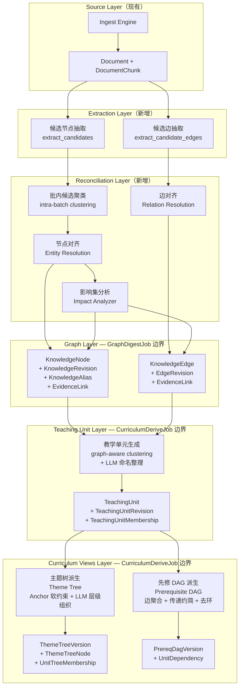
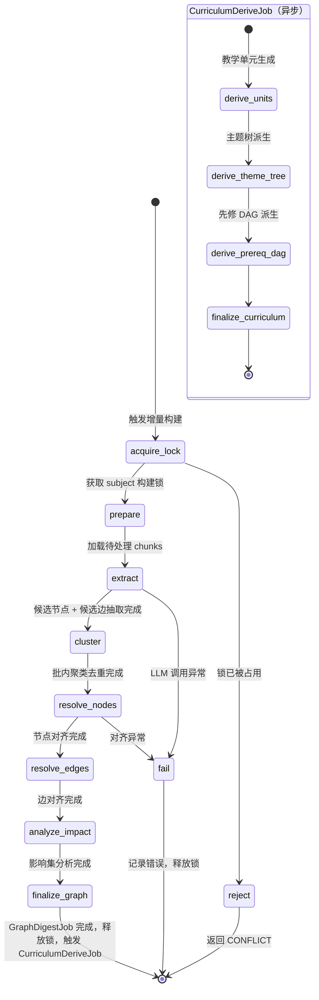
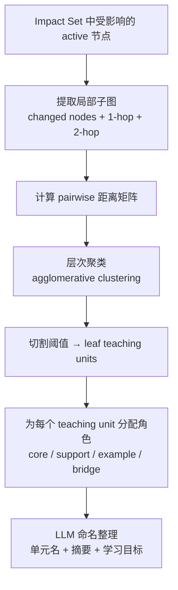
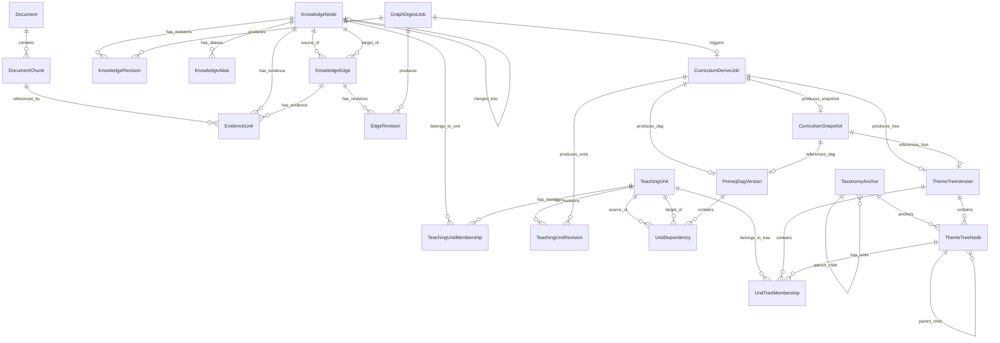
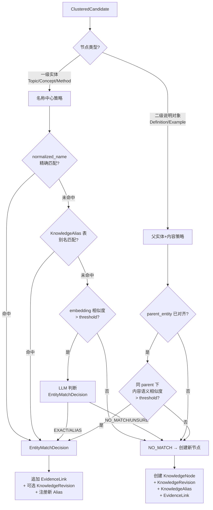
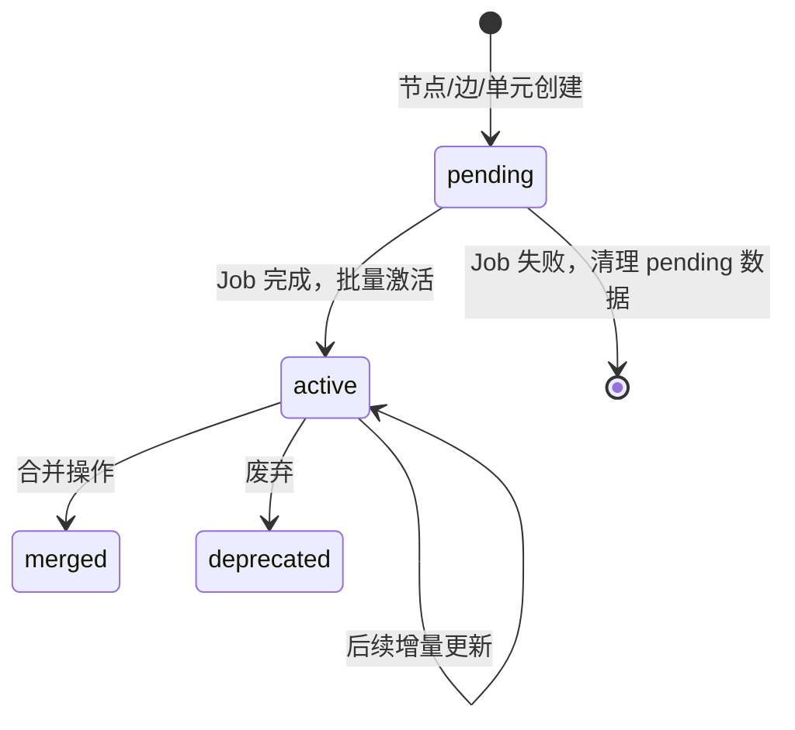

# 设计文档：知识图谱增量构建 + 多视图课程结构派生

## 概述

本设计将现有 Digest Engine 从"批次构建 DocSet"模式重构为"知识图谱型增量构建 + 多视图课程结构派生"模式（Graph-grounded Multi-View Curriculum Derivation）。

### 三层架构

- **底层 Knowledge Graph**：知识以图谱（节点 + 边 + 证据）为真相源，严格增量更新。节点内容完全由 Revision 承载，Node 表仅存身份 + 路由 + 状态
- **中层 Teaching Unit**：从知识节点通过 graph-aware 聚类生成教学单元（leaf-only，不含上层 module/chapter 层级）。这是课程组织层的基本粒度——不再是散乱的 Concept/Definition/Example 直接挂树，而是一组紧密相关的知识点组成的最小可讲授单位。上层 module/chapter 结构完全由 ThemeTreeNode 管理
- **上层 Curriculum Views**：从教学单元派生三种视图：
  - **Theme Tree（主题树）**：局部层次聚类 + Anchor 软约束 + LLM 命名整理，用于浏览与目录导航
  - **Prerequisite DAG（先修图）**：从图谱 prerequisite_of / part_of / defined_by 边聚合 + 传递约简 + 去环，用于教学依赖和学习路径
  - **Linear Syllabus（线性大纲）**：DAG 拓扑排序 + Theme Tree 层级约束 + LLM curriculum ordering（MVP-2）

### 增量构建的严格定义

**输入增量**：仅处理本次指定 file_ids 对应的新增 chunk。

**知识增量（Impact Set）**：当节点发生新增/合并/拆分时，以下对象进入候选重算集：
- 与 changed nodes 相邻的 edge（1-hop）
- edge 另一端节点的 summary 可能需要更新（2-hop 候选）
- 受影响的 teaching units
- 受 anchor 变更影响的子树需要重新派生
- 受影响的 unit dependencies 需要重新计算

### 两阶段任务模型

- **GraphDigestJob**：图谱增量构建（抽取 → 聚类 → 对齐 → 影响集分析）
- **CurriculumDeriveJob**：课程结构派生（教学单元生成 → 主题树派生 → 先修 DAG 派生）

图构建完成后即可对外提供图查询，课程结构异步刷新。

### 设计决策

| 决策 | 选择 | 理由 |
|------|------|------|
| 工作流引擎 | LangGraph StateGraph | 与现有 digest workflow 一致，支持条件分支和状态传递 |
| LLM 结构化输出 | Instructor + Pydantic | 已有 `acompletion_structured` 封装，零额外依赖 |
| 实体对齐策略 | 分层策略：一级实体 vs 二级说明对象 | Topic/Concept/Method 以 name 为主标识；Definition/Example 以父实体 + 内容摘要为标识 |
| 对齐判定 | EntityMatchDecision 7 值枚举 | 预留语义层级，MVP 先消费 EXACT/ALIAS/NO_MATCH |
| 别名管理 | 独立 KnowledgeAlias 表 | 支持高效索引、单独记录来源/置信度/语言/状态 |
| 节点内容 | Node 表仅存 identity + routing + status | 消除双写不一致风险，内容从 current_revision 读取 |
| 中间组织层 | TeachingUnit（教学单元） | 知识节点直接挂树太细碎，中间需要最小可讲授单位 |
| 教学单元生成 | graph-aware 聚类 + LLM 命名整理 | 距离函数结合 embedding、图关系、文档结构、类型兼容性 |
| 课程视图 | Theme Tree + Prerequisite DAG + Linear Syllabus | 单一树无法同时表达主题分组、教学依赖和讲授顺序 |
| Anchor 角色 | 软约束骨架（非硬分类目标） | 为主题树节点提供命名/排序/稳定约束，保留人工可控性又不压死自组织 |
| 主题树挂载 | 挂 TeachingUnit（leaf-only）而非 KnowledgeNode | KnowledgeNode → TeachingUnit → ThemeTreeNode，上层 chapter/section 由 ThemeTreeNode 层级管理 |
| 先修 DAG | 从图谱边聚合 + 传递约简 + 去环 | 不靠树，直接从知识依赖边提炼 |
| 任务拆分 | GraphDigestJob + CurriculumDeriveJob | 图构建完成即可查询，课程结构异步刷新 |
| 并发控制 | subject 级构建锁 + DB 唯一约束 + 乐观锁 | 防止重复触发、保证数据一致性 |
| 数据库 | 同一学科 .db 文件新增表 | 与现有 All-in-SQLite 理念一致 |

## 架构



### 两阶段任务状态机



### 引用链

```
api/knowledge.py
  → services/knowledge_graph_service.py
    → agents/digest/kg_workflow.py              (LangGraph — GraphDigestJob)
      → agents/digest/kg_extractor.py           (LLM 候选抽取)
      → agents/digest/kg_clusterer.py           (批内候选聚类去重)
      → agents/digest/kg_resolver.py            (实体/关系对齐)
      → agents/digest/kg_impact_analyzer.py     (影响集分析)
    → agents/digest/curriculum_workflow.py       (LangGraph — CurriculumDeriveJob)
      → agents/digest/unit_builder.py           (教学单元生成)
      → agents/digest/theme_tree_builder.py     (主题树派生)
      → agents/digest/prereq_dag_builder.py     (先修 DAG 派生)
    → repositories/kg_repo.py                   (知识图谱数据访问)
    → repositories/curriculum_repo.py           (课程结构数据访问)
```

## 组件与接口

### 1. 数据访问层：`repositories/kg_repo.py`

负责知识图谱相关表的 CRUD 操作。

```python
# === 构建锁 ===
def acquire_subject_build_lock(session: Session, subject: str) -> bool
def release_subject_build_lock(session: Session, subject: str) -> None

# === 节点 CRUD ===
def create_knowledge_node(session: Session, node: KnowledgeNode) -> KnowledgeNode
def get_knowledge_node_by_id(session: Session, node_id: int) -> KnowledgeNode | None
def find_node_by_normalized_name(session: Session, subject: str, normalized_name: str, node_type: str) -> KnowledgeNode | None
def find_nodes_by_alias(session: Session, subject: str, alias: str, node_type: str) -> list[KnowledgeNode]
def list_nodes_by_subject(session: Session, subject: str, *, node_type: str | None, status: str | None, limit: int, offset: int) -> tuple[list[KnowledgeNode], int]
def get_node_with_current_revision(session: Session, node_id: int) -> tuple[KnowledgeNode, KnowledgeRevision] | None

# === 别名 CRUD ===
def create_alias(session: Session, alias: KnowledgeAlias) -> KnowledgeAlias
def find_alias(session: Session, subject: str, normalized_alias: str) -> list[KnowledgeAlias]
def list_aliases_by_node(session: Session, node_id: int) -> list[KnowledgeAlias]

# === 边 CRUD ===
def create_knowledge_edge(session: Session, edge: KnowledgeEdge) -> KnowledgeEdge
def find_edge(session: Session, source_node_id: int, target_node_id: int, edge_type: str) -> KnowledgeEdge | None
def list_edges_by_node(session: Session, node_id: int) -> list[KnowledgeEdge]
def list_edges_by_type(session: Session, subject: str, edge_type: str) -> list[KnowledgeEdge]

# === 修订 ===
def create_knowledge_revision(session: Session, revision: KnowledgeRevision) -> KnowledgeRevision
def deactivate_old_revisions(session: Session, node_id: int) -> None
def create_edge_revision(session: Session, revision: EdgeRevision) -> EdgeRevision
def deactivate_old_edge_revisions(session: Session, edge_id: int) -> None

# === 证据 ===
def create_evidence_link(session: Session, link: EvidenceLink) -> EvidenceLink
def list_evidence_by_entity(session: Session, entity_type: str, entity_id: int, *, is_active: bool | None = True) -> list[EvidenceLink]
def count_active_evidence(session: Session, entity_type: str, entity_id: int) -> int

# === 任务 ===
def create_digest_job(session: Session, job: GraphDigestJob) -> GraphDigestJob
def update_digest_job(session: Session, job_id: int, **kwargs) -> GraphDigestJob | None
```

### 2. 数据访问层：`repositories/curriculum_repo.py`

负责教学单元和课程视图相关表的 CRUD 操作。

```python
# === 教学单元 ===
def create_teaching_unit(session: Session, unit: TeachingUnit) -> TeachingUnit
def get_teaching_unit_by_id(session: Session, unit_id: int) -> TeachingUnit | None
def find_unit_by_signature(session: Session, subject: str, member_signature: str) -> TeachingUnit | None
def find_units_overlapping_nodes(session: Session, subject: str, node_ids: list[int]) -> list[TeachingUnit]
def find_unit_by_normalized_name(session: Session, subject: str, normalized_name: str) -> TeachingUnit | None  # 辅助搜索，非身份定位
def list_units_by_subject(session: Session, subject: str, *, status: str | None, limit: int, offset: int) -> tuple[list[TeachingUnit], int]
def create_unit_revision(session: Session, revision: TeachingUnitRevision) -> TeachingUnitRevision
def deactivate_old_unit_revisions(session: Session, unit_id: int) -> None
def create_unit_membership(session: Session, membership: TeachingUnitMembership) -> TeachingUnitMembership
def list_memberships_by_unit(session: Session, unit_id: int) -> list[TeachingUnitMembership]
def find_unit_by_node(session: Session, knowledge_node_id: int) -> TeachingUnit | None

# === 锚点 ===
def create_taxonomy_anchor(session: Session, anchor: TaxonomyAnchor) -> TaxonomyAnchor
def list_anchors_by_subject(session: Session, subject: str) -> list[TaxonomyAnchor]
def get_uncategorized_anchor(session: Session, subject: str) -> TaxonomyAnchor

# === 主题树 ===
def create_theme_tree_version(session: Session, version: ThemeTreeVersion) -> ThemeTreeVersion
def get_current_theme_tree_version(session: Session, subject: str) -> ThemeTreeVersion | None
def create_theme_tree_version_with_optimistic_lock(session: Session, subject: str, expected_prev_version_no: int) -> ThemeTreeVersion
def create_theme_tree_node(session: Session, node: ThemeTreeNode) -> ThemeTreeNode
def create_unit_tree_membership(session: Session, membership: UnitTreeMembership) -> UnitTreeMembership

# === 先修 DAG ===
def create_prereq_dag_version(session: Session, version: PrereqDagVersion) -> PrereqDagVersion
def get_current_prereq_dag_version(session: Session, subject: str) -> PrereqDagVersion | None
def create_unit_dependency(session: Session, dep: UnitDependency) -> UnitDependency
def list_dependencies_by_version(session: Session, dag_version_id: int) -> list[UnitDependency]

# === 课程任务 ===
def create_curriculum_job(session: Session, job: CurriculumDeriveJob) -> CurriculumDeriveJob
def update_curriculum_job(session: Session, job_id: int, **kwargs) -> CurriculumDeriveJob | None

# === 课程快照 ===
def create_curriculum_snapshot(session: Session, snapshot: CurriculumSnapshot) -> CurriculumSnapshot
def get_current_curriculum_snapshot(session: Session, subject: str) -> CurriculumSnapshot | None
def archive_old_snapshots(session: Session, subject: str) -> None
```

### 3. LLM 抽取层：`agents/digest/kg_extractor.py`

使用 Instructor 结构化输出从 chunk 中抽取候选节点和候选边。

```python
class CandidateNode(BaseModel):
    name: str
    node_type: Literal["Topic", "Concept", "Definition", "Method", "Example"]
    local_summary: str
    taxonomy_hint: str
    parent_entity_name: str | None = None  # Definition/Example 的关联父实体名

class CandidateEdge(BaseModel):
    source_name: str
    target_name: str
    edge_type: Literal["belongs_to_topic", "prerequisite_of", "defined_by", "illustrated_by", "part_of"]
    description: str

class ChunkExtractionResult(BaseModel):
    nodes: list[CandidateNode]
    edges: list[CandidateEdge]

async def extract_candidates(
    chunk_content: str,
    chunk_title: str,
    header_path: str,
    doc_source_type: str | None = None,
) -> ChunkExtractionResult
```

### 4. 批内候选聚类：`agents/digest/kg_clusterer.py`

```python
@dataclass
class ClusteredCandidate:
    representative: CandidateNode
    members: list[CandidateNode]
    source_chunk_ids: list[int]
    merged_summary: str

def cluster_candidates(
    candidates: list[tuple[CandidateNode, int]],  # (candidate, chunk_id)
    similarity_threshold: float = 0.85,
) -> list[ClusteredCandidate]
```

### 5. 对齐层：`agents/digest/kg_resolver.py`

```python
class EntityMatchDecision(str, Enum):
    EXACT = "exact"
    ALIAS = "alias"
    BROADER = "broader"
    NARROWER = "narrower"
    RELATED_NOT_SAME = "related_not_same"
    NO_MATCH = "no_match"
    UNSURE = "unsure"

@dataclass
class ResolveResult:
    decision: EntityMatchDecision
    matched_node_id: int | None
    is_content_update: bool
    new_aliases: list[str]

async def resolve_node(
    session: Session,
    candidate: ClusteredCandidate,
    subject: str,
    candidate_embedding: list[float],
    similarity_threshold: float,
) -> ResolveResult

def resolve_edge(
    session: Session,
    candidate: CandidateEdge,
    subject: str,
    node_name_to_id: dict[str, int],
    active_evidence_counts: dict[int, int],
) -> tuple[KnowledgeEdge | None, float]

def compute_edge_confidence(
    active_evidence_count: int,
    contradicting_evidence_count: int = 0,
    max_confidence: float = 0.95,
) -> float:
    """confidence = min(max_confidence, 1 - 1/(1 + active_count)) - 0.1 * contradicting_count"""
```

### 6. 影响集分析：`agents/digest/kg_impact_analyzer.py`

```python
@dataclass
class ImpactSet:
    # === 图谱层闭包 ===
    changed_node_ids: set[int]              # 本次新增/合并/拆分的节点
    affected_edge_ids: set[int]             # 与 changed nodes incident 的 active edges
    candidate_recompute_node_ids: set[int]  # incident edges 对端的 2-hop nodes + evidence 失效影响 current_revision 的实体
    # === 教学单元层闭包 ===
    affected_unit_ids: set[int]             # 包含 changed nodes 的现有 units + 与 changed nodes 存在 part_of/defined_by/illustrated_by/prerequisite_of 强关系的邻接 units + 发生 merge/split 的 units
    # === 树视图层闭包 ===
    affected_anchor_ids: set[int]           # 受影响的锚点
    affected_tree_node_ids: set[int]        # affected units 的 UnitTreeMembership 对应的 tree nodes + 其祖先路径 + 锚点变化涉及的 subtree
    # === DAG 层闭包 ===
    affected_dag_edge_ids: set[int]         # source_unit_id 或 target_unit_id 落在 affected_unit_ids 中的 dependency edges + 与被断边环路同一 SCC 的 dependency candidates

def analyze_impact(
    session: Session,
    subject: str,
    new_node_ids: list[int],
    updated_node_ids: list[int],
    merged_node_ids: list[int],
    split_node_ids: list[int],
) -> ImpactSet
```

### 7. 教学单元生成：`agents/digest/unit_builder.py`

从知识图谱中通过 graph-aware 聚类生成教学单元。

```python
@dataclass
class UnitCandidate:
    """聚类产生的教学单元候选。"""
    core_node_ids: list[int]            # 核心概念节点
    support_node_ids: list[int]         # 支撑定义/方法节点
    example_node_ids: list[int]         # 示例节点
    bridge_node_ids: list[int]          # 前置桥接节点
    cluster_score: float                # 聚类内聚度

async def derive_teaching_units(
    session: Session,
    subject: str,
    impact_set: ImpactSet,
) -> list[TeachingUnit]

def compute_unit_distance(
    node_i: int,
    node_j: int,
    embeddings: dict[int, list[float]],
    edges: list[KnowledgeEdge],
    chunk_co_occurrence: dict[tuple[int, int], float],
    weights: UnitDistanceWeights | None = None,
) -> float
```

**graph-aware 聚类距离函数**：

```
dist(i, j) =
    a * semantic_distance(embedding_i, embedding_j)     # 0.30
  + b * graph_relation_distance(i, j)                   # 0.25
  + c * co_outline_distance(i, j)                       # 0.20
  + d * prerequisite_penalty(i, j)                       # 0.15
  + e * type_compatibility_penalty(i, j)                 # 0.10
```

其中：
- `semantic_distance`：embedding 余弦距离
- `graph_relation_distance`：part_of / defined_by / illustrated_by 边越多距离越近
- `co_outline_distance`：共现于同一 chunk/section 的节点距离更近
- `prerequisite_penalty`：强 prerequisite 关系的两端不一定应合并（惩罚项）
- `type_compatibility_penalty`：Concept + Definition + Example 容易聚在一起；Topic 倾向独立

**聚类流程**：



**角色分配规则**：
- `core`：cluster 中 node_type 为 Topic / Concept / Method 且 degree 最高的节点
- `support`：与 core 节点有 defined_by / part_of 边的 Definition / Method 节点
- `example`：与 core 节点有 illustrated_by 边的 Example 节点
- `prerequisite_bridge`：与 core 节点有 prerequisite_of 边但属于其他 unit 的节点引用

### 8. 主题树派生：`agents/digest/theme_tree_builder.py`

基于 Anchor 软约束 + 教学单元层级结构派生主题树。

```python
async def derive_theme_tree(
    session: Session,
    subject: str,
    impact_set: ImpactSet,
    prev_tree_version: ThemeTreeVersion | None,
) -> ThemeTreeVersion

def compute_unit_membership_score(
    unit_embedding: list[float],
    anchor_embedding: list[float],
    taxonomy_evidence: TaxonomyEvidence,
    weights: dict[str, float] | None = None,
) -> float
```

**主题树派生算法**：

**Step A：生成 Anchor Skeleton**
- 按 anchor_type 优先级排序：teacher_defined > syllabus > textbook_toc > graph_discovered > system
- teacher_defined / syllabus 锚点作为高优先级约束，结构保持不变
- graph_discovered 锚点仅作补充
- 确保"待归类"系统锚点始终存在
- Anchor 不再是"所有节点都要归到一个 anchor 下"，而是"为主题树节点提供命名、排序、对齐和稳定约束"

**Step B：将教学单元挂载到树**
- 主题树挂载的是 TeachingUnit（leaf-only）而非 KnowledgeNode
- TeachingUnit 只挂载到 ThemeTreeNode 的 theme / unit_bucket 层级节点
- 上层 chapter / section 结构完全由 ThemeTreeNode 自身的 parent_tree_node_id 层级管理
- 形成 KnowledgeNode → TeachingUnit → ThemeTreeNode(theme/unit_bucket) → ThemeTreeNode(section) → ThemeTreeNode(chapter) 的清晰分层

**Step C：计算 membership_score（多源证据融合）**

```
membership_score(unit, anchor) =
    w1 * semantic_similarity(unit_embedding, anchor_embedding)      # 0.30
  + w2 * doc_outline_match(unit.source_outline_paths, anchor.title) # 0.25
  + w3 * chunk_header_match(unit.source_header_paths, anchor.title) # 0.15
  + w4 * neighbor_vote(unit.neighbor_units, anchor)                 # 0.15
  + w5 * belongs_to_topic_propagation(unit, anchor)                 # 0.10
  + w6 * taxonomy_hint_match(unit.taxonomy_hints, anchor.title)     # 0.05
```

**Step D：确定归属（稳定规则）**

归属优先级：
1. `membership_source = "human_fixed"` → 绝对优先，自动派生不覆盖
2. 锚点集不变时：
   - score 最高且 > `membership_threshold`（默认 0.5）→ primary
   - 前两名差距 < `stability_threshold`（默认 0.08）→ 保持上一版归属
   - 所有 score < `membership_threshold` → 归入"待归类"池
3. 锚点集变化时：受影响子树内的单元重新评估，未受影响子树保持不变

**Step E：生成 ThemeTreeVersion**
- 使用乐观锁创建新版本 `status="draft"`
- **不在此处归档旧版本或发布新版本**——归档与发布统一在 `finalize_curriculum_node` 中原子完成，避免"旧版本已 archived 但新版本未 published"的窗口期
- 为每个 ThemeTreeNode 生成 summary
- "待归类"池作为固定树节点始终存在
- MVP 采用"逻辑局部重算 + 存储全量快照"的版本策略：仅对 Impact Set 影响范围内对象重新计算，但落库时生成完整新版本，以简化查询、回滚和版本比较

### 9. 先修 DAG 派生：`agents/digest/prereq_dag_builder.py`

从知识图谱的依赖边聚合出教学单元级别的先修 DAG。

```python
async def derive_prereq_dag(
    session: Session,
    subject: str,
    impact_set: ImpactSet,
    prev_dag_version: PrereqDagVersion | None,
) -> PrereqDagVersion

def aggregate_unit_dependencies(
    session: Session,
    subject: str,
    unit_node_map: dict[int, list[int]],  # unit_id -> [node_ids]
) -> list[UnitDependencyCandidate]

def transitive_reduction(edges: list[UnitDependencyCandidate]) -> list[UnitDependencyCandidate]

def break_cycles(edges: list[UnitDependencyCandidate]) -> tuple[list[UnitDependencyCandidate], list[UnitDependencyCandidate]]
```

**先修 DAG 派生算法**：

**Step 1：收集节点级依赖边**
- 从图谱中提取所有 active 的 prerequisite_of 边
- 补充 part_of 边的约束传播（A part_of B → B 的前置也是 A 的前置）
- defined_by 边采用保守策略：优先用于单元内聚合（帮助 Concept/Definition 进入同一 TeachingUnit）。仅当 Concept 与 Definition 已被分到不同 units，且同时满足以下条件时，才生成 unit-level dependency candidate：
  - 两者之间存在高置信度 defined_by 关系（confidence > 0.7）
  - 两 unit 没有被聚类并入的充分证据
  - 有额外支持信号（如文档顺序、先修边、教师锚点提示）支持其教学顺序

**Step 2：聚合为单元级依赖**
- 当 unit A 内多个节点通过依赖边指向 unit B 内多个节点时，聚合为 UnitDependency(source=A, target=B)
- confidence = weighted_sum(supporting_edge_confidences) / max_possible
- supporting_edge_count = 支撑的知识边数量
- 同一 unit 内部的依赖边不产生 UnitDependency

**Step 3：去环处理**
- 检测聚合图中的环路（Tarjan 强连通分量算法）
- 对每个 SCC，断开 confidence 最低的边
- 记录被断开的边到 `derivation_metadata_json`，供人工审查

**Step 4：传递约简（Transitive Reduction）**
- 在已确认无环的 DAG 上执行传递约简
- 如果 A → B → C 且 A → C 同时存在，移除 A → C（冗余边）
- 保留直接依赖，移除可通过其他路径推导的间接依赖

> 注意：先去环再约简，因为 transitive reduction 的定义基于 DAG，对含环图行为未定义。

**Step 5：生成 PrereqDagVersion**
- 创建新版本 `status="draft"`
- 仅对 Impact Set 影响范围内的单元重新计算依赖
- MVP 采用"逻辑局部重算 + 存储全量快照"的版本策略：仅对 Impact Set 影响范围内对象重新计算，但落库时生成完整新版本，以简化查询、回滚和版本比较
- **旧版本归档与新版本发布统一在 `finalize_curriculum_node` 中完成**，builder 阶段只产出 draft

### 10. LangGraph 工作流

#### GraphDigestJob 状态机：`agents/digest/kg_workflow.py`

```python
class KGDigestState(TypedDict):
    subject: str
    file_ids: list[int]
    job_id: int
    chunk_ids: list[int]
    candidates: list[ChunkExtractionResult]
    clustered_candidates: list[ClusteredCandidate]
    candidate_name_to_cluster_id: dict[str, int]           # 候选名称 → 聚类代表 ID
    candidate_name_to_resolved_node_id: dict[str, int]     # 候选名称 → 已对齐 KnowledgeNode ID
    new_node_ids: list[int]
    updated_node_ids: list[int]
    merged_node_ids: list[int]
    new_edge_ids: list[int]
    updated_edge_ids: list[int]
    impact_set: ImpactSet | None
    error: str | None

async def acquire_lock_node(state: KGDigestState) -> KGDigestState
async def prepare_node(state: KGDigestState) -> KGDigestState
async def extract_node(state: KGDigestState) -> KGDigestState
async def cluster_node(state: KGDigestState) -> KGDigestState
async def resolve_nodes_node(state: KGDigestState) -> KGDigestState
async def resolve_edges_node(state: KGDigestState) -> KGDigestState
async def analyze_impact_node(state: KGDigestState) -> KGDigestState
async def finalize_graph_node(state: KGDigestState) -> KGDigestState
async def fail_node(state: KGDigestState) -> KGDigestState
```

#### CurriculumDeriveJob 状态机：`agents/digest/curriculum_workflow.py`

```python
class CurriculumDeriveState(TypedDict):
    subject: str
    graph_job_id: int
    curriculum_job_id: int
    impact_set: ImpactSet
    derived_unit_ids: list[int]
    theme_tree_version_id: int | None
    prereq_dag_version_id: int | None
    snapshot_id: int | None
    error: str | None

async def derive_units_node(state: CurriculumDeriveState) -> CurriculumDeriveState
async def derive_theme_tree_node(state: CurriculumDeriveState) -> CurriculumDeriveState
async def derive_prereq_dag_node(state: CurriculumDeriveState) -> CurriculumDeriveState
async def finalize_curriculum_node(state: CurriculumDeriveState) -> CurriculumDeriveState
async def fail_curriculum_node(state: CurriculumDeriveState) -> CurriculumDeriveState
```

### 11. 服务层：`services/knowledge_graph_service.py`

```python
def trigger_digest_build(session: Session, *, subject: str, file_ids: list[int]) -> GraphDigestJob
async def run_graph_digest_background(*, subject: str, job_id: int) -> None
async def run_curriculum_derive_background(*, subject: str, graph_job_id: int, curriculum_job_id: int) -> None
def get_digest_status(session: Session, *, subject: str, job_id: int) -> DigestStatusResponse
    """聚合查询：返回 GraphDigestJob + 关联 CurriculumDeriveJob + 当前快照 ID。"""
def get_graph_nodes(session: Session, *, subject: str, node_type: str | None, page: int, size: int) -> PaginatedData
def get_graph_node_detail(session: Session, *, subject: str, node_id: int) -> dict
def get_teaching_units(session: Session, *, subject: str, page: int, size: int) -> PaginatedData
def get_teaching_unit_detail(session: Session, *, subject: str, unit_id: int) -> dict
def get_current_theme_tree(session: Session, *, subject: str) -> dict
def get_current_prereq_dag(session: Session, *, subject: str) -> dict
def get_current_curriculum_snapshot(session: Session, *, subject: str) -> dict  # 返回当前 published 快照（tree + dag 组合版本）
def manage_taxonomy_anchors(session: Session, *, subject: str, action: str, **kwargs) -> list[TaxonomyAnchor]
```

### 12. API 层：`api/knowledge.py`（扩展现有路由）

```python
POST /api/v1/subjects/{subject}/digest/build            # 触发增量构建
POST /api/v1/subjects/{subject}/digest/status            # 查询聚合状态（GraphDigestJob + CurriculumDeriveJob + 当前快照）
POST /api/v1/subjects/{subject}/graph/nodes/query        # 分页查询节点
POST /api/v1/subjects/{subject}/graph/nodes/detail       # 节点详情（含所属 teaching unit）
POST /api/v1/subjects/{subject}/units/query              # 分页查询教学单元
POST /api/v1/subjects/{subject}/units/detail             # 教学单元详情
POST /api/v1/subjects/{subject}/theme-tree/current       # 当前主题树
POST /api/v1/subjects/{subject}/prereq-dag/current       # 当前先修 DAG
POST /api/v1/subjects/{subject}/curriculum/current       # 当前课程快照（tree + dag 组合版本）
POST /api/v1/subjects/{subject}/taxonomy/anchors         # 锚点管理
```

## 数据模型

### 现有表（保持不变）

- `Document` — 文档记录
- `DocumentChunk` — 文档切块
- `DocumentOutlineNode` — 文档大纲节点
- `chunk_embeddings` — sqlite-vec 向量虚表

### 新增枚举：`models/enums.py`

```python
class KGNodeType(str, Enum):
    TOPIC = "Topic"
    CONCEPT = "Concept"
    DEFINITION = "Definition"
    METHOD = "Method"
    EXAMPLE = "Example"

class KGEdgeType(str, Enum):
    BELONGS_TO_TOPIC = "belongs_to_topic"
    PREREQUISITE_OF = "prerequisite_of"
    DEFINED_BY = "defined_by"
    ILLUSTRATED_BY = "illustrated_by"
    PART_OF = "part_of"

class KGNodeStatus(str, Enum):
    ACTIVE = "active"
    DEPRECATED = "deprecated"
    MERGED = "merged"
    PENDING = "pending"

class KGEdgeStatus(str, Enum):
    ACTIVE = "active"
    DEPRECATED = "deprecated"
    PENDING = "pending"

class EntityMatchDecision(str, Enum):
    EXACT = "exact"
    ALIAS = "alias"
    BROADER = "broader"
    NARROWER = "narrower"
    RELATED_NOT_SAME = "related_not_same"
    NO_MATCH = "no_match"
    UNSURE = "unsure"

class RevisionReason(str, Enum):
    NEW_EVIDENCE = "new_evidence"
    MERGE = "merge"
    SPLIT = "split"
    HUMAN_EDIT = "human_edit"
    CONFLICT_RESOLUTION = "conflict_resolution"

class EvidenceRole(str, Enum):
    SUPPORTS = "supports"
    ELABORATES = "elaborates"
    CONTRADICTS = "contradicts"
    EXEMPLIFIES = "exemplifies"
    TAXONOMY_HINT = "taxonomy_hint"

class ExtractionMethod(str, Enum):
    LLM = "llm"
    MANUAL = "manual"
    RULE = "rule"

class FieldScope(str, Enum):
    NAME = "name"
    SUMMARY = "summary"
    BODY = "body"
    EDGE_DESCRIPTION = "edge_description"
    TAXONOMY_HINT = "taxonomy_hint"

class AliasStatus(str, Enum):
    ACTIVE = "active"
    DEPRECATED = "deprecated"

class UnitMemberRole(str, Enum):
    """教学单元成员角色。"""
    CORE = "core"
    SUPPORT = "support"
    EXAMPLE = "example"
    PREREQUISITE_BRIDGE = "prerequisite_bridge"

class UnitStatus(str, Enum):
    """教学单元状态。"""
    ACTIVE = "active"
    DEPRECATED = "deprecated"
    MERGED = "merged"
    PENDING = "pending"

class AnchorType(str, Enum):
    TEACHER_DEFINED = "teacher_defined"
    SYLLABUS = "syllabus"
    TEXTBOOK_TOC = "textbook_toc"
    GRAPH_DISCOVERED = "graph_discovered"
    SYSTEM = "system"

class AnchorStatus(str, Enum):
    ACTIVE = "active"
    DEPRECATED = "deprecated"

class TreeVersionStatus(str, Enum):
    DRAFT = "draft"
    PUBLISHED = "published"
    ARCHIVED = "archived"

class ThemeTreeNodeType(str, Enum):
    """主题树节点类型。THEME 对应知识图谱中 Topic 级别的主题分组，避免与 KGNodeType.TOPIC 混淆。"""
    CHAPTER = "chapter"
    SECTION = "section"
    THEME = "theme"              # 原 TOPIC，改名避免与 KGNodeType.TOPIC 混淆
    UNIT_BUCKET = "unit_bucket"
    UNCATEGORIZED = "uncategorized"

class UnitTreeMembershipRole(str, Enum):
    PRIMARY = "primary"
    SECONDARY = "secondary"
    CROSS_LINK = "cross_link"

class MembershipSource(str, Enum):
    AUTO = "auto"
    HUMAN_FIXED = "human_fixed"

class DependencyType(str, Enum):
    """单元依赖类型。"""
    PREREQUISITE = "prerequisite"
    COREQUISITE = "corequisite"

class DigestJobStatus(str, Enum):
    PENDING = "pending"
    PROCESSING = "processing"
    COMPLETED = "completed"
    FAILED = "failed"
```

### 新增模型：`models/knowledge_graph.py`

#### KnowledgeNode — 身份 + 路由 + 状态（不存内容）

```python
class KnowledgeNode(SQLModel, table=True):
    __tablename__ = "knowledge_node"
    __table_args__ = (
        UniqueConstraint("subject", "node_type", "normalized_name",
                         name="uq_node_subject_type_name"),
    )

    id: int | None = Field(default=None, primary_key=True)
    subject: str = Field(index=True)
    node_type: str = Field(index=True)              # KGNodeType
    canonical_name: str
    normalized_name: str = Field(index=True)
    status: str = Field(default="pending")           # KGNodeStatus
    confidence: float = Field(default=1.0)
    current_revision_id: int | None = Field(default=None)
    merged_into_node_id: int | None = Field(default=None, foreign_key="knowledge_node.id")
    created_by_job_id: int | None = Field(default=None, foreign_key="graph_digest_job.id", index=True)
    created_at: datetime = Field(default_factory=datetime.utcnow)
    updated_at: datetime = Field(default_factory=datetime.utcnow)
```

#### KnowledgeAlias

```python
class KnowledgeAlias(SQLModel, table=True):
    __tablename__ = "knowledge_alias"
    __table_args__ = (
        UniqueConstraint("node_id", "normalized_alias",
                         name="uq_alias_node_normalized"),
    )

    id: int | None = Field(default=None, primary_key=True)
    node_id: int = Field(foreign_key="knowledge_node.id", index=True)
    alias: str
    normalized_alias: str = Field(index=True)
    language: str = Field(default="zh")
    source: str = Field(default="llm")
    confidence: float = Field(default=1.0)
    is_primary: bool = Field(default=False)
    status: str = Field(default="active")
    created_by_job_id: int | None = Field(default=None, foreign_key="graph_digest_job.id", index=True)
    created_at: datetime = Field(default_factory=datetime.utcnow)
```

#### KnowledgeEdge

```python
class KnowledgeEdge(SQLModel, table=True):
    __tablename__ = "knowledge_edge"
    __table_args__ = (
        UniqueConstraint("subject", "source_node_id", "target_node_id", "edge_type",
                         name="uq_edge_subject_src_tgt_type"),
    )

    id: int | None = Field(default=None, primary_key=True)
    subject: str = Field(index=True)
    source_node_id: int = Field(foreign_key="knowledge_node.id", index=True)
    target_node_id: int = Field(foreign_key="knowledge_node.id", index=True)
    edge_type: str = Field(index=True)
    weight: float = Field(default=1.0)
    confidence: float = Field(default=0.5)
    status: str = Field(default="pending")
    current_revision_id: int | None = Field(default=None)
    created_by_job_id: int | None = Field(default=None, foreign_key="graph_digest_job.id", index=True)
    created_at: datetime = Field(default_factory=datetime.utcnow)
    updated_at: datetime = Field(default_factory=datetime.utcnow)
```

#### KnowledgeRevision

```python
class KnowledgeRevision(SQLModel, table=True):
    __tablename__ = "knowledge_revision"
    __table_args__ = (
        UniqueConstraint("node_id", "revision_no", name="uq_node_revision_no"),
    )

    id: int | None = Field(default=None, primary_key=True)
    node_id: int = Field(foreign_key="knowledge_node.id", index=True)
    revision_no: int
    title: str
    summary: str = ""
    body: str = ""
    revision_reason: str
    digest_job_id: int | None = Field(default=None, foreign_key="graph_digest_job.id")
    is_current: bool = Field(default=True)
    created_at: datetime = Field(default_factory=datetime.utcnow)
```

#### EdgeRevision

```python
class EdgeRevision(SQLModel, table=True):
    __tablename__ = "edge_revision"
    __table_args__ = (
        UniqueConstraint("edge_id", "revision_no", name="uq_edge_revision_no"),
    )

    id: int | None = Field(default=None, primary_key=True)
    edge_id: int = Field(foreign_key="knowledge_edge.id", index=True)
    revision_no: int
    description: str
    weight: float
    confidence: float
    revision_reason: str
    digest_job_id: int | None = Field(default=None, foreign_key="graph_digest_job.id")
    is_current: bool = Field(default=True)
    created_at: datetime = Field(default_factory=datetime.utcnow)
```

#### EvidenceLink

```python
class EvidenceLink(SQLModel, table=True):
    """证据链接。采用 polymorphic association（entity_type + entity_id），
    DB 层不做外键强约束到 node/edge；完整性由服务层保证。"""
    __tablename__ = "evidence_link"

    id: int | None = Field(default=None, primary_key=True)
    subject: str = Field(index=True)
    entity_type: str                                 # "node" | "edge"
    entity_id: int = Field(index=True)
    entity_revision_id: int | None = Field(default=None)
    document_id: int = Field(foreign_key="document.id")
    chunk_id: int = Field(foreign_key="document_chunk.id")
    quote_text: str = ""
    source_span_start: int | None = Field(default=None)
    source_span_end: int | None = Field(default=None)
    evidence_role: str
    extraction_method: str = Field(default="llm")
    field_scope: str = Field(default="summary")
    confidence: float = Field(default=1.0)
    is_active: bool = Field(default=True)
    created_by_job_id: int | None = Field(default=None, foreign_key="graph_digest_job.id", index=True)
    created_at: datetime = Field(default_factory=datetime.utcnow)
```

### 新增模型：`models/curriculum.py`

#### TeachingUnit — 教学单元

```python
class TeachingUnit(SQLModel, table=True):
    """教学单元：一组紧密相关的知识节点组成的最小可讲授单位（leaf-only）。"""
    __tablename__ = "teaching_unit"
    __table_args__ = (
        UniqueConstraint("subject", "member_signature",
                         name="uq_unit_subject_signature"),
    )

    id: int | None = Field(default=None, primary_key=True)
    subject: str = Field(index=True)
    canonical_name: str
    normalized_name: str = Field(index=True)
    member_signature: str = Field(index=True)        # 结构签名：排序后 core node ids 的 hash，用于稳定身份定位
    status: str = Field(default="pending")           # UnitStatus
    confidence: float = Field(default=1.0)
    current_revision_id: int | None = Field(default=None)
    created_by_job_id: int | None = Field(default=None, foreign_key="curriculum_derive_job.id", index=True)
    created_at: datetime = Field(default_factory=datetime.utcnow)
    updated_at: datetime = Field(default_factory=datetime.utcnow)
```

#### TeachingUnitRevision

```python
class TeachingUnitRevision(SQLModel, table=True):
    __tablename__ = "teaching_unit_revision"
    __table_args__ = (
        UniqueConstraint("unit_id", "revision_no", name="uq_unit_revision_no"),
    )

    id: int | None = Field(default=None, primary_key=True)
    unit_id: int = Field(foreign_key="teaching_unit.id", index=True)
    revision_no: int
    title: str
    summary: str = ""
    learning_objectives_json: str = Field(default="[]")  # JSON 数组，统一格式
    revision_reason: str
    curriculum_job_id: int | None = Field(default=None, foreign_key="curriculum_derive_job.id")
    is_current: bool = Field(default=True)
    created_at: datetime = Field(default_factory=datetime.utcnow)
```

#### TeachingUnitMembership

```python
class TeachingUnitMembership(SQLModel, table=True):
    """知识节点在教学单元中的归属。"""
    __tablename__ = "teaching_unit_membership"
    __table_args__ = (
        UniqueConstraint("unit_id", "knowledge_node_id", "role",
                         name="uq_unit_node_role"),
    )

    id: int | None = Field(default=None, primary_key=True)
    unit_id: int = Field(foreign_key="teaching_unit.id", index=True)
    knowledge_node_id: int = Field(foreign_key="knowledge_node.id", index=True)
    role: str                                        # UnitMemberRole
    score: float = Field(default=0.0)
    created_by_job_id: int | None = Field(default=None, foreign_key="curriculum_derive_job.id", index=True)
    created_at: datetime = Field(default_factory=datetime.utcnow)
```

#### TaxonomyAnchor

```python
class TaxonomyAnchor(SQLModel, table=True):
    """分类锚点，作为软约束骨架。"""
    __tablename__ = "taxonomy_anchor"

    id: int | None = Field(default=None, primary_key=True)
    subject: str = Field(index=True)
    anchor_type: str
    title: str
    normalized_title: str = Field(index=True)
    parent_anchor_id: int | None = Field(default=None, foreign_key="taxonomy_anchor.id")
    order_index: int = Field(default=0)
    confidence: float = Field(default=1.0)
    is_system: bool = Field(default=False)
    status: str = Field(default="active")
    created_at: datetime = Field(default_factory=datetime.utcnow)
    updated_at: datetime = Field(default_factory=datetime.utcnow)
```

#### ThemeTreeVersion

```python
class ThemeTreeVersion(SQLModel, table=True):
    __tablename__ = "theme_tree_version"
    __table_args__ = (
        UniqueConstraint("subject", "version_no", name="uq_theme_tree_subject_version"),
    )

    id: int | None = Field(default=None, primary_key=True)
    subject: str = Field(index=True)
    version_no: int
    status: str = Field(default="draft")
    curriculum_job_id: int | None = Field(default=None, foreign_key="curriculum_derive_job.id")
    created_at: datetime = Field(default_factory=datetime.utcnow)
```

#### ThemeTreeNode

```python
class ThemeTreeNode(SQLModel, table=True):
    __tablename__ = "theme_tree_node"

    id: int | None = Field(default=None, primary_key=True)
    tree_version_id: int = Field(foreign_key="theme_tree_version.id", index=True)
    anchor_id: int | None = Field(default=None, foreign_key="taxonomy_anchor.id")
    parent_tree_node_id: int | None = Field(default=None, foreign_key="theme_tree_node.id")
    title: str
    node_type: str                                   # ThemeTreeNodeType
    order_index: int = Field(default=0)
    summary: str = ""
    created_by_job_id: int | None = Field(default=None, foreign_key="curriculum_derive_job.id", index=True)
    created_at: datetime = Field(default_factory=datetime.utcnow)
```

#### UnitTreeMembership

```python
class UnitTreeMembership(SQLModel, table=True):
    """教学单元在主题树中的归属。挂载 TeachingUnit 而非 KnowledgeNode。"""
    __tablename__ = "unit_tree_membership"
    __table_args__ = (
        UniqueConstraint("tree_version_id", "tree_node_id", "teaching_unit_id", "membership_role",
                         name="uq_tree_unit_role"),
    )

    id: int | None = Field(default=None, primary_key=True)
    tree_version_id: int = Field(foreign_key="theme_tree_version.id", index=True)
    tree_node_id: int = Field(foreign_key="theme_tree_node.id", index=True)
    teaching_unit_id: int = Field(foreign_key="teaching_unit.id", index=True)
    membership_role: str                             # UnitTreeMembershipRole
    membership_source: str = Field(default="auto")   # MembershipSource
    score: float = Field(default=0.0)
    created_by_job_id: int | None = Field(default=None, foreign_key="curriculum_derive_job.id", index=True)
    created_at: datetime = Field(default_factory=datetime.utcnow)
```

#### PrereqDagVersion

```python
class PrereqDagVersion(SQLModel, table=True):
    __tablename__ = "prereq_dag_version"
    __table_args__ = (
        UniqueConstraint("subject", "version_no", name="uq_prereq_dag_subject_version"),
    )

    id: int | None = Field(default=None, primary_key=True)
    subject: str = Field(index=True)
    version_no: int
    status: str = Field(default="draft")
    curriculum_job_id: int | None = Field(default=None, foreign_key="curriculum_derive_job.id")
    created_at: datetime = Field(default_factory=datetime.utcnow)
```

#### UnitDependency

```python
class UnitDependency(SQLModel, table=True):
    """教学单元之间的先修依赖边。"""
    __tablename__ = "unit_dependency"
    __table_args__ = (
        UniqueConstraint("dag_version_id", "source_unit_id", "target_unit_id", "dependency_type",
                         name="uq_dag_dep"),
    )

    id: int | None = Field(default=None, primary_key=True)
    dag_version_id: int = Field(foreign_key="prereq_dag_version.id", index=True)
    source_unit_id: int = Field(foreign_key="teaching_unit.id", index=True)  # 前置单元
    target_unit_id: int = Field(foreign_key="teaching_unit.id", index=True)  # 后续单元
    dependency_type: str = Field(default="prerequisite")  # DependencyType
    confidence: float = Field(default=0.5)
    supporting_edge_count: int = Field(default=0)
    derivation_metadata_json: str = Field(default="{}")  # 派生元数据：supporting edge ids、cycle resolution 记录、confidence 聚合详情
    created_by_job_id: int | None = Field(default=None, foreign_key="curriculum_derive_job.id", index=True)
    created_at: datetime = Field(default_factory=datetime.utcnow)
```

#### GraphDigestJob

```python
class GraphDigestJob(SQLModel, table=True):
    __tablename__ = "graph_digest_job"

    id: int | None = Field(default=None, primary_key=True)
    subject: str = Field(index=True)
    idempotency_key: str = Field(index=True, unique=True)
    # 幂等键生成规则：推荐由客户端传入；若服务端生成，则基于 subject + 排序后的 file_ids + 文件当前 chunk parse version 计算 hash，不混入 timestamp
    status: str = Field(default="pending")
    progress: int = Field(default=0)
    current_step: str | None = Field(default=None)
    input_file_ids_json: str = Field(default="[]")
    input_chunk_count: int = Field(default=0)
    extractor_version: str = Field(default="v1")
    embedding_model_version: str = Field(default="")
    nodes_added: int = Field(default=0)
    nodes_updated: int = Field(default=0)
    nodes_merged: int = Field(default=0)
    edges_added: int = Field(default=0)
    edges_updated: int = Field(default=0)
    curriculum_job_id: int | None = Field(default=None, foreign_key="curriculum_derive_job.id")
    # CurriculumDeriveJob 在 finalize_graph_node 成功后创建，此字段回填关联
    retry_of_job_id: int | None = Field(default=None, foreign_key="graph_digest_job.id")
    error_message: str | None = Field(default=None)
    created_at: datetime = Field(default_factory=datetime.utcnow)
    updated_at: datetime = Field(default_factory=datetime.utcnow)
```

#### CurriculumDeriveJob

```python
class CurriculumDeriveJob(SQLModel, table=True):
    """课程结构派生任务（替代原 TreeDeriveJob）。"""
    __tablename__ = "curriculum_derive_job"

    id: int | None = Field(default=None, primary_key=True)
    subject: str = Field(index=True)
    graph_job_id: int = Field(foreign_key="graph_digest_job.id")
    status: str = Field(default="pending")
    progress: int = Field(default=0)
    current_step: str | None = Field(default=None)
    units_added: int = Field(default=0)
    units_updated: int = Field(default=0)
    theme_tree_version_id: int | None = Field(default=None)
    prereq_dag_version_id: int | None = Field(default=None)
    error_message: str | None = Field(default=None)
    created_at: datetime = Field(default_factory=datetime.utcnow)
    updated_at: datetime = Field(default_factory=datetime.utcnow)
```

#### SubjectBuildLock

```python
class SubjectBuildLock(SQLModel, table=True):
    __tablename__ = "subject_build_lock"

    id: int | None = Field(default=None, primary_key=True)
    subject: str = Field(unique=True)
    job_id: int | None = Field(default=None)
    locked_at: datetime = Field(default_factory=datetime.utcnow)
    expires_at: datetime | None = Field(default=None)
```

#### CurriculumSnapshot — 课程视图一致性快照

```python
class CurriculumSnapshot(SQLModel, table=True):
    """课程视图一致性快照：明确记录当前课程结构 = 哪个 tree version + 哪个 dag version 的组合。
    解决 CurriculumDeriveJob 部分成功时 tree/dag 版本不一致的问题。"""
    __tablename__ = "curriculum_snapshot"
    __table_args__ = (
        UniqueConstraint("subject", "version_no", name="uq_curriculum_snapshot_subject_version"),
    )

    id: int | None = Field(default=None, primary_key=True)
    subject: str = Field(index=True)
    version_no: int
    status: str = Field(default="draft")             # draft / published / archived
    curriculum_job_id: int = Field(foreign_key="curriculum_derive_job.id")
    theme_tree_version_id: int | None = Field(default=None, foreign_key="theme_tree_version.id")
    prereq_dag_version_id: int | None = Field(default=None, foreign_key="prereq_dag_version.id")
    syllabus_version_id: int | None = Field(default=None)  # MVP-2 预留
    created_at: datetime = Field(default_factory=datetime.utcnow)
```

### ER 关系图



### 关键设计约束与边界规则

#### 版本发布责任边界（硬规则）

- `theme_tree_builder.py`：只能创建 draft version + ThemeTreeNode + UnitTreeMembership
- `prereq_dag_builder.py`：只能创建 draft version + UnitDependency
- `unit_builder.py`：只能创建 pending TeachingUnit + TeachingUnitRevision + TeachingUnitMembership
- `finalize_curriculum_node`：唯一允许调用 publish/archive 的地方
- **禁止 builder 内部调用任何 publish/archive helper；相关 helper 仅供 finalize_curriculum_node 使用**

#### CurriculumDeriveJob 触发时序

CurriculumDeriveJob 在 `finalize_graph_node` 成功后创建（不是在 GraphDigestJob 创建时预创建）。流程：
1. `finalize_graph_node` 批量激活 pending → active，释放构建锁
2. 创建 CurriculumDeriveJob 记录
3. 将 `curriculum_job_id` 回填到 GraphDigestJob
4. 异步调度 `run_curriculum_derive_background`

#### DigestStatusResponse 聚合查询

`digest/status` 接口返回聚合响应，而非单独的 GraphDigestJob：

```python
class DigestStatusResponse(BaseModel):
    graph_job: GraphDigestJobResponse
    curriculum_job: CurriculumJobResponse | None
    current_curriculum_snapshot_id: int | None
```

#### 幂等键与构建锁的三层检查

API 层和工作流层各有职责，检查顺序如下：

1. **幂等命中**：同一个 `idempotency_key` → 直接返回已有 job → 不视为冲突
2. **运行中冲突**：存在同 subject 运行中的非同幂等 job → 返回 409 Conflict
3. **工作流抢锁**：创建新 job 后，真正执行时再抢 `SubjectBuildLock` → 最终一致性保障，防竞态

> API 层检查 = 减少明显冲突请求；工作流抢锁 = 最终一致性保障

#### defined_by 跨 unit 依赖 MVP 范围

**MVP：defined_by 不参与跨 unit dependency 生成。** 相关保守策略（高置信度 + 无聚类并入证据 + 额外支持信号）仅作为后续增强预留（MVP+1 22.4），不进入当前实现范围。

#### cleanup_pending_by_job 的精确清理

所有可被 cleanup 的表均包含 `created_by_job_id` 字段，清理时按此字段精确定位：
- `job_type="graph"`：清理 `created_by_job_id = job_id` 的 pending nodes/edges/revisions/aliases/evidence_links
- `job_type="curriculum"`：清理 `created_by_job_id = job_id` 的 pending units/memberships/draft tree versions/draft dag versions/tree nodes/unit tree memberships/unit dependencies

#### 候选聚类到边解析的名称映射（Issue 17）

`cluster_node` 或 `resolve_nodes_node` 阶段需生成以下映射供后续边解析使用：
- `candidate_name_to_cluster_id: dict[str, int]` — 候选名称 → 聚类代表 ID
- `candidate_name_to_resolved_node_id: dict[str, int]` — 候选名称 → 已对齐的 KnowledgeNode ID

边解析优先级：
1. 通过 `candidate_name_to_resolved_node_id` 查找（batch 内已对齐的节点）
2. 通过 `candidate_name_to_cluster_id` 查找聚类代表对应的 resolved node id
3. Fallback：通过 `find_node_by_normalized_name` 在已有图谱中查找

#### 推荐分阶段交付

虽然当前设计覆盖完整 MVP-1 范围，建议实际交付按以下阶段推进：
- **Phase 1**：GraphDigestJob + KnowledgeNode/Edge/Revision/Evidence + 图谱查询 API
- **Phase 2**：TeachingUnit + 单元查询 API
- **Phase 3**：ThemeTree + 主题树查询 API
- **Phase 4**：PrereqDAG + CurriculumSnapshot + 完整课程 e2e

### 关键算法设计

#### 1. normalized_name 生成算法

```python
import re
import unicodedata

def normalize_name(name: str) -> str:
    text = name.strip().lower()
    text = unicodedata.normalize("NFKC", text)
    text = re.sub(r"[\s\-_]+", "", text)
    text = re.sub(r"[^\w\u4e00-\u9fff]", "", text)
    return text
```

#### 2. Entity Resolution 分层递进流程



#### 3. 边置信度计算（非单调递增）

```python
def compute_edge_confidence(
    active_evidence_count: int,
    contradicting_evidence_count: int = 0,
    max_confidence: float = 0.95,
) -> float:
    if active_evidence_count == 0:
        return 0.0
    base = 1.0 - 1.0 / (1.0 + active_evidence_count)
    penalty = 0.1 * contradicting_evidence_count
    return max(0.0, min(max_confidence, base - penalty))
```

#### 4. 教学单元 graph-aware 聚类算法

**核心思想**：不是纯 embedding 聚类，而是结合图结构、文档结构和类型兼容性的多维距离聚类。

```python
def compute_unit_distance(i, j, embeddings, edges, co_occurrence, weights=None):
    w = weights or DEFAULT_UNIT_DISTANCE_WEIGHTS
    return (
        w.semantic * cosine_distance(embeddings[i], embeddings[j])
      + w.graph_relation * graph_relation_distance(i, j, edges)
      + w.co_outline * co_outline_distance(i, j, co_occurrence)
      + w.prerequisite_penalty * prerequisite_penalty(i, j, edges)
      + w.type_compatibility * type_compatibility_penalty(i, j)
    )
```

**聚类切割**：
- 使用 agglomerative clustering（层次聚类）
- 切割阈值产生 leaf teaching units
- 每个 teaching unit 内部按角色分配：core / support / example / bridge
- 每个 leaf unit 由 LLM 命名

**增量策略**：
- 仅对 Impact Set 影响范围内的局部子图重新聚类
- 未受影响的教学单元保持不变
- 新节点优先尝试加入已有 unit（距离 < 阈值），否则形成新 unit

#### 5. 先修 DAG 派生算法

```python
def derive_prereq_dag(session, subject, impact_set, prev_dag_version):
    # Step 1: 收集节点级依赖边
    prereq_edges = list_edges_by_type(session, subject, "prerequisite_of")
    part_of_edges = list_edges_by_type(session, subject, "part_of")
    defined_by_edges = list_edges_by_type(session, subject, "defined_by")

    # Step 2: 聚合为单元级依赖
    unit_deps = aggregate_unit_dependencies(session, subject, unit_node_map)

    # Step 3: 去环（必须先于传递约简，因为 transitive reduction 定义基于 DAG，对含环图行为未定义）
    acyclic_edges, broken_edges = break_cycles(unit_deps)

    # Step 4: 传递约简
    reduced_edges = transitive_reduction(acyclic_edges)

    # Step 5: 创建版本
    return create_prereq_dag_version(session, subject, reduced_edges)
```

#### 6. 中间态一致性：staging/active 两层状态



- 构建中新创建的节点/边/单元默认 `status = "pending"`
- GraphDigestJob 成功后批量将 pending 节点/边激活为 active
- CurriculumDeriveJob 成功后批量将 pending 单元激活为 active
- Job 失败时清理所有 pending 状态数据
- 外部查询 API 默认只返回 active 状态的实体

#### 7. LLM Prompt 设计

**候选知识抽取 Prompt：**

```
你是一名学科知识图谱构建助手。请从以下文档片段中抽取知识节点和知识关系。

文档片段标题：{chunk_title}
文档路径：{header_path}
文档来源类型：{doc_source_type}
文档内容：
{chunk_content}

要求：
1. 节点类型限定为：Topic（主题）、Concept（概念）、Definition（定义）、Method（方法/算法）、Example（例题/示例）
2. 边类型限定为：belongs_to_topic、prerequisite_of、defined_by、illustrated_by、part_of
3. 每个节点需提供 name、node_type、local_summary、taxonomy_hint
4. Definition/Example 类型还需提供 parent_entity_name
5. 每条边需提供 source_name、target_name、edge_type、description
6. 不要杜撰原文没有的知识点
```

**教学单元命名 Prompt：**

```
你是一名教学设计助手。以下是一组紧密相关的知识节点，它们构成一个教学单元。

核心概念：{core_nodes}
支撑定义/方法：{support_nodes}
示例：{example_nodes}

请为这个教学单元生成：
1. 单元名称（简洁、准确、适合作为课程目录标题）
2. 单元摘要（一段话描述本单元的核心内容）
3. 学习目标（2-4 条，以"学完本单元后，学生能够..."开头）
4. 是否建议拆分为多个子单元（如果知识点跨度太大）
```

**实体对齐判断 Prompt：**

```
你是一名知识图谱实体对齐助手。请判断以下两个知识节点的关系。

候选节点：名称={candidate_name}，类型={candidate_type}，摘要={candidate_summary}
已有节点：名称={existing_name}，类型={existing_type}，摘要={existing_summary}

请从以下选项中选择：EXACT / ALIAS / BROADER / NARROWER / RELATED_NOT_SAME / NO_MATCH / UNSURE
```

## 正确性属性（Correctness Properties）

*A property is a characteristic or behavior that should hold true across all valid executions of a system-essentially, a formal statement about what the system should do. Properties serve as the bridge between human-readable specifications and machine-verifiable correctness guarantees.*

### 属性测试优先级分层

- **P0 必做**：normalize_name 幂等 (Property 5)、progress 单调 (Property 10)、DAG 无环 (Property 12)、教学单元核心唯一 (Property 2)、主题树归属唯一 (Property 3)
- **P1 再做**：实体对齐可达性 (Property 6)、对齐必产证据 (Property 7)、文件范围限定 (Property 11)、证据完整性 (Property 9)
- **P2 后续**：锚点稳定性 (Property 14)、归属稳定性 (Property 15)、向量 round-trip (Property 17)、版本归档不变式 (Property 16)

### Property 1: 修订唯一当前版本不变式（Revision Singleton Invariant）

对于任意 KnowledgeNode、KnowledgeEdge 或 TeachingUnit，在任何创建或更新操作完成后，该实体关联的修订记录中恰好有一条 `is_current = True`。

**Validates: Requirements 1.7, 1.8, 2.5**

### Property 2: 教学单元核心唯一不变式（Unit Core Membership Uniqueness）

对于任意 active 状态的 KnowledgeNode，其在所有 active 状态的 TeachingUnit 中 role="core" 的 TeachingUnitMembership 记录数量至多为 1。同一个 node 可以作为多个 unit 的 support / example / prerequisite_bridge，但作为 core 只能属于一个 active unit。

**Validates: Requirements 2.4**

### Property 3: 主题树归属唯一不变式（Theme Tree Primary Membership Uniqueness）

对于任意 TeachingUnit 和任意 ThemeTreeVersion，该单元在该树版本中 membership_role="primary" 的 UnitTreeMembership 记录数量至多为 1。

**Validates: Requirements 3.5**

### Property 4: 候选抽取结构合规性（Extraction Output Validity）

对于任意 ChunkExtractionResult，每个 CandidateNode 的 node_type 属于 {Topic, Concept, Definition, Method, Example}，每个 CandidateEdge 的 edge_type 属于 {belongs_to_topic, prerequisite_of, defined_by, illustrated_by, part_of}，且所有必填字段非空。

**Validates: Requirements 5.1, 5.2, 5.3, 5.4**

### Property 5: 名称规范化幂等性（Normalization Idempotence）

对于任意字符串 name，`normalize_name(normalize_name(name)) == normalize_name(name)`。

**Validates: Requirements 6.1**

### Property 6: 实体对齐可达性（Entity Resolution Reachability）

对于任意已存在的 KnowledgeNode，若一个 CandidateNode 的 normalized_name 与该节点的 normalized_name 相同，或出现在该节点的 KnowledgeAlias 表中，则 Entity Resolution 的结果 decision 必须为 EXACT 或 ALIAS。

**Validates: Requirements 6.1, 6.2**

### Property 7: 对齐操作必产证据（Resolution Always Creates Evidence）

对于任意节点对齐或边对齐操作的结果，系统都必须至少创建一条 EvidenceLink 记录。

**Validates: Requirements 6.5, 6.6, 7.2, 7.3**

### Property 8: 边置信度为证据函数（Edge Confidence as Evidence Function）

对于任意 KnowledgeEdge，其 confidence 值等于 `compute_edge_confidence(active_evidence_count, contradicting_evidence_count)`。

**Validates: Requirements 7.5**

### Property 9: 图谱实体证据完整性不变式（Evidence Completeness Invariant）

对于任意 active 状态的 KnowledgeNode 或 KnowledgeEdge，其关联的 is_active=True 的 EvidenceLink 数量 >= 1。

**Validates: Requirements 14.3, 14.4**

### Property 10: 构建进度单调递增（Job Progress Monotonicity）

对于任意处于 processing 状态的 GraphDigestJob 或 CurriculumDeriveJob，其 progress 字段在每次更新后 >= 更新前的值，完成时 = 100。

**Validates: Requirements 8.4**

### Property 11: 文件范围限定（File Scope Constraint）

对于任意指定 file_ids 触发的增量构建，仅这些文件对应的 DocumentChunk 会被处理。

**Validates: Requirements 8.6**

### Property 12: 先修 DAG 无环性（Prerequisite DAG Acyclicity）

对于任意 PrereqDagVersion，其包含的 UnitDependency 边构成的图是 DAG（无环）。

**Validates: Requirements 4.3**

### Property 13: 先修 DAG 传递约简（Prerequisite DAG Transitive Reduction）

对于任意 PrereqDagVersion，若存在路径 A → B → C，则不应同时存在直接边 A → C。

**Validates: Requirements 4.4**

### Property 14: 锚点骨架优先级稳定性（Anchor Skeleton Priority Stability）

对于任意主题树派生操作，若已存在 teacher_defined 或 syllabus 类型的 TaxonomyAnchor，则这些锚点在新生成的骨架中的父子结构和排序保持不变。

**Validates: Requirements 10.2**

### Property 15: 归属稳定性（Membership Stability Under Ambiguity）

对于任意 TeachingUnit（排除 human_fixed），若其对前两名 ThemeTreeNode 的 membership_score 差距小于 stability_threshold，且锚点集未变化，则该单元在新版本树中的 primary membership 与上一版本保持一致。

**Validates: Requirements 10.6**

### Property 16: 树版本归档不变式（Tree Version Archive Invariant）

对于任意主题树或先修 DAG 派生操作，若派生前存在 status="published" 的版本，则派生完成后该版本的 status 变为 "archived"，新版本的 version_no 严格大于旧版本。

**Validates: Requirements 10.9, 11.5**

### Property 17: 向量检索往返兼容性（Embedding Round-Trip Compatibility）

对于任意在增量构建中处理的 DocumentChunk，其 embedding 写入 chunk_embeddings 后，使用相同向量调用 vector_search 应能命中该 chunk。

**Validates: Requirements 13.1**

### Property 18: 抽取容错连续性（Extraction Fault Tolerance）

对于任意 chunk 列表，若其中部分 chunk 的 LLM 抽取调用失败，则其余 chunk 的抽取结果不受影响。

**Validates: Requirements 5.5**

## 错误处理

### 错误分类

| 错误类型 | 处理策略 | 影响范围 |
|----------|----------|----------|
| LLM 抽取调用失败 | 记录日志，跳过当前 chunk | 单个 chunk |
| LLM 对齐判断失败 | 保守策略：标记为 NO_MATCH | 单个候选节点 |
| LLM 单元命名失败 | 使用 core 节点名称作为 fallback | 单个教学单元 |
| Embedding 生成失败 | 跳过 embedding 步骤，仅依赖名称/别名匹配 | 单个候选节点 |
| 数据库写入失败 | 回滚事务，Job 状态设为 failed，清理 pending 数据 | 整个构建任务 |
| 课程派生失败 | CurriculumDeriveJob 设为 failed，图谱数据保留 | 课程视图更新 |
| 构建锁获取失败 | 返回 409 CONFLICT | 请求被拒绝 |
| 乐观锁冲突 | 重试最多 3 次 | 版本创建 |
| DAG 环路检测 | 断开最低置信度边，记录日志 | 单条依赖边 |
| 唯一约束冲突 | 转为 exact_match 处理 | 单个节点/边 |

### 新增异常类（`core/exceptions.py`）

```python
class DigestJobNotFoundError(AITeachMeError):
    error_code = "DIGEST_JOB_NOT_FOUND"
    status_code = HTTPStatus.NOT_FOUND

class KnowledgeNodeNotFoundError(AITeachMeError):
    error_code = "KNOWLEDGE_NODE_NOT_FOUND"
    status_code = HTTPStatus.NOT_FOUND

class TeachingUnitNotFoundError(AITeachMeError):
    error_code = "TEACHING_UNIT_NOT_FOUND"
    status_code = HTTPStatus.NOT_FOUND

class ThemeTreeNodeNotFoundError(AITeachMeError):
    error_code = "THEME_TREE_NODE_NOT_FOUND"
    status_code = HTTPStatus.NOT_FOUND

class NoPublishedTreeError(AITeachMeError):
    error_code = "NO_PUBLISHED_TREE"
    status_code = HTTPStatus.NOT_FOUND

class NoPublishedDagError(AITeachMeError):
    error_code = "NO_PUBLISHED_DAG"
    status_code = HTTPStatus.NOT_FOUND

class NoPublishedCurriculumSnapshotError(AITeachMeError):
    error_code = "NO_PUBLISHED_CURRICULUM_SNAPSHOT"
    status_code = HTTPStatus.NOT_FOUND

class SubjectBuildLockConflictError(AITeachMeError):
    error_code = "SUBJECT_BUILD_LOCK_CONFLICT"
    status_code = HTTPStatus.CONFLICT

class TreeVersionConflictError(AITeachMeError):
    error_code = "TREE_VERSION_CONFLICT"
    status_code = HTTPStatus.CONFLICT
```

### 容错原则

1. **chunk 级容错**：单个 chunk 的 LLM 调用失败不影响其他 chunk
2. **保守对齐**：UNSURE 时倾向创建新节点而非错误合并
3. **staging/active 两层状态**：pending → active 批量激活，失败时清理
4. **图谱与课程解耦**：GraphDigestJob 成功但 CurriculumDeriveJob 失败时，图谱数据保留
5. **subject 级构建锁**：同一 subject 同时只允许一个 GraphDigestJob
6. **幂等键防重复**：相同 idempotency_key 直接返回已有 job
7. **DAG 去环容错**：环路不阻塞派生，断开最低置信度边并记录

## 模块/文件结构

```
backend/
├── app/
│   ├── agents/digest/
│   │   ├── kg_workflow.py              # LangGraph GraphDigestJob 状态机
│   │   ├── curriculum_workflow.py      # LangGraph CurriculumDeriveJob 状态机
│   │   ├── kg_extractor.py            # LLM 候选抽取
│   │   ├── kg_clusterer.py            # 批内候选聚类去重
│   │   ├── kg_resolver.py             # 实体/关系对齐
│   │   ├── kg_impact_analyzer.py      # 影响集分析
│   │   ├── unit_builder.py            # 教学单元生成（graph-aware 聚类）
│   │   ├── theme_tree_builder.py      # 主题树派生
│   │   ├── prereq_dag_builder.py      # 先修 DAG 派生
│   │   └── prompts/
│   │       └── kg_prompts.py          # 知识图谱 + 课程结构相关 prompt
│   ├── models/
│   │   ├── knowledge_graph.py         # 知识图谱模型
│   │   ├── curriculum.py              # 教学单元 + 课程视图模型
│   │   └── enums.py                   # 新增枚举（追加）
│   ├── repositories/
│   │   ├── kg_repo.py                 # 知识图谱数据访问层
│   │   └── curriculum_repo.py         # 课程结构数据访问层
│   ├── services/
│   │   └── knowledge_graph_service.py # 知识图谱 + 课程结构服务层
│   ├── schemas/
│   │   └── knowledge_graph.py         # API schema
│   └── api/
│       └── knowledge.py               # 扩展现有路由
└── tests/
    ├── test_kg_models.py
    ├── test_curriculum_models.py
    ├── test_kg_extractor.py
    ├── test_kg_clusterer.py
    ├── test_kg_resolver.py
    ├── test_kg_impact_analyzer.py
    ├── test_unit_builder.py
    ├── test_theme_tree_builder.py
    ├── test_prereq_dag_builder.py
    ├── test_kg_repo.py
    ├── test_curriculum_repo.py
    └── test_kg_properties.py          # 属性测试（所有 Property）
```
