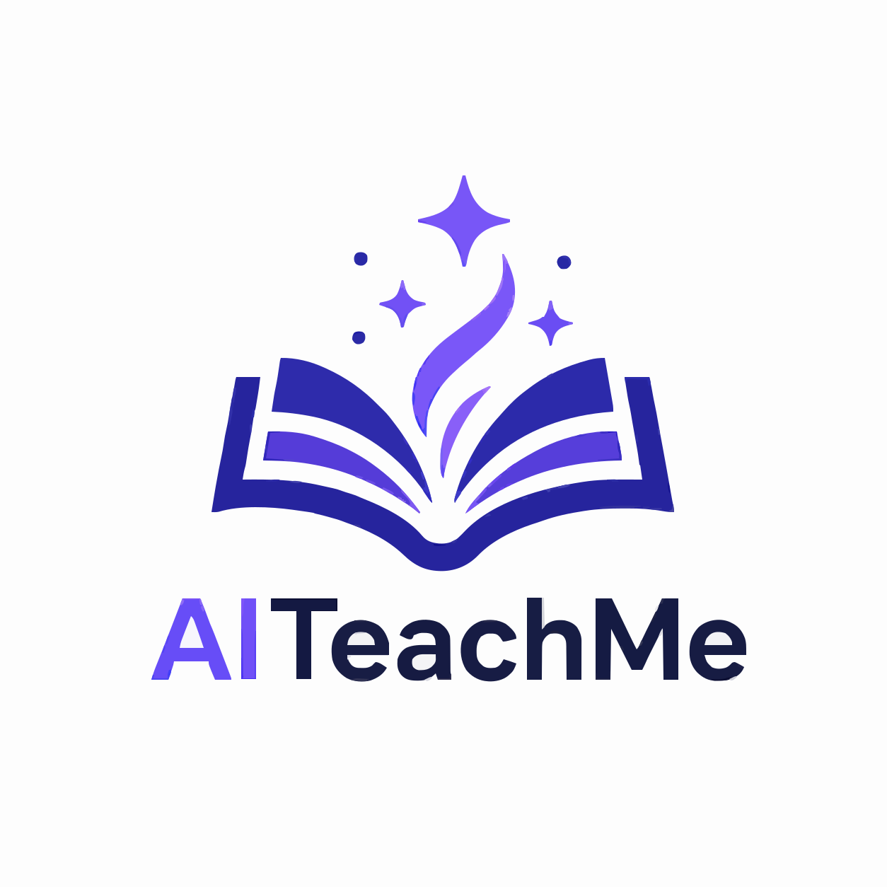
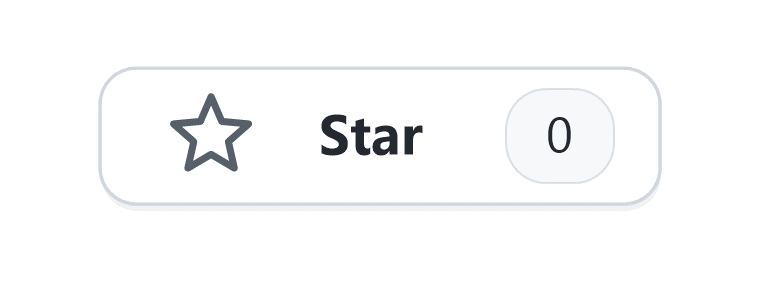
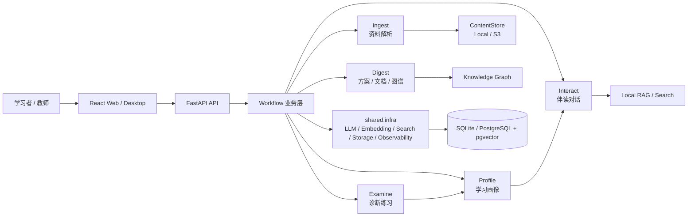

<div align="center">
  

  <h1>AITeachMe</h1>

  <p><strong>让天下没有难学的知识。</strong></p>
  <p>
    AITeachMe 是一个资料驱动的 AI 学习系统，把课程资料转化为可讲、可问、可测、可追踪的个人学习空间。
  </p>

  <p>
    <a href="./LICENSE"></a>
    
    
    
    
    <a href="https://github.com/aiteachme/AiTeachMe"></a>
  </p>
</div>

---

## AITeachMe 是什么

现代学习最难的地方不是缺资料，而是资料很难转化成持续、可验证、可复用的学习行为。AITeachMe 以 `Course` 为边界，把上传资料、知识文档、知识图谱、伴读对话、诊断练习和学习画像串成一个闭环。

```text
学习资料
  -> Ingest: 解析为标准 Markdown 与资产
  -> Digest: 生成学习方案、知识文档与知识图谱
  -> Interact: 围绕资料和上下文伴读问答
  -> Examine: 出题、作答、判卷、错因解释
  -> Profile: 沉淀掌握度、薄弱点、复习任务和学习画像
```

它不是一个简单的 ChatGPT 壳，也不是只做文件摘要的工具。项目目标是让一门课程拥有可持续复用的资料解析结果、教学上下文、诊断反馈和学习记录。

如果说传统学习软件解决的是“资料放在哪里”，AITeachMe 想进一步解决“资料如何被组织、追问、验证并沉淀到下一次学习”。资料进入系统后，不只被摘要，也会成为后续教学、练习、复习和画像可以复用的上下文。

## 为什么值得关注

| 设计判断 | 含义 |
| --- | --- |
| 课程边界 | 资料、文档、图谱、对话、考试和画像围绕 `Course` 组织，避免每次学习都从零开始 |
| Workflow 编排 | 后端以 LangGraph workflow 承接长链路任务，把解析、生成、诊断拆成可观测的阶段 |
| 知识资产复用 | Digest 先形成学习方案，再生成知识文档和图谱，Interact / Examine / Profile 复用这些产物 |
| 本地优先 | 本地 SQLite + ContentStore 可以独立运行，云端路径再接 PostgreSQL + pgvector + S3-compatible OSS |
| 学习记录沉淀 | Profile 记录掌握度、薄弱点、复习任务和 study plan，逐步服务后续学习行为 |
| 工程边界清晰 | `api -> workflows -> repositories / shared.infra / models / schemas`，业务编排和基础设施能力分层明确 |

## 当前状态

AITeachMe 当前处于 MVP 到早期产品化阶段，核心链路已经按真实应用边界拆分，但公开展示素材、部署模板和社区协作流程仍在持续完善。

| 维度 | 当前能力 |
| --- | --- |
| 本地运行 | React + FastAPI 分离运行，Windows 提供 `dev.bat` 一键启动入口 |
| 桌面端 | Electron local 为默认打包路径，Tauri local/remote 可选 |
| 后端架构 | FastAPI + SQLModel + LangGraph，`workflows/` 是唯一业务层 |
| 数据与存储 | 本地 SQLite + ContentStore；云端支持 PostgreSQL + pgvector 与 S3-compatible OSS |
| 文件接入 | 当前开放 PDF、DOCX、PPTX、Markdown、TXT、JPG/PNG/BMP 等资料上传 |
| 观测与调试 | LangSmith trace、workflow progress events、LLM token/timing summary |
| 代码规模 | 约 195.1k 总行数 / 161.7k 代码行；趋势图见下方「代码量概览」 |

## 保持关注

如果你想跟进 AITeachMe 的新功能、产品改进和后续发布，欢迎给仓库点一个 Star。

<p align="center">
  <a href="https://github.com/aiteachme/AiTeachMe">
    
  </a>
</p>

也欢迎扫码加入 AITeachMe 微信群，直接交流产品想法、使用反馈和后续共创计划。

<p align="center">
  
</p>

## 核心能力

| 模块 | 做什么 | 现在的边界 |
| --- | --- | --- |
| Ingest 透视引擎 | 把原始资料解析成可预览、可检索、可继续增强的 Markdown 与 assets | 上传、去重、解析、OCR/增强、失败恢复 |
| Digest 织网引擎 | 从资料生成可确认的学习方案，再生成知识文档并同步知识图谱 | Planner -> DocGen -> KG Doc Sync |
| Interact 伴读引擎 | 基于课程资料、知识文档、上下文和画像进行教学对话 | SSE 流式输出、本地知识优先、上下文压缩 |
| Examine 诊断引擎 | 生成试卷、组织作答、判卷并解释错因 | 题目生成、提交评分、诊断反馈、写回画像 |
| Profile 显影引擎 | 把学习与作答沉淀成掌握度、薄弱点、复习任务和学习建议 | update / snapshot / study_plan 三条链路 |
| Support 支撑用例 | 承接不属于五大引擎但面向 API 的业务用例 | 课程、认证、系统设置、导入导出 |

## 端到端架构



这张图只表达当前主干依赖：API 不直接拼装 AI 能力，业务流程进入 `workflows/`，共享能力由 `shared.infra` 提供，知识资产和学习画像围绕课程边界持久化。

## 产品展示位

> 这里先只预留产品展示结构，不新增产品截图或演示文件。后续公开发布前建议补齐真实截图、短 GIF 和一段完整课程样例。

| 场景 | 展示重点 | 推荐素材 |
| --- | --- | --- |
| 学习空间 | 课程列表、资料库、构建状态、学习入口 | 首屏截图 |
| 资料解析 | 上传资料到 Markdown 预览与资产抽取 | 8-12 秒 GIF |
| 知识文档 | 学习方案、章节生成、引用依据、质量报告 | 宽屏截图 |
| 知识图谱 | 知识单元、关系边、图谱侧栏与定位 | 交互 GIF |
| 伴读问答 | 基于课程资料的流式教学对话 | 对话截图 |
| 诊断练习 | 出题、作答、判卷、错因解释、画像更新 | 流程拼图 |
| 桌面端 | 安装、启动本地后端、数据目录与更新提示 | 安装包截图 |

## 使用形态

| 形态 | 适合谁 | 特点 |
| --- | --- | --- |
| 本地开发版 | 开发者、研究者、早期体验者 | 前后端分离运行，便于调试 workflow、模型、解析器和前端交互 |
| 桌面本地版 | 希望数据留在本机的个人用户 | Electron/Tauri local 打包，内置本地后端，默认使用本地数据目录 |
| 云端部署版 | 小团队、课程平台、内部验证环境 | 前端 Nginx + 后端服务 + PostgreSQL/pgvector + S3-compatible OSS |
| 课程包交换 | 教师、内容创作者、课程维护者 | 通过 `.atmx` 导入导出课程知识资产，支持迁移和复用 |

## 技术栈

| 层 | 技术 |
| --- | --- |
| Web 前端 | React 19, TypeScript, Vite, React Router, TanStack Query, Tailwind CSS, Framer Motion |
| 可视化 | Three.js, react-force-graph-2d, D3, Mermaid, KaTeX, Markdown 渲染 |
| 桌面端 | Electron, Tauri v2, Electron Builder, NSIS |
| 后端 API | FastAPI, SQLModel, Pydantic, Uvicorn |
| AI 编排 | LangGraph, LangSmith, LiteLLM, Instructor |
| 检索与知识 | 本地 RAG, pgvector, llama-index-core, Knowledge Graph lanes |
| 文件解析 | MarkItDown 风格本地解析、Mammoth/DOCX、PDF/PPTX/OCR、MinerU/PaddleOCR 外部链路 |
| 数据与存储 | SQLite, PostgreSQL, ContentStore, S3-compatible object storage |

## 快速启动

### 环境要求

- Python `3.11+`
- Node.js `18+`
- Windows 优先支持；Linux/macOS 可按前后端分离方式运行
- 终端和文件读写建议统一使用 UTF-8

### 后端

```powershell
cd backend
$env:PYTHONUTF8 = "1"
pip install -e .
uvicorn app.main:app --reload --reload-dir app --port 9020
```

健康检查：

```text
http://127.0.0.1:9020/api/health
```

### 前端

```powershell
cd frontend
npm install
npm run dev
```

默认地址：

```text
http://127.0.0.1:5180
```

开发模式下，Vite 会把 `/api` 代理到 `http://127.0.0.1:9020`。

### Windows 一键开发入口

```powershell
.\dev.bat
```

可通过 `.env` 或环境变量覆盖端口和 Conda 环境：

```env
AITEACHME_BACKEND_PORT=9020
AITEACHME_FRONTEND_PORT=5180
AITEACHME_CONDA_ENV=<your-conda-env>
```

### 最小本地配置

根目录 `.env.sample` 是本地用户侧变量入口，`.env.developer.sample` 包含开发、部署、验证码、通知等扩展配置。

```env
APP_MODE=local
AUTH_ENABLED=false
LLM_API_KEY=<model-api-key>
LLM_BASE_URL=https://api.example.com/v1
```

未启用鉴权的本地模型网关可以不填 `LLM_API_KEY`。实际模型槽位也可以在设置页或项目 settings override 中配置。

## 目录结构

```text
AITeachMe/
├── frontend/       # React 前端、Electron/Tauri 桌面端入口
├── backend/        # FastAPI 后端、workflows、models、migrations
├── docs/           # 当前事实源、标准、部署和开发说明
├── infra/          # Docker、Compose、Nginx、部署脚本
├── packaging/      # 打包与发布入口；桌面实现位于 packaging/desktop/
└── scripts/        # 仓库级辅助脚本
```

后端推荐依赖方向：

```text
api -> workflows -> repositories / shared.infra / models / schemas
shared.infra -> shared.kernel
```

`backend/app/workflows/` 是唯一业务层，承接五大引擎和 support 用例。`backend/app/shared/infra/` 只负责 LLM、检索、存储、数据库、workflow runtime、observability 等共享基础设施。

## 工程原则

- **Course first**：课程是资料、知识文档、知识图谱、对话、练习和画像的统一边界。
- **Workflow native**：复杂 AI 流程进入 LangGraph lane，状态、节点、进度和观测都应该可以追踪。
- **Evidence first**：学习文档和对话尽量回到资料、引用、检索结果和图谱资产，而不是只依赖模型即时发挥。
- **Local first**：本地模式必须能独立运行；云端能力是扩展，不是使用项目的前置门槛。
- **Readable by default**：模块 README 和 `docs/` 是当前事实源，架构变化必须能被后来者读懂。
- **Graceful degradation**：可选的外部服务、更新能力和云端能力缺失时，普通本地使用不应被硬阻断。

## 桌面端与发布

桌面端打包统一从仓库根目录运行：

```powershell
.\packaging\release.bat
```

默认生成 Electron local 安装包。Tauri local、remote 包和预绑定本地模型配置都通过显式参数打开，详细说明见 [packaging/README.md](./packaging/README.md)。

常见入口：

```powershell
.\packaging\release.bat
.\packaging\release.bat -ImportBundledEnv
.\packaging\release.bat -IncludeTauri
.\packaging\release.bat -IncludeRemote -ApiUrl https://api.example.com
```

Tauri local 已接入 Tauri v2 updater。没有 GitHub Release、没有更新 manifest 或网络不可达时，更新检查会静默跳过，不影响正常使用。

## 文档导航

从 [docs/README.md](./docs/README.md) 开始阅读。高频入口：

| 主题 | 文档 |
| --- | --- |
| 产品定位 | [产品愿景](./docs/product/vision.md) |
| 国际化策略 | [英文模式与国际化策略](./docs/product/language-mode-and-internationalization.md) |
| 系统总览 | [系统架构](./docs/architecture/system-architecture.md) |
| 仓库结构 | [仓库结构与运行时文件](./docs/architecture/repo-structure-and-runtime-files.md) |
| 本地开发 | [本地开发](./docs/development/local-development.md) |
| API 契约 | [API 契约与开发流程](./docs/development/api-contracts-and-dev-workflow.md) |
| Workflows | [Workflows 结构规则](./backend/app/workflows/README.md) |
| Infra | [Infra 分层说明](./backend/app/shared/infra/README.md) |
| 云端部署 | [云端部署配置](./docs/deployment/cloud-deployment.md) |
| 桌面端打包 | [packaging/README.md](./packaging/README.md) |

## 路线图

短期重点：

- 补齐公开 README 的真实截图、演示 GIF、课程样例和英文项目介绍。
- 强化 Ingest 持久化任务队列，减少长解析任务对进程内存状态的依赖。
- 完善 DocGen repair loop，让知识文档生成具备更强的自检和修复闭环。
- 增强 Profile study plan，把画像结果更主动地反馈到复习、练习和伴读建议中。
- 完善云端部署模板、发布流程和社区贡献指引。

中长期方向：

- 更完整的学习档案和认知诊断模型。
- 更强的知识图谱查询、可视化和章节定位能力。
- 更成熟的 `.atmx` 课程包导入导出和复用流程。
- 面向团队部署的权限、协作和运维能力。
- 更清晰的插件、工具和外部数据源接入边界。

## 贡献

欢迎围绕以下方向贡献：

- 文件解析质量、OCR、Markdown 规范化和资料预览体验。
- Planner / DocGen / KG 的教学质量、引用依据和质量评估。
- 伴读对话、诊断练习、错因解释和 Profile 学习建议。
- 前端交互、暗色模式、移动端适配和可视化体验。
- 部署、打包、更新、导入导出和文档质量。

开发前建议先阅读：

- [CONTRIBUTING.md](./CONTRIBUTING.md)
- [本地开发](./docs/development/local-development.md)
- [API 契约与开发流程](./docs/development/api-contracts-and-dev-workflow.md)
- [Workflows 结构规则](./backend/app/workflows/README.md)

重要约束：

- Python 使用 `3.11+`。
- 输入输出文件读写统一使用 UTF-8。
- `frontend/src/api/generated/` 由 Orval 生成，不手动修改。
- 架构改动优先同步 `docs/` 的当前事实源，以及对应模块目录内 README。
- 文档中不要提交真实密钥、私有部署地址、本机绝对路径或其他敏感信息。

<!-- CODE_STATS_START -->
## 代码量概览


![代码量趋势](https://quickchart.io/chart?c=%7B%22type%22%3A%22line%22%2C%22data%22%3A%7B%22labels%22%3A%5B%222026-03-11%22%2C%22%22%2C%22%22%2C%22%22%2C%22%22%2C%22%22%2C%22%22%2C%22%22%2C%22%22%2C%22%22%2C%22%22%2C%22%22%2C%222026-03-29%22%2C%22%22%2C%22%22%2C%22%22%2C%22%22%2C%22%22%2C%22%22%2C%22%22%2C%22%22%2C%22%22%2C%22%22%2C%22%22%2C%222026-04-12%22%2C%22%22%2C%22%22%2C%22%22%2C%22%22%2C%22%22%2C%22%22%2C%22%22%2C%22%22%2C%22%22%2C%22%22%2C%22%22%2C%222026-04-19%22%2C%22%22%2C%22%22%2C%22%22%2C%22%22%2C%22%22%2C%22%22%2C%22%22%2C%22%22%2C%22%22%2C%22%22%2C%22%22%2C%222026-04-25%22%2C%22%22%2C%22%22%2C%22%22%2C%22%22%2C%22%22%2C%22%22%2C%22%22%2C%22%22%2C%22%22%2C%22%22%2C%22%22%2C%222026-04-28%22%2C%22%22%2C%22%22%2C%22%22%2C%22%22%2C%22%22%2C%22%22%2C%22%22%2C%22%22%2C%22%22%2C%22%22%2C%22%22%2C%222026-05-04%22%2C%22%22%2C%22%22%2C%22%22%2C%22%22%2C%22%22%2C%22%22%2C%22%22%2C%22%22%2C%22%22%2C%22%22%2C%22%22%2C%222026-06-01%22%2C%22%22%2C%22%22%2C%22%22%2C%22%22%2C%22%22%2C%22%22%2C%22%22%2C%22%22%2C%22%22%2C%22%22%2C%22%22%2C%222026-07-14%22%2C%22%22%2C%22%22%2C%22%22%5D%2C%22datasets%22%3A%5B%7B%22label%22%3A%22%5Cu4ee3%5Cu7801%5Cu884c%5Cu6570%22%2C%22data%22%3A%5B253%2C7485%2C5577%2C7379%2C11038%2C21371%2C25874%2C30526%2C40324%2C42730%2C44399%2C50563%2C62897%2C66005%2C67117%2C76133%2C79372%2C83066%2C85623%2C87010%2C84621%2C89072%2C96494%2C100146%2C105921%2C107567%2C109901%2C109113%2C99784%2C98782%2C103493%2C99911%2C96423%2C97550%2C97184%2C100407%2C101834%2C100354%2C102283%2C103464%2C106302%2C106487%2C107135%2C107819%2C109531%2C111725%2C116311%2C119498%2C118401%2C127178%2C127491%2C129624%2C134463%2C137266%2C134992%2C135278%2C130971%2C139075%2C133084%2C135228%2C136961%2C138057%2C138919%2C139585%2C140281%2C141500%2C141096%2C142636%2C147052%2C146015%2C149737%2C155268%2C150246%2C150232%2C150482%2C152695%2C153510%2C154850%2C158810%2C164840%2C165839%2C172331%2C173300%2C176000%2C193089%2C193531%2C195804%2C202940%2C203704%2C205814%2C209444%2C221823%2C226811%2C230584%2C233715%2C234971%2C236388%2C242699%2C253927%2C262022%5D%2C%22borderColor%22%3A%22rgb%2875%2C%20192%2C%20192%29%22%2C%22backgroundColor%22%3A%22rgba%2875%2C%20192%2C%20192%2C%200.5%29%22%2C%22fill%22%3Atrue%2C%22tension%22%3A0.4%7D%2C%7B%22label%22%3A%22%5Cu6ce8%5Cu91ca/%5Cu7a7a%5Cu884c%22%2C%22data%22%3A%5B272%2C3062%2C2375%2C2745%2C4228%2C8262%2C10300%2C11528%2C12604%2C12809%2C12551%2C14169%2C22181%2C22862%2C23059%2C25738%2C25837%2C26469%2C27514%2C27496%2C26842%2C28146%2C29773%2C31345%2C31348%2C32096%2C33054%2C32172%2C27964%2C27539%2C29017%2C28454%2C28511%2C29026%2C28822%2C29150%2C29336%2C28078%2C28527%2C29027%2C30206%2C30208%2C30098%2C30225%2C30464%2C30877%2C31568%2C32085%2C31973%2C33527%2C33673%2C33924%2C34366%2C34622%2C33997%2C34023%2C32873%2C34570%2C33205%2C33667%2C34016%2C34207%2C34581%2C34763%2C34655%2C34828%2C34731%2C35101%2C35664%2C35617%2C35940%2C36602%2C32077%2C32075%2C32173%2C32391%2C32264%2C32469%2C32825%2C33925%2C34022%2C35082%2C35272%2C35487%2C36712%2C36869%2C37302%2C38421%2C38518%2C38923%2C39666%2C40972%2C41947%2C42417%2C42761%2C42925%2C43206%2C44247%2C45668%2C47058%5D%2C%22borderColor%22%3A%22rgb%28255%2C%20159%2C%2064%29%22%2C%22backgroundColor%22%3A%22rgba%28255%2C%20159%2C%2064%2C%200.5%29%22%2C%22fill%22%3Atrue%2C%22tension%22%3A0.4%7D%5D%7D%2C%22options%22%3A%7B%22title%22%3A%7B%22display%22%3Atrue%2C%22text%22%3A%22%5Cu4ee3%5Cu7801%5Cu91cf%5Cu53d8%5Cu5316%5Cu8d8b%5Cu52bf%22%2C%22fontSize%22%3A16%7D%2C%22scales%22%3A%7B%22yAxes%22%3A%5B%7B%22stacked%22%3Atrue%2C%22ticks%22%3A%7B%22beginAtZero%22%3Atrue%7D%2C%22scaleLabel%22%3A%7B%22display%22%3Atrue%2C%22labelString%22%3A%22%5Cu884c%5Cu6570%22%7D%7D%5D%2C%22xAxes%22%3A%5B%7B%22stacked%22%3Atrue%2C%22scaleLabel%22%3A%7B%22display%22%3Atrue%2C%22labelString%22%3A%22%5Cu65e5%5Cu671f%22%7D%7D%5D%7D%2C%22legend%22%3A%7B%22display%22%3Atrue%7D%7D%7D&width=800&height=400)
<!-- CODE_STATS_END -->

## License 与商标

本仓库代码使用 [GNU Affero General Public License v3.0 only](./LICENSE)（`AGPL-3.0-only`）。

如果你修改本项目并通过网络服务向用户提供访问，需要按照 AGPL-3.0 的要求向这些用户提供相应源码。需要在不触发 AGPL 源码开放义务的场景中使用、集成或托管 AITeachMe，请参考 [商业授权说明](./COMMERCIAL.md)。

`AITeachMe` 名称、标识、Logo 和相关品牌资产不随代码许可证授权。商标和品牌使用边界见 [TRADEMARKS.md](./TRADEMARKS.md)。
