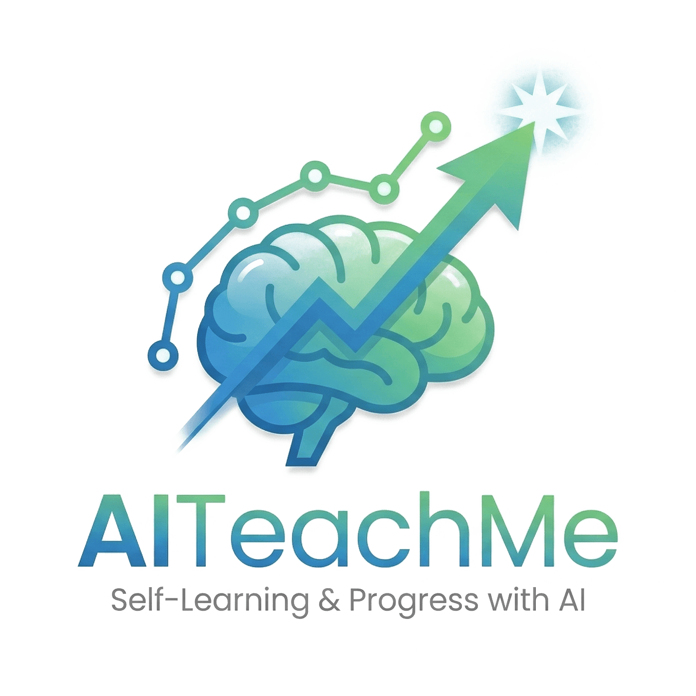

<div align="center">
  

  <p style="margin:0 0 6px 0;">
    AI 驱动的个性化学习平台 · 知识图谱 · 智能诊断 · 自适应教学
  </p>

  <p style="margin:0;">
    
    
    
    
    
  </p>
</div>


## 项目简介

AITeachMe 是一个基于 AI 的个性化学习平台，通过知识图谱、智能诊断和自适应教学技术，为学习者提供精准的学习路径和个性化辅导。

### 核心特性

- **知识图谱构建**: 自动解析学习内容，构建结构化知识体系
- **智能诊断**: AI 分析学习者掌握情况，精准定位薄弱环节
- **自适应出题**: 根据学习者水平动态生成练习题
- **个性化讲解**: 针对错题提供定制化的讲解和辅导
- **学习路径规划**: 基于知识图谱推荐最优学习路径

## 项目结构

```text
AITeachMe/
├── frontend/          # 前端应用 (React + TypeScript)
├── backend/           # 后端应用 (Python + FastAPI)
├── docs/              # 项目文档
├── scripts/           # 工程脚本
├── datasets/          # 数据集与样本
├── models/            # AI 模型资源
├── configs/           # 配置模板
└── infra/             # 基础设施配置
```

详细架构说明请参考 [项目目录架构规范](./docs/standards/standard-01-project-directory-architecture.md)

## 文档导航

开发规范
- [Standard-01: 项目目录架构规范](./docs/standards/standard-01-project-directory-architecture.md)
- [Standard-02: Git 分支管理规范](./docs/standards/standard-02-git-branch-management.md)

开发指南
- [本地开发环境搭建](./docs/local-dev.md)
- [前端开发文档](./frontend/README.md)
- [后端开发文档](./backend/README.md)

## 看板

### 📈 代码量变化趋势

![代码量趋势](https://quickchart.io/chart?c=%7B%22type%22%3A%22line%22%2C%22data%22%3A%7B%22labels%22%3A%5B%222026-03-11%22%2C%22%22%2C%22%22%2C%22%22%2C%222026-03-12%22%2C%22%22%2C%22%22%2C%22%22%2C%222026-03-11%22%2C%22%22%2C%22%22%2C%22%22%2C%222026-03-12%22%2C%22%22%2C%22%22%2C%22%22%2C%222026-03-15%22%2C%22%22%2C%22%22%2C%22%22%2C%222026-03-15%22%2C%22%22%2C%22%22%2C%22%22%2C%222026-03-15%22%2C%22%22%2C%22%22%2C%22%22%2C%222026-03-15%22%2C%22%22%2C%22%22%2C%22%22%2C%222026-03-15%22%2C%22%22%2C%22%22%5D%2C%22datasets%22%3A%5B%7B%22label%22%3A%22%5Cu4ee3%5Cu7801%5Cu884c%5Cu6570%22%2C%22data%22%3A%5B253%2C347%2C1376%2C1402%2C1446%2C1446%2C1446%2C1446%2C1446%2C1446%2C1446%2C1446%2C1446%2C1446%2C1677%2C3049%2C6294%2C6294%2C6294%2C7485%2C7485%2C7485%2C7485%2C7687%2C7687%2C7687%2C7687%2C7692%2C7692%2C7692%2C7646%2C7646%2C7646%2C7646%2C7646%5D%2C%22borderColor%22%3A%22rgb%2875%2C%20192%2C%20192%29%22%2C%22backgroundColor%22%3A%22rgba%2875%2C%20192%2C%20192%2C%200.5%29%22%2C%22fill%22%3Atrue%2C%22tension%22%3A0.4%7D%2C%7B%22label%22%3A%22%5Cu6ce8%5Cu91ca/%5Cu7a7a%5Cu884c%22%2C%22data%22%3A%5B272%2C340%2C905%2C926%2C955%2C955%2C955%2C955%2C955%2C955%2C955%2C955%2C955%2C955%2C1053%2C1461%2C2638%2C2638%2C2638%2C3062%2C3062%2C3062%2C3062%2C3114%2C3114%2C3114%2C3114%2C3120%2C3120%2C3120%2C3077%2C3077%2C3077%2C3077%2C3077%5D%2C%22borderColor%22%3A%22rgb%28255%2C%20159%2C%2064%29%22%2C%22backgroundColor%22%3A%22rgba%28255%2C%20159%2C%2064%2C%200.5%29%22%2C%22fill%22%3Atrue%2C%22tension%22%3A0.4%7D%5D%7D%2C%22options%22%3A%7B%22title%22%3A%7B%22display%22%3Atrue%2C%22text%22%3A%22FluxHive%20%5Cu4ee3%5Cu7801%5Cu91cf%5Cu53d8%5Cu5316%5Cu8d8b%5Cu52bf%22%2C%22fontSize%22%3A16%7D%2C%22scales%22%3A%7B%22yAxes%22%3A%5B%7B%22stacked%22%3Atrue%2C%22ticks%22%3A%7B%22beginAtZero%22%3Atrue%7D%2C%22scaleLabel%22%3A%7B%22display%22%3Atrue%2C%22labelString%22%3A%22%5Cu884c%5Cu6570%22%7D%7D%5D%2C%22xAxes%22%3A%5B%7B%22stacked%22%3Atrue%2C%22scaleLabel%22%3A%7B%22display%22%3Atrue%2C%22labelString%22%3A%22%5Cu65e5%5Cu671f%22%7D%7D%5D%7D%2C%22legend%22%3A%7B%22display%22%3Atrue%7D%7D%7D&width=800&height=400)


---

<div align="center">
  <p>用 AI 赋能教育，让学习更高效</p>
  <p>Made with ❤️ by AITeachMe Team</p>
</div>