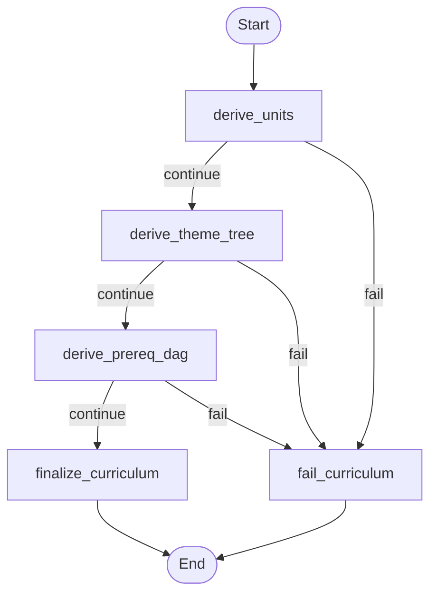

# Digest Curriculum Workflow

课程结构派生的 LangGraph 工作流。

```mermaid
flowchart TD
    workflow_start(["Start"])
    workflow_end(["End"])
    derive_units["derive_units"]
    derive_theme_tree["derive_theme_tree"]
    derive_prereq_dag["derive_prereq_dag"]
    finalize_curriculum["finalize_curriculum"]
    fail_curriculum["fail_curriculum"]
    workflow_start --> derive_units
    derive_units -->|"continue"| derive_theme_tree
    derive_units -->|"fail"| fail_curriculum
    derive_theme_tree -->|"continue"| derive_prereq_dag
    derive_theme_tree -->|"fail"| fail_curriculum
    derive_prereq_dag -->|"continue"| finalize_curriculum
    derive_prereq_dag -->|"fail"| fail_curriculum
    finalize_curriculum --> workflow_end
    fail_curriculum --> workflow_end
```
