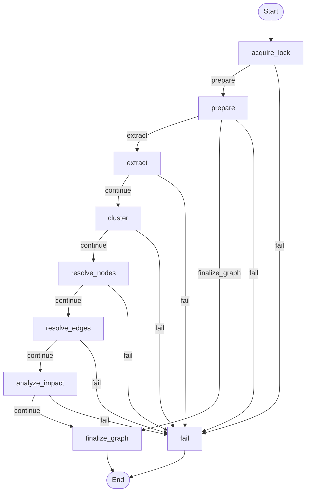

# Digest Graph Workflow

增量知识图谱构建的 LangGraph 工作流。

```mermaid
flowchart TD
    workflow_start(["Start"])
    workflow_end(["End"])
    acquire_lock["acquire_lock"]
    prepare["prepare"]
    extract["extract"]
    cluster["cluster"]
    resolve_nodes["resolve_nodes"]
    resolve_edges["resolve_edges"]
    analyze_impact["analyze_impact"]
    finalize_graph["finalize_graph"]
    fail["fail"]
    workflow_start --> acquire_lock
    acquire_lock -->|"prepare"| prepare
    acquire_lock -->|"fail"| fail
    prepare -->|"extract"| extract
    prepare -->|"finalize_graph"| finalize_graph
    prepare -->|"fail"| fail
    extract -->|"continue"| cluster
    extract -->|"fail"| fail
    cluster -->|"continue"| resolve_nodes
    cluster -->|"fail"| fail
    resolve_nodes -->|"continue"| resolve_edges
    resolve_nodes -->|"fail"| fail
    resolve_edges -->|"continue"| analyze_impact
    resolve_edges -->|"fail"| fail
    analyze_impact -->|"continue"| finalize_graph
    analyze_impact -->|"fail"| fail
    finalize_graph --> workflow_end
    fail --> workflow_end
```
