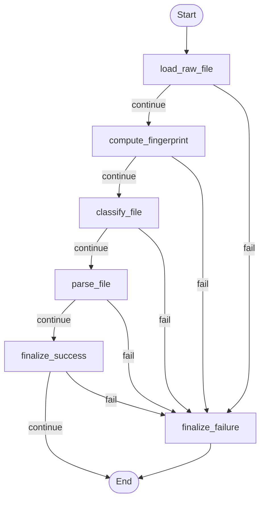

# Ingest File Parse Workflow

文件解析、落盘和进入 digest 前状态收敛的 LangGraph 工作流。

```mermaid
flowchart TD
    workflow_start(["Start"])
    workflow_end(["End"])
    load_raw_file["load_raw_file"]
    compute_fingerprint["compute_fingerprint"]
    classify_file["classify_file"]
    parse_file["parse_file"]
    finalize_success["finalize_success"]
    finalize_failure["finalize_failure"]
    workflow_start --> load_raw_file
    load_raw_file -->|"continue"| compute_fingerprint
    load_raw_file -->|"fail"| finalize_failure
    compute_fingerprint -->|"continue"| classify_file
    compute_fingerprint -->|"fail"| finalize_failure
    classify_file -->|"continue"| parse_file
    classify_file -->|"fail"| finalize_failure
    parse_file -->|"continue"| finalize_success
    parse_file -->|"fail"| finalize_failure
    finalize_success -->|"continue"| workflow_end
    finalize_success -->|"fail"| finalize_failure
    finalize_failure --> workflow_end
```
