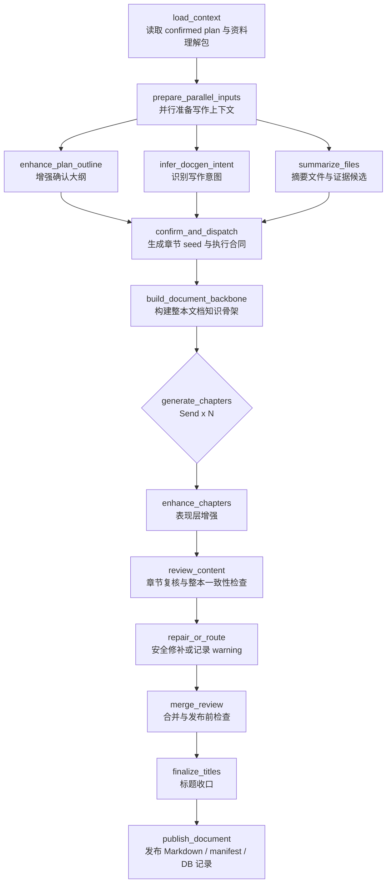

# DocGen 知识文档生成链路说明

最后更新：2026-04-19

`backend/app/workflows/digest/docgen/` 是 Digest 的知识文档生成 lane。它不负责重新替用户决定学习方案，而是消费 Planner 已确认的 `confirmed_plan`，把用户资料、章节合同、检索结果和教学表达收束成可发布的知识文档。

一句话：

```text
Planner 定方向，DocGen 按确认方案生成可读、可追踪、可复核的知识文档。
```

## 1. 权威顺序

如果文档之间出现冲突，按下面顺序判断：

1. 当前代码：`graph.py`、`state.py`、`nodes/`、`lib/models.py`
2. 当前流程设计：`FLOW_DESIGN.md`
3. 后续落地计划：`REFACTOR_PLAN.md`
4. 历史评估记录：`DOCGEN_ARCHITECTURE_REVIEW.md`

本 README 只作为接手入口，不替代节点代码的真实合同。

## 2. 当前 LangGraph 主线

当前代码主线是：

```text
load_context
  -> prepare_parallel_inputs
       ├─ enhance_plan_outline
       ├─ infer_docgen_intent
       └─ summarize_files
  -> confirm_and_dispatch
  -> build_document_backbone
  -> generate_chapters (Send x N)
  -> enhance_chapters
  -> review_content
  -> repair_or_route
  -> merge_review
  -> finalize_titles
  -> publish_document
  -> END
```

其中 `generate_chapters` 是 LangGraph `Send` fan-out：每章独立研究、整理证据、写草稿；`enhance_chapters` 在章节 fan-in 后一次性并发处理全部草稿。

## 3. 当前流程图



## 4. 节点职责

| 顺序 | 节点 | 当前职责 |
| --- | --- | --- |
| 0 | `load_context` | 校验 `confirmed_plan`，准备 `shared_inputs`、`chapter_assignments`、`DocGenContext`、`document_context` |
| 1 | `prepare_parallel_inputs` | 并行增强章节大纲、识别写作意图、摘要文件，并派生章节来源亲和度与高置信证据候选 |
| 2 | `confirm_and_dispatch` | 生成 `ChapterGenerationPlanSeed`、`ChapterGenerationTaskSeed`、`BackboneResearchAgenda`，同时保留兼容的 `ChapterGenerationPlan` / `ChapterGenerationTask` |
| 3 | `build_document_backbone` | 构建术语、概念依赖、主张池、符号表、易混点；失败时降级为 seed 弱骨架 |
| 4 | `generate_chapters` | 每章检索、读取/压缩上下文、生成 evidence ledger、claim ledger、claim/evidence map、conflict report，并写草稿 |
| 5 | `enhance_chapters` | 处理 Mermaid、图片/交互占位降级、公式清洗、Markdown 结构和本章自检题 |
| 6 | `review_content` | 逐章执行 LLM 结构化内容复核，并用规则复核兜底；同时做整本术语/标题/章节数一致性检查 |
| 7 | `repair_or_route` | 对 `surface_patch` / `section_patch` 执行局部 Markdown patch，对证据补强和重写类动作结构化记录 |
| 8 | `merge_review` | 按章去重排序，生成章节 metadata，合并 Markdown，做发布前完整性检查 |
| 9 | `finalize_titles` | 用 LLM 复核并优化最终章节标题，同步改写章节 Markdown 一级标题，并重建整本 Markdown |
| 10 | `publish_document` | 写 `_build`、当前发布文件、版本归档、`docgen_manifest.json` 和 `KnowledgeDoc` rows |

## 5. 目录结构

```text
docgen/
  __init__.py              # lane 稳定导入面
  graph.py                 # LangGraph 定义、初始 state、Send 分发
  state.py                 # DocGenState TypedDict
  builds.py                # API-facing 构建触发、状态装配、后台任务编排
  nodes/                   # 顶层图节点
  lib/                     # 节点内部复用逻辑和 Pydantic 合同
  prompts/                 # prompt builder / template
  README.md
  FLOW_DESIGN.md
  REFACTOR_PLAN.md
  DOCGEN_ARCHITECTURE_REVIEW.md
```

说明：

- `builds.py` 不是 LangGraph 节点，而是 DocGen lane 的 API-facing 构建入口。
- 知识产物清理已收口到 `digest/common/cleanup.py`，因为它清理的是 Digest 级知识产物，而不是 DocGen 私有中间状态。
- 新增节点优先放 `nodes/`，节点内部可复用逻辑放 `lib/`。
- 不新增 `runtime/`、`internal/`、`services/`、第二套 search/tool registry。

## 6. 核心合同

核心 Pydantic 模型集中在 `lib/models.py`。当前最重要的合同包括：

```text
DocGenContext
DocGenIntentProfile
FileMaterialSummary
HighConfidenceEvidenceUnit
SourceAffinityByChapter
EnhancedChapterOutline
ChapterGenerationPlanSeed
ChapterGenerationTaskSeed
BackboneResearchAgenda
DocumentBackbone
ChapterGenerationPlan
ChapterGenerationTask
ChapterResearchTrace
EvidenceLedger
ClaimLedger
ClaimEvidenceMap
ConflictReport
ChapterDraft
EnhancedChapterDraft
ReviewedChapterDraft
ChapterReviewReport
DocumentConsistencyReport
ReviewAction
AssetManifest
PracticeManifest
MergeReviewReport
```

`ChapterGenerationPlan` / `ChapterGenerationTask` 是 DocGen 内部执行合同。它们只能细化 confirmed plan，不能新增、删除、重排用户确认过的章节语义。

## 7. 发布产物

DocGen 会写出：

```text
knowledge_markdowns/_build/chapter_XX_*.md
knowledge_markdowns/_build/merged_knowledge_base.md
knowledge_markdowns/_build/docgen_manifest.json

knowledge_markdowns/chapter_XX_*.md
knowledge_markdowns/merged_knowledge_base.md
knowledge_markdowns/docgen_manifest.json

knowledge_markdowns/versions/vXXXX/chapter_XX_*.md
knowledge_markdowns/versions/vXXXX/merged_knowledge_base.md
knowledge_markdowns/versions/vXXXX/docgen_manifest.json
```

同时会写入 `KnowledgeDoc` rows，章节 manifest 会带上 evidence、claim、conflict、review、asset、practice 等结构化字段。

`docgen_manifest.json` 目前至少包含：

```text
docgen_context
intent_profile
file_summaries
source_affinity_by_chapter
high_confidence_evidence_units
chapter_generation_plan_seed
chapter_task_seeds
backbone_research_agenda
document_backbone_snapshot
backbone_conflict_warnings
chapter_generation_plan
chapter_drafts
enhanced_chapter_drafts
reviewed_chapter_drafts
research_traces
evidence_ledgers
claim_ledgers
claim_evidence_maps
conflict_reports
chapter_review_reports
document_consistency_report
review_actions
unresolved_warnings
source_trust_summary
asset_manifest
practice_manifest
merge_review_report
final_chapter_titles
title_review_report
```

## 8. 当前明显风险

当前主线不需要推倒重来，但有几处需要后续优先收口：

- `repair_or_route` 还是一次性路径，没有 `review_content <-> repair_or_route` 两轮闭环。
- `ReviewAction` 已扩展出 `evidence_patch`、`target_anchor`、`instruction`、`constraints`、`expected_effect`，repair 层已消费 `surface_patch` / `section_patch` 执行局部修补，`evidence_patch` 和 `regenerate_chapter` 仍待闭环阶段接入。
- patch 类动作只有真实修改正文才会标记为 `applied`；未执行的动作会进入 `repair_trace`。
- 如果后续引入 repair loop，`chapter_drafts` / `enhanced_chapter_drafts` 这类 `operator.add` fan-in 字段需要版本化或按章替换，否则容易累积旧草稿。
- 文生图已接入 infra `agenerate_image` 和 DocGen image 占位处理；后续还需要补更细的前端展示与失败重试策略。
- `final_merge_patch` 尚未独立实现，合并后才暴露的小问题只能由 `merge_review` / `finalize_titles` 间接收口。

这些问题都不要求立刻大改 graph，但应该按 `REFACTOR_PLAN.md` 的顺序小步处理。

## 9. 修改前检查清单

改 DocGen 前先确认：

- 是否仍然消费 `confirmed_plan`，并保持章节数量、顺序、用户确认语义不变。
- 是否会改变 LangGraph fan-in 字段，尤其是 `operator.add` 的 list 字段。
- 新字段是否应该进入 `lib/models.py` typed contract，而不是临时塞 dict。
- 是否需要写入 `docgen_manifest.json`，供后续 Interact / Examine / Profile 复用。
- 是否需要更新 `FLOW_DESIGN.md` 和 `REFACTOR_PLAN.md`。
- 是否影响 `KnowledgeDoc.manifest_json`、`source_scope_json` 或前端 build preview。
- 是否触及 `frontend/src/api/generated/`。该目录由 Orval 生成，不手改。

## 10. 推荐阅读顺序

1. `backend/app/workflows/README.md`
2. `backend/app/workflows/digest/README.md`
3. `backend/app/workflows/digest/planner/README.md`
4. `backend/app/workflows/digest/docgen/README.md`
5. `backend/app/workflows/digest/docgen/FLOW_DESIGN.md`
6. `backend/app/workflows/digest/docgen/graph.py`
7. `backend/app/workflows/digest/docgen/state.py`
8. `backend/app/workflows/digest/docgen/lib/models.py`
9. `backend/app/workflows/digest/docgen/nodes/*.py`
10. `backend/app/workflows/digest/docgen/REFACTOR_PLAN.md`

## 11. 一句话收束

DocGen 当前的正确方向不是“重新设计一个全能 Agent”，而是继续加固这条链：

```text
confirmed plan
  -> 章节执行合同
  -> 整本文档知识骨架
  -> 单章研究与证据账本
  -> 表现层增强
  -> 内容复核与有限回流
  -> 发布级 manifest
```
