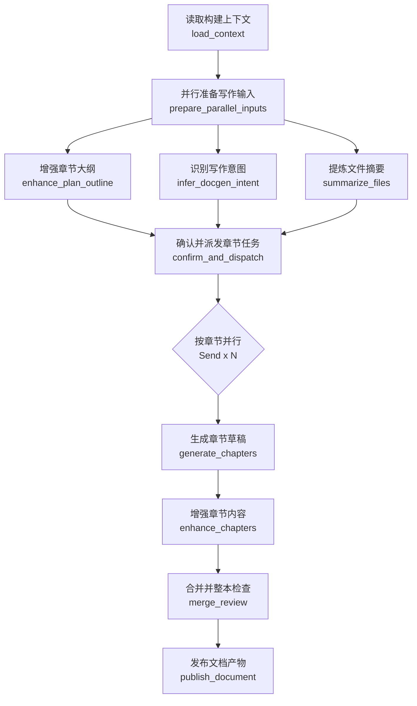

# DocGen 知识文档生成链路说明

最后更新：2026-04-17

`digest/docgen/` 是 Digest 的知识文档生成链路。Planner 已经负责生成并确认用户级构建方案；DocGen 只消费 confirmed plan，把它增强成可执行的写作大纲，并生成高质量教学文档。

## 一句话总览

DocGen 做的事是：拿用户已确认的 plan，先并行补齐写作执行上下文，再按章并行生成、增强、整本检查，最后发布 Markdown 和结构化 manifest。

## 当前 LangGraph

```text
load_context
  -> prepare_parallel_inputs
       ├─ enhance_plan_outline
       ├─ infer_docgen_intent
       └─ summarize_files
  -> confirm_and_dispatch
  -> generate_chapters (Send x N)
  -> enhance_chapters
  -> merge_review
  -> publish_document
  -> END
```

注意：`enhance_chapters` 当前在 `generate_chapters` fan-in 后一次性并发处理全部章节草稿。这样可以保持章节增强并行，同时避免在 LangGraph branch state 中传递临时章节任务。

## 手写流程图



## 步骤总览

| 顺序 | 节点 | 做什么 |
| --- | --- | --- |
| 0 | `load_context` | 读取 confirmed plan、shared inputs、skillpacks、文档上下文，生成基础 `DocGenContext` |
| 0A/0B/0C | `prepare_parallel_inputs` | 并行执行计划大纲增强、DocGen 写作意图识别、文件摘要 |
| 1 | `confirm_and_dispatch` | 内部收口 0A/0B/0C，生成唯一 `ChapterGenerationPlan` 和每章 `ChapterGenerationTask` |
| 2 | `generate_chapters` | 每章并行检索、压缩材料、生成 evidence ledger、写正文、critic 和最多一次 rewrite |
| 3 | `enhance_chapters` | 每章并行处理 Mermaid/图片建议/交互块/公式清洗/本章自检，并生成 asset/practice manifest |
| 4 | `merge_review` | 合并章节并做整本检查，输出 `MergeReviewReport` |
| 5 | `publish_document` | 发布 Markdown、KnowledgeDoc 记录、版本归档和结构化 DocGen manifest |

## 目录结构

```text
docgen/
  __init__.py
  graph.py
  state.py
  builds.py
  cleanup.py
  nodes/
    load_context.py
    prepare_parallel_inputs.py
    confirm_and_dispatch.py
    build_document_backbone.py
    generate_chapters.py
    enhance_chapters.py
    review_content.py
    repair_or_route.py
    merge_review.py
    finalize_titles.py
    publish_document.py
  lib/
    models.py
    outline_enhance.py
    intent.py
    file_summaries.py
    chapter_generation.py
    evidence.py
    chapter_critic.py
    chapter_enhancement.py
    merge_review.py
    publish.py
  prompts/
```

说明：

- `nodes/` 内文件名与 Planner 对齐，不再使用 `_node.py` 后缀；函数名仍保留 `build_xxx_node`，和 Planner 的节点 builder 风格一致。
- `builds.py` 与 `cleanup.py` 不是 LangGraph 节点。它们是 docgen lane 的 API-facing 用例入口：前者负责构建触发、状态装配和后台任务编排，后者负责清理当前学科的知识文档产物。
- 真正的图执行逻辑只放在 `graph.py`、`state.py`、`nodes/`、`lib/`、`prompts/` 这几层。

## 核心合同

新增核心模型集中在 `lib/models.py`：

- `DocGenContext`
- `DocGenIntentProfile`
- `FileMaterialSummary`
- `EnhancedChapterOutline`
- `ChapterGenerationPlan`
- `ChapterGenerationTask`
- `ChapterResearchTrace`
- `EvidenceLedger`
- `ChapterDraft`
- `EnhancedChapterDraft`
- `AssetManifest`
- `PracticeManifest`
- `MergeReviewReport`

其中 `ChapterGenerationPlan` 是 DocGen 内部核心合同。它只细化 confirmed plan，不替代 Planner，也不默认新增、删除、重排章节。

## 发布产物

除了原有章节 Markdown、merged knowledge base、`KnowledgeDoc` DB 记录以外，DocGen 现在还会写结构化 manifest：

```text
knowledge_markdowns/_build/docgen_manifest.json
knowledge_markdowns/docgen_manifest.json
knowledge_markdowns/versions/vXXXX/docgen_manifest.json
```

manifest 包含：

- `docgen_context`
- `intent_profile`
- `file_summaries`
- `chapter_generation_plan`
- `enhanced_chapter_drafts`
- `research_traces`
- `evidence_ledgers`
- `asset_manifest`
- `practice_manifest`
- `merge_review_report`

## 边界

- Planner 是用户确认级计划的唯一来源。
- DocGen 的计划大纲增强只做执行级细化。
- `confirm_and_dispatch` 是内部收口，不需要用户二次确认。
- DocGen 不默认推翻 confirmed plan；发现问题时写 `plan_mismatch_warnings` 或 merge review warning。
- 第一版不接真实图片生成，也不接尚不存在的 Examine lane；但 asset/practice manifest 已预留。

## 维护提醒

- 新 graph 以最新设计为准，不再围绕旧 `research_chapters / write_chapters / enrich_assets / append_practice` 节点做兼容。
- 旧底层 runtime 如 `DocGenChapterContextRuntime`、`DocGenWriterRuntime`、`DocGenAssetRuntime` 仍可作为可复用能力使用。
- 发布路径和 `ContentStore`/`KnowledgeDoc` 写入仍由 `lib/publish.py` 统一负责。
