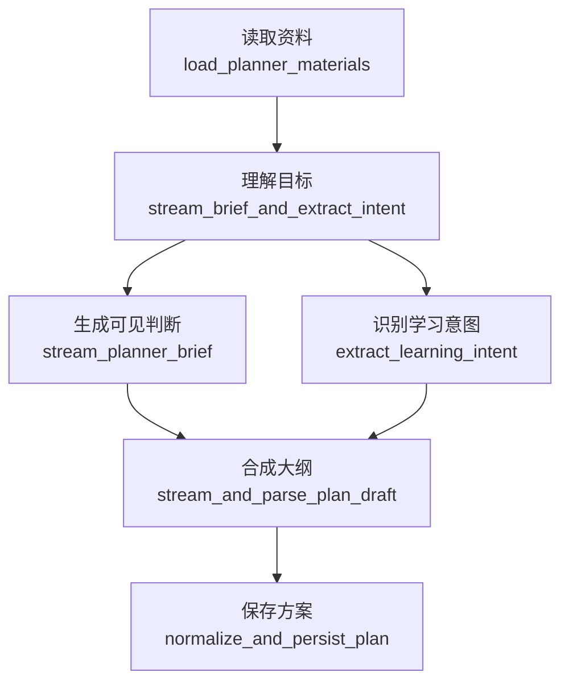

# Planner 链路说明

最后更新：2026-04-17

`digest/planner/` 负责在正式生成知识文档前，产出一份用户可确认的构建方案。

当前原则很简单：

- Planner 只理解资料、识别目标、合成计划。
- Planner 不做本地 RAG 检索。
- Planner 不做外部 Web 检索。
- 后续真正写文档时，DocGen 自己决定是否检索。

## 命名约定

- LangGraph 节点 id：英文 snake_case，和代码定位一致。
- 中文名：只用于文档、LangSmith 展示和前端文案。
- 子步骤：可以有更细的英文名，例如 `stream_planner_brief`，但它不是 LangGraph 节点。

## 当前流程

```text
load_planner_materials              # 读取资料
  -> stream_brief_and_extract_intent # 理解目标
       ├─ stream_planner_brief
       └─ extract_learning_intent
  -> stream_and_parse_plan_draft     # 合成大纲
  -> normalize_and_persist_plan      # 保存方案
```

## 推荐总流程

Planner 的流程直接按下面理解。它只做“确认前规划”，不做本地 RAG 或外部 Web research。

```text
load_planner_materials
  输入：planner_operation / requested_file_uids / file_ids / user_goal / message_history / latest_plan
    - planner_operation：create / append / generate_only，决定是否读写 planner session。
    - requested_file_uids：用户本轮选择的文件 UID。
    - file_ids：实际进入资料准备的文件 ID。
    - user_goal：用户本轮学习目标。
    - message_history：Planner 会话历史和修改意见。
    - latest_plan：append 时上一版 plan。
  输出：material_context / digest_mode / selected_file_ids / selected_file_uids / planner_record / planner_turns
    - material_context：资料理解包，包含文件、切片、画像、统计、材料 digest。
    - digest_mode：sprint 或 systematic。
    - selected_file_ids / selected_file_uids：会话绑定的文件选择。
    - planner_record / planner_turns：持久化会话快照。
  作用：准备会话、文件选择和资料上下文。正文未解析时可用文件名和目标生成 seed context。

stream_brief_and_extract_intent
  ├─ stream_planner_brief
  │    输入：material_context / user_goal / digest_mode / message_history
  │    输出：planner_brief
  │      - planner_brief：用户可见的资料边界和规划判断。
  │    作用：流式输出“我理解到什么”，给前端即时可见内容。
  └─ extract_learning_intent
       输入：material_context / user_goal / digest_mode / message_history
       输出：learning_intent
         - learning_intent：目标类型、受众、成功标准、约束、核心概念。
       作用：把用户目标转成结构化规划信号。

stream_and_parse_plan_draft
  输入：material_context / planner_brief / learning_intent / latest_plan / user_goal / message_history
  输出：plan_outline_markdown / build_plan_draft
    - plan_outline_markdown：给用户看的计划大纲文本。
    - build_plan_draft：从 `<PLAN_JSON>` 解析出的极简章节草稿。
  作用：一次 reason 流式调用，同时生成可见大纲和机器可解析 JSON。
  内部步骤：
    1. 先流式输出用户可见 Markdown。
    2. 遇到 `<PLAN_JSON>` 后停止向前端透出机器合同。
    3. 解析 `plan_text / chapters`。
    4. 转成待 normalize 的 `chapter_plan`。

normalize_and_persist_plan
  输入：build_plan_draft / material_context / latest_plan / selected_skillpacks
  输出：plan / plan_summary / planner_record / planner_turns
    - plan：API、确认接口和 DocGen 消费的最终 plan payload。
    - plan_summary：计划摘要。
    - planner_record / planner_turns：保存后的会话快照。
  作用：规范化章节数、模式、媒体计划、构建约束，并保存 assistant turn。
```

## Planner -> DocGen 交接

用户确认后，Planner 的 `plan` 会冻结成 `confirmed_plan`，DocGen 只消费这份合同。

```text
confirmed_plan
  subject：展示用主题名
  user_goal：用户学习目标
  digest_mode：sprint / systematic
  tone：写作语气
  selected_skillpacks：传给 DocGen 的提示词策略包
  chapter_plan：用户确认的章节合同，DocGen 不默认新增、删除、重排
  media_plan：Mermaid / 图片 / 交互块能力开关
  build_constraints：章节数、目标长度、是否含练习和来源等约束
  plan_summary：方案摘要
  selected_file_ids：DocGen 读取资料和检索本地切片的文件范围
  planner_context：Planner 会话摘要、最新大纲、修订次数
  docgen_history_brief：给 DocGen 的精简历史修改意见
```

交接原则：

- Planner 负责确认“学什么、按什么章节学”。
- DocGen 负责决定“每章怎么写、查哪些资料、怎么增强”。
- Planner 不把检索词、来源或证据写死给 DocGen。

## 手写流程图



## 节点职责

| LangGraph 节点 id | 中文展示名 | 代码定位 | 做什么 |
| --- | --- | --- | --- |
| `load_planner_materials` | 读取资料 | `nodes/load_planner_materials.py` | 读取会话、文件和历史消息，生成并打包 `DigestMaterialContext` |
| `stream_brief_and_extract_intent` | 理解目标 | `nodes/stream_brief_and_extract_intent.py` | 并行做两件事：流式输出可见规划判断；结构化识别学习目标 |
| `stream_and_parse_plan_draft` | 合成大纲 | `nodes/stream_and_parse_plan_draft.py` | 一次 reason 流式调用，同时输出可见大纲和 `<PLAN_JSON>` |
| `normalize_and_persist_plan` | 保存方案 | `nodes/normalize_and_persist_plan.py` | 规范化 plan，保存 planner session 和 assistant turn |

## LLM 调用

一次正常 planner run 只有 3 个逻辑 LLM 步骤：

| 顺序 | 步骤 | 模型 | 产物 |
| --- | --- | --- | --- |
| 1 | `stream_planner_brief` | `reason` | 用户可见的简短规划判断 |
| 2 | `extract_learning_intent` | `primary` | `LearningIntent` |
| 3 | `stream_and_parse_plan_draft` | `reason` | 可见大纲 + 极简 JSON 草稿 |

## State

核心业务字段只保留：

| 字段 | 作用 |
| --- | --- |
| `material_context` | 资料上下文、切片、主题画像 |
| `planner_brief` | 用户可见的规划判断原文 |
| `learning_intent` | 用户目标、成功标准、约束、核心概念 |
| `plan_outline_markdown` | 最终合成阶段展示给前端的大纲文本 |
| `build_plan_draft` | 由极简 JSON 草稿转成的待 normalize plan |
| `plan` | 对外返回和持久化的最终 plan |

运行时统计保留：

- `prepare_ms`
- `bootstrap_ms`
- `compose_ms`
- `finalize_ms`

## SSE 事件

Planner 当前事件：

- `planner.material.loading`
- `planner.material.pending`
- `planner.material.ready`
- `planner.context.started`
- `planner.context.ready`
- `planner.thinking.started`
- `planner.thinking.failed`
- `planner.thinking.empty`
- `planner.intent.ready`
- `planner.intent.failed`
- `planner.plan.composing`
- `planner.plan.ready`
- `planner.plan.failed`

可见文本增量统一走 `token` SSE；`status` 只承载阶段变化和结构化结果。
旧 `status/token/done` 仍保持兼容。
