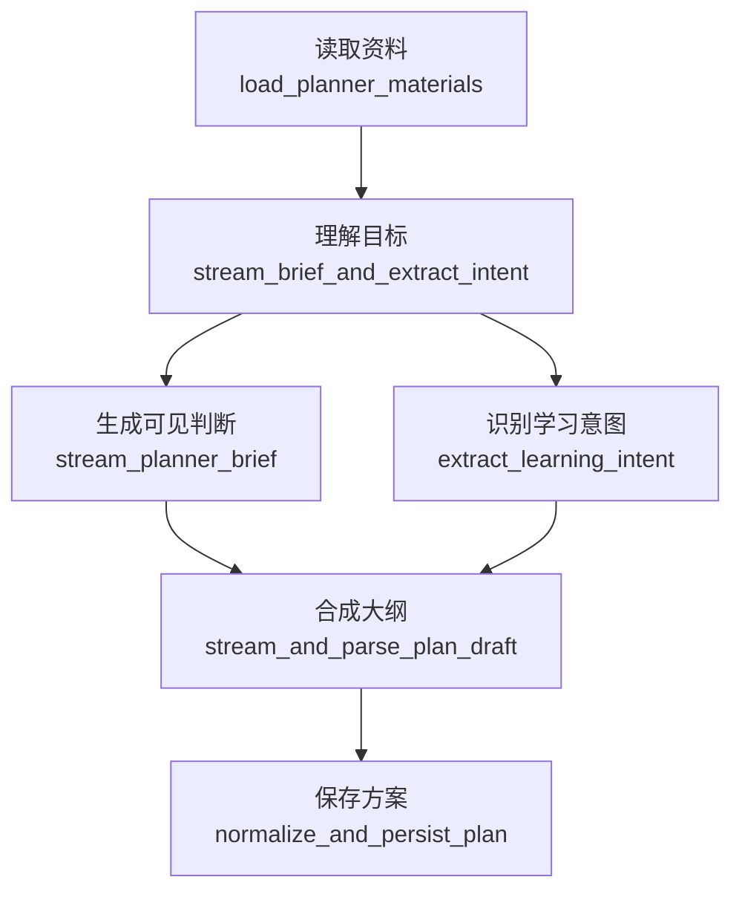

# Planner 链路说明

最后更新：2026-04-17

`digest/planner/` 负责在正式生成知识文档前，产出一份用户可确认的构建方案。

当前原则很简单：

- Planner 只理解资料、识别目标、合成计划。
- Planner 不做本地 RAG 检索。
- Planner 不做外部 Web 检索。
- 后续真正写文档时，DocGen 自己决定是否检索。

## 当前流程

```text
读取资料
  -> 理解目标
       ├─ stream_planner_brief
       └─ extract_learning_intent
  -> 合成大纲
  -> 保存方案
```

## 手写流程图



## 节点职责

| LangSmith 展示名 | 代码定位 | 做什么 |
| --- | --- | --- |
| `读取资料` | `load_planner_materials` | 读取会话、文件和历史消息，生成并打包 `DigestMaterialContext` |
| `理解目标` | `stream_brief_and_extract_intent` | 并行做两件事：流式输出可见规划判断；结构化识别学习目标 |
| `合成大纲` | `stream_and_parse_plan_draft` | 一次 reason 流式调用，同时输出可见大纲和 `<PLAN_JSON>` |
| `保存方案` | `normalize_and_persist_plan` | 规范化 plan，保存 planner session 和 assistant turn |

## LLM 调用

一次正常 planner run 只有 3 个逻辑 LLM 步骤：

| 顺序 | 步骤 | 模型 | 产物 |
| --- | --- | --- | --- |
| 1 | `stream_planner_brief` | `reason` | 用户可见的简短规划判断 |
| 2 | `extract_learning_intent` | `primary` | `LearningIntent` |
| 3 | `stream_and_parse_plan_draft` | `reason` | 可见大纲 + 极简 JSON 草稿 |

## State

核心业务字段只保留：

| 字段 | 作用 |
| --- | --- |
| `material_context` | 资料上下文、切片、主题画像 |
| `planner_brief` | 用户可见的规划判断原文 |
| `learning_intent` | 用户目标、成功标准、约束、核心概念 |
| `plan_outline_markdown` | 最终合成阶段展示给前端的大纲文本 |
| `build_plan_draft` | 由极简 JSON 草稿转成的待 normalize plan |
| `plan` | 对外返回和持久化的最终 plan |

运行时统计保留：

- `prepare_ms`
- `bootstrap_ms`
- `compose_ms`
- `finalize_ms`

## SSE 事件

Planner 当前事件：

- `planner.material.loading`
- `planner.material.pending`
- `planner.material.ready`
- `planner.context.started`
- `planner.context.ready`
- `planner.thinking.started`
- `planner.thinking.delta`
- `planner.thinking.failed`
- `planner.thinking.empty`
- `planner.intent.ready`
- `planner.intent.failed`
- `planner.plan.composing`
- `planner.plan.delta`
- `planner.plan.ready`
- `planner.plan.failed`

旧 `status/token/done` 仍保持兼容。
