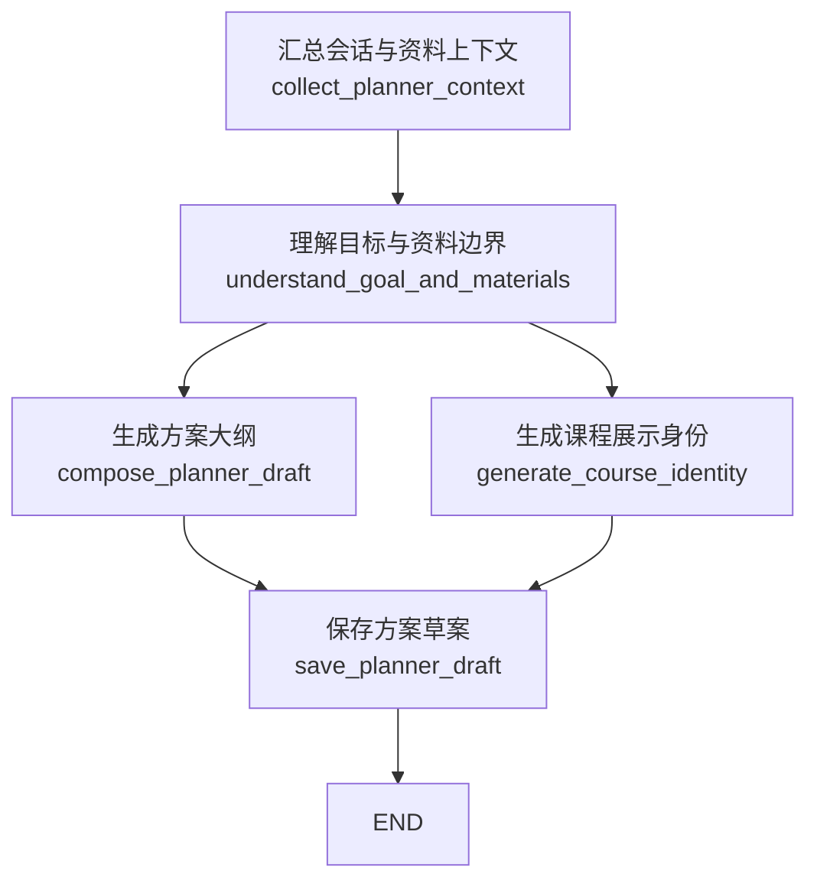
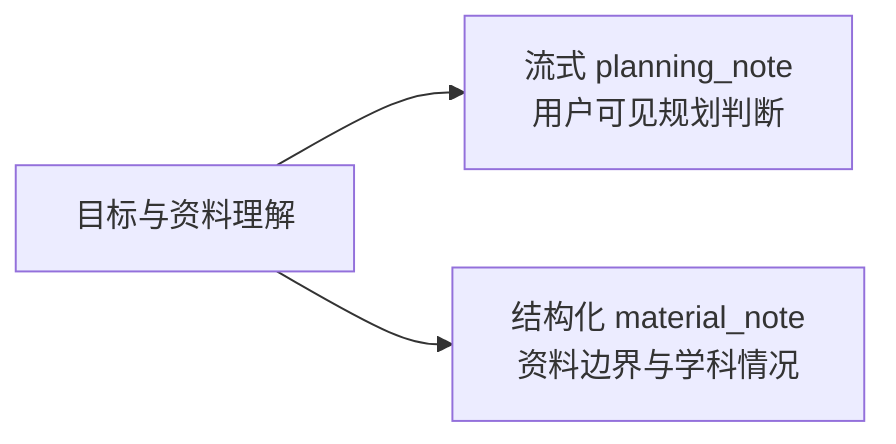
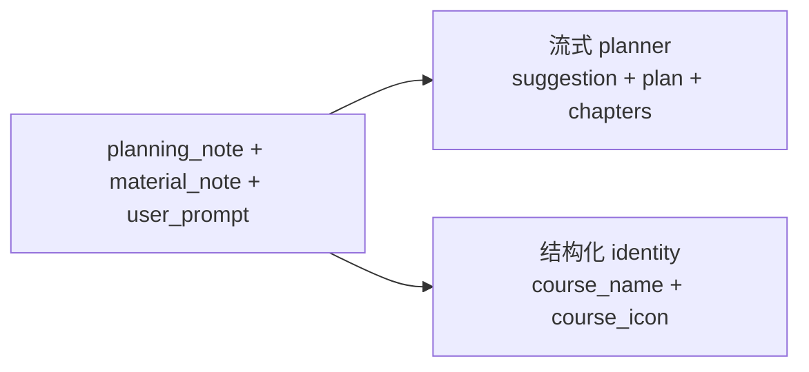

# Planner 链路说明

最后更新：2026-06-08

`digest/planner/` 是 Digest 的确认前规划链路。它负责把用户目标、资料边界和后续修改意见整理成一份可确认的课程方案；用户确认后，DocGen 只消费冻结后的 confirmed plan，不直接消费流式 token。

```text
Planner 定方向：学什么、怎么拆、每章解决什么问题。
DocGen 做执行：查上下文、写正文、审校、发布知识文档。
```

Planner 不写 `KnowledgeDoc`，不做章节正文检索，不绑定证据来源，也不能假装读取尚未解析或未上传的资料。

## 文件入口

```text
planner/
  graph.py                              # LangGraph 主线和公开运行入口
  state.py                              # 图内 state 字段
  nodes/collect_planner_context.py       # 汇总会话、资料选择、上一版方案与现有文档摘要
  nodes/understand_goal_and_materials.py # 首轮并行生成 planning_note / material_note
  nodes/compose_planner_draft.py         # 流式生成 suggestion / plan / chapters
  nodes/generate_course_identity.py      # 生成 course_name / course_icon
  nodes/save_planner_draft.py            # 规范化并保存可继续调整的 latest_plan
  lib/store.py                           # planner session / confirmed plan 持久化
  lib/model_policy.py                    # Planner LLM 策略
  prompts/                               # 规划判断、资料摘要、方案、课程身份 prompts
```

公开入口：

```python
from app.workflows.digest.planner import (
    create_build_planner_session,
    append_build_planner_message,
    confirm_build_planner_session,
    get_confirmed_build_plan,
    run_build_planner_workflow,
)
```

## 输出合同

前端和普通 API 只展示精简后的 `planner` 合同：

```json
{
  "course_name": "初中数学",
  "course_icon": "book-open",
  "user_prompt": "我想学习初中数学，请构建一门 14 天课程",
  "digest_mode": "systematic",
  "model_override": "",
  "planning_note": "本轮目标是 14 天学习初中数学，需要按知识依赖拆分...",
  "suggestion": "如果更关注考试题型，可以增加压轴题和易错诊断比例。",
  "plan": "本课程会按依赖关系拆成五个板块...",
  "chapters": [
    {
      "chapter_index": 1,
      "title": "数与式基础",
      "objective": "建立数、式和方程的基础抓手。",
      "required_elements": ["实数与代数式", "整式运算", "方程变形"],
      "writing_instructions": "围绕本章知识点生成清晰讲解。"
    }
  ]
}
```

`chapters` 是完整章节列表，不是 diff。后续调整时也必须返回完整 `suggestion + plan + chapters`。

几个旧字段不再作为公开合同：

- `intent` / `summary`：已合并成一个用户可读的 `planning_note`，新链路不再生成或对外暴露。
- `runtime_stats`：只进入日志和 tracing，不进 API。
- `plan_json`：聊天 turn 里只返回经过裁剪的公开 plan，不暴露内部执行字段。
- `build_constraints`：只在 confirmed plan 内部保留，供 DocGen 执行时约束章节数量等规则。

## Graph 总览



第一次生成时，`understand_goal_and_materials` 内部并行跑两个任务：



第二阶段，课程身份和方案大纲并行：



## 第一次生成

触发入口：`create_build_planner_session(...)`

典型场景：用户输入“我想学习初中数学，请构建一门 14 天课程”，可选上传资料。

短流程：

```text
1. 创建 planner session，保存用户首条目标和选择的文件。
2. 读取已解析资料；资料未解析时只能使用文件名、检测信息和用户目标；没有资料时只按目标规划。
3. 并行生成：
   - planning_note：流式输出用户可见的学习目标理解、规划判断和资料边界。
   - material_note：结构化整理资料/学科情况，只作为内部辅助上下文。
4. 并行生成：
   - course_name + course_icon：一次结构化调用生成课程展示身份。
   - suggestion + plan + chapters：一次流式调用生成正式方案，其中 plan 字段实时 SSE 展示。
5. 规范化并保存 latest_plan。
6. 前端展示可确认方案，用户可以确认或继续调整。
```

第一次生成的用户可见最终字段：

- `course_name`
- `course_icon`
- `user_prompt`
- `digest_mode`
- `model_override`
- `planning_note`
- `suggestion`
- `plan`
- `chapters`

## 后续调整

触发入口：`append_build_planner_message(...)`

典型场景：

- “改成 5 章”
- “更偏考试”
- “删除几何部分”
- “只讲洛必达法则”
- “把当前方案改成定积分的 5 个章节”

调整流程和第一次生成不同：

```text
1. 读取已有 planner session、上一版 latest_plan 和最近对话。
2. 追加用户反馈消息。
3. 复用上一版 planning_note、course_name、course_icon。
4. 只调用一次 planner composer，生成新的 suggestion、plan、chapters。
5. 保存完整 latest_plan；旧版本仍留在聊天历史里。
```

调整时不重新摘要资料，也不重新生成 `course_name/course_icon`。如果用户明确要求换范围或换章节数，composer 必须在完整 `chapters` 中体现变化。

## SSE 展示合同

Planner 的 SSE 不是单个 loading。前端应该分层展示阶段、判断和实时方案内容。

事件类型：

```text
status 事件：阶段进度和中间判断
token 事件：planning_note 与 plan 的自然语言流式内容
done 事件：最终 BuildPlannerSessionResponse
```

status payload 只保留 `stage`、`detail` 和必要业务 payload，避免把 `step/event/runtime_stats` 重复塞给前端。

关键事件：

| 事件 | 用途 |
| --- | --- |
| `accepted` | 请求已进入 Planner |
| `planner.material.empty` | 没有绑定资料，只按目标规划 |
| `planner.material.pending` | 资料未解析完成，先出临时方案 |
| `planner.context.ready` | 资料上下文已准备 |
| `planner.planning_note.started` | 开始流式规划判断 |
| `planner.planning_note.ready` | `planning_note` 完成，可放到方案顶部 |
| `planner.material_note.started` | 开始整理资料边界 |
| `planner.material_note.ready` | `material_note` 完成 |
| `planner.analysis.ready` | `planning_note + material_note` 都完成 |
| `planner.identity.started` | 开始生成课程名和图标 |
| `planner.identity.ready` | `course_name + course_icon` 完成 |
| `planner.plan.started` | 开始流式生成正式 `plan` |
| `planner.plan.ready` | `suggestion + plan + chapters` 完成，携带 `plan_preview` |
| `planner.saved` | latest_plan 已保存 |

推荐 UI 排布：

1. 顶部显示 `planning_note`，作为“我如何理解你的目标和资料”的判断区。
2. 第二段显示 `suggestion`，标题可用“可以继续这样改”。
3. 主体显示 `plan`，使用较强字重，作为最终方案总说明。
4. `chapters` 左侧使用编号或章节图标，不使用像复选框的圆点，避免误导为可勾选。
5. SSE 过程中已经收到的 `planning_note` 和 `plan` 都应实时展示，不能只显示“正在加载”。

## 资料读取边界

- 有已解析资料：`material_note` 可以基于资料 Markdown、material digest 和主题提示形成摘要。
- 有文件但正文未解析：只能说“检测到文件/资料名”，不能声称已经读完内容。
- 没有文件：只能基于用户目标和通用课程常识规划，SSE 中要明确说明没有绑定上传资料。

## 保存与确认

`save_planner_draft` 保存的是可继续修改的 `latest_plan`：

- 写入 `ChatSession.meta_json.latest_plan`
- 写入 assistant `ChatMessage(message_kind="planner_plan")`
- 必要时更新课程名、课程图标、课程描述和用户意图

`confirm_build_planner_session(...)` 才会冻结为 confirmed plan：

- 读取 planner session 的 `latest_plan`
- 写入 `planner_context` 和 `docgen_history_brief`
- 保留内部 `build_constraints` 给 DocGen 执行
- 生成或复用 `confirmed_plan_id`
- 更新 session 状态为 `confirmed`

DocGen 消费 confirmed plan 的核心字段仍是 `plan` 和 `chapters`。数据库表内可以保留历史列名承载这些内容，但业务 JSON 和 API 不继续暴露旧字段。

## 模型调用

策略集中在 `lib/model_policy.py`。

| 步骤 | 调用 | 模型槽位 |
| --- | --- | --- |
| `understand_goal_and_materials.stream_planning_note` | stream | `light` |
| `understand_goal_and_materials.summarize_materials` | structured | `light` |
| `compose_planner_draft` | stream | `light` |
| `generate_course_identity` | structured | `light` |

运行时如果传了 `model_override`，逻辑槽位仍写 `light`，实际 provider 模型由 runtime override / settings 决定。

## 修改检查

- 改 graph 顺序时同步更新本文 Mermaid 图。
- 新 LLM 调用必须进入 `lib/model_policy.py`。
- 新用户可见进度优先走 Planner SSE 事件，不只写日志。
- 新影响 DocGen 的字段必须进入 confirmed plan。
- 不要在 Planner 中写正文、绑定证据或做章节检索。
