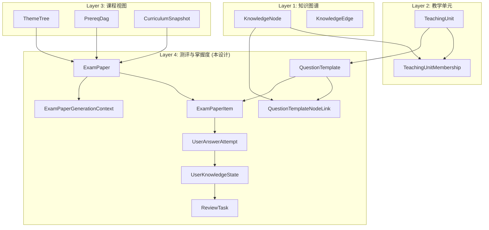
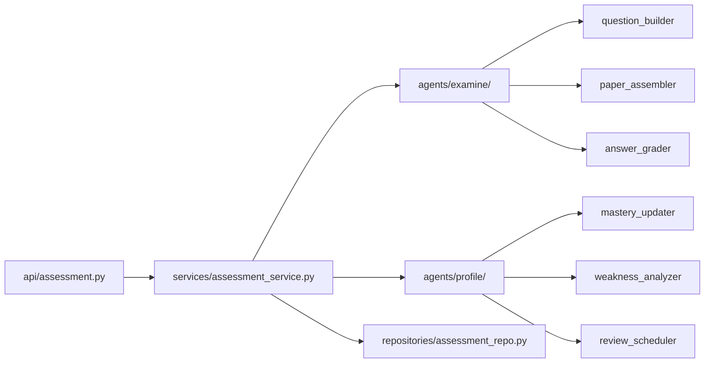
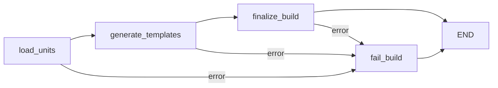
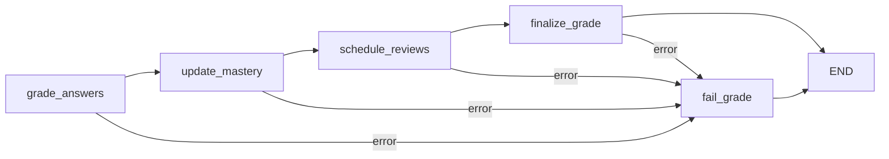
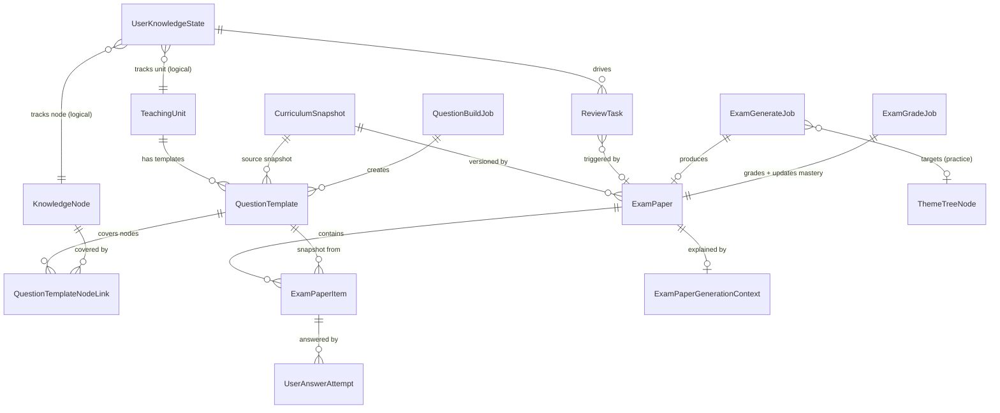

# 设计文档：Assessment & Mastery Layer（第四层：测评与掌握度层）

> 2026-04-16 当前仓库说明：本文为 assessment/mastery 早期设计。当前后端已完成 workflows 单层化，真实依赖方向为 `api -> workflows -> repositories / shared.infra / models / schemas`；Examine 用例入口位于 `workflows/examine/application/`，Profile 用例入口位于 `workflows/profile/application/`，不再使用 `services/assessment_service.py`。

## 概述

本设计在 AITeachMe 现有三层知识架构（知识图谱 → 教学单元 → 课程视图）之上构建第四层——测评与掌握度层。核心设计理念：

- **以掌握状态为核心资产**：考试是诊断载体，真正价值在于 `UserKnowledgeState`（双粒度：TeachingUnit + KnowledgeNode）
- **严格依赖现有三层**：通过 `TeachingUnitMembership` 获取知识关联，通过 `ThemeTree` 获取主题结构，通过 `PrereqDag` 获取先修依赖，通过 `CurriculumSnapshot` 保证组卷一致性
- **两阶段题目生成**：Phase A 模板沉淀（`QuestionBuildJob` → `QuestionTemplate`）+ Phase B 轻量变体（组卷时快照 + 选项打乱）
- **遵循现有项目模式**：SQLModel 模型、LangGraph 工作流、FastAPI API、structlog 日志、api/ → services/ → ai/ 依赖链

### MVP 三阶段路线

| 阶段 | 范围 | 核心交付 |
|------|------|----------|
| Phase 1 闭环 | TeachingUnit 粒度 | QuestionTemplate 生成、3 种考试模式组卷、自动判卷、unit 级 mastery 更新、简单间隔复习 |
| Phase 2 下钻 | KnowledgeNode 粒度 | node 级掌握度、错因标注、先修缺口分析、完整复习队列 |
| Phase 3 预测 | 预测模型 | BKT/DKT 替代统计方法、遗忘风险预测、自适应难度 |

## 架构

### 层级关系



### 模块依赖链



严格遵循 `api/ → services/ → ai/` 依赖链，`Examine_Engine` 和 `Profile_Engine` 之间不直接互调，由 `services/assessment_service.py` 编排。

### LangGraph 工作流

测评层引入两个 LangGraph 工作流，遵循现有 `kg_workflow.py` / `curriculum_workflow.py` 的模式（TypedDict State + StateGraph + 条件路由 + fail 节点）：


**1. QuestionBuildWorkflow（题目构建工作流）**



- `load_units`：加载目标 TeachingUnit 及其 KnowledgeNode 成员
- `generate_templates`：逐 unit 调用 LLM 生成 QuestionTemplate + QuestionTemplateNodeLink
- `finalize_build`：更新 job 状态为 completed
- `fail_build`：清理 + 标记 job 为 failed

**2. ExamGradeWorkflow（判卷 + 掌握度更新 + 复习调度 一体化工作流）**

> **设计决策**：MVP 阶段将判卷、掌握度更新、复习调度合并为一个工作流（ExamGradeWorkflow），由 ExamGradeJob 驱动完整链路：grade → mastery update → review scheduling。不再单独设置 MasteryUpdateJob 异步任务表。这样做的好处是先打通闭环、减少任务编排复杂度。Phase 2/3 如果需要解耦（如掌握度更新耗时增长、需要独立重试），可将 `update_mastery` 和 `schedule_reviews` 节点拆分为独立工作流 + 独立 Job 表。



- `grade_answers`：将 ExamPaper.status 从 submitted 迁移到 grading；精确匹配 + LLM 语义判分 + 错因标注
- `update_mastery`：调用 Profile_Engine 更新 UserKnowledgeState（双粒度）
- `schedule_reviews`：调用 Review_Scheduler 生成/更新 ReviewTask
- `finalize_grade`：更新 ExamPaper status 从 grading 到 graded，更新 ExamGradeJob 状态为 completed（含 states_updated / tasks_created 统计）

## 组件与接口

### 1. Examine_Engine（测验引擎）

位于 `backend/app/agents/examine/`，扩展现有 `generator.py` 和 `grader.py`。

#### 1.1 question_builder（题目生成器）

```python
# backend/app/agents/examine/question_builder.py

async def build_question_templates(
    *,
    session: Session,
    course: str,
    unit_ids: list[int],
    questions_per_unit: int = 9,  # 3 题型 × 3 难度
) -> list[QuestionTemplate]:
    """Phase A：为每个 TeachingUnit 生成 QuestionTemplate 模板库。
    
    流程：
    1. 通过 TeachingUnitMembership 获取每个 unit 的 KnowledgeNode 列表
    2. 从 KnowledgeRevision 获取知识内容作为出题依据
    3. 调用 LLM 生成覆盖 3 种题型 × 3 种难度的题目
    4. 计算 stem_hash 去重，跳过已有模板
    5. 持久化 QuestionTemplate 记录
    6. 为每个模板创建 QuestionTemplateNodeLink 记录（含 coverage_weight 和 role）
    """
```

#### 1.2 paper_assembler（组卷器）

```python
# backend/app/agents/examine/paper_assembler.py

async def assemble_paper(
    *,
    session: Session,
    course: str,
    user_id: str,
    exam_mode: ExamMode,
    num_questions: int,
    theme_tree_node_id: int | None = None,
    teaching_unit_ids: list[int] | None = None,
) -> ExamPaper:
    """根据考试模式和用户状态组装个性化试卷。
    
    流程：
    1. 获取当前 published CurriculumSnapshot
    2. 根据 exam_mode 选择题目选取策略
    3. 从 QuestionTemplate 池中选取题目（排除 status=deprecated）
    4. Phase B 轻量变体：打乱选项顺序（SINGLE_CHOICE）
    5. 创建 ExamPaper + ExamPaperItem（含内容快照 + 知识映射快照）
    6. 创建 ExamPaperGenerationContext 记录组卷决策上下文
    
    学习上下文入口：
    - practice 模式需要调用方提供学习上下文（theme_tree_node_id 或 teaching_unit_ids），
      否则降级为随机练习
    - theme_tree_node_id：指定当前学习的主题树节点，系统自动解析关联的 TeachingUnit
    - teaching_unit_ids：直接指定目标教学单元列表
    """
```

**五种考试模式的组卷策略：**

| ExamMode | 选题策略 |
|----------|----------|
| `diagnostic` | 从全部 TeachingUnit 均匀抽取，覆盖面最广 |
| `practice` | 从调用方提供的学习上下文（`theme_tree_node_id` 或 `teaching_unit_ids`）关联的 TeachingUnit 抽取；若未提供上下文则降级为随机练习 |
| `weakpoint_boost` | 70% 薄弱单元 + 20% 先修依赖单元（via UnitDependency）+ 10% 迁移拓展 |
| `review` | 优先选取 forgetting_due_at ≤ now 的 TeachingUnit 关联题目 |
| `mock_final` | 按 ThemeTree 各章节 TeachingUnit 数量比例分配题目 |

#### 1.3 answer_grader（判卷器）

```python
# backend/app/agents/examine/answer_grader.py

async def grade_paper(
    *,
    session: Session,
    exam_paper_id: int,
) -> GradeResult:
    """对试卷全部 UserAnswerAttempt 判分 + 错因标注。
    
    幂等性保证：
    - 若 UserAnswerAttempt.is_correct 已非 None，跳过该条目不重复判分
    - 重复调用对已判分的 attempt 不产生额外修改副作用
    - 若 ExamPaper.status 已为 graded，返回已有结果或拒绝执行（由 service 层控制 regrade 参数）
    
    判分策略：
    - SINGLE_CHOICE / FILL_BLANK：精确匹配（忽略大小写 + 首尾空白）
    - SHORT_ANSWER：LLM 语义判分，失败时降级为精确匹配
    
    错因标注：
    - is_correct=false 时调用 LLM 分析错因
    - 基于 QuestionTemplateNodeLink 关联的知识内容进行错因分析
    - 写入 ErrorCauseLabel 枚举值到 UserAnswerAttempt.error_cause_label
    """
```

### 2. Profile_Engine（画像引擎）

位于 `backend/app/agents/profile/`，新建模块。

#### 2.1 mastery_updater（掌握度更新器）

```python
# backend/app/agents/profile/mastery_updater.py

async def update_mastery_from_exam(
    *,
    session: Session,
    exam_paper_id: int,
) -> MasteryUpdateResult:
    """根据判卷结果更新 UserKnowledgeState（双粒度）。
    
    幂等性保证：
    - 使用 ExamGradeJob.states_updated 作为"已处理"标记
    - 若 states_updated > 0 且 job.status == completed，说明已处理过，跳过重复执行
    - 内部使用 upsert 语义更新 UserKnowledgeState，避免重复累计 total_attempts / correct_attempts
    - 具体做法：每次更新基于 ExamPaperItem 快照重新计算增量，而非盲目 += 1
    
    计算方法（MVP 阶段 - 加权统计）：
    - mastery_score = weighted_correct / weighted_total
      - 近期权重更高（时间衰减 recency decay：越近的作答权重越大）
      - 难度加权：easy=0.8, medium=1.0, hard=1.2
      - mastery_score 反映历史累积表现，是"学得怎么样"的度量
    - confidence_score = min(1.0, total_attempts / 10)（作答越多越置信）
    - stability_score = consecutive_correct / 5（连续正确越多越稳定）
      - stability_score 反映记忆稳定性，是遗忘曲线的驱动因子
      - stability_score 高 → forgetting_due_at 远 → 复习间隔长
    - forgetting_due_at = now + interval_from_stability
    
    mastery_score 与 stability_score 的关系：
    - mastery_score 是"学会了多少"（历史表现的加权统计）
    - stability_score 是"记住了多牢"（连续正确的稳定性度量）
    - 两者独立计算，共同驱动 review_priority 和 forgetting_due_at
    
    多节点题目的掌握度分配：
    - 通过 ExamPaperItem.snapshot_node_links_json 获取快照时的节点关联（含 coverage_weight 和 role）
    - 根据 coverage_weight 将得分按权重分配到各节点
    """
```

#### 2.2 weakness_analyzer（薄弱分析器）

```python
# backend/app/agents/profile/weakness_analyzer.py

def analyze_weakness(
    *,
    session: Session,
    user_id: str,
    course: str,
    top_n: int = 20,
) -> list[WeaknessItem]:
    """综合五维度计算薄弱 TeachingUnit 列表。
    
    五个维度：
    1. mastery_score（掌握度越低优先级越高）
    2. 近期错误频率
    3. 先修缺口（via UnitDependency，先修 mastery < 0.6）
    4. 遗忘风险（forgetting_due_at 越近优先级越高）
    5. 考试权重（ThemeTree 中占比越大优先级越高）
    
    返回结果包含 WeaknessReason 标签：
    - forgetting_due: 遗忘到期
    - repeated_wrong: 反复做错
    - prereq_gap: 先修缺口
    - newly_learned: 新学未巩固
    """
```

#### 2.3 review_scheduler（复习调度器）

```python
# backend/app/agents/profile/review_scheduler.py

def schedule_reviews(
    *,
    session: Session,
    user_id: str,
    course: str,
    updated_state_ids: list[int],
) -> list[ReviewTask]:
    """基于 SM-2 启发的间隔重复算法生成/更新 ReviewTask。
    
    幂等性保证：
    - 使用 upsert 语义（INSERT ... ON CONFLICT DO UPDATE）写入 ReviewTask
    - 依赖数据库部分唯一索引 uq_review_task_pending 保证并发安全
    - 重复调用不会产生多余的 pending ReviewTask
    
    SM-2 核心逻辑：
    - 首次间隔：1 天
    - 第二次：6 天
    - 后续：interval = prev_interval × ease_factor
    - ease_factor 范围：[1.3, 2.5]
    - 正确率 > 0.8 → ease_factor 增加
    - 正确率 < 0.6 → ease_factor 降低
    - 同一 user+course+target+target_granularity 只保留一个 pending ReviewTask
    
    ReviewTask 生成时记录 reason（WeaknessReason）和 source 追踪信息。
    """

def compute_sm2_interval(
    *,
    repetition_count: int,
    current_ease_factor: float,
    current_interval_days: int,
    accuracy: float,
) -> tuple[int, float]:
    """SM-2 纯函数计算：返回 (new_interval_days, new_ease_factor)。
    
    幂等性保证：相同输入 → 相同输出。
    """
```

### 3. Services 层

```python
# backend/app/services/assessment_service.py

async def trigger_question_build(session, *, course, unit_ids, questions_per_unit) -> QuestionBuildJob
async def trigger_exam_generate(
    session, *, course, user_id, exam_mode, num_questions,
    theme_tree_node_id: int | None = None,
    teaching_unit_ids: list[int] | None = None,
) -> ExamGenerateJob
async def submit_exam_answers(session, *, course, exam_paper_id, user_id, answers) -> ExamPaper
    """提交答卷（仅落库，不自动触发判卷）。
    
    职责边界：
    - 仅负责将用户答案写入 UserAnswerAttempt 并将 ExamPaper.status 迁移到 submitted
    - 不触发 ExamGradeJob，判卷必须由前端单独调用 trigger_exam_grade
    - 幂等性保证：若 ExamPaper.status 已为 submitted/grading/graded，拒绝重复提交（返回 409）
    """
async def trigger_exam_grade(session, *, exam_paper_id, regrade: bool = False) -> ExamGradeJob
    """触发判卷（提交与判卷解耦）。
    
    前置条件与防重复规则：
    - 仅当 ExamPaper.status == submitted 时允许触发（否则返回 409）
    - 同一 exam_paper_id 在 pending/running 状态下最多一个 ExamGradeJob（查重后创建）
    - 已 graded 的 paper 不允许再次触发，除非显式传入 regrade=True
    - 触发时将 ExamPaper.status 迁移到 grading
    """
async def get_mastery_overview(session, *, course, user_id) -> MasteryOverview
async def get_mastery_detail(session, *, course, user_id, target_id, granularity: MasteryGranularity) -> UserKnowledgeState
    """获取单个单元/节点掌握度详情。
    
    注意：必须同时传入 target_id 和 granularity 以消除逻辑多态歧义。
    """
async def get_review_tasks(session, *, course, user_id) -> list[ReviewTask]
async def complete_review_task(session, *, task_id, user_id) -> ReviewTask
```

> **提交与判卷解耦规则总结**：
> 1. `submit_exam_answers` 只落库，不触发判卷
> 2. `trigger_exam_grade` 前置检查：ExamPaper.status 必须为 submitted
> 3. 同一 exam_paper_id 在 pending/running 状态下最多一个 ExamGradeJob
> 4. 已 graded 的 paper 不允许再次触发，除非 regrade=True

### 4. API 层

```python
# backend/app/api/assessment.py
# 修正：prefix 已包含 courses/{course}，各路由不再重复 {course}
router = APIRouter(prefix="/api/v1/courses", tags=["assessment"])

# ── 路由注册顺序说明（FastAPI 重要） ──
# FastAPI 按注册顺序匹配路由，固定路径必须在动态路径之前注册。
# 例如 GET /{course}/exam/history 必须在 GET /{course}/exam/{exam_paper_id} 之前注册，
# 否则 "history" 会被当作 exam_paper_id 参数捕获。
# exam_paper_id 使用 int path converter 进一步防止误匹配：Path(..., ge=1)

# ── 路由定义（{course} 仅出现一次） ──

# 组卷与试卷
POST /{course}/exam/generate                    # 触发组卷（创建 ExamGenerateJob）
GET  /{course}/exam/history                     # 分页获取试卷历史（固定路由，优先注册）
GET  /{course}/exam/{exam_paper_id:int}         # 获取试卷详情（动态路由，后注册）
POST /{course}/exam/{exam_paper_id:int}/submit  # 提交答卷

# 判卷
POST /{course}/exam/{exam_paper_id:int}/grade   # 触发判卷（支持 regrade=true 查询参数）

# 异步任务查询
GET  /{course}/exam/generate-jobs/{job_id:int}      # 查询组卷任务状态
GET  /{course}/exam/grade-jobs/{job_id:int}          # 查询判卷任务状态
GET  /{course}/question-build-jobs/{job_id:int}      # 查询题目构建任务状态

# 掌握度（消除 target_id 逻辑多态歧义）
GET  /{course}/mastery                              # 获取掌握度概览
GET  /{course}/mastery/unit/{target_id:int}         # 获取单个 TeachingUnit 掌握度详情
GET  /{course}/mastery/node/{target_id:int}         # 获取单个 KnowledgeNode 掌握度详情

# 复习任务
GET  /{course}/review/tasks                     # 获取待复习任务列表
POST /{course}/review/tasks/{task_id}/complete  # 标记复习任务完成
```

> 完整路径示例：`POST /api/v1/courses/math/exam/generate`
> 掌握度路径示例：`GET /api/v1/courses/math/mastery/unit/42`、`GET /api/v1/courses/math/mastery/node/101`

API 层仅负责参数校验和响应格式化，全部业务逻辑通过 `services/assessment_service.py` 调用。响应使用统一 `ApiResponse[T]` 格式（`code` / `message` / `data`）。

组卷 API 请求体支持可选的学习上下文参数：

```python
class ExamGenerateRequest(BaseModel):
    exam_mode: ExamMode
    num_questions: int = 10
    theme_tree_node_id: int | None = None      # 当前学习的主题树节点
    teaching_unit_ids: list[int] | None = None  # 直接指定目标教学单元
```

### 5. Repository 层

```python
# backend/app/repositories/assessment_repo.py

# QuestionTemplate CRUD
def create_question_template(session, template) -> QuestionTemplate
def create_template_node_links(session, links) -> list[QuestionTemplateNodeLink]
def find_templates_by_unit(session, unit_id, *, status="active") -> list[QuestionTemplate]
def find_templates_by_node(session, node_id, *, status="active") -> list[QuestionTemplate]
def find_template_by_stem_hash(session, course, unit_id, stem_hash) -> QuestionTemplate | None
def find_node_links_by_template(session, template_id) -> list[QuestionTemplateNodeLink]

# ExamPaper CRUD
def create_exam_paper(session, paper) -> ExamPaper
def create_exam_paper_items(session, items) -> list[ExamPaperItem]
def create_generation_context(session, ctx) -> ExamPaperGenerationContext
def get_exam_paper_by_id(session, paper_id) -> ExamPaper | None

# UserAnswerAttempt CRUD
def create_answer_attempts(session, attempts) -> list[UserAnswerAttempt]
def list_attempts_by_paper(session, paper_id) -> list[UserAnswerAttempt]

# UserKnowledgeState CRUD
def upsert_knowledge_state(session, state) -> UserKnowledgeState
def get_knowledge_state(session, user_id, course, granularity, target_id) -> UserKnowledgeState | None
def list_knowledge_states(session, user_id, course, *, granularity=None) -> list[UserKnowledgeState]

# ReviewTask CRUD
def upsert_review_task(session, task) -> ReviewTask
    """使用 INSERT ... ON CONFLICT DO UPDATE 语义写入 ReviewTask。
    冲突键为部分唯一索引 uq_review_task_pending。
    """
def find_pending_review(session, user_id, course, target_id, target_granularity) -> ReviewTask | None
def list_pending_reviews(session, user_id, course) -> list[ReviewTask]

# Job CRUD
def create_question_build_job(session, job) -> QuestionBuildJob
def create_exam_generate_job(session, job) -> ExamGenerateJob
def create_exam_grade_job(session, job) -> ExamGradeJob
def get_question_build_job(session, job_id) -> QuestionBuildJob | None
def get_exam_generate_job(session, job_id) -> ExamGenerateJob | None
def get_exam_grade_job(session, job_id) -> ExamGradeJob | None
def find_active_grade_job(session, exam_paper_id) -> ExamGradeJob | None
    """查找 exam_paper_id 下 status 为 pending/running 的 ExamGradeJob（防重复创建）。"""
```

所有 repo 函数遵循现有模式：纯函数，`Session` 作为第一参数。


## 数据模型

所有新模型定义在 `backend/app/models/assessment.py`，遵循现有 SQLModel 模式。新增枚举定义在 `backend/app/models/enums.py`。

### 新增枚举

```python
# 追加到 backend/app/models/enums.py

class QuestionType(str, Enum):
    """题目类型。"""
    SINGLE_CHOICE = "single_choice"
    FILL_BLANK = "fill_blank"
    SHORT_ANSWER = "short_answer"

class Difficulty(str, Enum):
    """题目难度。"""
    EASY = "easy"
    MEDIUM = "medium"
    HARD = "hard"

class ExamMode(str, Enum):
    """考试模式。"""
    DIAGNOSTIC = "diagnostic"
    PRACTICE = "practice"
    WEAKPOINT_BOOST = "weakpoint_boost"
    REVIEW = "review"
    MOCK_FINAL = "mock_final"

class ExamPaperStatus(str, Enum):
    """试卷状态。
    draft=组卷中, ready=组卷完成待作答, in_progress=作答中,
    submitted=已提交, grading=判卷中, graded=已判卷, archived=已归档。
    
    状态机合法迁移路径（单向前进，禁止回退/跳跃）：
      draft -> ready -> in_progress -> submitted -> grading -> graded -> archived
    """
    DRAFT = "draft"
    READY = "ready"
    IN_PROGRESS = "in_progress"
    SUBMITTED = "submitted"
    GRADING = "grading"      # 异步判卷中间态
    GRADED = "graded"
    ARCHIVED = "archived"

# ExamPaperStatus 状态机转换规则（白名单，未列出的转换一律禁止）
EXAM_PAPER_STATUS_TRANSITIONS: dict[ExamPaperStatus, list[ExamPaperStatus]] = {
    ExamPaperStatus.DRAFT: [ExamPaperStatus.READY],
    ExamPaperStatus.READY: [ExamPaperStatus.IN_PROGRESS],
    ExamPaperStatus.IN_PROGRESS: [ExamPaperStatus.SUBMITTED],
    ExamPaperStatus.SUBMITTED: [ExamPaperStatus.GRADING],
    ExamPaperStatus.GRADING: [ExamPaperStatus.GRADED],
    ExamPaperStatus.GRADED: [ExamPaperStatus.ARCHIVED],
    ExamPaperStatus.ARCHIVED: [],
}

class QuestionTemplateStatus(str, Enum):
    """题目模板状态。"""
    ACTIVE = "active"
    DEPRECATED = "deprecated"

class MasteryGranularity(str, Enum):
    """掌握度粒度。"""
    UNIT = "unit"
    NODE = "node"

class ReviewTaskType(str, Enum):
    """复习任务类型。"""
    REVIEW_UNIT = "review_unit"
    REVIEW_NODE = "review_node"
    REVIEW_EXAM = "review_exam"
    PREREQ_PATCH = "prereq_patch"

class ReviewTaskStatus(str, Enum):
    """复习任务状态。"""
    PENDING = "pending"
    COMPLETED = "completed"
    SKIPPED = "skipped"
    EXPIRED = "expired"

class ErrorCauseLabel(str, Enum):
    """错因标签。"""
    CONCEPT_CONFUSION = "concept_confusion"
    CALCULATION_ERROR = "calculation_error"
    PREREQUISITE_GAP = "prerequisite_gap"
    CARELESS_MISTAKE = "careless_mistake"
    INCOMPLETE_UNDERSTANDING = "incomplete_understanding"
    METHOD_MISAPPLICATION = "method_misapplication"
    UNKNOWN = "unknown"

class WeaknessReason(str, Enum):
    """薄弱原因标签。
    
    与 ErrorCauseLabel 的边界说明：
    - ErrorCauseLabel 回答的是："这道题为什么错"（题目级错因，由 answer_grader 在判卷时标注）
    - WeaknessReason 回答的是："这个知识点为什么被判定为弱项 / 为什么进入复习队列"（知识状态级原因，由 weakness_analyzer 和 review_scheduler 标注）
    - 示例：一题错因为 CALCULATION_ERROR，但该 unit 进入复习队列的 reason 可能是 REPEATED_WRONG
    - 两者不是一回事，不可混用
    """
    FORGETTING_DUE = "forgetting_due"
    REPEATED_WRONG = "repeated_wrong"
    PREREQ_GAP = "prereq_gap"
    NEWLY_LEARNED = "newly_learned"

class TemplateNodeRole(str, Enum):
    """题目模板与知识节点的关联角色。"""
    PRIMARY = "primary"
    SECONDARY = "secondary"
    PREREQUISITE = "prerequisite"
    TRANSFER = "transfer"

class AsyncJobStatus(str, Enum):
    """异步任务状态（独立于 Agent TaskStatus，Job 和 Agent Task 是不同领域概念）。"""
    PENDING = "pending"
    RUNNING = "running"
    COMPLETED = "completed"
    FAILED = "failed"
```

> **字段类型约定（str vs 枚举）**：所有枚举字段在数据库层存储为 `str`（SQLite 无原生枚举类型），应用层通过 Python `Enum` 类映射。模型定义中字段类型标注为 `str` 并在注释中标明对应枚举类名，service/repo 层在读写时负责枚举校验与转换。

### 核心数据模型（8 个）

#### 1. QuestionTemplate（题目模板）

```python
class QuestionTemplate(SQLModel, table=True):
    """题目模板：绑定到 TeachingUnit 的可复用题目原型。
    
    与 KnowledgeNode 的关联通过 QuestionTemplateNodeLink 关系表实现（多对多），
    支持一道题覆盖多个知识节点（如综合题、简答题）。
    不再持有 knowledge_node_id 外键，所有节点关联均通过 QuestionTemplateNodeLink 表达。
    """
    __tablename__ = "question_template"
    __table_args__ = (
        UniqueConstraint("course", "teaching_unit_id", "stem_hash",
                         name="uq_template_course_unit_stem"),
    )

    id: int | None = Field(default=None, primary_key=True)
    course: str = Field(index=True)
    teaching_unit_id: int = Field(foreign_key="teaching_unit.id", index=True)
    # 注意：不再有 knowledge_node_id 外键，节点关联通过 QuestionTemplateNodeLink 多对多表实现
    question_type: str  # QuestionType 枚举（SINGLE_CHOICE / FILL_BLANK / SHORT_ANSWER）
    difficulty: str  # Difficulty 枚举（EASY / MEDIUM / HARD）
    stem: str  # 题干
    stem_hash: str = Field(index=True)  # 题干哈希，用于去重
    options: str | None = Field(default=None)  # JSON 数组，SINGLE_CHOICE 时非空
    answer: str  # 标准答案
    explanation: str  # 解析
    template_version: int = Field(default=1)
    status: str = Field(default="active")  # QuestionTemplateStatus 枚举
    source_snapshot_id: int | None = Field(
        default=None, foreign_key="curriculum_snapshot.id"
    )  # 生成该模板时引用的 CurriculumSnapshot 版本
    # 跨 CurriculumSnapshot 复用规则（方案 B）：
    # - 模板默认可跨 CurriculumSnapshot 复用
    # - 有效性判定规则：teaching_unit_id 仍存在于当前 published snapshot
    #   + template.status=active + 所覆盖的 KnowledgeNode 仍属于该 TeachingUnit（通过 TeachingUnitMembership 验证）
    # - paper_assembler 在组卷时执行此有效性校验，无效模板视同 deprecated 跳过
    created_by_job_id: int | None = Field(default=None, index=True)
    created_at: datetime = Field(default_factory=datetime.utcnow)
    updated_at: datetime = Field(default_factory=datetime.utcnow)
```

#### 2. QuestionTemplateNodeLink（题目模板-知识节点关联表）

```python
class QuestionTemplateNodeLink(SQLModel, table=True):
    """题目模板与知识节点的多对多关联。
    
    一道题可以覆盖多个 KnowledgeNode，每个关联有权重和角色：
    - coverage_weight：该节点在本题中的覆盖权重（用于掌握度分配）
    - role：关联角色（primary=主要考查, secondary=次要涉及, prerequisite=先修前提, transfer=迁移拓展）
    """
    __tablename__ = "question_template_node_link"
    __table_args__ = (
        UniqueConstraint("question_template_id", "knowledge_node_id",
                         name="uq_template_node_link"),
    )

    id: int | None = Field(default=None, primary_key=True)
    question_template_id: int = Field(
        foreign_key="question_template.id", index=True
    )
    knowledge_node_id: int = Field(
        foreign_key="knowledge_node.id", index=True
    )
    coverage_weight: float = Field(default=1.0)  # 覆盖权重，用于掌握度得分分配
    role: str = Field(default="primary")  # TemplateNodeRole 枚举
    created_at: datetime = Field(default_factory=datetime.utcnow)
```

#### 3. ExamPaper（试卷）

```python
class ExamPaper(SQLModel, table=True):
    """试卷：组卷结果实体。"""
    __tablename__ = "exam_paper"

    id: int | None = Field(default=None, primary_key=True)
    course: str = Field(index=True)
    user_id: str = Field(default="local", index=True)
    exam_mode: str  # ExamMode 枚举
    curriculum_snapshot_id: int = Field(
        foreign_key="curriculum_snapshot.id", index=True
    )
    status: str = Field(default="draft")  # ExamPaperStatus 枚举
    total_items: int = Field(default=0)  # 实际题目数量

    # ── 考试级统计字段 ──
    submitted_at: datetime | None = Field(default=None)
    graded_at: datetime | None = Field(default=None)
    total_score: float | None = Field(default=None)  # 满分值
    score_obtained: float | None = Field(default=None)  # 实际得分
    duration_seconds: int | None = Field(default=None)  # 总用时（秒）

    created_at: datetime = Field(default_factory=datetime.utcnow)
    updated_at: datetime = Field(default_factory=datetime.utcnow)
```

#### 4. ExamPaperItem（试卷题目条目）

```python
class ExamPaperItem(SQLModel, table=True):
    """试卷题目条目：ExamPaper 与 QuestionTemplate 的关联，含内容快照。
    
    除了题目内容快照外，还包含知识映射快照字段，确保即使模板的
    unit/node 绑定后续变更，历史试卷的掌握度归因仍基于组卷时的映射。
    """
    __tablename__ = "exam_paper_item"
    __table_args__ = (
        UniqueConstraint("exam_paper_id", "item_order",
                         name="uq_paper_item_order"),
    )

    id: int | None = Field(default=None, primary_key=True)
    exam_paper_id: int = Field(foreign_key="exam_paper.id", index=True)
    question_template_id: int = Field(
        foreign_key="question_template.id", index=True
    )
    item_order: int  # 题目序号

    # ── 题目内容快照（不可变） ──
    snapshot_stem: str  # 题干快照
    snapshot_options: str | None = Field(default=None)  # 选项快照 JSON
    snapshot_answer: str  # 标准答案快照（非空）
    snapshot_explanation: str  # 解析快照

    # ── 知识映射快照（不可变，防止模板绑定变更导致历史归因漂移） ──
    snapshot_teaching_unit_id: int  # 组卷时的 TeachingUnit ID
    snapshot_node_links_json: str = Field(default="[]")
    # JSON 数组: [{"knowledge_node_id": 101, "coverage_weight": 0.7, "role": "primary"}, ...]
    # 存储完整的节点关联快照（含权重和角色），确保历史掌握度归因不受后续 coverage_weight 变更影响
    snapshot_difficulty: str  # 组卷时的难度（Difficulty 枚举值）
    snapshot_question_type: str  # 组卷时的题型（QuestionType 枚举值）

    created_at: datetime = Field(default_factory=datetime.utcnow)
```

#### 5. UserAnswerAttempt（用户作答记录）

```python
class UserAnswerAttempt(SQLModel, table=True):
    """用户作答记录。
    
    支持多次作答（attempt_no）：MVP Phase 1 每题仅允许一次提交（attempt_no=1），
    后续扩展多次作答时放开 attempt_no 限制。
    """
    __tablename__ = "user_answer_attempt"
    __table_args__ = (
        UniqueConstraint("exam_paper_item_id", "user_id", "attempt_no",
                         name="uq_attempt_item_user_attempt"),
    )

    id: int | None = Field(default=None, primary_key=True)
    exam_paper_item_id: int = Field(
        foreign_key="exam_paper_item.id", index=True
    )
    user_id: str = Field(default="local", index=True)
    attempt_no: int = Field(default=1)  # 作答序号，MVP Phase 1 固定为 1
    user_answer: str
    is_correct: bool | None = Field(default=None)  # 判卷后填充

    # ── 部分得分支持 ──
    score_obtained: float | None = Field(default=None, ge=0.0)  # 实际得分
    score_max: float | None = Field(default=None, ge=0.0)  # 满分值
    # 设计说明：MVP Phase 1 统一 score_max=1.0（对=1.0, 错=0.0），Phase 2 支持 SHORT_ANSWER 部分得分

    time_spent_seconds: int | None = Field(default=None, ge=0)
    hint_used: bool = Field(default=False)
    confidence_self_report: int | None = Field(default=None, ge=1, le=5)
    error_cause_label: str | None = Field(default=None)  # ErrorCauseLabel 枚举
    created_at: datetime = Field(default_factory=datetime.utcnow)
```

#### 6. UserKnowledgeState（用户知识状态）

```python
class UserKnowledgeState(SQLModel, table=True):
    """用户知识状态：双粒度（unit / node）掌握度追踪。
    
    设计说明：
    - target_id 是逻辑多态关联（logical polymorphic association），非物理外键。
    - 当 granularity="unit" 时，target_id 引用 TeachingUnit.id；
      当 granularity="node" 时，target_id 引用 KnowledgeNode.id。
    - 引用完整性由 service/repo 层保证，不依赖数据库外键约束。
    - Phase 2 可考虑拆分为 UserUnitMasteryState / UserNodeMasteryState 两张表，
      以获得物理外键约束和更清晰的查询语义。
    """
    __tablename__ = "user_knowledge_state"
    __table_args__ = (
        UniqueConstraint("user_id", "course", "granularity", "target_id",
                         name="uq_knowledge_state"),
    )

    id: int | None = Field(default=None, primary_key=True)
    user_id: str = Field(default="local", index=True)
    course: str = Field(index=True)
    granularity: str  # MasteryGranularity 枚举：unit / node
    target_id: int = Field(index=True)  # 逻辑多态关联，非物理外键，引用完整性由 service/repo 层保证
    mastery_score: float = Field(default=0.0, ge=0.0, le=1.0)
    confidence_score: float = Field(default=0.0, ge=0.0, le=1.0)
    stability_score: float = Field(default=0.0, ge=0.0, le=1.0)
    forgetting_due_at: datetime | None = Field(default=None)
    review_priority: float = Field(default=0.0)
    total_attempts: int = Field(default=0, ge=0)
    correct_attempts: int = Field(default=0, ge=0)
    last_attempt_at: datetime | None = Field(default=None)

    # ── 重算策略相关 ──
    state_version: int = Field(default=1)  # 掌握度计算版本号
    last_recomputed_at: datetime | None = Field(default=None)  # 最近全量重算时间
    # 设计决策（重算策略）：
    # - MVP 阶段采用增量更新为主，不支持全量历史重算
    # - Phase 2 若引入 BKT/DKT 或公式变更，新增 replay/rebuild 能力
    # - state_version 用于标记当前记录使用的计算公式版本，便于后续批量迁移

    updated_at: datetime = Field(default_factory=datetime.utcnow)
```

#### 7. ReviewTask（复习任务）

```python
class ReviewTask(SQLModel, table=True):
    """复习任务：间隔重复复习队列条目。
    
    包含任务生成的原因追踪（reason）和来源追踪（source_state_id / source_exam_paper_id），
    支持向用户解释"为什么要复习这个"。
    
    单 pending 约束说明：
    同一 user_id + course + target_id + target_granularity 组合最多一个 pending ReviewTask。
    该约束通过数据库部分唯一索引 + 应用层事务保护双重保证：
    - 数据库层：partial unique index on (user_id, course, target_id, target_granularity) WHERE status='pending'
    - 应用层：service 层使用 INSERT ... ON CONFLICT DO UPDATE (upsert) 语义，在事务内完成查询+写入
    - 并发安全：不依赖"先查再插"模式，避免 TOCTOU 竞态条件
    注意：target_granularity 必须参与唯一性判定，因为 unit id=12 和 node id=12 是不同目标。
    """
    __tablename__ = "review_task"
    __table_args__ = (
        # 部分唯一索引：同一目标最多一个 pending 任务
        UniqueConstraint(
            "user_id", "course", "target_id", "target_granularity",
            name="uq_review_task_pending",
            sqlite_where=text("status='pending'"),
        ),
    )

    id: int | None = Field(default=None, primary_key=True)
    user_id: str = Field(default="local", index=True)
    course: str = Field(index=True)
    task_type: str  # ReviewTaskType 枚举
    target_id: int = Field(index=True)  # TeachingUnit.id 或 KnowledgeNode.id
    target_granularity: str  # MasteryGranularity 枚举：unit / node
    priority: float = Field(default=0.0)
    scheduled_at: datetime
    status: str = Field(default="pending")  # ReviewTaskStatus 枚举
    interval_days: int = Field(default=1, ge=1)
    ease_factor: float = Field(default=2.5, ge=1.3)
    repetition_count: int = Field(default=0)

    # ── 生成原因与来源追踪 ──
    reason: str | None = Field(default=None)  # WeaknessReason 枚举值：forgetting_due / repeated_wrong / prereq_gap / newly_learned
    source_state_id: int | None = Field(
        default=None, foreign_key="user_knowledge_state.id"
    )  # 触发该任务的 UserKnowledgeState
    source_exam_paper_id: int | None = Field(
        default=None, foreign_key="exam_paper.id"
    )  # 触发该任务的 ExamPaper

    created_at: datetime = Field(default_factory=datetime.utcnow)
    completed_at: datetime | None = Field(default=None)
    expired_at: datetime | None = Field(default=None)  # 实际过期时间
    # 说明：当 scheduled_at + 7 天后 status 仍为 pending 时，
    # Review_Scheduler 将 status 设为 expired 并记录 expired_at
```

#### 8. ExamPaperGenerationContext（组卷决策上下文）

```python
class ExamPaperGenerationContext(SQLModel, table=True):
    """组卷决策上下文：记录一份试卷为什么被这样组装。
    
    支持向用户解释："这 10 道题为什么出现，哪几道是薄弱强化，
    哪几道是遗忘到期，哪几道是先修补丁"。
    """
    __tablename__ = "exam_paper_generation_context"

    id: int | None = Field(default=None, primary_key=True)
    exam_paper_id: int = Field(
        foreign_key="exam_paper.id", unique=True, index=True
    )
    selection_reason_json: str = Field(default="{}")
    # 每道题的选取原因 JSON，格式：
    # {
    #   "<exam_paper_item_id>": {"question_template_id": 77, "reason": "weakpoint_boost", "source_state_id": 123},
    #   "<exam_paper_item_id>": {"question_template_id": 88, "reason": "review_due", "source_state_id": 456},
    #   "<exam_paper_item_id>": {"question_template_id": 99, "reason": "prereq_patch", "source_state_id": 789}
    # }
    # Key = exam_paper_item_id (string)，在 ExamPaperItem 创建后回填
    # Value 中同时存储 question_template_id，便于在 item 创建前生成选题决策时保持追溯性
    # 注意：不再使用 item_order 做 key，因为 item_order 可能在排序调整时变化，
    #       而 exam_paper_item_id 是稳定的主键标识
    target_theme_tree_node_id: int | None = Field(default=None)  # practice 模式的目标主题节点
    weakness_state_ids_json: str = Field(default="[]")  # 驱动 weakpoint_boost 的 UserKnowledgeState ID 列表
    review_task_ids_json: str = Field(default="[]")  # 驱动 review 模式的 ReviewTask ID 列表
    excluded_template_ids_json: str = Field(default="[]")  # 被排除的模板 ID 列表（如近期已考过）
    created_at: datetime = Field(default_factory=datetime.utcnow)
```


### 异步任务模型（3 个）

> **设计决策**：MVP 阶段不再单独设置 MasteryUpdateJob 表。判卷完成后的掌握度更新和复习调度由 ExamGradeWorkflow 一体化完成，ExamGradeJob 新增 `states_updated` / `tasks_created` 字段记录统计结果。Phase 2/3 如需解耦，可拆分为独立 MasteryUpdateJob。

```python
class QuestionBuildJob(SQLModel, table=True):
    """题目构建异步任务。"""
    __tablename__ = "question_build_job"

    id: int | None = Field(default=None, primary_key=True)
    course: str = Field(index=True)
    target_unit_ids_json: str = Field(default="[]")  # JSON 数组
    questions_per_unit: int = Field(default=9)
    status: str = Field(default="pending")  # AsyncJobStatus 枚举（pending / running / completed / failed）
    progress: int = Field(default=0)
    templates_created: int = Field(default=0)
    warnings_json: str = Field(default="[]")  # 部分失败的 unit 记录: [{"unit_id": 5, "error": "LLM timeout"}]
    error_message: str | None = Field(default=None)
    created_at: datetime = Field(default_factory=datetime.utcnow)
    updated_at: datetime = Field(default_factory=datetime.utcnow)


class ExamGenerateJob(SQLModel, table=True):
    """组卷异步任务。"""
    __tablename__ = "exam_generate_job"

    id: int | None = Field(default=None, primary_key=True)
    course: str = Field(index=True)
    user_id: str = Field(default="local")
    exam_mode: str  # ExamMode 枚举
    num_questions: int
    status: str = Field(default="pending")  # AsyncJobStatus 枚举（pending / running / completed / failed）
    exam_paper_id: int | None = Field(default=None, foreign_key="exam_paper.id")
    theme_tree_node_id: int | None = Field(default=None)  # practice 模式的目标主题节点
    teaching_unit_ids_json: str = Field(default="[]")  # 定向练习的目标教学单元 ID 列表
    error_message: str | None = Field(default=None)
    created_at: datetime = Field(default_factory=datetime.utcnow)
    updated_at: datetime = Field(default_factory=datetime.utcnow)


class ExamGradeJob(SQLModel, table=True):
    """判卷异步任务（一体化：判卷 + 掌握度更新 + 复习调度）。
    
    MVP 阶段合并了原 MasteryUpdateJob 的职责，驱动完整链路：
    grade → mastery update → review scheduling。
    Phase 2/3 可拆分为独立的 MasteryUpdateJob。
    
    幂等性保证：
    - 同一 exam_paper_id 在 pending/running 状态下最多一个 ExamGradeJob
    - 已 completed 的 job 不会被重复创建，除非 service 层显式传入 regrade=True
    """
    __tablename__ = "exam_grade_job"
    __table_args__ = (
        # 部分唯一索引：同一试卷最多一个活跃判卷任务
        UniqueConstraint(
            "exam_paper_id",
            name="uq_grade_job_active",
            sqlite_where=text("status IN ('pending', 'running')"),
        ),
    )

    id: int | None = Field(default=None, primary_key=True)
    exam_paper_id: int = Field(foreign_key="exam_paper.id", index=True)
    status: str = Field(default="pending")  # AsyncJobStatus 枚举（pending / running / completed / failed）
    score: float | None = Field(default=None)
    states_updated: int = Field(default=0)  # 更新的 UserKnowledgeState 数量
    tasks_created: int = Field(default=0)  # 生成的 ReviewTask 数量
    error_message: str | None = Field(default=None)
    created_at: datetime = Field(default_factory=datetime.utcnow)
    updated_at: datetime = Field(default_factory=datetime.utcnow)
```

### ER 关系图




## 正确性属性（Correctness Properties）

*正确性属性是系统在所有合法执行路径上都应保持为真的特征或行为——本质上是对系统应做什么的形式化陈述。属性是人类可读规格说明与机器可验证正确性保证之间的桥梁。*

### Property 1: UserKnowledgeState 分数与计数不变量

*对于任意* UserKnowledgeState 记录，经过任意次掌握度更新操作后，以下不变量必须同时成立：
- 0.0 ≤ mastery_score ≤ 1.0
- 0.0 ≤ confidence_score ≤ 1.0
- 0.0 ≤ stability_score ≤ 1.0
- total_attempts ≥ 0
- correct_attempts ≥ 0
- correct_attempts ≤ total_attempts

**Validates: Requirements 4.3, 4.4, 4.5, 4.6, 22.1, 22.2, 22.3, 22.4, 22.5**

### Property 2: SM-2 计算幂等性

*对于任意* 合法的 SM-2 输入参数组合（repetition_count, current_ease_factor, current_interval_days, accuracy），`compute_sm2_interval` 函数对相同输入重复调用必须产生相同的输出 (new_interval_days, new_ease_factor)。

**Validates: Requirements 23.1**

### Property 3: SM-2 输出边界与收敛性

*对于任意* SM-2 计算结果：
- 1.3 ≤ new_ease_factor ≤ 2.5
- new_interval_days ≥ 1

且*对于任意*连续正确作答序列（accuracy > 0.8），interval_days 单调递增；*对于任意*连续错误作答序列（accuracy < 0.6），ease_factor 单调递减（直到下限 1.3），interval_days 不低于 1。

**Validates: Requirements 5.4, 12.3, 12.4, 22.6, 22.7, 23.2, 23.3, 23.4**

### Property 4: 试卷快照创建正确性

*对于任意* ExamPaperItem，在创建时其快照字段必须与源 QuestionTemplate 的当前内容一致：
- snapshot_stem == template.stem（或经 Phase B 变体处理后的等价内容）
- snapshot_answer 正确反映标准答案（若选项打乱则同步更新）
- snapshot_explanation == template.explanation
- snapshot_teaching_unit_id == template.teaching_unit_id
- snapshot_node_links_json 包含该模板所有 QuestionTemplateNodeLink 的完整快照（含 knowledge_node_id、coverage_weight、role）
- snapshot_difficulty == template.difficulty
- snapshot_question_type == template.question_type

**Validates: Requirements 2.3, 8.4**

### Property 5: 试卷快照不可变性

*对于任意*已创建的 ExamPaperItem，无论后续 QuestionTemplate 如何更新（新版本、内容修改、status 变更），该 ExamPaperItem 的 snapshot_stem、snapshot_options、snapshot_answer、snapshot_explanation、snapshot_teaching_unit_id、snapshot_node_links_json 字段均不可被修改。且 snapshot_answer 始终非空。

**Validates: Requirements 24.1, 24.2, 24.3**

### Property 6: 选项打乱保持答案正确性

*对于任意* SINGLE_CHOICE 类型的 ExamPaperItem，经过 Phase B 选项顺序打乱后：
- snapshot_options 包含的选项集合与原始 QuestionTemplate.options 的选项集合相同（集合相等）
- snapshot_answer 指向的选项内容与原始 template.answer 指向的选项内容语义一致

**Validates: Requirements 17.3, 17.4**

### Property 7: 已废弃模板排除

*对于任意*组卷操作产生的 ExamPaper，其所有 ExamPaperItem 引用的 QuestionTemplate 的 status 在组卷时刻均不为 "deprecated"。

**Validates: Requirements 1.6**

### Property 8: 试卷内模板不重复

*对于任意* ExamPaper，其所有 ExamPaperItem 的 question_template_id 两两不同。

**Validates: Requirements 8.5**

### Property 9: ExamPaper 题目数量一致性

*对于任意* ExamPaper，其 total_items 字段的值等于关联的 ExamPaperItem 记录的实际数量。

**Validates: Requirements 22.8**

### Property 10: 诊断模式覆盖广度

*对于任意* diagnostic 模式的 ExamPaper，在可用模板充足的前提下，选中的题目应覆盖尽可能多的不同 TeachingUnit（即选中的 distinct snapshot_teaching_unit_id 数量应最大化）。

**Validates: Requirements 6.2**

### Property 11: 练习模式上下文过滤

*对于任意* practice 模式的 ExamPaper，若组卷时提供了 theme_tree_node_id 或 teaching_unit_ids 上下文，则所有 ExamPaperItem 的 snapshot_teaching_unit_id 必须属于该上下文关联的 TeachingUnit 集合。

**Validates: Requirements 6.3**

### Property 12: 薄弱强化模式组卷比例

*对于任意* weakpoint_boost 模式的 ExamPaper（题目数量 ≥ 10），薄弱单元题目占比约 70%（±10%），先修依赖单元题目占比约 20%（±10%），迁移拓展题目占比约 10%（±10%）。

**Validates: Requirements 6.4**

### Property 13: 复习模式遗忘优先

*对于任意* review 模式的 ExamPaper，forgetting_due_at ≤ 当前时间的 TeachingUnit 关联的题目应优先于 forgetting_due_at > 当前时间的题目被选入试卷。

**Validates: Requirements 6.5**

### Property 14: 薄弱列表排序正确性

*对于任意* Weakness_Analyzer 返回的薄弱 TeachingUnit 列表，列表按 priority 降序排列，且每个条目包含有效的 WeaknessReason 标签。

**Validates: Requirements 11.1, 11.4**

### Property 15: 先修缺口检测

*对于任意* TeachingUnit，若其通过 UnitDependency 关联的先修单元的 mastery_score < 0.6，则该先修单元应出现在 Weakness_Analyzer 的返回结果中，且 reason 为 prereq_gap。

**Validates: Requirements 11.3, 21.3**

### Property 16: 单一待处理复习任务

*对于任意* user_id + course + target_id + target_granularity 组合，在任意时刻最多只有一个 status="pending" 的 ReviewTask。

**Validates: Requirements 12.6**

### Property 17: 精确匹配判分正确性

*对于任意* SINGLE_CHOICE 或 FILL_BLANK 类型的 UserAnswerAttempt，is_correct 应等于 `normalize(user_answer) == normalize(snapshot_answer)`（其中 normalize 为忽略大小写 + 去除首尾空白）。

**Validates: Requirements 9.2**

### Property 18: SINGLE_CHOICE 选项验证

*对于任意* question_type 为 SINGLE_CHOICE 的 QuestionTemplate，其 options 字段必须为非空 JSON 数组且包含至少 2 个选项。

**Validates: Requirements 1.2**

### Property 19: 掌握度加权计算正确性

*对于任意*判卷后的掌握度更新，mastery_score 的计算应满足：
- 近期作答的权重高于早期作答（时间衰减 recency decay）
- 难度加权：easy 题权重 0.8，medium 题权重 1.0，hard 题权重 1.2
- 最终 mastery_score = Σ(weight_i × score_obtained_i / score_max_i) / Σ(weight_i)，结果 clamp 到 [0.0, 1.0]
- MVP Phase 1 中 score_max 统一为 1.0（对=1.0, 错=0.0），Phase 2 支持 SHORT_ANSWER 部分得分

**Validates: Requirements 10.3**

### Property 20: 判卷幂等性

*对于任意* exam_paper_id，重复执行 `grade_paper` 不得产生额外的 UserAnswerAttempt 修改副作用：若某 attempt 的 is_correct 已非 None，则重复判卷后该 attempt 的 is_correct、score_obtained、error_cause_label 字段值不变。若 ExamPaper 已处于 graded 状态，应返回相同结果或拒绝重复执行。

**Validates: Requirements 9.1, 9.5, 15.2**

### Property 21: 掌握度更新幂等性

*对于任意* exam_paper_id，重复执行 `update_mastery_from_exam` 不会导致 UserKnowledgeState 的 total_attempts、correct_attempts、mastery_score 被重复累计。即：对同一 exam_paper_id 连续调用两次 `update_mastery_from_exam`，第二次调用后的 UserKnowledgeState 各字段值应与第一次调用后完全一致。

**Validates: Requirements 10.1, 10.2, 16.2**

### Property 22: 复习任务去重一致性

*对于任意* exam_paper_id 导致的 `schedule_reviews` 重试，同一 target（user_id + course + target_id + target_granularity）最终至多产生一个 status="pending" 的 ReviewTask。即：对同一组 updated_state_ids 连续调用两次 `schedule_reviews`，pending ReviewTask 的数量不变。

**Validates: Requirements 12.6, 16.2**

### Property 23: ExamPaper 状态机合法迁移

*对于任意* ExamPaper，其 status 只能沿定义好的状态机路径前进：draft → ready → in_progress → submitted → grading → graded → archived。禁止任何非法回退（如 graded → submitted）或跳跃（如 ready → graded）。任何不在 `EXAM_PAPER_STATUS_TRANSITIONS` 白名单中的状态迁移尝试必须被拒绝。

**Validates: Requirements 2.1, 2.5, 9.5**

### Property 24: 历史试卷归因稳定性

*对于任意* UserKnowledgeState 的更新，若该更新由某个 ExamPaperItem 驱动，则掌握度分配必须基于该 ExamPaperItem 的 snapshot_node_links_json（快照时的 coverage_weight 和 role），而非当前 QuestionTemplateNodeLink 表中的实时数据。即：即使 QuestionTemplateNodeLink 的 coverage_weight 在判卷后被修改，已有试卷的掌握度归因结果不受影响。

**Validates: Requirements 24.1, 24.2**

## 错误处理

### 错误分类

| 错误类型 | 处理策略 | 示例 |
|----------|----------|------|
| 引用完整性错误 | 拒绝操作，返回 400 | 创建 QuestionTemplate 时 TeachingUnit 不存在 |
| 状态冲突错误 | 拒绝操作，返回 409 | 修改已提交试卷的题目；重复提交答卷；对非 submitted 状态试卷触发判卷 |
| 状态机非法迁移 | 拒绝操作，返回 409 | 尝试 graded → submitted 回退或 ready → graded 跳跃 |
| 重复任务错误 | 拒绝操作，返回 409 | 同一 exam_paper_id 已有 pending/running 的 ExamGradeJob |
| 资源不存在 | 返回 404 | 查询不存在的 ExamPaper |
| LLM 调用失败 | 降级策略 + 警告日志 | SHORT_ANSWER 判分降级为精确匹配 |
| CurriculumSnapshot 缺失 | Job 标记 failed | 组卷时无 published 快照 |
| 题目不足 | 降级组卷 + 记录实际数量 | 可用模板 < num_questions |

### LLM 降级策略

- `question_builder`：单个 TeachingUnit 生成失败 → 跳过该 unit，继续处理剩余 unit，记录错误日志
- `answer_grader`（SHORT_ANSWER）：LLM 判分失败 → 降级为精确匹配，记录警告日志
- `answer_grader`（错因标注）：LLM 分析失败 → error_cause_label 设为 "unknown"，记录警告日志

### 异步任务错误处理

所有 Job（QuestionBuildJob / ExamGenerateJob / ExamGradeJob）遵循统一模式：
- 错误时 status 设为 "failed"，error_message 记录详细信息
- 部分成功的 Job（如 QuestionBuildJob 部分 unit 失败）仍标记为 completed，通过 templates_created 反映实际结果，失败的 unit 记录在 warnings_json 中
- ExamGradeJob 中 update_mastery 或 schedule_reviews 步骤失败时，判卷结果已持久化，Job 标记 failed 并记录失败步骤，支持重试

## 测试策略

### 双轨测试方法

本设计采用单元测试 + 属性测试（Property-Based Testing）互补的双轨策略：

- **单元测试**：验证具体示例、边界条件、错误处理路径
- **属性测试**：验证跨所有输入的通用属性，使用随机生成的输入覆盖更广的输入空间

### 属性测试配置

- **测试库**：Hypothesis（Python 属性测试标准库）
- **最小迭代次数**：每个属性测试至少 100 次迭代
- **标签格式**：每个属性测试必须包含注释引用设计文档中的属性编号
  - 格式：`# Feature: assessment-mastery-layer, Property {N}: {property_text}`
- **每个正确性属性对应一个属性测试函数**

### 测试分层

| 层级 | 测试类型 | 覆盖范围 |
|------|----------|----------|
| 纯函数 | 属性测试 | `compute_sm2_interval`（Property 2, 3）、mastery_score 计算（Property 19）、normalize 函数（Property 17） |
| 数据模型 | 属性测试 + 单元测试 | 字段约束（Property 1, 18）、唯一约束、快照不可变性（Property 5）、状态机合法迁移（Property 23） |
| 组卷逻辑 | 属性测试 | 模式策略（Property 10-13）、去重（Property 8）、快照正确性（Property 4）、选项打乱（Property 6） |
| 判卷逻辑 | 属性测试 + 单元测试 | 精确匹配（Property 17）、判卷幂等性（Property 20）、LLM 降级（单元测试） |
| 画像引擎 | 属性测试 | 掌握度不变量（Property 1）、掌握度更新幂等性（Property 21）、历史归因稳定性（Property 24）、薄弱分析排序（Property 14）、先修缺口（Property 15） |
| 复习调度 | 属性测试 | SM-2 幂等性（Property 2）、收敛性（Property 3）、单一 pending（Property 16）、复习任务去重（Property 22） |
| API 层 | 单元测试 | 参数校验、响应格式、错误码、路由正确性 |
| 集成测试 | 单元测试 | 完整工作流（组卷 → 作答 → 判卷 → 掌握度更新 → 复习调度） |

### 关键单元测试用例

- ExamPaper 状态机转换：draft → ready → in_progress → submitted → grading → graded → archived
- ExamPaper 状态机非法迁移拒绝：graded → submitted、ready → graded 等
- submit_exam_answers 重复提交拒绝（status 已为 submitted/grading/graded 时返回 409）
- trigger_exam_grade 防重复：同一 exam_paper_id 已有 pending/running job 时拒绝创建
- trigger_exam_grade 对已 graded paper 的 regrade=false 拒绝 vs regrade=true 允许
- grade_paper 幂等性：重复调用不修改已判分的 attempt
- update_mastery_from_exam 幂等性：重复调用不重复累计 attempts
- schedule_reviews 幂等性：重复调用不产生多余 pending ReviewTask
- LLM 调用失败时的降级路径
- CurriculumSnapshot 不存在时 ExamGenerateJob 失败
- 题目不足时的降级组卷
- ReviewTask 过期处理（scheduled_at + 7 天）
- 多节点题目的掌握度分配（通过 snapshot_node_links_json 中的 coverage_weight）
- practice 模式无上下文时降级为随机练习
- Job 查询接口返回正确的 AsyncJobStatus
- 路由优先级：GET /exam/history 不被 GET /exam/{exam_paper_id} 误匹配
