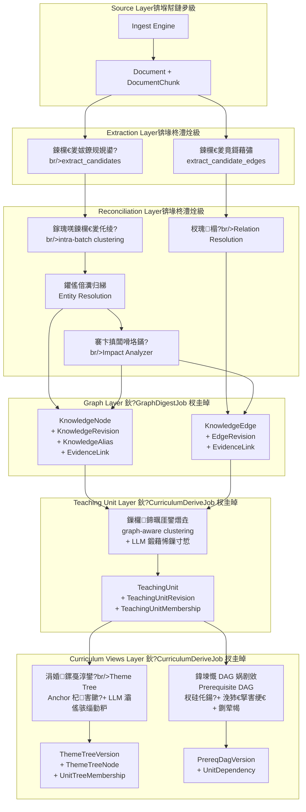
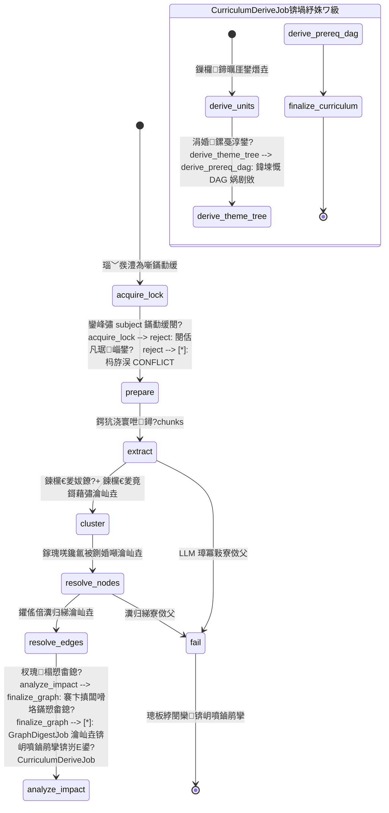
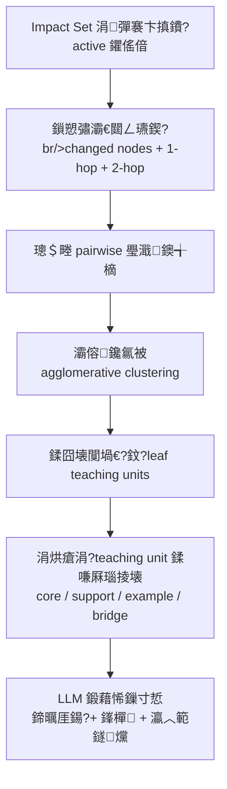
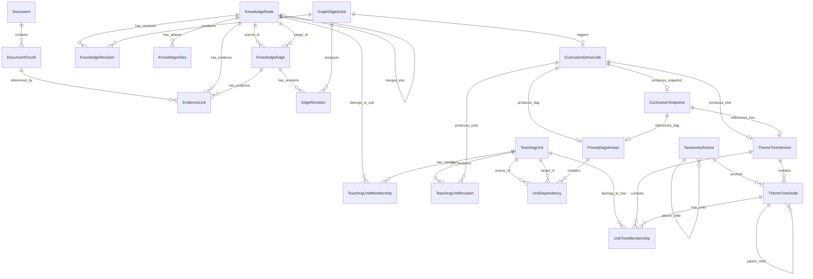
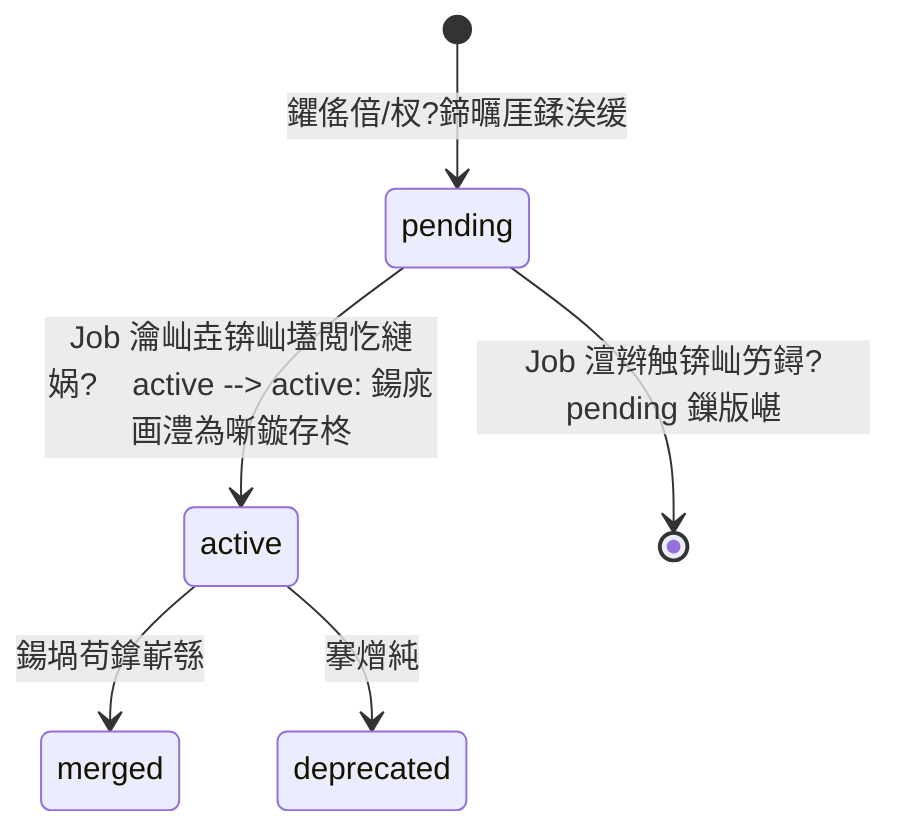

# 璁捐鏂囨。锛氱煡璇嗗浘璋卞閲忔瀯寤?+ 澶氳鍥捐绋嬬粨鏋勬淳鐢?
## 姒傝堪

鏈璁″皢鐜版湁 Digest Engine 浠?鎵规鏋勫缓 DocSet"妯″紡閲嶆瀯涓?鐭ヨ瘑鍥捐氨鍨嬪閲忔瀯寤?+ 澶氳鍥捐绋嬬粨鏋勬淳鐢?妯″紡锛圙raph-grounded Multi-View Curriculum Derivation锛夈€?
### 涓夊眰鏋舵瀯

- **搴曞眰 Knowledge Graph**锛氱煡璇嗕互鍥捐氨锛堣妭鐐?+ 杈?+ 璇佹嵁锛変负鐪熺浉婧愶紝涓ユ牸澧為噺鏇存柊銆傝妭鐐瑰唴瀹瑰畬鍏ㄧ敱 Revision 鎵胯浇锛孨ode 琛ㄤ粎瀛樿韩浠?+ 璺敱 + 鐘舵€?- **涓眰 Teaching Unit**锛氫粠鐭ヨ瘑鑺傜偣閫氳繃 graph-aware 鑱氱被鐢熸垚鏁欏鍗曞厓锛坙eaf-only锛屼笉鍚笂灞?module/chapter 灞傜骇锛夈€傝繖鏄绋嬬粍缁囧眰鐨勫熀鏈矑搴︹€斺€斾笉鍐嶆槸鏁ｄ贡鐨?Concept/Definition/Example 鐩存帴鎸傛爲锛岃€屾槸涓€缁勭揣瀵嗙浉鍏崇殑鐭ヨ瘑鐐圭粍鎴愮殑鏈€灏忓彲璁叉巿鍗曚綅銆備笂灞?module/chapter 缁撴瀯瀹屽叏鐢?ThemeTreeNode 绠＄悊
- **涓婂眰 Curriculum Views**锛氫粠鏁欏鍗曞厓娲剧敓涓夌瑙嗗浘锛?  - **Theme Tree锛堜富棰樻爲锛?*锛氬眬閮ㄥ眰娆¤仛绫?+ Anchor 杞害鏉?+ LLM 鍛藉悕鏁寸悊锛岀敤浜庢祻瑙堜笌鐩綍瀵艰埅
  - **Prerequisite DAG锛堝厛淇浘锛?*锛氫粠鍥捐氨 prerequisite_of / part_of / defined_by 杈硅仛鍚?+ 浼犻€掔害绠€ + 鍘荤幆锛岀敤浜庢暀瀛︿緷璧栧拰瀛︿範璺緞
  - **Linear Syllabus锛堢嚎鎬уぇ绾诧級**锛欴AG 鎷撴墤鎺掑簭 + Theme Tree 灞傜骇绾︽潫 + LLM curriculum ordering锛圡VP-2锛?
### 澧為噺鏋勫缓鐨勪弗鏍煎畾涔?
**杈撳叆澧為噺**锛氫粎澶勭悊鏈鎸囧畾 file_ids 瀵瑰簲鐨勬柊澧?chunk銆?
**鐭ヨ瘑澧為噺锛圛mpact Set锛?*锛氬綋鑺傜偣鍙戠敓鏂板/鍚堝苟/鎷嗗垎鏃讹紝浠ヤ笅瀵硅薄杩涘叆鍊欓€夐噸绠楅泦锛?- 涓?changed nodes 鐩搁偦鐨?edge锛?-hop锛?- edge 鍙︿竴绔妭鐐圭殑 summary 鍙兘闇€瑕佹洿鏂帮紙2-hop 鍊欓€夛級
- 鍙楀奖鍝嶇殑 teaching units
- 鍙?anchor 鍙樻洿褰卞搷鐨勫瓙鏍戦渶瑕侀噸鏂版淳鐢?- 鍙楀奖鍝嶇殑 unit dependencies 闇€瑕侀噸鏂拌绠?
### 涓ら樁娈典换鍔℃ā鍨?
- **GraphDigestJob**锛氬浘璋卞閲忔瀯寤猴紙鎶藉彇 鈫?鑱氱被 鈫?瀵归綈 鈫?褰卞搷闆嗗垎鏋愶級
- **CurriculumDeriveJob**锛氳绋嬬粨鏋勬淳鐢燂紙鏁欏鍗曞厓鐢熸垚 鈫?涓婚鏍戞淳鐢?鈫?鍏堜慨 DAG 娲剧敓锛?
鍥炬瀯寤哄畬鎴愬悗鍗冲彲瀵瑰鎻愪緵鍥炬煡璇紝璇剧▼缁撴瀯寮傛鍒锋柊銆?
### 璁捐鍐崇瓥

| 鍐崇瓥 | 閫夋嫨 | 鐞嗙敱 |
|------|------|------|
| 宸ヤ綔娴佸紩鎿?| LangGraph StateGraph | 涓庣幇鏈?digest workflow 涓€鑷达紝鏀寔鏉′欢鍒嗘敮鍜岀姸鎬佷紶閫?|
| LLM 缁撴瀯鍖栬緭鍑?| Instructor + Pydantic | 宸叉湁 `acompletion_structured` 灏佽锛岄浂棰濆渚濊禆 |
| 瀹炰綋瀵归綈绛栫暐 | 鍒嗗眰绛栫暐锛氫竴绾у疄浣?vs 浜岀骇璇存槑瀵硅薄 | Topic/Concept/Method 浠?name 涓轰富鏍囪瘑锛汥efinition/Example 浠ョ埗瀹炰綋 + 鍐呭鎽樿涓烘爣璇?|
| 瀵归綈鍒ゅ畾 | EntityMatchDecision 7 鍊兼灇涓?| 棰勭暀璇箟灞傜骇锛孧VP 鍏堟秷璐?EXACT/ALIAS/NO_MATCH |
| 鍒悕绠＄悊 | 鐙珛 KnowledgeAlias 琛?| 鏀寔楂樻晥绱㈠紩銆佸崟鐙褰曟潵婧?缃俊搴?璇█/鐘舵€?|
| 鑺傜偣鍐呭 | Node 琛ㄤ粎瀛?identity + routing + status | 娑堥櫎鍙屽啓涓嶄竴鑷撮闄╋紝鍐呭浠?current_revision 璇诲彇 |
| 涓棿缁勭粐灞?| TeachingUnit锛堟暀瀛﹀崟鍏冿級 | 鐭ヨ瘑鑺傜偣鐩存帴鎸傛爲澶粏纰庯紝涓棿闇€瑕佹渶灏忓彲璁叉巿鍗曚綅 |
| 鏁欏鍗曞厓鐢熸垚 | graph-aware 鑱氱被 + LLM 鍛藉悕鏁寸悊 | 璺濈鍑芥暟缁撳悎 embedding銆佸浘鍏崇郴銆佹枃妗ｇ粨鏋勩€佺被鍨嬪吋瀹规€?|
| 璇剧▼瑙嗗浘 | Theme Tree + Prerequisite DAG + Linear Syllabus | 鍗曚竴鏍戞棤娉曞悓鏃惰〃杈句富棰樺垎缁勩€佹暀瀛︿緷璧栧拰璁叉巿椤哄簭 |
| Anchor 瑙掕壊 | 杞害鏉熼鏋讹紙闈炵‖鍒嗙被鐩爣锛?| 涓轰富棰樻爲鑺傜偣鎻愪緵鍛藉悕/鎺掑簭/绋冲畾绾︽潫锛屼繚鐣欎汉宸ュ彲鎺ф€у張涓嶅帇姝昏嚜缁勭粐 |
| 涓婚鏍戞寕杞?| 鎸?TeachingUnit锛坙eaf-only锛夎€岄潪 KnowledgeNode | KnowledgeNode 鈫?TeachingUnit 鈫?ThemeTreeNode锛屼笂灞?chapter/section 鐢?ThemeTreeNode 灞傜骇绠＄悊 |
| 鍏堜慨 DAG | 浠庡浘璋辫竟鑱氬悎 + 浼犻€掔害绠€ + 鍘荤幆 | 涓嶉潬鏍戯紝鐩存帴浠庣煡璇嗕緷璧栬竟鎻愮偧 |
| 浠诲姟鎷嗗垎 | GraphDigestJob + CurriculumDeriveJob | 鍥炬瀯寤哄畬鎴愬嵆鍙煡璇紝璇剧▼缁撴瀯寮傛鍒锋柊 |
| 骞跺彂鎺у埗 | subject 绾ф瀯寤洪攣 + DB 鍞竴绾︽潫 + 涔愯閿?| 闃叉閲嶅瑙﹀彂銆佷繚璇佹暟鎹竴鑷存€?|
| 鏁版嵁搴?| 鍚屼竴瀛︾ .db 鏂囦欢鏂板琛?| 涓庣幇鏈?All-in-SQLite 鐞嗗康涓€鑷?|

## 鏋舵瀯



### 涓ら樁娈典换鍔＄姸鎬佹満



### 寮曠敤閾?
```
api/knowledge.py
  鈫?services/knowledge_graph_service.py
    鈫?agents/digest/knowledge_graph_workflow.py              (LangGraph 鈥?GraphDigestJob)
      鈫?agents/digest/knowledge_graph_extractor.py           (LLM 鍊欓€夋娊鍙?
      鈫?agents/digest/knowledge_graph_clusterer.py           (鎵瑰唴鍊欓€夎仛绫诲幓閲?
      鈫?agents/digest/knowledge_graph_resolver.py            (瀹炰綋/鍏崇郴瀵归綈)
      鈫?agents/digest/knowledge_graph_impact_analyzer.py     (褰卞搷闆嗗垎鏋?
    鈫?agents/digest/curriculum_workflow.py       (LangGraph 鈥?CurriculumDeriveJob)
      鈫?agents/digest/unit_builder.py           (鏁欏鍗曞厓鐢熸垚)
      鈫?agents/digest/theme_tree_builder.py     (涓婚鏍戞淳鐢?
      鈫?agents/digest/prereq_dag_builder.py     (鍏堜慨 DAG 娲剧敓)
    鈫?repositories/kg_repo.py                   (鐭ヨ瘑鍥捐氨鏁版嵁璁块棶)
    鈫?repositories/curriculum_repo.py           (璇剧▼缁撴瀯鏁版嵁璁块棶)
```

## 缁勪欢涓庢帴鍙?
### 1. 鏁版嵁璁块棶灞傦細`repositories/kg_repo.py`

璐熻矗鐭ヨ瘑鍥捐氨鐩稿叧琛ㄧ殑 CRUD 鎿嶄綔銆?
```python
# === 鏋勫缓閿?===
def acquire_subject_build_lock(session: Session, subject: str) -> bool
def release_subject_build_lock(session: Session, subject: str) -> None

# === 鑺傜偣 CRUD ===
def create_knowledge_node(session: Session, node: KnowledgeNode) -> KnowledgeNode
def get_knowledge_node_by_id(session: Session, node_id: int) -> KnowledgeNode | None
def find_node_by_normalized_name(session: Session, subject: str, normalized_name: str, node_type: str) -> KnowledgeNode | None
def find_nodes_by_alias(session: Session, subject: str, alias: str, node_type: str) -> list[KnowledgeNode]
def list_nodes_by_subject(session: Session, subject: str, *, node_type: str | None, status: str | None, limit: int, offset: int) -> tuple[list[KnowledgeNode], int]
def get_node_with_current_revision(session: Session, node_id: int) -> tuple[KnowledgeNode, KnowledgeRevision] | None

# === 鍒悕 CRUD ===
def create_alias(session: Session, alias: KnowledgeAlias) -> KnowledgeAlias
def find_alias(session: Session, subject: str, normalized_alias: str) -> list[KnowledgeAlias]
def list_aliases_by_node(session: Session, node_id: int) -> list[KnowledgeAlias]

# === 杈?CRUD ===
def create_knowledge_edge(session: Session, edge: KnowledgeEdge) -> KnowledgeEdge
def find_edge(session: Session, source_node_id: int, target_node_id: int, edge_type: str) -> KnowledgeEdge | None
def list_edges_by_node(session: Session, node_id: int) -> list[KnowledgeEdge]
def list_edges_by_type(session: Session, subject: str, edge_type: str) -> list[KnowledgeEdge]

# === 淇 ===
def create_knowledge_revision(session: Session, revision: KnowledgeRevision) -> KnowledgeRevision
def deactivate_old_revisions(session: Session, node_id: int) -> None
def create_edge_revision(session: Session, revision: EdgeRevision) -> EdgeRevision
def deactivate_old_edge_revisions(session: Session, edge_id: int) -> None

# === 璇佹嵁 ===
def create_evidence_link(session: Session, link: EvidenceLink) -> EvidenceLink
def list_evidence_by_entity(session: Session, entity_type: str, entity_id: int, *, is_active: bool | None = True) -> list[EvidenceLink]
def count_active_evidence(session: Session, entity_type: str, entity_id: int) -> int

# === 浠诲姟 ===
def create_digest_job(session: Session, job: GraphDigestJob) -> GraphDigestJob
def update_digest_job(session: Session, job_id: int, **kwargs) -> GraphDigestJob | None
```

### 2. 鏁版嵁璁块棶灞傦細`repositories/curriculum_repo.py`

璐熻矗鏁欏鍗曞厓鍜岃绋嬭鍥剧浉鍏宠〃鐨?CRUD 鎿嶄綔銆?
```python
# === 鏁欏鍗曞厓 ===
def create_teaching_unit(session: Session, unit: TeachingUnit) -> TeachingUnit
def get_teaching_unit_by_id(session: Session, unit_id: int) -> TeachingUnit | None
def find_unit_by_signature(session: Session, subject: str, member_signature: str) -> TeachingUnit | None
def find_units_overlapping_nodes(session: Session, subject: str, node_ids: list[int]) -> list[TeachingUnit]
def find_unit_by_normalized_name(session: Session, subject: str, normalized_name: str) -> TeachingUnit | None  # 杈呭姪鎼滅储锛岄潪韬唤瀹氫綅
def list_units_by_subject(session: Session, subject: str, *, status: str | None, limit: int, offset: int) -> tuple[list[TeachingUnit], int]
def create_unit_revision(session: Session, revision: TeachingUnitRevision) -> TeachingUnitRevision
def deactivate_old_unit_revisions(session: Session, unit_id: int) -> None
def create_unit_membership(session: Session, membership: TeachingUnitMembership) -> TeachingUnitMembership
def list_memberships_by_unit(session: Session, unit_id: int) -> list[TeachingUnitMembership]
def find_unit_by_node(session: Session, knowledge_node_id: int) -> TeachingUnit | None

# === 閿氱偣 ===
def create_taxonomy_anchor(session: Session, anchor: TaxonomyAnchor) -> TaxonomyAnchor
def list_anchors_by_subject(session: Session, subject: str) -> list[TaxonomyAnchor]
def get_uncategorized_anchor(session: Session, subject: str) -> TaxonomyAnchor

# === 涓婚鏍?===
def create_theme_tree_version(session: Session, version: ThemeTreeVersion) -> ThemeTreeVersion
def get_current_theme_tree_version(session: Session, subject: str) -> ThemeTreeVersion | None
def create_theme_tree_version_with_optimistic_lock(session: Session, subject: str, expected_prev_version_no: int) -> ThemeTreeVersion
def create_theme_tree_node(session: Session, node: ThemeTreeNode) -> ThemeTreeNode
def create_unit_tree_membership(session: Session, membership: UnitTreeMembership) -> UnitTreeMembership

# === 鍏堜慨 DAG ===
def create_prereq_dag_version(session: Session, version: PrereqDagVersion) -> PrereqDagVersion
def get_current_prereq_dag_version(session: Session, subject: str) -> PrereqDagVersion | None
def create_unit_dependency(session: Session, dep: UnitDependency) -> UnitDependency
def list_dependencies_by_version(session: Session, dag_version_id: int) -> list[UnitDependency]

# === 璇剧▼浠诲姟 ===
def create_curriculum_job(session: Session, job: CurriculumDeriveJob) -> CurriculumDeriveJob
def update_curriculum_job(session: Session, job_id: int, **kwargs) -> CurriculumDeriveJob | None

# === 璇剧▼蹇収 ===
def create_curriculum_snapshot(session: Session, snapshot: CurriculumSnapshot) -> CurriculumSnapshot
def get_current_curriculum_snapshot(session: Session, subject: str) -> CurriculumSnapshot | None
def archive_old_snapshots(session: Session, subject: str) -> None
```

### 3. LLM 鎶藉彇灞傦細`agents/digest/knowledge_graph_extractor.py`

浣跨敤 Instructor 缁撴瀯鍖栬緭鍑轰粠 chunk 涓娊鍙栧€欓€夎妭鐐瑰拰鍊欓€夎竟銆?
```python
class CandidateNode(BaseModel):
    name: str
    node_type: Literal["Topic", "Concept", "Definition", "Method", "Example"]
    local_summary: str
    taxonomy_hint: str
    parent_entity_name: str | None = None  # Definition/Example 鐨勫叧鑱旂埗瀹炰綋鍚?
class CandidateEdge(BaseModel):
    source_name: str
    target_name: str
    edge_type: Literal["belongs_to_topic", "prerequisite_of", "defined_by", "illustrated_by", "part_of"]
    description: str

class ChunkExtractionResult(BaseModel):
    nodes: list[CandidateNode]
    edges: list[CandidateEdge]

async def extract_candidates(
    chunk_content: str,
    chunk_title: str,
    header_path: str,
    doc_source_type: str | None = None,
) -> ChunkExtractionResult
```

### 4. 鎵瑰唴鍊欓€夎仛绫伙細`agents/digest/knowledge_graph_clusterer.py`

```python
@dataclass
class ClusteredCandidate:
    representative: CandidateNode
    members: list[CandidateNode]
    source_chunk_ids: list[int]
    merged_summary: str

def cluster_candidates(
    candidates: list[tuple[CandidateNode, int]],  # (candidate, chunk_id)
    similarity_threshold: float = 0.85,
) -> list[ClusteredCandidate]
```

### 5. 瀵归綈灞傦細`agents/digest/knowledge_graph_resolver.py`

```python
class EntityMatchDecision(str, Enum):
    EXACT = "exact"
    ALIAS = "alias"
    BROADER = "broader"
    NARROWER = "narrower"
    RELATED_NOT_SAME = "related_not_same"
    NO_MATCH = "no_match"
    UNSURE = "unsure"

@dataclass
class ResolveResult:
    decision: EntityMatchDecision
    matched_node_id: int | None
    is_content_update: bool
    new_aliases: list[str]

async def resolve_node(
    session: Session,
    candidate: ClusteredCandidate,
    subject: str,
    candidate_embedding: list[float],
    similarity_threshold: float,
) -> ResolveResult

def resolve_edge(
    session: Session,
    candidate: CandidateEdge,
    subject: str,
    node_name_to_id: dict[str, int],
    active_evidence_counts: dict[int, int],
) -> tuple[KnowledgeEdge | None, float]

def compute_edge_confidence(
    active_evidence_count: int,
    contradicting_evidence_count: int = 0,
    max_confidence: float = 0.95,
) -> float:
    """confidence = min(max_confidence, 1 - 1/(1 + active_count)) - 0.1 * contradicting_count"""
```

### 6. 褰卞搷闆嗗垎鏋愶細`agents/digest/knowledge_graph_impact_analyzer.py`

```python
@dataclass
class ImpactSet:
    # === 鍥捐氨灞傞棴鍖?===
    changed_node_ids: set[int]              # 鏈鏂板/鍚堝苟/鎷嗗垎鐨勮妭鐐?    affected_edge_ids: set[int]             # 涓?changed nodes incident 鐨?active edges
    candidate_recompute_node_ids: set[int]  # incident edges 瀵圭鐨?2-hop nodes + evidence 澶辨晥褰卞搷 current_revision 鐨勫疄浣?    # === 鏁欏鍗曞厓灞傞棴鍖?===
    affected_unit_ids: set[int]             # 鍖呭惈 changed nodes 鐨勭幇鏈?units + 涓?changed nodes 瀛樺湪 part_of/defined_by/illustrated_by/prerequisite_of 寮哄叧绯荤殑閭绘帴 units + 鍙戠敓 merge/split 鐨?units
    # === 鏍戣鍥惧眰闂寘 ===
    affected_anchor_ids: set[int]           # 鍙楀奖鍝嶇殑閿氱偣
    affected_tree_node_ids: set[int]        # affected units 鐨?UnitTreeMembership 瀵瑰簲鐨?tree nodes + 鍏剁鍏堣矾寰?+ 閿氱偣鍙樺寲娑夊強鐨?subtree
    # === DAG 灞傞棴鍖?===
    affected_dag_edge_ids: set[int]         # source_unit_id 鎴?target_unit_id 钀藉湪 affected_unit_ids 涓殑 dependency edges + 涓庤鏂竟鐜矾鍚屼竴 SCC 鐨?dependency candidates

def analyze_impact(
    session: Session,
    subject: str,
    new_node_ids: list[int],
    updated_node_ids: list[int],
    merged_node_ids: list[int],
    split_node_ids: list[int],
) -> ImpactSet
```

### 7. 鏁欏鍗曞厓鐢熸垚锛歚agents/digest/unit_builder.py`

浠庣煡璇嗗浘璋变腑閫氳繃 graph-aware 鑱氱被鐢熸垚鏁欏鍗曞厓銆?
```python
@dataclass
class UnitCandidate:
    """鑱氱被浜х敓鐨勬暀瀛﹀崟鍏冨€欓€夈€?""
    core_node_ids: list[int]            # 鏍稿績姒傚康鑺傜偣
    support_node_ids: list[int]         # 鏀拺瀹氫箟/鏂规硶鑺傜偣
    example_node_ids: list[int]         # 绀轰緥鑺傜偣
    bridge_node_ids: list[int]          # 鍓嶇疆妗ユ帴鑺傜偣
    cluster_score: float                # 鑱氱被鍐呰仛搴?
async def derive_teaching_units(
    session: Session,
    subject: str,
    impact_set: ImpactSet,
) -> list[TeachingUnit]

def compute_unit_distance(
    node_i: int,
    node_j: int,
    embeddings: dict[int, list[float]],
    edges: list[KnowledgeEdge],
    chunk_co_occurrence: dict[tuple[int, int], float],
    weights: UnitDistanceWeights | None = None,
) -> float
```

**graph-aware 鑱氱被璺濈鍑芥暟**锛?
```
dist(i, j) =
    a * semantic_distance(embedding_i, embedding_j)     # 0.30
  + b * graph_relation_distance(i, j)                   # 0.25
  + c * co_outline_distance(i, j)                       # 0.20
  + d * prerequisite_penalty(i, j)                       # 0.15
  + e * type_compatibility_penalty(i, j)                 # 0.10
```

鍏朵腑锛?- `semantic_distance`锛歟mbedding 浣欏鸡璺濈
- `graph_relation_distance`锛歱art_of / defined_by / illustrated_by 杈硅秺澶氳窛绂昏秺杩?- `co_outline_distance`锛氬叡鐜颁簬鍚屼竴 chunk/section 鐨勮妭鐐硅窛绂绘洿杩?- `prerequisite_penalty`锛氬己 prerequisite 鍏崇郴鐨勪袱绔笉涓€瀹氬簲鍚堝苟锛堟儵缃氶」锛?- `type_compatibility_penalty`锛欳oncept + Definition + Example 瀹规槗鑱氬湪涓€璧凤紱Topic 鍊惧悜鐙珛

**鑱氱被娴佺▼**锛?


**瑙掕壊鍒嗛厤瑙勫垯**锛?- `core`锛歝luster 涓?node_type 涓?Topic / Concept / Method 涓?degree 鏈€楂樼殑鑺傜偣
- `support`锛氫笌 core 鑺傜偣鏈?defined_by / part_of 杈圭殑 Definition / Method 鑺傜偣
- `example`锛氫笌 core 鑺傜偣鏈?illustrated_by 杈圭殑 Example 鑺傜偣
- `prerequisite_bridge`锛氫笌 core 鑺傜偣鏈?prerequisite_of 杈逛絾灞炰簬鍏朵粬 unit 鐨勮妭鐐瑰紩鐢?
### 8. 涓婚鏍戞淳鐢燂細`agents/digest/theme_tree_builder.py`

鍩轰簬 Anchor 杞害鏉?+ 鏁欏鍗曞厓灞傜骇缁撴瀯娲剧敓涓婚鏍戙€?
```python
async def derive_theme_tree(
    session: Session,
    subject: str,
    impact_set: ImpactSet,
    prev_tree_version: ThemeTreeVersion | None,
) -> ThemeTreeVersion

def compute_unit_membership_score(
    unit_embedding: list[float],
    anchor_embedding: list[float],
    taxonomy_evidence: TaxonomyEvidence,
    weights: dict[str, float] | None = None,
) -> float
```

**涓婚鏍戞淳鐢熺畻娉?*锛?
**Step A锛氱敓鎴?Anchor Skeleton**
- 鎸?anchor_type 浼樺厛绾ф帓搴忥細teacher_defined > syllabus > textbook_toc > graph_discovered > system
- teacher_defined / syllabus 閿氱偣浣滀负楂樹紭鍏堢骇绾︽潫锛岀粨鏋勪繚鎸佷笉鍙?- graph_discovered 閿氱偣浠呬綔琛ュ厖
- 纭繚"寰呭綊绫?绯荤粺閿氱偣濮嬬粓瀛樺湪
- Anchor 涓嶅啀鏄?鎵€鏈夎妭鐐归兘瑕佸綊鍒颁竴涓?anchor 涓?锛岃€屾槸"涓轰富棰樻爲鑺傜偣鎻愪緵鍛藉悕銆佹帓搴忋€佸榻愬拰绋冲畾绾︽潫"

**Step B锛氬皢鏁欏鍗曞厓鎸傝浇鍒版爲**
- 涓婚鏍戞寕杞界殑鏄?TeachingUnit锛坙eaf-only锛夎€岄潪 KnowledgeNode
- TeachingUnit 鍙寕杞藉埌 ThemeTreeNode 鐨?theme / unit_bucket 灞傜骇鑺傜偣
- 涓婂眰 chapter / section 缁撴瀯瀹屽叏鐢?ThemeTreeNode 鑷韩鐨?parent_tree_node_id 灞傜骇绠＄悊
- 褰㈡垚 KnowledgeNode 鈫?TeachingUnit 鈫?ThemeTreeNode(theme/unit_bucket) 鈫?ThemeTreeNode(section) 鈫?ThemeTreeNode(chapter) 鐨勬竻鏅板垎灞?
**Step C锛氳绠?membership_score锛堝婧愯瘉鎹瀺鍚堬級**

```
membership_score(unit, anchor) =
    w1 * semantic_similarity(unit_embedding, anchor_embedding)      # 0.30
  + w2 * doc_outline_match(unit.source_outline_paths, anchor.title) # 0.25
  + w3 * chunk_header_match(unit.source_header_paths, anchor.title) # 0.15
  + w4 * neighbor_vote(unit.neighbor_units, anchor)                 # 0.15
  + w5 * belongs_to_topic_propagation(unit, anchor)                 # 0.10
  + w6 * taxonomy_hint_match(unit.taxonomy_hints, anchor.title)     # 0.05
```

**Step D锛氱‘瀹氬綊灞烇紙绋冲畾瑙勫垯锛?*

褰掑睘浼樺厛绾э細
1. `membership_source = "human_fixed"` 鈫?缁濆浼樺厛锛岃嚜鍔ㄦ淳鐢熶笉瑕嗙洊
2. 閿氱偣闆嗕笉鍙樻椂锛?   - score 鏈€楂樹笖 > `membership_threshold`锛堥粯璁?0.5锛夆啋 primary
   - 鍓嶄袱鍚嶅樊璺?< `stability_threshold`锛堥粯璁?0.08锛夆啋 淇濇寔涓婁竴鐗堝綊灞?   - 鎵€鏈?score < `membership_threshold` 鈫?褰掑叆"寰呭綊绫?姹?3. 閿氱偣闆嗗彉鍖栨椂锛氬彈褰卞搷瀛愭爲鍐呯殑鍗曞厓閲嶆柊璇勪及锛屾湭鍙楀奖鍝嶅瓙鏍戜繚鎸佷笉鍙?
**Step E锛氱敓鎴?ThemeTreeVersion**
- 浣跨敤涔愯閿佸垱寤烘柊鐗堟湰 `status="draft"`
- **涓嶅湪姝ゅ褰掓。鏃х増鏈垨鍙戝竷鏂扮増鏈?*鈥斺€斿綊妗ｄ笌鍙戝竷缁熶竴鍦?`finalize_curriculum_node` 涓師瀛愬畬鎴愶紝閬垮厤"鏃х増鏈凡 archived 浣嗘柊鐗堟湰鏈?published"鐨勭獥鍙ｆ湡
- 涓烘瘡涓?ThemeTreeNode 鐢熸垚 summary
- "寰呭綊绫?姹犱綔涓哄浐瀹氭爲鑺傜偣濮嬬粓瀛樺湪
- MVP 閲囩敤"閫昏緫灞€閮ㄩ噸绠?+ 瀛樺偍鍏ㄩ噺蹇収"鐨勭増鏈瓥鐣ワ細浠呭 Impact Set 褰卞搷鑼冨洿鍐呭璞￠噸鏂拌绠楋紝浣嗚惤搴撴椂鐢熸垚瀹屾暣鏂扮増鏈紝浠ョ畝鍖栨煡璇€佸洖婊氬拰鐗堟湰姣旇緝

### 9. 鍏堜慨 DAG 娲剧敓锛歚agents/digest/prereq_dag_builder.py`

浠庣煡璇嗗浘璋辩殑渚濊禆杈硅仛鍚堝嚭鏁欏鍗曞厓绾у埆鐨勫厛淇?DAG銆?
```python
async def derive_prereq_dag(
    session: Session,
    subject: str,
    impact_set: ImpactSet,
    prev_dag_version: PrereqDagVersion | None,
) -> PrereqDagVersion

def aggregate_unit_dependencies(
    session: Session,
    subject: str,
    unit_node_map: dict[int, list[int]],  # unit_id -> [node_ids]
) -> list[UnitDependencyCandidate]

def transitive_reduction(edges: list[UnitDependencyCandidate]) -> list[UnitDependencyCandidate]

def break_cycles(edges: list[UnitDependencyCandidate]) -> tuple[list[UnitDependencyCandidate], list[UnitDependencyCandidate]]
```

**鍏堜慨 DAG 娲剧敓绠楁硶**锛?
**Step 1锛氭敹闆嗚妭鐐圭骇渚濊禆杈?*
- 浠庡浘璋变腑鎻愬彇鎵€鏈?active 鐨?prerequisite_of 杈?- 琛ュ厖 part_of 杈圭殑绾︽潫浼犳挱锛圓 part_of B 鈫?B 鐨勫墠缃篃鏄?A 鐨勫墠缃級
- defined_by 杈归噰鐢ㄤ繚瀹堢瓥鐣ワ細浼樺厛鐢ㄤ簬鍗曞厓鍐呰仛鍚堬紙甯姪 Concept/Definition 杩涘叆鍚屼竴 TeachingUnit锛夈€備粎褰?Concept 涓?Definition 宸茶鍒嗗埌涓嶅悓 units锛屼笖鍚屾椂婊¤冻浠ヤ笅鏉′欢鏃讹紝鎵嶇敓鎴?unit-level dependency candidate锛?  - 涓よ€呬箣闂村瓨鍦ㄩ珮缃俊搴?defined_by 鍏崇郴锛坈onfidence > 0.7锛?  - 涓?unit 娌℃湁琚仛绫诲苟鍏ョ殑鍏呭垎璇佹嵁
  - 鏈夐澶栨敮鎸佷俊鍙凤紙濡傛枃妗ｉ『搴忋€佸厛淇竟銆佹暀甯堥敋鐐规彁绀猴級鏀寔鍏舵暀瀛﹂『搴?
**Step 2锛氳仛鍚堜负鍗曞厓绾т緷璧?*
- 褰?unit A 鍐呭涓妭鐐归€氳繃渚濊禆杈规寚鍚?unit B 鍐呭涓妭鐐规椂锛岃仛鍚堜负 UnitDependency(source=A, target=B)
- confidence = weighted_sum(supporting_edge_confidences) / max_possible
- supporting_edge_count = 鏀拺鐨勭煡璇嗚竟鏁伴噺
- 鍚屼竴 unit 鍐呴儴鐨勪緷璧栬竟涓嶄骇鐢?UnitDependency

**Step 3锛氬幓鐜鐞?*
- 妫€娴嬭仛鍚堝浘涓殑鐜矾锛圱arjan 寮鸿繛閫氬垎閲忕畻娉曪級
- 瀵规瘡涓?SCC锛屾柇寮€ confidence 鏈€浣庣殑杈?- 璁板綍琚柇寮€鐨勮竟鍒?`derivation_metadata_json`锛屼緵浜哄伐瀹℃煡

**Step 4锛氫紶閫掔害绠€锛圱ransitive Reduction锛?*
- 鍦ㄥ凡纭鏃犵幆鐨?DAG 涓婃墽琛屼紶閫掔害绠€
- 濡傛灉 A 鈫?B 鈫?C 涓?A 鈫?C 鍚屾椂瀛樺湪锛岀Щ闄?A 鈫?C锛堝啑浣欒竟锛?- 淇濈暀鐩存帴渚濊禆锛岀Щ闄ゅ彲閫氳繃鍏朵粬璺緞鎺ㄥ鐨勯棿鎺ヤ緷璧?
> 娉ㄦ剰锛氬厛鍘荤幆鍐嶇害绠€锛屽洜涓?transitive reduction 鐨勫畾涔夊熀浜?DAG锛屽鍚幆鍥捐涓烘湭瀹氫箟銆?
**Step 5锛氱敓鎴?PrereqDagVersion**
- 鍒涘缓鏂扮増鏈?`status="draft"`
- 浠呭 Impact Set 褰卞搷鑼冨洿鍐呯殑鍗曞厓閲嶆柊璁＄畻渚濊禆
- MVP 閲囩敤"閫昏緫灞€閮ㄩ噸绠?+ 瀛樺偍鍏ㄩ噺蹇収"鐨勭増鏈瓥鐣ワ細浠呭 Impact Set 褰卞搷鑼冨洿鍐呭璞￠噸鏂拌绠楋紝浣嗚惤搴撴椂鐢熸垚瀹屾暣鏂扮増鏈紝浠ョ畝鍖栨煡璇€佸洖婊氬拰鐗堟湰姣旇緝
- **鏃х増鏈綊妗ｄ笌鏂扮増鏈彂甯冪粺涓€鍦?`finalize_curriculum_node` 涓畬鎴?*锛宐uilder 闃舵鍙骇鍑?draft

### 10. LangGraph 宸ヤ綔娴?
#### GraphDigestJob 鐘舵€佹満锛歚agents/digest/knowledge_graph_workflow.py`

```python
class KGDigestState(TypedDict):
    subject: str
    file_ids: list[int]
    job_id: int
    chunk_ids: list[int]
    candidates: list[ChunkExtractionResult]
    clustered_candidates: list[ClusteredCandidate]
    candidate_name_to_cluster_id: dict[str, int]           # 鍊欓€夊悕绉?鈫?鑱氱被浠ｈ〃 ID
    candidate_name_to_resolved_node_id: dict[str, int]     # 鍊欓€夊悕绉?鈫?宸插榻?KnowledgeNode ID
    new_node_ids: list[int]
    updated_node_ids: list[int]
    merged_node_ids: list[int]
    new_edge_ids: list[int]
    updated_edge_ids: list[int]
    impact_set: ImpactSet | None
    error: str | None

async def acquire_lock_node(state: KGDigestState) -> KGDigestState
async def prepare_node(state: KGDigestState) -> KGDigestState
async def extract_node(state: KGDigestState) -> KGDigestState
async def cluster_node(state: KGDigestState) -> KGDigestState
async def resolve_nodes_node(state: KGDigestState) -> KGDigestState
async def resolve_edges_node(state: KGDigestState) -> KGDigestState
async def analyze_impact_node(state: KGDigestState) -> KGDigestState
async def finalize_graph_node(state: KGDigestState) -> KGDigestState
async def fail_node(state: KGDigestState) -> KGDigestState
```

#### CurriculumDeriveJob 鐘舵€佹満锛歚agents/digest/curriculum_workflow.py`

```python
class CurriculumDeriveState(TypedDict):
    subject: str
    graph_job_id: int
    curriculum_job_id: int
    impact_set: ImpactSet
    derived_unit_ids: list[int]
    theme_tree_version_id: int | None
    prereq_dag_version_id: int | None
    snapshot_id: int | None
    error: str | None

async def derive_units_node(state: CurriculumDeriveState) -> CurriculumDeriveState
async def derive_theme_tree_node(state: CurriculumDeriveState) -> CurriculumDeriveState
async def derive_prereq_dag_node(state: CurriculumDeriveState) -> CurriculumDeriveState
async def finalize_curriculum_node(state: CurriculumDeriveState) -> CurriculumDeriveState
async def fail_curriculum_node(state: CurriculumDeriveState) -> CurriculumDeriveState
```

### 11. 鏈嶅姟灞傦細`services/knowledge_graph_service.py`

```python
def trigger_digest_build(session: Session, *, subject: str, file_ids: list[int]) -> GraphDigestJob
async def run_graph_digest_background(*, subject: str, job_id: int) -> None
async def run_curriculum_derive_background(*, subject: str, graph_job_id: int, curriculum_job_id: int) -> None
def get_digest_status(session: Session, *, subject: str, job_id: int) -> DigestStatusResponse
    """鑱氬悎鏌ヨ锛氳繑鍥?GraphDigestJob + 鍏宠仈 CurriculumDeriveJob + 褰撳墠蹇収 ID銆?""
def get_graph_nodes(session: Session, *, subject: str, node_type: str | None, page: int, size: int) -> PaginatedData
def get_graph_node_detail(session: Session, *, subject: str, node_id: int) -> dict
def get_teaching_units(session: Session, *, subject: str, page: int, size: int) -> PaginatedData
def get_teaching_unit_detail(session: Session, *, subject: str, unit_id: int) -> dict
def get_current_theme_tree(session: Session, *, subject: str) -> dict
def get_current_prereq_dag(session: Session, *, subject: str) -> dict
def get_current_curriculum_snapshot(session: Session, *, subject: str) -> dict  # 杩斿洖褰撳墠 published 蹇収锛坱ree + dag 缁勫悎鐗堟湰锛?def manage_taxonomy_anchors(session: Session, *, subject: str, action: str, **kwargs) -> list[TaxonomyAnchor]
```

### 12. API 灞傦細`api/knowledge.py`锛堟墿灞曠幇鏈夎矾鐢憋級

```python
POST /api/v1/subjects/{subject}/digest/build            # 瑙﹀彂澧為噺鏋勫缓
POST /api/v1/subjects/{subject}/digest/status            # 鏌ヨ鑱氬悎鐘舵€侊紙GraphDigestJob + CurriculumDeriveJob + 褰撳墠蹇収锛?POST /api/v1/subjects/{subject}/graph/nodes/query        # 鍒嗛〉鏌ヨ鑺傜偣
POST /api/v1/subjects/{subject}/graph/nodes/detail       # 鑺傜偣璇︽儏锛堝惈鎵€灞?teaching unit锛?POST /api/v1/subjects/{subject}/units/query              # 鍒嗛〉鏌ヨ鏁欏鍗曞厓
POST /api/v1/subjects/{subject}/units/detail             # 鏁欏鍗曞厓璇︽儏
POST /api/v1/subjects/{subject}/theme-tree/current       # 褰撳墠涓婚鏍?POST /api/v1/subjects/{subject}/prereq-dag/current       # 褰撳墠鍏堜慨 DAG
POST /api/v1/subjects/{subject}/curriculum/current       # 褰撳墠璇剧▼蹇収锛坱ree + dag 缁勫悎鐗堟湰锛?POST /api/v1/subjects/{subject}/taxonomy/anchors         # 閿氱偣绠＄悊
```

## 鏁版嵁妯″瀷

### 鐜版湁琛紙淇濇寔涓嶅彉锛?
- `Document` 鈥?鏂囨。璁板綍
- `DocumentChunk` 鈥?鏂囨。鍒囧潡
- `DocumentOutlineNode` 鈥?鏂囨。澶х翰鑺傜偣
- `chunk_embeddings` 鈥?sqlite-vec 鍚戦噺铏氳〃

### 鏂板鏋氫妇锛歚models/enums.py`

```python
class KGNodeType(str, Enum):
    TOPIC = "Topic"
    CONCEPT = "Concept"
    DEFINITION = "Definition"
    METHOD = "Method"
    EXAMPLE = "Example"

class KGEdgeType(str, Enum):
    BELONGS_TO_TOPIC = "belongs_to_topic"
    PREREQUISITE_OF = "prerequisite_of"
    DEFINED_BY = "defined_by"
    ILLUSTRATED_BY = "illustrated_by"
    PART_OF = "part_of"

class KGNodeStatus(str, Enum):
    ACTIVE = "active"
    DEPRECATED = "deprecated"
    MERGED = "merged"
    PENDING = "pending"

class KGEdgeStatus(str, Enum):
    ACTIVE = "active"
    DEPRECATED = "deprecated"
    PENDING = "pending"

class EntityMatchDecision(str, Enum):
    EXACT = "exact"
    ALIAS = "alias"
    BROADER = "broader"
    NARROWER = "narrower"
    RELATED_NOT_SAME = "related_not_same"
    NO_MATCH = "no_match"
    UNSURE = "unsure"

class RevisionReason(str, Enum):
    NEW_EVIDENCE = "new_evidence"
    MERGE = "merge"
    SPLIT = "split"
    HUMAN_EDIT = "human_edit"
    CONFLICT_RESOLUTION = "conflict_resolution"

class EvidenceRole(str, Enum):
    SUPPORTS = "supports"
    ELABORATES = "elaborates"
    CONTRADICTS = "contradicts"
    EXEMPLIFIES = "exemplifies"
    TAXONOMY_HINT = "taxonomy_hint"

class ExtractionMethod(str, Enum):
    LLM = "llm"
    MANUAL = "manual"
    RULE = "rule"

class FieldScope(str, Enum):
    NAME = "name"
    SUMMARY = "summary"
    BODY = "body"
    EDGE_DESCRIPTION = "edge_description"
    TAXONOMY_HINT = "taxonomy_hint"

class AliasStatus(str, Enum):
    ACTIVE = "active"
    DEPRECATED = "deprecated"

class UnitMemberRole(str, Enum):
    """鏁欏鍗曞厓鎴愬憳瑙掕壊銆?""
    CORE = "core"
    SUPPORT = "support"
    EXAMPLE = "example"
    PREREQUISITE_BRIDGE = "prerequisite_bridge"

class UnitStatus(str, Enum):
    """鏁欏鍗曞厓鐘舵€併€?""
    ACTIVE = "active"
    DEPRECATED = "deprecated"
    MERGED = "merged"
    PENDING = "pending"

class AnchorType(str, Enum):
    TEACHER_DEFINED = "teacher_defined"
    SYLLABUS = "syllabus"
    TEXTBOOK_TOC = "textbook_toc"
    GRAPH_DISCOVERED = "graph_discovered"
    SYSTEM = "system"

class AnchorStatus(str, Enum):
    ACTIVE = "active"
    DEPRECATED = "deprecated"

class TreeVersionStatus(str, Enum):
    DRAFT = "draft"
    PUBLISHED = "published"
    ARCHIVED = "archived"

class ThemeTreeNodeType(str, Enum):
    """涓婚鏍戣妭鐐圭被鍨嬨€俆HEME 瀵瑰簲鐭ヨ瘑鍥捐氨涓?Topic 绾у埆鐨勪富棰樺垎缁勶紝閬垮厤涓?KGNodeType.TOPIC 娣锋穯銆?""
    CHAPTER = "chapter"
    SECTION = "section"
    THEME = "theme"              # 鍘?TOPIC锛屾敼鍚嶉伩鍏嶄笌 KGNodeType.TOPIC 娣锋穯
    UNIT_BUCKET = "unit_bucket"
    UNCATEGORIZED = "uncategorized"

class UnitTreeMembershipRole(str, Enum):
    PRIMARY = "primary"
    SECONDARY = "secondary"
    CROSS_LINK = "cross_link"

class MembershipSource(str, Enum):
    AUTO = "auto"
    HUMAN_FIXED = "human_fixed"

class DependencyType(str, Enum):
    """鍗曞厓渚濊禆绫诲瀷銆?""
    PREREQUISITE = "prerequisite"
    COREQUISITE = "corequisite"

class DigestJobStatus(str, Enum):
    PENDING = "pending"
    PROCESSING = "processing"
    COMPLETED = "completed"
    FAILED = "failed"
```

### 鏂板妯″瀷锛歚models/knowledge_graph.py`

#### KnowledgeNode 鈥?韬唤 + 璺敱 + 鐘舵€侊紙涓嶅瓨鍐呭锛?
```python
class KnowledgeNode(SQLModel, table=True):
    __tablename__ = "knowledge_node"
    __table_args__ = (
        UniqueConstraint("subject", "node_type", "normalized_name",
                         name="uq_node_subject_type_name"),
    )

    id: int | None = Field(default=None, primary_key=True)
    subject: str = Field(index=True)
    node_type: str = Field(index=True)              # KGNodeType
    canonical_name: str
    normalized_name: str = Field(index=True)
    status: str = Field(default="pending")           # KGNodeStatus
    confidence: float = Field(default=1.0)
    current_revision_id: int | None = Field(default=None)
    merged_into_node_id: int | None = Field(default=None, foreign_key="knowledge_node.id")
    created_by_job_id: int | None = Field(default=None, foreign_key="graph_digest_job.id", index=True)
    created_at: datetime = Field(default_factory=datetime.utcnow)
    updated_at: datetime = Field(default_factory=datetime.utcnow)
```

#### KnowledgeAlias

```python
class KnowledgeAlias(SQLModel, table=True):
    __tablename__ = "knowledge_alias"
    __table_args__ = (
        UniqueConstraint("node_id", "normalized_alias",
                         name="uq_alias_node_normalized"),
    )

    id: int | None = Field(default=None, primary_key=True)
    node_id: int = Field(foreign_key="knowledge_node.id", index=True)
    alias: str
    normalized_alias: str = Field(index=True)
    language: str = Field(default="zh")
    source: str = Field(default="llm")
    confidence: float = Field(default=1.0)
    is_primary: bool = Field(default=False)
    status: str = Field(default="active")
    created_by_job_id: int | None = Field(default=None, foreign_key="graph_digest_job.id", index=True)
    created_at: datetime = Field(default_factory=datetime.utcnow)
```

#### KnowledgeEdge

```python
class KnowledgeEdge(SQLModel, table=True):
    __tablename__ = "knowledge_edge"
    __table_args__ = (
        UniqueConstraint("subject", "source_node_id", "target_node_id", "edge_type",
                         name="uq_edge_subject_src_tgt_type"),
    )

    id: int | None = Field(default=None, primary_key=True)
    subject: str = Field(index=True)
    source_node_id: int = Field(foreign_key="knowledge_node.id", index=True)
    target_node_id: int = Field(foreign_key="knowledge_node.id", index=True)
    edge_type: str = Field(index=True)
    weight: float = Field(default=1.0)
    confidence: float = Field(default=0.5)
    status: str = Field(default="pending")
    current_revision_id: int | None = Field(default=None)
    created_by_job_id: int | None = Field(default=None, foreign_key="graph_digest_job.id", index=True)
    created_at: datetime = Field(default_factory=datetime.utcnow)
    updated_at: datetime = Field(default_factory=datetime.utcnow)
```

#### KnowledgeRevision

```python
class KnowledgeRevision(SQLModel, table=True):
    __tablename__ = "knowledge_revision"
    __table_args__ = (
        UniqueConstraint("node_id", "revision_no", name="uq_node_revision_no"),
    )

    id: int | None = Field(default=None, primary_key=True)
    node_id: int = Field(foreign_key="knowledge_node.id", index=True)
    revision_no: int
    title: str
    summary: str = ""
    body: str = ""
    revision_reason: str
    digest_job_id: int | None = Field(default=None, foreign_key="graph_digest_job.id")
    is_current: bool = Field(default=True)
    created_at: datetime = Field(default_factory=datetime.utcnow)
```

#### EdgeRevision

```python
class EdgeRevision(SQLModel, table=True):
    __tablename__ = "edge_revision"
    __table_args__ = (
        UniqueConstraint("edge_id", "revision_no", name="uq_edge_revision_no"),
    )

    id: int | None = Field(default=None, primary_key=True)
    edge_id: int = Field(foreign_key="knowledge_edge.id", index=True)
    revision_no: int
    description: str
    weight: float
    confidence: float
    revision_reason: str
    digest_job_id: int | None = Field(default=None, foreign_key="graph_digest_job.id")
    is_current: bool = Field(default=True)
    created_at: datetime = Field(default_factory=datetime.utcnow)
```

#### EvidenceLink

```python
class EvidenceLink(SQLModel, table=True):
    """璇佹嵁閾炬帴銆傞噰鐢?polymorphic association锛坋ntity_type + entity_id锛夛紝
    DB 灞備笉鍋氬閿己绾︽潫鍒?node/edge锛涘畬鏁存€х敱鏈嶅姟灞備繚璇併€?""
    __tablename__ = "evidence_link"

    id: int | None = Field(default=None, primary_key=True)
    subject: str = Field(index=True)
    entity_type: str                                 # "node" | "edge"
    entity_id: int = Field(index=True)
    entity_revision_id: int | None = Field(default=None)
    document_id: int = Field(foreign_key="document.id")
    chunk_id: int = Field(foreign_key="document_chunk.id")
    quote_text: str = ""
    source_span_start: int | None = Field(default=None)
    source_span_end: int | None = Field(default=None)
    evidence_role: str
    extraction_method: str = Field(default="llm")
    field_scope: str = Field(default="summary")
    confidence: float = Field(default=1.0)
    is_active: bool = Field(default=True)
    created_by_job_id: int | None = Field(default=None, foreign_key="graph_digest_job.id", index=True)
    created_at: datetime = Field(default_factory=datetime.utcnow)
```

### 鏂板妯″瀷锛歚models/curriculum.py`

#### TeachingUnit 鈥?鏁欏鍗曞厓

```python
class TeachingUnit(SQLModel, table=True):
    """鏁欏鍗曞厓锛氫竴缁勭揣瀵嗙浉鍏崇殑鐭ヨ瘑鑺傜偣缁勬垚鐨勬渶灏忓彲璁叉巿鍗曚綅锛坙eaf-only锛夈€?""
    __tablename__ = "teaching_unit"
    __table_args__ = (
        UniqueConstraint("subject", "member_signature",
                         name="uq_unit_subject_signature"),
    )

    id: int | None = Field(default=None, primary_key=True)
    subject: str = Field(index=True)
    canonical_name: str
    normalized_name: str = Field(index=True)
    member_signature: str = Field(index=True)        # 缁撴瀯绛惧悕锛氭帓搴忓悗 core node ids 鐨?hash锛岀敤浜庣ǔ瀹氳韩浠藉畾浣?    status: str = Field(default="pending")           # UnitStatus
    confidence: float = Field(default=1.0)
    current_revision_id: int | None = Field(default=None)
    created_by_job_id: int | None = Field(default=None, foreign_key="curriculum_derive_job.id", index=True)
    created_at: datetime = Field(default_factory=datetime.utcnow)
    updated_at: datetime = Field(default_factory=datetime.utcnow)
```

#### TeachingUnitRevision

```python
class TeachingUnitRevision(SQLModel, table=True):
    __tablename__ = "teaching_unit_revision"
    __table_args__ = (
        UniqueConstraint("unit_id", "revision_no", name="uq_unit_revision_no"),
    )

    id: int | None = Field(default=None, primary_key=True)
    unit_id: int = Field(foreign_key="teaching_unit.id", index=True)
    revision_no: int
    title: str
    summary: str = ""
    learning_objectives_json: str = Field(default="[]")  # JSON 鏁扮粍锛岀粺涓€鏍煎紡
    revision_reason: str
    curriculum_job_id: int | None = Field(default=None, foreign_key="curriculum_derive_job.id")
    is_current: bool = Field(default=True)
    created_at: datetime = Field(default_factory=datetime.utcnow)
```

#### TeachingUnitMembership

```python
class TeachingUnitMembership(SQLModel, table=True):
    """鐭ヨ瘑鑺傜偣鍦ㄦ暀瀛﹀崟鍏冧腑鐨勫綊灞炪€?""
    __tablename__ = "teaching_unit_membership"
    __table_args__ = (
        UniqueConstraint("unit_id", "knowledge_node_id", "role",
                         name="uq_unit_node_role"),
    )

    id: int | None = Field(default=None, primary_key=True)
    unit_id: int = Field(foreign_key="teaching_unit.id", index=True)
    knowledge_node_id: int = Field(foreign_key="knowledge_node.id", index=True)
    role: str                                        # UnitMemberRole
    score: float = Field(default=0.0)
    created_by_job_id: int | None = Field(default=None, foreign_key="curriculum_derive_job.id", index=True)
    created_at: datetime = Field(default_factory=datetime.utcnow)
```

#### TaxonomyAnchor

```python
class TaxonomyAnchor(SQLModel, table=True):
    """鍒嗙被閿氱偣锛屼綔涓鸿蒋绾︽潫楠ㄦ灦銆?""
    __tablename__ = "taxonomy_anchor"

    id: int | None = Field(default=None, primary_key=True)
    subject: str = Field(index=True)
    anchor_type: str
    title: str
    normalized_title: str = Field(index=True)
    parent_anchor_id: int | None = Field(default=None, foreign_key="taxonomy_anchor.id")
    order_index: int = Field(default=0)
    confidence: float = Field(default=1.0)
    is_system: bool = Field(default=False)
    status: str = Field(default="active")
    created_at: datetime = Field(default_factory=datetime.utcnow)
    updated_at: datetime = Field(default_factory=datetime.utcnow)
```

#### ThemeTreeVersion

```python
class ThemeTreeVersion(SQLModel, table=True):
    __tablename__ = "theme_tree_version"
    __table_args__ = (
        UniqueConstraint("subject", "version_no", name="uq_theme_tree_subject_version"),
    )

    id: int | None = Field(default=None, primary_key=True)
    subject: str = Field(index=True)
    version_no: int
    status: str = Field(default="draft")
    curriculum_job_id: int | None = Field(default=None, foreign_key="curriculum_derive_job.id")
    created_at: datetime = Field(default_factory=datetime.utcnow)
```

#### ThemeTreeNode

```python
class ThemeTreeNode(SQLModel, table=True):
    __tablename__ = "theme_tree_node"

    id: int | None = Field(default=None, primary_key=True)
    tree_version_id: int = Field(foreign_key="theme_tree_version.id", index=True)
    anchor_id: int | None = Field(default=None, foreign_key="taxonomy_anchor.id")
    parent_tree_node_id: int | None = Field(default=None, foreign_key="theme_tree_node.id")
    title: str
    node_type: str                                   # ThemeTreeNodeType
    order_index: int = Field(default=0)
    summary: str = ""
    created_by_job_id: int | None = Field(default=None, foreign_key="curriculum_derive_job.id", index=True)
    created_at: datetime = Field(default_factory=datetime.utcnow)
```

#### UnitTreeMembership

```python
class UnitTreeMembership(SQLModel, table=True):
    """鏁欏鍗曞厓鍦ㄤ富棰樻爲涓殑褰掑睘銆傛寕杞?TeachingUnit 鑰岄潪 KnowledgeNode銆?""
    __tablename__ = "unit_tree_membership"
    __table_args__ = (
        UniqueConstraint("tree_version_id", "tree_node_id", "teaching_unit_id", "membership_role",
                         name="uq_tree_unit_role"),
    )

    id: int | None = Field(default=None, primary_key=True)
    tree_version_id: int = Field(foreign_key="theme_tree_version.id", index=True)
    tree_node_id: int = Field(foreign_key="theme_tree_node.id", index=True)
    teaching_unit_id: int = Field(foreign_key="teaching_unit.id", index=True)
    membership_role: str                             # UnitTreeMembershipRole
    membership_source: str = Field(default="auto")   # MembershipSource
    score: float = Field(default=0.0)
    created_by_job_id: int | None = Field(default=None, foreign_key="curriculum_derive_job.id", index=True)
    created_at: datetime = Field(default_factory=datetime.utcnow)
```

#### PrereqDagVersion

```python
class PrereqDagVersion(SQLModel, table=True):
    __tablename__ = "prereq_dag_version"
    __table_args__ = (
        UniqueConstraint("subject", "version_no", name="uq_prereq_dag_subject_version"),
    )

    id: int | None = Field(default=None, primary_key=True)
    subject: str = Field(index=True)
    version_no: int
    status: str = Field(default="draft")
    curriculum_job_id: int | None = Field(default=None, foreign_key="curriculum_derive_job.id")
    created_at: datetime = Field(default_factory=datetime.utcnow)
```

#### UnitDependency

```python
class UnitDependency(SQLModel, table=True):
    """鏁欏鍗曞厓涔嬮棿鐨勫厛淇緷璧栬竟銆?""
    __tablename__ = "unit_dependency"
    __table_args__ = (
        UniqueConstraint("dag_version_id", "source_unit_id", "target_unit_id", "dependency_type",
                         name="uq_dag_dep"),
    )

    id: int | None = Field(default=None, primary_key=True)
    dag_version_id: int = Field(foreign_key="prereq_dag_version.id", index=True)
    source_unit_id: int = Field(foreign_key="teaching_unit.id", index=True)  # 鍓嶇疆鍗曞厓
    target_unit_id: int = Field(foreign_key="teaching_unit.id", index=True)  # 鍚庣画鍗曞厓
    dependency_type: str = Field(default="prerequisite")  # DependencyType
    confidence: float = Field(default=0.5)
    supporting_edge_count: int = Field(default=0)
    derivation_metadata_json: str = Field(default="{}")  # 娲剧敓鍏冩暟鎹細supporting edge ids銆乧ycle resolution 璁板綍銆乧onfidence 鑱氬悎璇︽儏
    created_by_job_id: int | None = Field(default=None, foreign_key="curriculum_derive_job.id", index=True)
    created_at: datetime = Field(default_factory=datetime.utcnow)
```

#### GraphDigestJob

```python
class GraphDigestJob(SQLModel, table=True):
    __tablename__ = "graph_digest_job"

    id: int | None = Field(default=None, primary_key=True)
    subject: str = Field(index=True)
    idempotency_key: str = Field(index=True, unique=True)
    # 骞傜瓑閿敓鎴愯鍒欙細鎺ㄨ崘鐢卞鎴风浼犲叆锛涜嫢鏈嶅姟绔敓鎴愶紝鍒欏熀浜?subject + 鎺掑簭鍚庣殑 file_ids + 鏂囦欢褰撳墠 chunk parse version 璁＄畻 hash锛屼笉娣峰叆 timestamp
    status: str = Field(default="pending")
    progress: int = Field(default=0)
    current_step: str | None = Field(default=None)
    input_file_ids_json: str = Field(default="[]")
    input_chunk_count: int = Field(default=0)
    extractor_version: str = Field(default="v1")
    embedding_model_version: str = Field(default="")
    nodes_added: int = Field(default=0)
    nodes_updated: int = Field(default=0)
    nodes_merged: int = Field(default=0)
    edges_added: int = Field(default=0)
    edges_updated: int = Field(default=0)
    curriculum_job_id: int | None = Field(default=None, foreign_key="curriculum_derive_job.id")
    # CurriculumDeriveJob 鍦?finalize_graph_node 鎴愬姛鍚庡垱寤猴紝姝ゅ瓧娈靛洖濉叧鑱?    retry_of_job_id: int | None = Field(default=None, foreign_key="graph_digest_job.id")
    error_message: str | None = Field(default=None)
    created_at: datetime = Field(default_factory=datetime.utcnow)
    updated_at: datetime = Field(default_factory=datetime.utcnow)
```

#### CurriculumDeriveJob

```python
class CurriculumDeriveJob(SQLModel, table=True):
    """璇剧▼缁撴瀯娲剧敓浠诲姟锛堟浛浠ｅ師 TreeDeriveJob锛夈€?""
    __tablename__ = "curriculum_derive_job"

    id: int | None = Field(default=None, primary_key=True)
    subject: str = Field(index=True)
    graph_job_id: int = Field(foreign_key="graph_digest_job.id")
    status: str = Field(default="pending")
    progress: int = Field(default=0)
    current_step: str | None = Field(default=None)
    units_added: int = Field(default=0)
    units_updated: int = Field(default=0)
    theme_tree_version_id: int | None = Field(default=None)
    prereq_dag_version_id: int | None = Field(default=None)
    error_message: str | None = Field(default=None)
    created_at: datetime = Field(default_factory=datetime.utcnow)
    updated_at: datetime = Field(default_factory=datetime.utcnow)
```

#### SubjectBuildLock

```python
class SubjectBuildLock(SQLModel, table=True):
    __tablename__ = "subject_build_lock"

    id: int | None = Field(default=None, primary_key=True)
    subject: str = Field(unique=True)
    job_id: int | None = Field(default=None)
    locked_at: datetime = Field(default_factory=datetime.utcnow)
    expires_at: datetime | None = Field(default=None)
```

#### CurriculumSnapshot 鈥?璇剧▼瑙嗗浘涓€鑷存€у揩鐓?
```python
class CurriculumSnapshot(SQLModel, table=True):
    """璇剧▼瑙嗗浘涓€鑷存€у揩鐓э細鏄庣‘璁板綍褰撳墠璇剧▼缁撴瀯 = 鍝釜 tree version + 鍝釜 dag version 鐨勭粍鍚堛€?    瑙ｅ喅 CurriculumDeriveJob 閮ㄥ垎鎴愬姛鏃?tree/dag 鐗堟湰涓嶄竴鑷寸殑闂銆?""
    __tablename__ = "curriculum_snapshot"
    __table_args__ = (
        UniqueConstraint("subject", "version_no", name="uq_curriculum_snapshot_subject_version"),
    )

    id: int | None = Field(default=None, primary_key=True)
    subject: str = Field(index=True)
    version_no: int
    status: str = Field(default="draft")             # draft / published / archived
    curriculum_job_id: int = Field(foreign_key="curriculum_derive_job.id")
    theme_tree_version_id: int | None = Field(default=None, foreign_key="theme_tree_version.id")
    prereq_dag_version_id: int | None = Field(default=None, foreign_key="prereq_dag_version.id")
    syllabus_version_id: int | None = Field(default=None)  # MVP-2 棰勭暀
    created_at: datetime = Field(default_factory=datetime.utcnow)
```

### ER 鍏崇郴鍥?


### 鍏抽敭璁捐绾︽潫涓庤竟鐣岃鍒?
#### 鐗堟湰鍙戝竷璐ｄ换杈圭晫锛堢‖瑙勫垯锛?
- `theme_tree_builder.py`锛氬彧鑳藉垱寤?draft version + ThemeTreeNode + UnitTreeMembership
- `prereq_dag_builder.py`锛氬彧鑳藉垱寤?draft version + UnitDependency
- `unit_builder.py`锛氬彧鑳藉垱寤?pending TeachingUnit + TeachingUnitRevision + TeachingUnitMembership
- `finalize_curriculum_node`锛氬敮涓€鍏佽璋冪敤 publish/archive 鐨勫湴鏂?- **绂佹 builder 鍐呴儴璋冪敤浠讳綍 publish/archive helper锛涚浉鍏?helper 浠呬緵 finalize_curriculum_node 浣跨敤**

#### CurriculumDeriveJob 瑙﹀彂鏃跺簭

CurriculumDeriveJob 鍦?`finalize_graph_node` 鎴愬姛鍚庡垱寤猴紙涓嶆槸鍦?GraphDigestJob 鍒涘缓鏃堕鍒涘缓锛夈€傛祦绋嬶細
1. `finalize_graph_node` 鎵归噺婵€娲?pending 鈫?active锛岄噴鏀炬瀯寤洪攣
2. 鍒涘缓 CurriculumDeriveJob 璁板綍
3. 灏?`curriculum_job_id` 鍥炲～鍒?GraphDigestJob
4. 寮傛璋冨害 `run_curriculum_derive_background`

#### DigestStatusResponse 鑱氬悎鏌ヨ

`digest/status` 鎺ュ彛杩斿洖鑱氬悎鍝嶅簲锛岃€岄潪鍗曠嫭鐨?GraphDigestJob锛?
```python
class DigestStatusResponse(BaseModel):
    graph_job: GraphDigestJobResponse
    curriculum_job: CurriculumJobResponse | None
    current_curriculum_snapshot_id: int | None
```

#### 骞傜瓑閿笌鏋勫缓閿佺殑涓夊眰妫€鏌?
API 灞傚拰宸ヤ綔娴佸眰鍚勬湁鑱岃矗锛屾鏌ラ『搴忓涓嬶細

1. **骞傜瓑鍛戒腑**锛氬悓涓€涓?`idempotency_key` 鈫?鐩存帴杩斿洖宸叉湁 job 鈫?涓嶈涓哄啿绐?2. **杩愯涓啿绐?*锛氬瓨鍦ㄥ悓 subject 杩愯涓殑闈炲悓骞傜瓑 job 鈫?杩斿洖 409 Conflict
3. **宸ヤ綔娴佹姠閿?*锛氬垱寤烘柊 job 鍚庯紝鐪熸鎵ц鏃跺啀鎶?`SubjectBuildLock` 鈫?鏈€缁堜竴鑷存€т繚闅滐紝闃茬珵鎬?
> API 灞傛鏌?= 鍑忓皯鏄庢樉鍐茬獊璇锋眰锛涘伐浣滄祦鎶㈤攣 = 鏈€缁堜竴鑷存€т繚闅?
#### defined_by 璺?unit 渚濊禆 MVP 鑼冨洿

**MVP锛歞efined_by 涓嶅弬涓庤法 unit dependency 鐢熸垚銆?* 鐩稿叧淇濆畧绛栫暐锛堥珮缃俊搴?+ 鏃犺仛绫诲苟鍏ヨ瘉鎹?+ 棰濆鏀寔淇″彿锛変粎浣滀负鍚庣画澧炲己棰勭暀锛圡VP+1 22.4锛夛紝涓嶈繘鍏ュ綋鍓嶅疄鐜拌寖鍥淬€?
#### cleanup_pending_by_job 鐨勭簿纭竻鐞?
鎵€鏈夊彲琚?cleanup 鐨勮〃鍧囧寘鍚?`created_by_job_id` 瀛楁锛屾竻鐞嗘椂鎸夋瀛楁绮剧‘瀹氫綅锛?- `job_type="graph"`锛氭竻鐞?`created_by_job_id = job_id` 鐨?pending nodes/edges/revisions/aliases/evidence_links
- `job_type="curriculum"`锛氭竻鐞?`created_by_job_id = job_id` 鐨?pending units/memberships/draft tree versions/draft dag versions/tree nodes/unit tree memberships/unit dependencies

#### 鍊欓€夎仛绫诲埌杈硅В鏋愮殑鍚嶇О鏄犲皠锛圛ssue 17锛?
`cluster_node` 鎴?`resolve_nodes_node` 闃舵闇€鐢熸垚浠ヤ笅鏄犲皠渚涘悗缁竟瑙ｆ瀽浣跨敤锛?- `candidate_name_to_cluster_id: dict[str, int]` 鈥?鍊欓€夊悕绉?鈫?鑱氱被浠ｈ〃 ID
- `candidate_name_to_resolved_node_id: dict[str, int]` 鈥?鍊欓€夊悕绉?鈫?宸插榻愮殑 KnowledgeNode ID

杈硅В鏋愪紭鍏堢骇锛?1. 閫氳繃 `candidate_name_to_resolved_node_id` 鏌ユ壘锛坆atch 鍐呭凡瀵归綈鐨勮妭鐐癸級
2. 閫氳繃 `candidate_name_to_cluster_id` 鏌ユ壘鑱氱被浠ｈ〃瀵瑰簲鐨?resolved node id
3. Fallback锛氶€氳繃 `find_node_by_normalized_name` 鍦ㄥ凡鏈夊浘璋变腑鏌ユ壘

#### 鎺ㄨ崘鍒嗛樁娈典氦浠?
铏界劧褰撳墠璁捐瑕嗙洊瀹屾暣 MVP-1 鑼冨洿锛屽缓璁疄闄呬氦浠樻寜浠ヤ笅闃舵鎺ㄨ繘锛?- **Phase 1**锛欸raphDigestJob + KnowledgeNode/Edge/Revision/Evidence + 鍥捐氨鏌ヨ API
- **Phase 2**锛歍eachingUnit + 鍗曞厓鏌ヨ API
- **Phase 3**锛歍hemeTree + 涓婚鏍戞煡璇?API
- **Phase 4**锛歅rereqDAG + CurriculumSnapshot + 瀹屾暣璇剧▼ e2e

### 鍏抽敭绠楁硶璁捐

#### 1. normalized_name 鐢熸垚绠楁硶

```python
import re
import unicodedata

def normalize_name(name: str) -> str:
    text = name.strip().lower()
    text = unicodedata.normalize("NFKC", text)
    text = re.sub(r"[\s\-_]+", "", text)
    text = re.sub(r"[^\w\u4e00-\u9fff]", "", text)
    return text
```

#### 2. Entity Resolution 鍒嗗眰閫掕繘娴佺▼

```mermaid
flowchart TD
    A[ClusteredCandidate] --> B{鑺傜偣绫诲瀷?}
    B -->|涓€绾у疄浣?br/>Topic/Concept/Method| C[鍚嶇О涓績绛栫暐]
    B -->|浜岀骇璇存槑瀵硅薄<br/>Definition/Example| D[鐖跺疄浣?鍐呭绛栫暐]

    C --> C1{normalized_name<br/>绮剧‘鍖归厤?}
    C1 -->|鍛戒腑| MATCH[EntityMatchDecision]
    C1 -->|鏈懡涓瓅 C2{KnowledgeAlias 琛?br/>鍒悕鍖归厤?}
    C2 -->|鍛戒腑| MATCH
    C2 -->|鏈懡涓瓅 C3{embedding 鐩镐技搴?br/>> threshold?}
    C3 -->|鍚 NEW[NO_MATCH 鈫?鍒涘缓鏂拌妭鐐筣
    C3 -->|鏄瘄 C4[LLM 鍒ゆ柇<br/>EntityMatchDecision]
    C4 -->|EXACT/ALIAS| MATCH
    C4 -->|NO_MATCH/UNSURE| NEW

    D --> D1{parent_entity 宸插榻?}
    D1 -->|鍚 NEW
    D1 -->|鏄瘄 D2{鍚?parent 涓?br/>鍐呭璇箟鐩镐技搴?br/>> threshold?}
    D2 -->|鏄瘄 MATCH
    D2 -->|鍚 NEW

    MATCH --> E[杩藉姞 EvidenceLink<br/>+ 鍙€?KnowledgeRevision<br/>+ 娉ㄥ唽鏂?Alias]
    NEW --> F[鍒涘缓 KnowledgeNode<br/>+ KnowledgeRevision<br/>+ KnowledgeAlias<br/>+ EvidenceLink]
```

#### 3. 杈圭疆淇″害璁＄畻锛堥潪鍗曡皟閫掑锛?
```python
def compute_edge_confidence(
    active_evidence_count: int,
    contradicting_evidence_count: int = 0,
    max_confidence: float = 0.95,
) -> float:
    if active_evidence_count == 0:
        return 0.0
    base = 1.0 - 1.0 / (1.0 + active_evidence_count)
    penalty = 0.1 * contradicting_evidence_count
    return max(0.0, min(max_confidence, base - penalty))
```

#### 4. 鏁欏鍗曞厓 graph-aware 鑱氱被绠楁硶

**鏍稿績鎬濇兂**锛氫笉鏄函 embedding 鑱氱被锛岃€屾槸缁撳悎鍥剧粨鏋勩€佹枃妗ｇ粨鏋勫拰绫诲瀷鍏煎鎬х殑澶氱淮璺濈鑱氱被銆?
```python
def compute_unit_distance(i, j, embeddings, edges, co_occurrence, weights=None):
    w = weights or DEFAULT_UNIT_DISTANCE_WEIGHTS
    return (
        w.semantic * cosine_distance(embeddings[i], embeddings[j])
      + w.graph_relation * graph_relation_distance(i, j, edges)
      + w.co_outline * co_outline_distance(i, j, co_occurrence)
      + w.prerequisite_penalty * prerequisite_penalty(i, j, edges)
      + w.type_compatibility * type_compatibility_penalty(i, j)
    )
```

**鑱氱被鍒囧壊**锛?- 浣跨敤 agglomerative clustering锛堝眰娆¤仛绫伙級
- 鍒囧壊闃堝€间骇鐢?leaf teaching units
- 姣忎釜 teaching unit 鍐呴儴鎸夎鑹插垎閰嶏細core / support / example / bridge
- 姣忎釜 leaf unit 鐢?LLM 鍛藉悕

**澧為噺绛栫暐**锛?- 浠呭 Impact Set 褰卞搷鑼冨洿鍐呯殑灞€閮ㄥ瓙鍥鹃噸鏂拌仛绫?- 鏈彈褰卞搷鐨勬暀瀛﹀崟鍏冧繚鎸佷笉鍙?- 鏂拌妭鐐逛紭鍏堝皾璇曞姞鍏ュ凡鏈?unit锛堣窛绂?< 闃堝€硷級锛屽惁鍒欏舰鎴愭柊 unit

#### 5. 鍏堜慨 DAG 娲剧敓绠楁硶

```python
def derive_prereq_dag(session, subject, impact_set, prev_dag_version):
    # Step 1: 鏀堕泦鑺傜偣绾т緷璧栬竟
    prereq_edges = list_edges_by_type(session, subject, "prerequisite_of")
    part_of_edges = list_edges_by_type(session, subject, "part_of")
    defined_by_edges = list_edges_by_type(session, subject, "defined_by")

    # Step 2: 鑱氬悎涓哄崟鍏冪骇渚濊禆
    unit_deps = aggregate_unit_dependencies(session, subject, unit_node_map)

    # Step 3: 鍘荤幆锛堝繀椤诲厛浜庝紶閫掔害绠€锛屽洜涓?transitive reduction 瀹氫箟鍩轰簬 DAG锛屽鍚幆鍥捐涓烘湭瀹氫箟锛?    acyclic_edges, broken_edges = break_cycles(unit_deps)

    # Step 4: 浼犻€掔害绠€
    reduced_edges = transitive_reduction(acyclic_edges)

    # Step 5: 鍒涘缓鐗堟湰
    return create_prereq_dag_version(session, subject, reduced_edges)
```

#### 6. 涓棿鎬佷竴鑷存€э細staging/active 涓ゅ眰鐘舵€?


- 鏋勫缓涓柊鍒涘缓鐨勮妭鐐?杈?鍗曞厓榛樿 `status = "pending"`
- GraphDigestJob 鎴愬姛鍚庢壒閲忓皢 pending 鑺傜偣/杈规縺娲讳负 active
- CurriculumDeriveJob 鎴愬姛鍚庢壒閲忓皢 pending 鍗曞厓婵€娲讳负 active
- Job 澶辫触鏃舵竻鐞嗘墍鏈?pending 鐘舵€佹暟鎹?- 澶栭儴鏌ヨ API 榛樿鍙繑鍥?active 鐘舵€佺殑瀹炰綋

#### 7. LLM Prompt 璁捐

**鍊欓€夌煡璇嗘娊鍙?Prompt锛?*

```
浣犳槸涓€鍚嶅绉戠煡璇嗗浘璋辨瀯寤哄姪鎵嬨€傝浠庝互涓嬫枃妗ｇ墖娈典腑鎶藉彇鐭ヨ瘑鑺傜偣鍜岀煡璇嗗叧绯汇€?
鏂囨。鐗囨鏍囬锛歿chunk_title}
鏂囨。璺緞锛歿header_path}
鏂囨。鏉ユ簮绫诲瀷锛歿doc_source_type}
鏂囨。鍐呭锛?{chunk_content}

瑕佹眰锛?1. 鑺傜偣绫诲瀷闄愬畾涓猴細Topic锛堜富棰橈級銆丆oncept锛堟蹇碉級銆丏efinition锛堝畾涔夛級銆丮ethod锛堟柟娉?绠楁硶锛夈€丒xample锛堜緥棰?绀轰緥锛?2. 杈圭被鍨嬮檺瀹氫负锛歜elongs_to_topic銆乸rerequisite_of銆乨efined_by銆乮llustrated_by銆乸art_of
3. 姣忎釜鑺傜偣闇€鎻愪緵 name銆乶ode_type銆乴ocal_summary銆乼axonomy_hint
4. Definition/Example 绫诲瀷杩橀渶鎻愪緵 parent_entity_name
5. 姣忔潯杈归渶鎻愪緵 source_name銆乼arget_name銆乪dge_type銆乨escription
6. 涓嶈鏉滄挵鍘熸枃娌℃湁鐨勭煡璇嗙偣
```

**鏁欏鍗曞厓鍛藉悕 Prompt锛?*

```
浣犳槸涓€鍚嶆暀瀛﹁璁″姪鎵嬨€備互涓嬫槸涓€缁勭揣瀵嗙浉鍏崇殑鐭ヨ瘑鑺傜偣锛屽畠浠瀯鎴愪竴涓暀瀛﹀崟鍏冦€?
鏍稿績姒傚康锛歿core_nodes}
鏀拺瀹氫箟/鏂规硶锛歿support_nodes}
绀轰緥锛歿example_nodes}

璇蜂负杩欎釜鏁欏鍗曞厓鐢熸垚锛?1. 鍗曞厓鍚嶇О锛堢畝娲併€佸噯纭€侀€傚悎浣滀负璇剧▼鐩綍鏍囬锛?2. 鍗曞厓鎽樿锛堜竴娈佃瘽鎻忚堪鏈崟鍏冪殑鏍稿績鍐呭锛?3. 瀛︿範鐩爣锛?-4 鏉★紝浠?瀛﹀畬鏈崟鍏冨悗锛屽鐢熻兘澶?.."寮€澶达級
4. 鏄惁寤鸿鎷嗗垎涓哄涓瓙鍗曞厓锛堝鏋滅煡璇嗙偣璺ㄥ害澶ぇ锛?```

**瀹炰綋瀵归綈鍒ゆ柇 Prompt锛?*

```
浣犳槸涓€鍚嶇煡璇嗗浘璋卞疄浣撳榻愬姪鎵嬨€傝鍒ゆ柇浠ヤ笅涓や釜鐭ヨ瘑鑺傜偣鐨勫叧绯汇€?
鍊欓€夎妭鐐癸細鍚嶇О={candidate_name}锛岀被鍨?{candidate_type}锛屾憳瑕?{candidate_summary}
宸叉湁鑺傜偣锛氬悕绉?{existing_name}锛岀被鍨?{existing_type}锛屾憳瑕?{existing_summary}

璇蜂粠浠ヤ笅閫夐」涓€夋嫨锛欵XACT / ALIAS / BROADER / NARROWER / RELATED_NOT_SAME / NO_MATCH / UNSURE
```

## 姝ｇ‘鎬у睘鎬э紙Correctness Properties锛?
*A property is a characteristic or behavior that should hold true across all valid executions of a system-essentially, a formal statement about what the system should do. Properties serve as the bridge between human-readable specifications and machine-verifiable correctness guarantees.*

### 灞炴€ф祴璇曚紭鍏堢骇鍒嗗眰

- **P0 蹇呭仛**锛歯ormalize_name 骞傜瓑 (Property 5)銆乸rogress 鍗曡皟 (Property 10)銆丏AG 鏃犵幆 (Property 12)銆佹暀瀛﹀崟鍏冩牳蹇冨敮涓€ (Property 2)銆佷富棰樻爲褰掑睘鍞竴 (Property 3)
- **P1 鍐嶅仛**锛氬疄浣撳榻愬彲杈炬€?(Property 6)銆佸榻愬繀浜ц瘉鎹?(Property 7)銆佹枃浠惰寖鍥撮檺瀹?(Property 11)銆佽瘉鎹畬鏁存€?(Property 9)
- **P2 鍚庣画**锛氶敋鐐圭ǔ瀹氭€?(Property 14)銆佸綊灞炵ǔ瀹氭€?(Property 15)銆佸悜閲?round-trip (Property 17)銆佺増鏈綊妗ｄ笉鍙樺紡 (Property 16)

### Property 1: 淇鍞竴褰撳墠鐗堟湰涓嶅彉寮忥紙Revision Singleton Invariant锛?
瀵逛簬浠绘剰 KnowledgeNode銆並nowledgeEdge 鎴?TeachingUnit锛屽湪浠讳綍鍒涘缓鎴栨洿鏂版搷浣滃畬鎴愬悗锛岃瀹炰綋鍏宠仈鐨勪慨璁㈣褰曚腑鎭板ソ鏈変竴鏉?`is_current = True`銆?
**Validates: Requirements 1.7, 1.8, 2.5**

### Property 2: 鏁欏鍗曞厓鏍稿績鍞竴涓嶅彉寮忥紙Unit Core Membership Uniqueness锛?
瀵逛簬浠绘剰 active 鐘舵€佺殑 KnowledgeNode锛屽叾鍦ㄦ墍鏈?active 鐘舵€佺殑 TeachingUnit 涓?role="core" 鐨?TeachingUnitMembership 璁板綍鏁伴噺鑷冲涓?1銆傚悓涓€涓?node 鍙互浣滀负澶氫釜 unit 鐨?support / example / prerequisite_bridge锛屼絾浣滀负 core 鍙兘灞炰簬涓€涓?active unit銆?
**Validates: Requirements 2.4**

### Property 3: 涓婚鏍戝綊灞炲敮涓€涓嶅彉寮忥紙Theme Tree Primary Membership Uniqueness锛?
瀵逛簬浠绘剰 TeachingUnit 鍜屼换鎰?ThemeTreeVersion锛岃鍗曞厓鍦ㄨ鏍戠増鏈腑 membership_role="primary" 鐨?UnitTreeMembership 璁板綍鏁伴噺鑷冲涓?1銆?
**Validates: Requirements 3.5**

### Property 4: 鍊欓€夋娊鍙栫粨鏋勫悎瑙勬€э紙Extraction Output Validity锛?
瀵逛簬浠绘剰 ChunkExtractionResult锛屾瘡涓?CandidateNode 鐨?node_type 灞炰簬 {Topic, Concept, Definition, Method, Example}锛屾瘡涓?CandidateEdge 鐨?edge_type 灞炰簬 {belongs_to_topic, prerequisite_of, defined_by, illustrated_by, part_of}锛屼笖鎵€鏈夊繀濉瓧娈甸潪绌恒€?
**Validates: Requirements 5.1, 5.2, 5.3, 5.4**

### Property 5: 鍚嶇О瑙勮寖鍖栧箓绛夋€э紙Normalization Idempotence锛?
瀵逛簬浠绘剰瀛楃涓?name锛宍normalize_name(normalize_name(name)) == normalize_name(name)`銆?
**Validates: Requirements 6.1**

### Property 6: 瀹炰綋瀵归綈鍙揪鎬э紙Entity Resolution Reachability锛?
瀵逛簬浠绘剰宸插瓨鍦ㄧ殑 KnowledgeNode锛岃嫢涓€涓?CandidateNode 鐨?normalized_name 涓庤鑺傜偣鐨?normalized_name 鐩稿悓锛屾垨鍑虹幇鍦ㄨ鑺傜偣鐨?KnowledgeAlias 琛ㄤ腑锛屽垯 Entity Resolution 鐨勭粨鏋?decision 蹇呴』涓?EXACT 鎴?ALIAS銆?
**Validates: Requirements 6.1, 6.2**

### Property 7: 瀵归綈鎿嶄綔蹇呬骇璇佹嵁锛圧esolution Always Creates Evidence锛?
瀵逛簬浠绘剰鑺傜偣瀵归綈鎴栬竟瀵归綈鎿嶄綔鐨勭粨鏋滐紝绯荤粺閮藉繀椤昏嚦灏戝垱寤轰竴鏉?EvidenceLink 璁板綍銆?
**Validates: Requirements 6.5, 6.6, 7.2, 7.3**

### Property 8: 杈圭疆淇″害涓鸿瘉鎹嚱鏁帮紙Edge Confidence as Evidence Function锛?
瀵逛簬浠绘剰 KnowledgeEdge锛屽叾 confidence 鍊肩瓑浜?`compute_edge_confidence(active_evidence_count, contradicting_evidence_count)`銆?
**Validates: Requirements 7.5**

### Property 9: 鍥捐氨瀹炰綋璇佹嵁瀹屾暣鎬т笉鍙樺紡锛圗vidence Completeness Invariant锛?
瀵逛簬浠绘剰 active 鐘舵€佺殑 KnowledgeNode 鎴?KnowledgeEdge锛屽叾鍏宠仈鐨?is_active=True 鐨?EvidenceLink 鏁伴噺 >= 1銆?
**Validates: Requirements 14.3, 14.4**

### Property 10: 鏋勫缓杩涘害鍗曡皟閫掑锛圝ob Progress Monotonicity锛?
瀵逛簬浠绘剰澶勪簬 processing 鐘舵€佺殑 GraphDigestJob 鎴?CurriculumDeriveJob锛屽叾 progress 瀛楁鍦ㄦ瘡娆℃洿鏂板悗 >= 鏇存柊鍓嶇殑鍊硷紝瀹屾垚鏃?= 100銆?
**Validates: Requirements 8.4**

### Property 11: 鏂囦欢鑼冨洿闄愬畾锛團ile Scope Constraint锛?
瀵逛簬浠绘剰鎸囧畾 file_ids 瑙﹀彂鐨勫閲忔瀯寤猴紝浠呰繖浜涙枃浠跺搴旂殑 DocumentChunk 浼氳澶勭悊銆?
**Validates: Requirements 8.6**

### Property 12: 鍏堜慨 DAG 鏃犵幆鎬э紙Prerequisite DAG Acyclicity锛?
瀵逛簬浠绘剰 PrereqDagVersion锛屽叾鍖呭惈鐨?UnitDependency 杈规瀯鎴愮殑鍥炬槸 DAG锛堟棤鐜級銆?
**Validates: Requirements 4.3**

### Property 13: 鍏堜慨 DAG 浼犻€掔害绠€锛圥rerequisite DAG Transitive Reduction锛?
瀵逛簬浠绘剰 PrereqDagVersion锛岃嫢瀛樺湪璺緞 A 鈫?B 鈫?C锛屽垯涓嶅簲鍚屾椂瀛樺湪鐩存帴杈?A 鈫?C銆?
**Validates: Requirements 4.4**

### Property 14: 閿氱偣楠ㄦ灦浼樺厛绾хǔ瀹氭€э紙Anchor Skeleton Priority Stability锛?
瀵逛簬浠绘剰涓婚鏍戞淳鐢熸搷浣滐紝鑻ュ凡瀛樺湪 teacher_defined 鎴?syllabus 绫诲瀷鐨?TaxonomyAnchor锛屽垯杩欎簺閿氱偣鍦ㄦ柊鐢熸垚鐨勯鏋朵腑鐨勭埗瀛愮粨鏋勫拰鎺掑簭淇濇寔涓嶅彉銆?
**Validates: Requirements 10.2**

### Property 15: 褰掑睘绋冲畾鎬э紙Membership Stability Under Ambiguity锛?
瀵逛簬浠绘剰 TeachingUnit锛堟帓闄?human_fixed锛夛紝鑻ュ叾瀵瑰墠涓ゅ悕 ThemeTreeNode 鐨?membership_score 宸窛灏忎簬 stability_threshold锛屼笖閿氱偣闆嗘湭鍙樺寲锛屽垯璇ュ崟鍏冨湪鏂扮増鏈爲涓殑 primary membership 涓庝笂涓€鐗堟湰淇濇寔涓€鑷淬€?
**Validates: Requirements 10.6**

### Property 16: 鏍戠増鏈綊妗ｄ笉鍙樺紡锛圱ree Version Archive Invariant锛?
瀵逛簬浠绘剰涓婚鏍戞垨鍏堜慨 DAG 娲剧敓鎿嶄綔锛岃嫢娲剧敓鍓嶅瓨鍦?status="published" 鐨勭増鏈紝鍒欐淳鐢熷畬鎴愬悗璇ョ増鏈殑 status 鍙樹负 "archived"锛屾柊鐗堟湰鐨?version_no 涓ユ牸澶т簬鏃х増鏈€?
**Validates: Requirements 10.9, 11.5**

### Property 17: 鍚戦噺妫€绱㈠線杩斿吋瀹规€э紙Embedding Round-Trip Compatibility锛?
瀵逛簬浠绘剰鍦ㄥ閲忔瀯寤轰腑澶勭悊鐨?DocumentChunk锛屽叾 embedding 鍐欏叆 chunk_embeddings 鍚庯紝浣跨敤鐩稿悓鍚戦噺璋冪敤 vector_search 搴旇兘鍛戒腑璇?chunk銆?
**Validates: Requirements 13.1**

### Property 18: 鎶藉彇瀹归敊杩炵画鎬э紙Extraction Fault Tolerance锛?
瀵逛簬浠绘剰 chunk 鍒楄〃锛岃嫢鍏朵腑閮ㄥ垎 chunk 鐨?LLM 鎶藉彇璋冪敤澶辫触锛屽垯鍏朵綑 chunk 鐨勬娊鍙栫粨鏋滀笉鍙楀奖鍝嶃€?
**Validates: Requirements 5.5**

## 閿欒澶勭悊

### 閿欒鍒嗙被

| 閿欒绫诲瀷 | 澶勭悊绛栫暐 | 褰卞搷鑼冨洿 |
|----------|----------|----------|
| LLM 鎶藉彇璋冪敤澶辫触 | 璁板綍鏃ュ織锛岃烦杩囧綋鍓?chunk | 鍗曚釜 chunk |
| LLM 瀵归綈鍒ゆ柇澶辫触 | 淇濆畧绛栫暐锛氭爣璁颁负 NO_MATCH | 鍗曚釜鍊欓€夎妭鐐?|
| LLM 鍗曞厓鍛藉悕澶辫触 | 浣跨敤 core 鑺傜偣鍚嶇О浣滀负 fallback | 鍗曚釜鏁欏鍗曞厓 |
| Embedding 鐢熸垚澶辫触 | 璺宠繃 embedding 姝ラ锛屼粎渚濊禆鍚嶇О/鍒悕鍖归厤 | 鍗曚釜鍊欓€夎妭鐐?|
| 鏁版嵁搴撳啓鍏ュけ璐?| 鍥炴粴浜嬪姟锛孞ob 鐘舵€佽涓?failed锛屾竻鐞?pending 鏁版嵁 | 鏁翠釜鏋勫缓浠诲姟 |
| 璇剧▼娲剧敓澶辫触 | CurriculumDeriveJob 璁句负 failed锛屽浘璋辨暟鎹繚鐣?| 璇剧▼瑙嗗浘鏇存柊 |
| 鏋勫缓閿佽幏鍙栧け璐?| 杩斿洖 409 CONFLICT | 璇锋眰琚嫆缁?|
| 涔愯閿佸啿绐?| 閲嶈瘯鏈€澶?3 娆?| 鐗堟湰鍒涘缓 |
| DAG 鐜矾妫€娴?| 鏂紑鏈€浣庣疆淇″害杈癸紝璁板綍鏃ュ織 | 鍗曟潯渚濊禆杈?|
| 鍞竴绾︽潫鍐茬獊 | 杞负 exact_match 澶勭悊 | 鍗曚釜鑺傜偣/杈?|

### 鏂板寮傚父绫伙紙`core/exceptions.py`锛?
```python
class DigestJobNotFoundError(AITeachMeError):
    error_code = "DIGEST_JOB_NOT_FOUND"
    status_code = HTTPStatus.NOT_FOUND

class KnowledgeNodeNotFoundError(AITeachMeError):
    error_code = "KNOWLEDGE_NODE_NOT_FOUND"
    status_code = HTTPStatus.NOT_FOUND

class TeachingUnitNotFoundError(AITeachMeError):
    error_code = "TEACHING_UNIT_NOT_FOUND"
    status_code = HTTPStatus.NOT_FOUND

class ThemeTreeNodeNotFoundError(AITeachMeError):
    error_code = "THEME_TREE_NODE_NOT_FOUND"
    status_code = HTTPStatus.NOT_FOUND

class NoPublishedTreeError(AITeachMeError):
    error_code = "NO_PUBLISHED_TREE"
    status_code = HTTPStatus.NOT_FOUND

class NoPublishedDagError(AITeachMeError):
    error_code = "NO_PUBLISHED_DAG"
    status_code = HTTPStatus.NOT_FOUND

class NoPublishedCurriculumSnapshotError(AITeachMeError):
    error_code = "NO_PUBLISHED_CURRICULUM_SNAPSHOT"
    status_code = HTTPStatus.NOT_FOUND

class SubjectBuildLockConflictError(AITeachMeError):
    error_code = "SUBJECT_BUILD_LOCK_CONFLICT"
    status_code = HTTPStatus.CONFLICT

class TreeVersionConflictError(AITeachMeError):
    error_code = "TREE_VERSION_CONFLICT"
    status_code = HTTPStatus.CONFLICT
```

### 瀹归敊鍘熷垯

1. **chunk 绾у閿?*锛氬崟涓?chunk 鐨?LLM 璋冪敤澶辫触涓嶅奖鍝嶅叾浠?chunk
2. **淇濆畧瀵归綈**锛歎NSURE 鏃跺€惧悜鍒涘缓鏂拌妭鐐硅€岄潪閿欒鍚堝苟
3. **staging/active 涓ゅ眰鐘舵€?*锛歱ending 鈫?active 鎵归噺婵€娲伙紝澶辫触鏃舵竻鐞?4. **鍥捐氨涓庤绋嬭В鑰?*锛欸raphDigestJob 鎴愬姛浣?CurriculumDeriveJob 澶辫触鏃讹紝鍥捐氨鏁版嵁淇濈暀
5. **subject 绾ф瀯寤洪攣**锛氬悓涓€ subject 鍚屾椂鍙厑璁镐竴涓?GraphDigestJob
6. **骞傜瓑閿槻閲嶅**锛氱浉鍚?idempotency_key 鐩存帴杩斿洖宸叉湁 job
7. **DAG 鍘荤幆瀹归敊**锛氱幆璺笉闃诲娲剧敓锛屾柇寮€鏈€浣庣疆淇″害杈瑰苟璁板綍

## 妯″潡/鏂囦欢缁撴瀯

```
backend/
鈹溾攢鈹€ app/
鈹?  鈹溾攢鈹€ agents/digest/
鈹?  鈹?  鈹溾攢鈹€ kg_workflow.py              # LangGraph GraphDigestJob 鐘舵€佹満
鈹?  鈹?  鈹溾攢鈹€ curriculum_workflow.py      # LangGraph CurriculumDeriveJob 鐘舵€佹満
鈹?  鈹?  鈹溾攢鈹€ kg_extractor.py            # LLM 鍊欓€夋娊鍙?鈹?  鈹?  鈹溾攢鈹€ kg_clusterer.py            # 鎵瑰唴鍊欓€夎仛绫诲幓閲?鈹?  鈹?  鈹溾攢鈹€ kg_resolver.py             # 瀹炰綋/鍏崇郴瀵归綈
鈹?  鈹?  鈹溾攢鈹€ kg_impact_analyzer.py      # 褰卞搷闆嗗垎鏋?鈹?  鈹?  鈹溾攢鈹€ unit_builder.py            # 鏁欏鍗曞厓鐢熸垚锛坓raph-aware 鑱氱被锛?鈹?  鈹?  鈹溾攢鈹€ theme_tree_builder.py      # 涓婚鏍戞淳鐢?鈹?  鈹?  鈹溾攢鈹€ prereq_dag_builder.py      # 鍏堜慨 DAG 娲剧敓
鈹?  鈹?  鈹斺攢鈹€ prompts/
鈹?  鈹?      鈹斺攢鈹€ kg_prompts.py          # 鐭ヨ瘑鍥捐氨 + 璇剧▼缁撴瀯鐩稿叧 prompt
鈹?  鈹溾攢鈹€ models/
鈹?  鈹?  鈹溾攢鈹€ knowledge_graph.py         # 鐭ヨ瘑鍥捐氨妯″瀷
鈹?  鈹?  鈹溾攢鈹€ curriculum.py              # 鏁欏鍗曞厓 + 璇剧▼瑙嗗浘妯″瀷
鈹?  鈹?  鈹斺攢鈹€ enums.py                   # 鏂板鏋氫妇锛堣拷鍔狅級
鈹?  鈹溾攢鈹€ repositories/
鈹?  鈹?  鈹溾攢鈹€ kg_repo.py                 # 鐭ヨ瘑鍥捐氨鏁版嵁璁块棶灞?鈹?  鈹?  鈹斺攢鈹€ curriculum_repo.py         # 璇剧▼缁撴瀯鏁版嵁璁块棶灞?鈹?  鈹溾攢鈹€ services/
鈹?  鈹?  鈹斺攢鈹€ knowledge_graph_service.py # 鐭ヨ瘑鍥捐氨 + 璇剧▼缁撴瀯鏈嶅姟灞?鈹?  鈹溾攢鈹€ schemas/
鈹?  鈹?  鈹斺攢鈹€ knowledge_graph.py         # API schema
鈹?  鈹斺攢鈹€ api/
鈹?      鈹斺攢鈹€ knowledge.py               # 鎵╁睍鐜版湁璺敱
鈹斺攢鈹€ tests/
    鈹溾攢鈹€ test_kg_models.py
    鈹溾攢鈹€ test_curriculum_models.py
    鈹溾攢鈹€ test_kg_extractor.py
    鈹溾攢鈹€ test_kg_clusterer.py
    鈹溾攢鈹€ test_kg_resolver.py
    鈹溾攢鈹€ test_kg_impact_analyzer.py
    鈹溾攢鈹€ test_unit_builder.py
    鈹溾攢鈹€ test_theme_tree_builder.py
    鈹溾攢鈹€ test_prereq_dag_builder.py
    鈹溾攢鈹€ test_kg_repo.py
    鈹溾攢鈹€ test_curriculum_repo.py
    鈹斺攢鈹€ test_kg_properties.py          # 灞炴€ф祴璇曪紙鎵€鏈?Property锛?```

