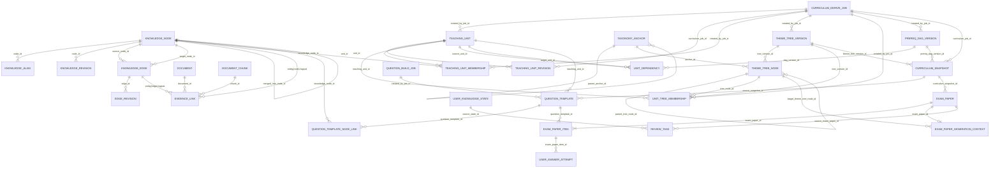

```mermaid
erDiagram
    %% =======================
    %% 知识图谱
    %% =======================
    KNOWLEDGE_NODE ||--o{ KNOWLEDGE_ALIAS : "node_id"
    KNOWLEDGE_NODE ||--o{ KNOWLEDGE_REVISION : "node_id"
    KNOWLEDGE_NODE ||--o{ KNOWLEDGE_EDGE : "source_node_id"
    KNOWLEDGE_NODE ||--o{ KNOWLEDGE_EDGE : "target_node_id"
    KNOWLEDGE_EDGE ||--o{ EDGE_REVISION : "edge_id"
    KNOWLEDGE_NODE ||--o| KNOWLEDGE_NODE : "merged_into_node_id"

    %% EvidenceLink 是多态关联（entity_type + entity_id）
    KNOWLEDGE_NODE ||--o{ EVIDENCE_LINK : "entity(node)-logical"
    KNOWLEDGE_EDGE ||--o{ EVIDENCE_LINK : "entity(edge)-logical"
    DOCUMENT ||--o{ EVIDENCE_LINK : "document_id"
    DOCUMENT_CHUNK ||--o{ EVIDENCE_LINK : "chunk_id"

    %% =======================
    %% 主题树 / 先修图 / 课程结构
    %% =======================
    CURRICULUM_DERIVE_JOB ||--o{ TEACHING_UNIT : "created_by_job_id"
    CURRICULUM_DERIVE_JOB ||--o{ TEACHING_UNIT_REVISION : "curriculum_job_id"
    TEACHING_UNIT ||--o{ TEACHING_UNIT_REVISION : "unit_id"

    CURRICULUM_DERIVE_JOB ||--o{ TEACHING_UNIT_MEMBERSHIP : "created_by_job_id"
    TEACHING_UNIT ||--o{ TEACHING_UNIT_MEMBERSHIP : "unit_id"
    KNOWLEDGE_NODE ||--o{ TEACHING_UNIT_MEMBERSHIP : "knowledge_node_id"

    TAXONOMY_ANCHOR ||--o{ TAXONOMY_ANCHOR : "parent_anchor_id"

    CURRICULUM_DERIVE_JOB ||--o{ THEME_TREE_VERSION : "created_by_job_id"
    THEME_TREE_VERSION ||--o{ THEME_TREE_NODE : "tree_version_id"
    TAXONOMY_ANCHOR ||--o{ THEME_TREE_NODE : "anchor_id"
    THEME_TREE_NODE ||--o{ THEME_TREE_NODE : "parent_tree_node_id"

    CURRICULUM_DERIVE_JOB ||--o{ UNIT_TREE_MEMBERSHIP : "created_by_job_id"
    THEME_TREE_VERSION ||--o{ UNIT_TREE_MEMBERSHIP : "tree_version_id"
    THEME_TREE_NODE ||--o{ UNIT_TREE_MEMBERSHIP : "tree_node_id"
    TEACHING_UNIT ||--o{ UNIT_TREE_MEMBERSHIP : "teaching_unit_id"

    CURRICULUM_DERIVE_JOB ||--o{ PREREQ_DAG_VERSION : "created_by_job_id"
    PREREQ_DAG_VERSION ||--o{ UNIT_DEPENDENCY : "dag_version_id"
    TEACHING_UNIT ||--o{ UNIT_DEPENDENCY : "source_unit_id"
    TEACHING_UNIT ||--o{ UNIT_DEPENDENCY : "target_unit_id"

    CURRICULUM_DERIVE_JOB ||--o{ CURRICULUM_SNAPSHOT : "curriculum_job_id"
    THEME_TREE_VERSION ||--o{ CURRICULUM_SNAPSHOT : "theme_tree_version_id"
    PREREQ_DAG_VERSION ||--o{ CURRICULUM_SNAPSHOT : "prereq_dag_version_id"

    %% =======================
    %% 考题与判题
    %% =======================
    QUESTION_BUILD_JOB ||--o{ QUESTION_TEMPLATE : "created_by_job_id"
    CURRICULUM_SNAPSHOT ||--o{ QUESTION_TEMPLATE : "source_snapshot_id"
    TEACHING_UNIT ||--o{ QUESTION_TEMPLATE : "teaching_unit_id"

    QUESTION_TEMPLATE ||--o{ QUESTION_TEMPLATE_NODE_LINK : "question_template_id"
    KNOWLEDGE_NODE ||--o{ QUESTION_TEMPLATE_NODE_LINK : "knowledge_node_id"

    CURRICULUM_SNAPSHOT ||--o{ EXAM_PAPER : "curriculum_snapshot_id"
    EXAM_PAPER ||--|{ EXAM_PAPER_ITEM : "exam_paper_id"
    QUESTION_TEMPLATE ||--o{ EXAM_PAPER_ITEM : "question_template_id"

    EXAM_PAPER ||--o| EXAM_PAPER_GENERATION_CONTEXT : "exam_paper_id"
    THEME_TREE_NODE ||--o{ EXAM_PAPER_GENERATION_CONTEXT : "target_theme_tree_node_id"

    EXAM_PAPER_ITEM ||--o{ USER_ANSWER_ATTEMPT : "exam_paper_item_id"

    USER_KNOWLEDGE_STATE ||--o{ REVIEW_TASK : "source_state_id"
    EXAM_PAPER ||--o{ REVIEW_TASK : "source_exam_paper_id"

```