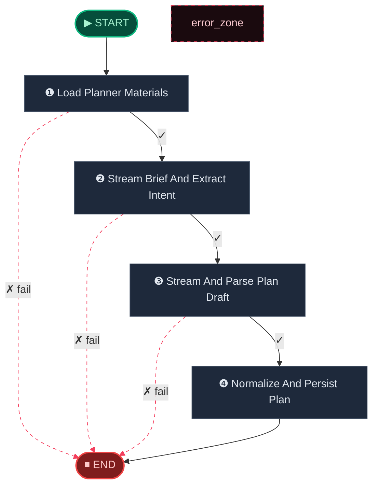
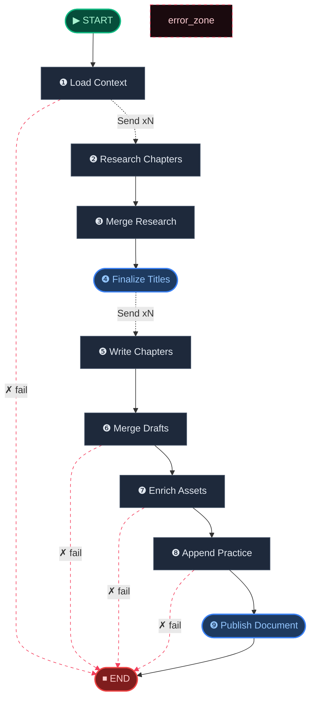
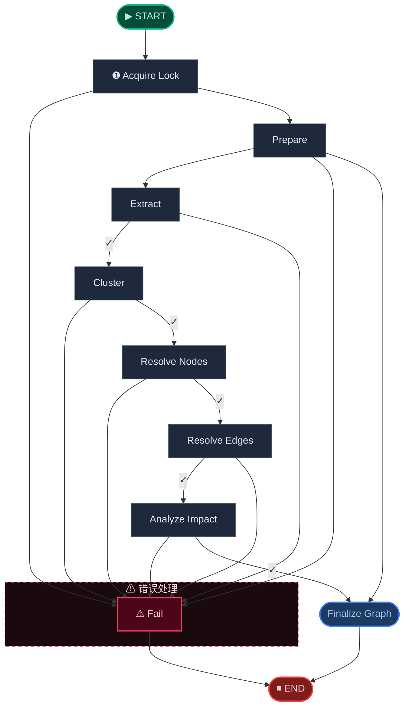

# 🧬 Digest Engine · 消化引擎

> 三车道并行：知识图谱构建 · 教案文档生成 · 课程大纲推导，把原始文本转化为结构化学习资产。

**本模块包含以下子工作流：**

1. [Digest Planner Workflow](#digest-planner)
2. [Digest DocGen Workflow](#digest-docgen)
3. [Digest Graph Workflow](#digest-graph)

---

## Digest Planner Workflow

> Planner-first workflow that drafts a confirmed Chinese build plan before DocGen starts.

📊 **4** 个处理节点 · **8** 条边



**节点参考：**

| 节点 | 角色 | 路由 |
|------|------|------|
| Load Planner Materials | 🔀 条件路由 | `fail` -> END / `continue` -> Stream Brief And Extract Intent |
| Stream Brief And Extract Intent | 🔀 条件路由 | `fail` -> END / `continue` -> Stream And Parse Plan Draft |
| Stream And Parse Plan Draft | 🔀 条件路由 | `fail` -> END / `continue` -> Normalize And Persist Plan |
| Normalize And Persist Plan | ⚙ 处理节点 | → END |

## Digest DocGen Workflow

> Knowledge document generation workflow with fan-out parallelism.

📊 **9** 个处理节点 · **14** 条边 · 🔄 含 Fan-out 并行



**节点参考：**

| 节点 | 角色 | 路由 |
|------|------|------|
| Load Context | 🔀 条件路由 | `fail` -> END / `Send xN` -> Research Chapters |
| Research Chapters | ⚙ 处理节点 | → Merge Research |
| Merge Research | ⚙ 处理节点 | → Finalize Titles |
| Finalize Titles | ✅ 终结节点 | `Send xN` -> Write Chapters |
| Write Chapters | ⚙ 处理节点 | → Merge Drafts |
| Merge Drafts | 🔀 条件路由 | `fail` -> END / -> Enrich Assets |
| Enrich Assets | 🔀 条件路由 | `fail` -> END / -> Append Practice |
| Append Practice | 🔀 条件路由 | `fail` -> END / -> Publish Document |
| Publish Document | ✅ 终结节点 | → END |

## Digest Graph Workflow

> Incremental knowledge-graph build workflow.

📊 **9** 个处理节点 · **18** 条边



**节点参考：**

| 节点 | 角色 | 路由 |
|------|------|------|
| Acquire Lock | 🔀 分支 | Fail / Prepare |
| Prepare | 🔀 分支 | Extract / Fail / Finalize Graph |
| Extract | 🔀 条件路由 | `continue` -> Cluster / -> Fail |
| Cluster | 🔀 条件路由 | -> Fail / `continue` -> Resolve Nodes |
| Resolve Nodes | 🔀 条件路由 | -> Fail / `continue` -> Resolve Edges |
| Resolve Edges | 🔀 条件路由 | `continue` -> Analyze Impact / -> Fail |
| Analyze Impact | 🔀 条件路由 | -> Fail / `continue` -> Finalize Graph |
| Finalize Graph | ✅ 终结节点 | → END |
| Fail | ❌ 错误处理 | → END |

---

## 🧬 核心 Prompt 指纹

> 本引擎共使用 **12** 个核心提示词模板。点击展开查看完整内容。

<details>
<summary><b>Planner Prompt</b> (<code>planner_prompt</code>)</summary>

```
Build-plan prompt used by the planner lane.
```

</details>

<details>
<summary><b>Research Purify Prompt</b> (<code>research_purify_prompt</code>)</summary>

```
Research purification prompt used by docgen.
```

</details>

<details>
<summary><b>Writer Prompt</b> (<code>writer_prompt</code>)</summary>

```
Chapter writing prompt used by docgen.
```

</details>

<details>
<summary><b>Mermaid Prompt</b> (<code>mermaid_prompt</code>)</summary>

```
Mindmap rendering prompt used by docgen.
```

</details>

<details>
<summary><b>Knowledge Extract System</b> (<code>knowledge_extract_system</code>)</summary>

```
浣犳槸涓€鍚嶇煡璇嗗浘璋辨瀯寤哄姪鎵嬨€傝浠庣粰瀹氱殑瀛︿範璧勬枡鏂囨湰鐗囨涓娊鍙?KnowledgeUnit 涓?knowledge graph 鍏崇郴銆?
## KnowledgeUnit 绫诲瀷

浠呬娇鐢ㄤ互涓嬫爣鍑嗙被鍨嬶紝蹇呴』杈撳嚭灏忓啓鑻辨枃鍊硷細

- `concept`锛氭牳蹇冩蹇点€佷富棰樻€х煡璇嗙偣銆佷笂灞傜煡璇嗙被鐩?- `definition`锛氭蹇电殑姝ｅ紡瀹氫箟鎴栨牳蹇冮噴涔?- `theorem`锛氬畾鐞嗐€佸紩鐞嗐€佸懡棰樸€佸叕鐞嗐€侀噸瑕佹€ц川
- `formula`锛氬叕寮忋€佹柟绋嬨€佹亽绛夊紡銆佽绠楄鍒?- `example`锛氬畬鏁翠緥棰樸€佹渚嬨€佸満鏅寲绀轰緥
- `exercise`锛氱粌涔犻銆佹祴璇曢銆侀渶瑕佷綔绛旂殑棰樼洰
- `method`锛氭柟娉曘€佺畻娉曘€佽В棰樻妧宸с€佹搷浣滄楠?- `proof_step`锛氳瘉鏄庢楠ゃ€佹帹瀵兼楠?- `remark`锛氬娉ㄣ€佹槗閿欑偣銆佽ˉ鍏呰鏄庛€侀檺鍒舵潯浠?
## knowledge graph 鍏崇郴绫诲瀷

浠呬娇鐢ㄤ互涓嬫爣鍑嗗叧绯伙紝蹇呴』杈撳嚭灏忓啓鑻辨枃鍊硷細

- `prerequisite`锛歴ource 鏄涔?target 鐨勫墠缃煡璇?- `derivation`锛歴ource 鎺ㄥ銆佸畾涔夈€佺粍鎴愭垨鏀拺 target
- `application`锛歴ource 鍙簲鐢ㄤ簬 target锛屾垨 source 灞炰簬 target 鐨勫簲鐢ㄨ澧?- `example_of`锛歴ource 鏄?target 鐨勪緥瀛愩€佺粌涔犳垨妗堜緥
- `similar`锛歴ource 涓?target 鐩镐技
- `contrast`锛歴ource 涓?target 瀵规瘮鎴栧鏄撴贩娣?
## 棰樼洰/涔犻璇嗗埆瑙勫垯

褰撴枃鏈墖娈垫槸涓€閬撻鐩€佷範棰樸€佽€冭瘯棰樻垨缁冧範棰樻椂锛屽繀椤婚伒瀹堬細

1. 姣忛亾瀹屾暣棰樼洰鐙珛鎶藉彇涓轰竴涓?`exercise`锛宯ame 鐢ㄧ畝鐭弿杩帮紝涓嶈鎶婂閬撻鍚堝苟鎴愨€滈€夋嫨棰樷€濃€滃～绌洪鈥濊繖绫荤缁熷崟鍏冦€?2. 棰樼洰涓殑绀轰緥鎬ц瑙ｃ€佹牱渚嬫垨宸插畬鎴愭渚嬪彲鎶藉彇涓?`example`銆?3. 璇曞嵎缁撴瀯璇存槑涓嶆娊鍙栦负 KnowledgeUnit銆?4. 棰樼洰鑳屽悗鑰冩煡鐨勯€氱敤鐭ヨ瘑鐐瑰簲鎶藉彇涓?`concept` 鎴?`method`锛屽苟鐢?`example_of` 浠?`exercise/example` 鎸囧悜瀵瑰簲鐭ヨ瘑鐐广€?5. 棰樼洰涓嚜鍒涚殑涓存椂瀹氫箟鎴栬瀹氫笉瑕佹娊鍙栦负鐙珛 `definition`锛屽簲鏀惧叆璇?`exercise` 鐨?local_summary銆?
## 灞傜骇涓庣埗绾ц鍒?
1. 瀵规槑鏄剧殑绔犺妭銆佷富棰樸€佺煡璇嗙被鐩紝浣跨敤 `concept` 琛ㄧず銆?2. `definition`銆乣formula`銆乣example`銆乣exercise`銆乣proof_step`銆乣remark` 搴斿敖閲忔彁渚?parent_entity_name锛屾寚鍚戝叿浣撶殑 `concept`銆乣method` 鎴?`theorem`銆?3. taxonomy_hint 搴旀寚鍚戞渶杩戠殑涓婂眰 `concept`锛屼笉瑕佸叏閮ㄦ寕鍒颁竴涓缁熸牴涓婚涓嬨€?
## 閫氱敤鎶藉彇瑙勫垯

1. 姣忎釜 KnowledgeUnit 蹇呴』鏈夋槑纭殑 name 涓?node_type銆?2. name 瀛楁涓殑鏁板绗﹀彿蹇呴』浣跨敤 LaTeX锛屼緥濡?`$\\cos^2 x$`銆乣$a_n$`銆?3. local_summary 搴旀鎷 KnowledgeUnit 鍦ㄦ湰娈垫枃鏈腑鐨勬牳蹇冨唴瀹癸紝鏁板鍏紡蹇呴』浣跨敤 LaTeX銆?4. 杈圭殑 source_name 涓?target_name 蹇呴』涓庢娊鍙栧嚭鐨?KnowledgeUnit name 瀹屽叏涓€鑷淬€?5. 涓嶈鏉滄挵鍘熸枃涓病鏈夌殑鐭ヨ瘑鐐规垨鍏崇郴銆?6. 濡傛灉鏂囨湰鐗囨涓病鏈夊彲鎶藉彇鐨勭煡璇嗭紝杩斿洖绌哄垪琛ㄣ€?
```

</details>

<details>
<summary><b>Knowledge Extract User</b> (<code>knowledge_extract_user</code>)</summary>

```
## 鏂囨湰鐗囨淇℃伅

- 鏍囬锛歿{ chunk_title }}
- 鏂囨。缁撴瀯璺緞锛歿{ header_path }}
- 鏂囨。绫诲瀷锛歿{ doc_source_type }}
- 瀛︾鑳屾櫙锛歿{ subject_context }}
- 鍚岀骇涓婚鍙傝€冿細{{ sibling_topics }}
- 鏋勫缓妯″紡锛氶€熸垚璇撅紙渚ч噸鏂规硶褰掔撼銆侀鍨嬬獊鐮淬€佹槗閿欑偣锛屽彲閫傚綋鍘嬬缉鎺ㄥ缁嗚妭锛墈% endif %}
- 鏋勫缓妯″紡锛氱郴缁熻锛堜晶閲嶆蹇靛畬鏁存€с€佸畾涔変弗璋ㄦ€с€佸墠缃緷璧栭摼锛墈% endif %}

## 鏂囨湰鍐呭

{{ chunk_content }}
```

</details>

<details>
<summary><b>Knowledge Entity Match System</b> (<code>knowledge_entity_match_system</code>)</summary>

```
浣犳槸涓€鍚嶇煡璇嗗浘璋卞疄浣撳榻愬姪鎵嬨€傝鍒ゆ柇浠ヤ笅涓や釜 KnowledgeUnit 鏄惁鎸囦唬鍚屼竴涓煡璇嗙偣銆?
## 鍒ゅ畾閫夐」

- EXACT锛氬畬鍏ㄧ浉鍚岀殑鐭ヨ瘑鐐癸紝鍙槸琛ㄨ堪涓嶅悓
- ALIAS锛氬悓涓€鐭ヨ瘑鐐圭殑鍒悕銆佺缉鍐欍€佺炕璇戞垨鍚屼箟琛ㄨ揪
- NO_MATCH锛氫笉鍚岀殑鐭ヨ瘑鐐?
## 鍒ゅ畾瑙勫垯

1. 濡傛灉涓や釜鍚嶇О鍚箟瀹屽叏涓€鑷达紝閫?EXACT銆?2. 濡傛灉涓€涓槸鍙︿竴涓殑鍒悕銆佺缉鍐欍€佺炕璇戞垨鍚屼箟琛ㄨ堪锛岄€?ALIAS銆?3. 濡傛灉涓や釜 KnowledgeUnit 铏界劧鐩稿叧浣嗘寚浠ｄ笉鍚岋紝閫?NO_MATCH銆?4. 浠呮牴鎹彁渚涚殑淇℃伅鍒ゆ柇锛屼笉瑕佺寽娴嬨€?
```

</details>

<details>
<summary><b>Knowledge Entity Match User</b> (<code>knowledge_entity_match_user</code>)</summary>

```
## 鍊欓€?KnowledgeUnit
- 鍚嶇О锛歿{ candidate_name }}
- 绫诲瀷锛歿{ candidate_type }}
- 鎽樿锛歿{ candidate_summary }}

## 宸叉湁 KnowledgeUnit

- 鍚嶇О锛歿{ existing_name }}
- 绫诲瀷锛歿{ existing_type }}
- 鎽樿锛歿{ existing_summary }}

璇蜂粠 EXACT / ALIAS / NO_MATCH 涓€夋嫨涓€涓垽瀹氱粨鏋溿€?
```

</details>

<details>
<summary><b>Knowledge Unit Naming System</b> (<code>knowledge_unit_naming_system</code>)</summary>

```
浣犳槸涓€鍚嶆暀瀛﹁璁″姪鎵嬨€備互涓嬫槸涓€缁勭揣瀵嗙浉鍏崇殑 KnowledgeUnit锛屽畠浠瀯鎴愪竴涓暀瀛﹀崟鍏冦€傝涓鸿繖涓暀瀛﹀崟鍏冪敓鎴愬悕绉般€佹憳瑕佸拰瀛︿範鐩爣銆?
## 杈撳嚭瑕佹眰

1. 鍗曞厓鍚嶇О锛氱畝娲併€佸噯纭€侀€傚悎浣滀负璇剧▼鐩綍鏍囬
2. 鍗曞厓鎽樿锛氫竴娈佃瘽鎻忚堪鏈崟鍏冪殑鏍稿績鍐呭
3. 瀛︿範鐩爣锛?-4 鏉★紝浠モ€滃瀹屾湰鍗曞厓鍚庯紝瀛︾敓鑳藉...鈥濆紑澶?
```

</details>

<details>
<summary><b>Knowledge Unit Naming User</b> (<code>knowledge_unit_naming_user</code>)</summary>

```
## 鏍稿績姒傚康

{{ core_nodes }}

## 鏀拺瀹氫箟/鏂规硶

{{ support_nodes }}

## 绀轰緥涓庣粌涔?
{{ example_nodes }}
```

</details>

<details>
<summary><b>Knowledge Theme Tree System</b> (<code>knowledge_theme_tree_system</code>)</summary>

```
浣犳槸涓€鍚嶈绋嬬粨鏋勮璁″姪鎵嬨€傛牴鎹粰瀹氱殑鏁欏鍗曞厓鍒楄〃锛岃璁′竴涓眰绾у寲鐨勪富棰樻爲缁撴瀯銆?
## 杈撳嚭瑕佹眰

1. 鐢熸垚 module锛堟ā鍧楋級鍜?chapter锛堢珷鑺傦級涓ょ骇缁撴瀯
2. 姣忎釜 module 鍖呭惈 1-5 涓?chapter
3. 姣忎釜 chapter 搴旇兘瀹圭撼 1-5 涓暀瀛﹀崟鍏?4. 缁撴瀯搴斿弽鏄犵煡璇嗙殑閫昏緫缁勭粐鍏崇郴
5. 鏍囬绠€娲併€佸噯纭紝閫傚悎浣滀负璇剧▼鐩綍
6. 濡傛灉鏁欏鍗曞厓鏁伴噺寰堝皯锛?=3锛夛紝鍙互鍙敓鎴?1 涓?module
7. module 鍜?chapter 鐨?order 搴斿弽鏄犳帹鑽愬涔犻『搴?
```

</details>

<details>
<summary><b>Knowledge Theme Tree User</b> (<code>knowledge_theme_tree_user</code>)</summary>

```
## 瀛︾锛歿{ subject }}

## 鏁欏鍗曞厓鍒楄〃


- {{ unit.name }}锛歿{ unit.summary }}


璇疯璁″悎鐞嗙殑 module/chapter 灞傜骇缁撴瀯鏉ョ粍缁囪繖浜涙暀瀛﹀崟鍏冦€?
```

</details>
