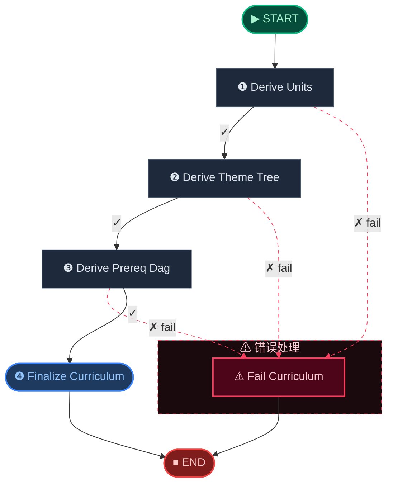
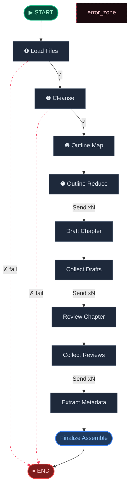
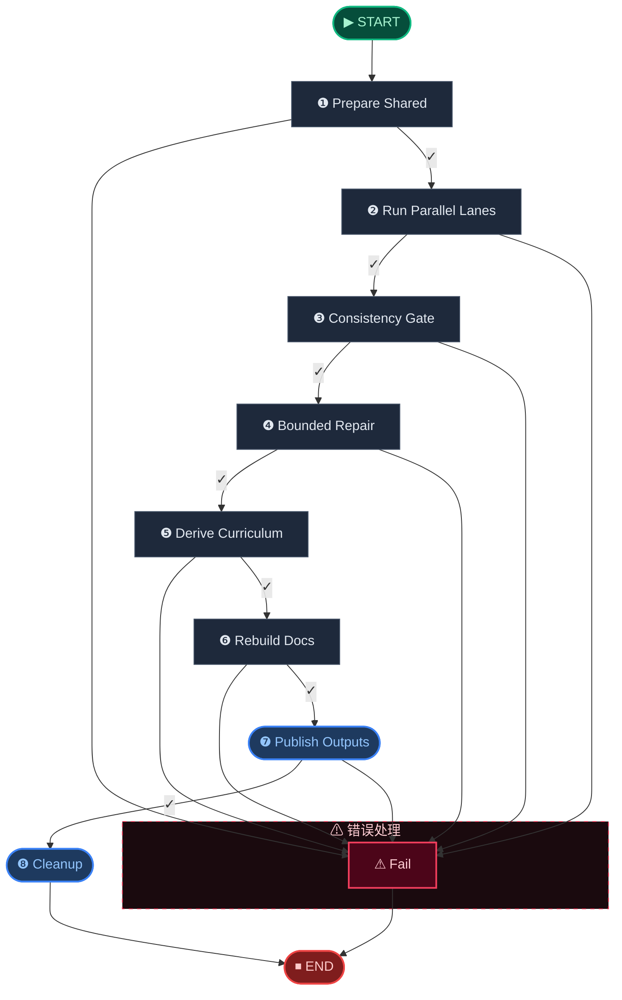

# 🧬 Digest Engine · 消化引擎

> 三车道并行：知识图谱构建 · 教案文档生成 · 课程大纲推导，把原始文本转化为结构化学习资产。

**本模块包含以下子工作流：**

1. [Digest Curriculum Workflow](#digest-curriculum)
2. [Digest DocGen Workflow](#digest-docgen)
3. [Digest Graph Workflow](#digest-graph)
4. [Digest Unified Workflow](#digest-unified)

---

## Digest Curriculum Workflow

> Curriculum derivation workflow built from digest graph impact.

📊 **5** 个处理节点 · **9** 条边



**节点参考：**

| 节点 | 角色 | 路由 |
|------|------|------|
| Derive Units | 🔀 条件路由 | `continue` → `fail` |
| Derive Theme Tree | 🔀 条件路由 | `continue` → `fail` |
| Derive Prereq Dag | 🔀 条件路由 | `fail` → `continue` |
| Finalize Curriculum | ✅ 终结节点 | → END |
| Fail Curriculum | ❌ 错误处理 | → END |

## Digest DocGen Workflow

> Knowledge document generation workflow with fan-out parallelism.

📊 **10** 个处理节点 · **7** 条边 · 🔄 含 Fan-out 并行



**节点参考：**

| 节点 | 角色 | 路由 |
|------|------|------|
| Load Files | 🔀 条件路由 | `fail` → `continue` |
| Cleanse | 🔀 条件路由 | `fail` → `continue` |
| Outline Map | ⚙ 处理节点 | → Outline Reduce |
| Outline Reduce | ⚙ 处理节点 | → END |
| Draft Chapter | ⚙ 处理节点 |  |
| Collect Drafts | ⚙ 处理节点 |  |
| Review Chapter | ⚙ 处理节点 |  |
| Collect Reviews | ⚙ 处理节点 |  |
| Extract Metadata | ⚙ 处理节点 |  |
| Finalize Assemble | ✅ 终结节点 |  |

## Digest Graph Workflow

> Incremental knowledge-graph build workflow.

📊 **9** 个处理节点 · **18** 条边


**节点参考：**

| 节点 | 角色 | 路由 |
|------|------|------|
| Acquire Lock | 🔀 分支 | Fail / Prepare |
| Prepare | 🔀 分支 | Extract / Fail / Finalize Graph |
| Extract | 🔀 条件路由 | `continue` |
| Cluster | 🔀 条件路由 | `continue` |
| Resolve Nodes | 🔀 条件路由 | `continue` |
| Resolve Edges | 🔀 条件路由 | `continue` |
| Analyze Impact | 🔀 条件路由 | `continue` |
| Finalize Graph | ✅ 终结节点 | → END |
| Fail | ❌ 错误处理 | → END |

## Digest Unified Workflow

> Shared prepare, docs lane, graph lane, consistency, repair, and curriculum.

📊 **9** 个处理节点 · **17** 条边



**节点参考：**

| 节点 | 角色 | 路由 |
|------|------|------|
| Prepare Shared | 🔀 条件路由 | `continue` |
| Run Parallel Lanes | 🔀 条件路由 | `continue` |
| Consistency Gate | 🔀 条件路由 | `continue` |
| Bounded Repair | 🔀 条件路由 | `continue` |
| Derive Curriculum | 🔀 条件路由 | `continue` |
| Rebuild Docs | 🔀 条件路由 | `continue` |
| Publish Outputs | 🔀 条件路由 | `continue` |
| Cleanup | ✅ 终结节点 | → END |
| Fail | ❌ 错误处理 | → END |

---

## 🧬 核心 Prompt 指纹

> 本引擎共使用 **10** 个核心提示词模板。点击展开查看完整内容。

<details>
<summary><b>Global Outline Prompt</b> (<code>global_outline_prompt</code>)</summary>

```
你是一位经验丰富的教研老师。请把下面零散的知识点整理成适合学习和复习的多章节结构。

学科信息：
{subject_context}

输入：
- 原始文本块数量：{chunk_count}
- 局部标题汇总：
{local_outlines}

用户补充要求：
{user_prompt}

要求：
1. 输出两级结构：章 -> 节。
2. 章节顺序要符合该学科的教学逻辑，基础在前，综合应用在后。
3. 每一节都要标明对应的原始文本块索引。
4. 不要漏掉重要主题，也不要制造虚假章节。
5. 章节标题要体现学科特色，使用该学科的专业术语。

输出格式：
返回严格 JSON：
{{
  "chapters": [
    {{
      "chapter_index": 1,
      "title": "章标题",
      "sections": [
        {{
          "title": "节标题",
          "source_chunk_indices": [0, 1]
        }}
      ]
    }}
  ]
}}
```

</details>

<details>
<summary><b>Writer Prompt</b> (<code>writer_prompt</code>)</summary>

```
你是 AITeachMe 的金牌私教。请基于分配给你的原始素材，写出一章真正适合学习和复习的中文讲义。

学科信息：
{subject_context}

写作风格指导：
{teaching_style_hint}

全局大纲：
{global_outline}

当前章节：
- 标题：{chapter_title}
- 序号：第 {chapter_index} 章 / 共 {total_chapters} 章
- 本章重点小节：{section_titles}

用户补充要求：
{user_prompt}

上一章摘要：
{prev_summary}

本章素材导读：
{source_brief}

本章关键公式参考：
{formula_refs}

本章原始素材：
{source_content}

下一章预告：
{next_preview}

写作要求：
1. 只输出这一章，不要写整本书。
2. 以 `# {chapter_title}` 作为唯一一级标题。
3. 开头必须有 `> 📌 本章概要：...`，用 2-3 句话说明本章主线。
4. 正文要写成自然的讲义，不要写成拼接摘要，也不要空洞列点。
5. 使用自然的二级、三级标题组织内容，讲清概念、公式、推导思路、例题和易错点。
6. 公式请保留 LaTeX 写法，并确保符号准确。
7. 不要照搬原文，要用教学化语言重写，但不能遗漏关键概念和公式。
8. 文末附一行：`📊 本章标签：#标签1 #标签2 ...`
9. 内容深度和表达方式要匹配该学科的特点和难度级别。

输出要求：
直接返回完整 Markdown，不要加解释。
```

</details>

<details>
<summary><b>Kg Extract System</b> (<code>kg_extract_system</code>)</summary>

```
你是一名知识图谱构建助手。请从给定的学习资料文本片段中抽取知识节点和知识边。

## 节点类型（仅限以下 5 种）

- **Topic**：主题或大类（如"微积分"、"线性代数"、"商业模式"、"系统架构"）
- **Concept**：核心概念（如"导数"、"极限"、"核心痛点"、"产品特性"）
- **Definition**：概念的正式定义或核心释义（如"导数的定义"、"AITeachMe的产品定位"）
- **Method**：方法、算法、解题技巧或业务策略（如"洛必达法则"、"动态复习算法"、"获客策略"）
- **Example**：具体用例、场景、例题或习题（如"求 $f(x)=x^2$ 的导数"、"考研党专属复习场景"）。注意：一道完整的题目或完整的业务案例应作为一个 Example 节点。

## 边类型（仅限以下 5 种）

- **belongs_to_topic**：节点属于某个 Topic（source → target=Topic）
- **prerequisite_of**：source 是学习 target 的前置知识
- **defined_by**：Concept 由 Definition 定义（source=Concept → target=Definition）
- **illustrated_by**：Concept/Method 由 Example 说明（source=Concept/Method → target=Example）
- **part_of**：source 是 target 的组成部分

## 题目/习题识别规则（优先级最高）

当文本片段是一道题目、习题、考试题或练习题时，必须遵守以下规则：

1. **每道题独立抽取为一个 Example 节点**，name 用简短描述（如"充要条件判断题"、"正六棱柱中阳马计数"），不要把题目拆成多个 Concept 或 Definition。
2. **严禁合并多道题**：如果文本中包含多道题（如第14题、第15题、第16题），必须为每道题分别创建独立的 Example 节点。绝对不要创建"选择题"、"填空题"、"解答题"这样的笼统节点来概括多道题。
3. **试卷结构描述不抽取**：如"本部分共4题，满分20分"、"选择题（共X分）"等试卷说明性文字不是知识点，不应抽取为任何节点。
4. **题目中引用的学科概念**（如"圆锥"、"数列"、"导数"）：如果是学科中公认的概念，可以抽取为 Concept 节点，并用 `illustrated_by` 边连接到该 Example。
5. **题目中自创的临时定义**（如"定义两个数列'接近'：对任意正整数 $n$，$|b_n - a_n| \leq 1$"）属于题目设问的一部分，**不得**抽取为独立的 Definition 或 Concept 节点。这类内容应包含在 Example 节点的 local_summary 中。
6. 判断依据：如果一个"定义"或"概念"仅在该题目中成立、不是学科通用知识，则它是题目专属设定，归入 Example。

### 如何识别题目内容
- 包含"求…"、"证明…"、"计算…"、"判断…"、"选择…"等指令性语句
- 包含题号标记（如"1."、"(1)"、"第X题"、"例X"）
- 包含"已知…，求…"、"设…，则…"等数学题目结构
- 包含选项（A/B/C/D）

## 多层级主题结构规则（非常重要）

1. **必须构建层级化的 Topic 结构**：如果文本片段涉及多个层级的知识（如"高等数学 > 微积分 > 导数"），应为每个层级创建独立的 Topic 节点，并用 `part_of` 边连接。严禁把所有内容都挂到一个笼统的 Topic 下。
2. **从题目中提取知识点**：当文本包含题目时，不要只创建 Example 节点。必须同时提取题目背后考查的核心 Concept 或 Method 节点，并用 `illustrated_by` 边将 Concept/Method 连接到 Example。
3. **parent_entity_name 必须精确**：Definition 和 Example 的 parent_entity_name 应指向具体的 Concept 或 Method，而不是笼统的大 Topic。例如，"导数的定义"的 parent_entity_name 应该是"导数"而不是"高等数学"。
4. **taxonomy_hint 应指向最近的上层 Topic**：不要所有节点都指向同一个根 Topic。

## 通用抽取规则

1. 每个节点必须有明确的 name 和 node_type。
2. **name 字段中的数学符号必须用 LaTeX**：禁止使用 Unicode 上下标（如 cos²x、x₁），必须写成 LaTeX 格式（如 `$\cos^2 x$`、`$x_1$`）。正确示例：`$\sin x$`、`$\int f(x)\,dx$`、`$a_n$`。错误示例：sin x、cos²x、aₙ。
3. Definition 和 Example 类型的节点**必须**提供 parent_entity_name，指明其所属的 Concept 或 Method 名称（不是笼统的大 Topic）。
4. 每个节点应提供 taxonomy_hint：该节点最可能归属的最近上层主题名称（用于后续主题树对齐）。
5. local_summary 应概括该知识点在本段文本中的核心内容。内容较多时可以分段（用换行分隔），不设严格字数上限但应保持精炼。其中数学公式必须使用 LaTeX 语法（行内 `$...$`，独立 `$$...$$`）。
6. 边的 source_name 和 target_name 必须与抽取出的节点 name 完全一致。
7. 不要杜撰原文中没有的知识点或关系。
8. 如果文本片段中没有可抽取的知识，返回空列表即可。
9. **数学公式格式**：所有字段（name、local_summary、description）中的数学公式都必须使用 LaTeX 语法。行内公式用 `$...$` 包裹，独立公式用 `$$...$$` 包裹。绝对不要使用纯文本或 Unicode 字符（如 ²、³、₁、∫、∑、≤）表示数学符号。
```

</details>

<details>
<summary><b>Kg Extract User</b> (<code>kg_extract_user</code>)</summary>

```
## 文本片段信息

- 标题：{{ chunk_title }}
- 文档结构路径：{{ header_path }}
- 文档类型：{{ doc_source_type }}
- 学科背景：{{ subject_context }}
- 同级主题参考：{{ sibling_topics }}
- 构建模式：速成课（侧重方法归纳、题型突破、易错点，可适当压缩推导细节）
- 构建模式：系统课（侧重概念完整性、定义严谨性、前置依赖链）

## 文本内容

{{ chunk_content }}
```

</details>

<details>
<summary><b>Kg Entity Match System</b> (<code>kg_entity_match_system</code>)</summary>

```
你是一名知识图谱实体对齐助手。请判断以下两个知识节点是否指代同一个知识点。

## 判定选项

- **EXACT**：完全相同的知识点，只是表述不同
- **ALIAS**：同一知识点的别名或缩写（如"BP算法"与"反向传播算法"）
- **NO_MATCH**：不同的知识点

## 判定规则

1. 如果两个节点名称含义完全一致，选 EXACT。
2. 如果一个是另一个的别名、缩写、翻译或同义表述，选 ALIAS。
3. 如果两个节点虽然相关但指代不同的知识点，选 NO_MATCH。
4. 仅根据提供的信息判断，不要猜测。
```

</details>

<details>
<summary><b>Kg Entity Match User</b> (<code>kg_entity_match_user</code>)</summary>

```
## 候选节点

- 名称：{{ candidate_name }}
- 类型：{{ candidate_type }}
- 摘要：{{ candidate_summary }}

## 已有节点

- 名称：{{ existing_name }}
- 类型：{{ existing_type }}
- 摘要：{{ existing_summary }}

请从 EXACT / ALIAS / NO_MATCH 中选择一个判定结果。
```

</details>

<details>
<summary><b>Kg Unit Naming System</b> (<code>kg_unit_naming_system</code>)</summary>

```
你是一名教学设计助手。以下是一组紧密相关的知识节点，它们构成一个教学单元。
请为这个教学单元生成名称、摘要和学习目标。

## 输出要求

1. 单元名称：简洁、准确、适合作为课程目录标题
2. 单元摘要：一段话描述本单元的核心内容
3. 学习目标：2-4 条，以"学完本单元后，学生能够..."开头
```

</details>

<details>
<summary><b>Kg Unit Naming User</b> (<code>kg_unit_naming_user</code>)</summary>

```
## 核心概念

{{ core_nodes }}

## 支撑定义/方法

{{ support_nodes }}

## 示例

{{ example_nodes }}
```

</details>

<details>
<summary><b>Kg Theme Tree System</b> (<code>kg_theme_tree_system</code>)</summary>

```
你是一名课程结构设计助手。根据给定的教学单元列表，设计一个层级化的主题树结构。

## 输出要求

1. 生成 module（模块）和 chapter（章节）两级结构
2. 每个 module 包含 1-5 个 chapter
3. 每个 chapter 应该能容纳 1-5 个教学单元
4. 结构应反映知识的逻辑组织关系
5. 标题简洁、准确，适合作为课程目录
6. 如果教学单元数量很少（≤3），可以只生成 1 个 module
7. module 和 chapter 的 order 应反映推荐的学习顺序
```

</details>

<details>
<summary><b>Kg Theme Tree User</b> (<code>kg_theme_tree_user</code>)</summary>

```
## 学科：{{ subject }}

## 教学单元列表


- {{ unit.name }}：{{ unit.summary }}


请设计合理的 module/chapter 层级结构来组织这些教学单元。
```

</details>
