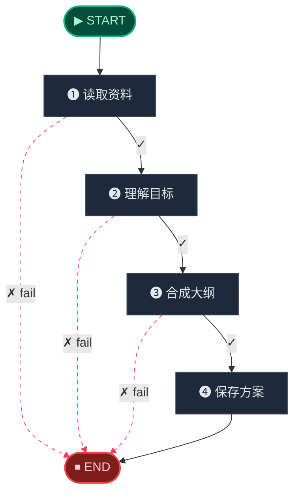
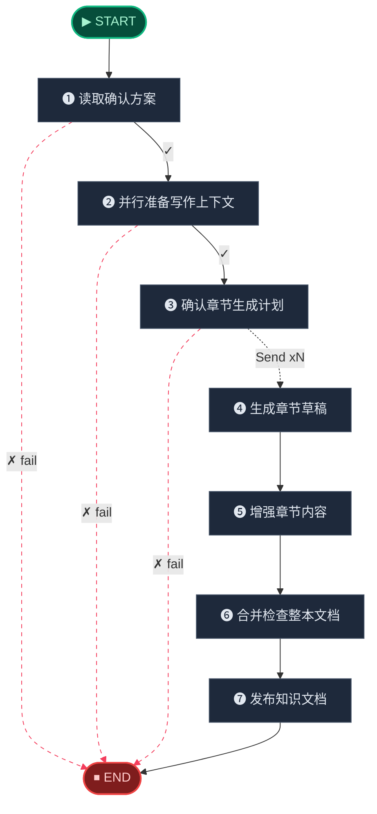

# 🧬 Digest Engine · 消化引擎

> 三车道并行：知识图谱构建 · 教案文档生成 · 课程大纲推导，把原始文本转化为结构化学习资产。

**本模块包含以下子工作流：**

1. [Digest Planner Workflow](#digest-planner)
2. [Digest DocGen Workflow](#digest-docgen)
3. [Digest Graph Workflow](#digest-graph)

---

## Digest Planner Workflow

> Planner-first workflow that drafts a confirmed Chinese build plan before DocGen starts.

📊 **4** 个处理节点 · **8** 条边



**节点参考：**

| 节点 | 角色 | 路由 |
|------|------|------|
| 读取资料 | 🔀 条件路由 | `fail` -> END / `continue` -> 理解目标 |
| 理解目标 | 🔀 条件路由 | `fail` -> END / `continue` -> 合成大纲 |
| 合成大纲 | 🔀 条件路由 | `fail` -> END / `continue` -> 保存方案 |
| 保存方案 | ⚙ 处理节点 | → END |

## Digest DocGen Workflow

> Knowledge document generation workflow with fan-out parallelism.

📊 **7** 个处理节点 · **11** 条边 · 🔄 含 Fan-out 并行



**节点参考：**

| 节点 | 角色 | 路由 |
|------|------|------|
| 读取确认方案 | 🔀 条件路由 | `fail` -> END / `continue` -> 并行准备写作上下文 |
| 并行准备写作上下文 | 🔀 条件路由 | `fail` -> END / `continue` -> 确认章节生成计划 |
| 确认章节生成计划 | 🔀 条件路由 | `fail` -> END / `Send xN` -> 生成章节草稿 |
| 生成章节草稿 | ⚙ 处理节点 | → 增强章节内容 |
| 增强章节内容 | ⚙ 处理节点 | → 合并检查整本文档 |
| 合并检查整本文档 | ⚙ 处理节点 | → 发布知识文档 |
| 发布知识文档 | ⚙ 处理节点 | → END |

## Digest Graph Workflow

> Incremental knowledge-graph build workflow.

📊 **9** 个处理节点 · **18** 条边


**节点参考：**

| 节点 | 角色 | 路由 |
|------|------|------|
| Acquire Lock | 🔀 分支 | Fail / Prepare |
| Prepare | 🔀 分支 | Extract / Fail / Finalize Graph |
| Extract | 🔀 条件路由 | `continue` -> Cluster / -> Fail |
| Cluster | 🔀 条件路由 | -> Fail / `continue` -> Resolve Nodes |
| Resolve Nodes | 🔀 条件路由 | -> Fail / `continue` -> Resolve Edges |
| Resolve Edges | 🔀 条件路由 | `continue` -> Analyze Impact / -> Fail |
| Analyze Impact | 🔀 条件路由 | -> Fail / `continue` -> Finalize Graph |
| Finalize Graph | ✅ 终结节点 | → END |
| Fail | ❌ 错误处理 | → END |

---

## 🧬 核心 Prompt 指纹

> 本引擎共使用 **15** 个核心提示词模板。点击展开查看完整内容。

<details>
<summary><b>Planner Prompt</b> (<code>planner_prompt</code>)</summary>

```
Build-plan prompt used by the planner lane.
```

</details>

<details>
<summary><b>Outline Enhance Prompt</b> (<code>outline_enhance_prompt</code>)</summary>

```
DocGen execution-level outline enhancement prompt.
```

</details>

<details>
<summary><b>Intent Prompt</b> (<code>intent_prompt</code>)</summary>

```
DocGen writing-intent inference prompt.
```

</details>

<details>
<summary><b>File Summary Prompt</b> (<code>file_summary_prompt</code>)</summary>

```
DocGen file material summary prompt.
```

</details>

<details>
<summary><b>Writer Prompt</b> (<code>writer_prompt</code>)</summary>

```
Chapter writing prompt used by DocGen.
```

</details>

<details>
<summary><b>Chapter Critic Prompt</b> (<code>chapter_critic_prompt</code>)</summary>

```
Bounded chapter rewrite prompt.
```

</details>

<details>
<summary><b>Mermaid Prompt</b> (<code>mermaid_prompt</code>)</summary>

```
Mindmap rendering prompt used by DocGen.
```

</details>

<details>
<summary><b>Knowledge Extract System</b> (<code>knowledge_extract_system</code>)</summary>

```
你是知识图谱抽取助手。请从给定的学习资料切片中抽取 KnowledgeUnit 节点与知识图谱关系。

## KnowledgeUnit 类型
只能使用以下小写值：
- `concept`：核心概念、主题级知识点或更高层级的类别
- `definition`：概念的正式定义或关键解释
- `theorem`：定理、引理、命题、公理或重要性质
- `formula`：公式、方程、恒等式或计算规则
- `example`：完整例题、案例或情境化说明
- `exercise`：需要作答的问题、习题或题目
- `method`：方法、算法、解题技巧或步骤性流程
- `proof_step`：证明步骤或推导步骤
- `remark`：备注、注意事项、易错点、补充说明或适用条件

## Relation 类型
只能使用以下小写值：
- `prerequisite`：source 是学习 target 的前置知识
- `derivation`：source 可推出、定义、组成或支撑 target
- `application`：source 被用于 target，或 source 属于 target 的应用语境
- `example_of`：source 是 target 的例子、习题或案例
- `similar`：source 与 target 相似
- `contrast`：source 与 target 构成对比，或两者容易混淆

## 习题识别规则
如果切片内容是题目、习题、试题或练习：
1. 每一道完整题目抽取为一个 `exercise`，名称尽量简洁。
2. 讲解过程或完整解例可以抽取为 `example`。
3. 试卷结构性文字本身不要当作 KnowledgeUnit。
4. 题目考查的一般知识点仍应抽取为 `concept` 或 `method`，并让 `exercise/example` 通过 `example_of` 指向这些知识点。
5. 仅为当前题目临时引入的定义，优先放进 `exercise.local_summary`，不要单独抽成独立 `definition`。

## 层级与父节点规则
1. 明显属于章节、主题或类别层级的条目，优先使用 `concept`。
2. `definition`、`formula`、`example`、`exercise`、`proof_step`、`remark` 在可能时都应填写 `parent_entity_name`。
3. `taxonomy_hint` 应指向最近的上层 `concept`，不要指向过于宽泛的总根节点。

## 通用抽取规则
1. 每个 KnowledgeUnit 都必须有明确的 `name` 和 `node_type`。
2. `name` 中的数学符号必须使用 LaTeX，例如 `$\cos^2 x$`、`$a_n$`。
3. `local_summary` 需要概括该单元在当前切片中的核心内容，数学内容用 LaTeX 表示。
4. 边的 `source_name` 和 `target_name` 必须与已抽取的 KnowledgeUnit 名称完全一致。
5. 不要编造文本中没有明确支持的知识点或关系。
6. 如果没有可抽取内容，返回空列表。
```

</details>

<details>
<summary><b>Knowledge Extract User</b> (<code>knowledge_extract_user</code>)</summary>

```
## 切片元数据

- 标题：{{ chunk_title }}
- 标题路径：{{ header_path }}
- 文档类型：{{ doc_source_type }}
- 学科上下文：{{ subject_context }}
- 同级主题：{{ sibling_topics }}
- 构建模式：冲刺课，重点关注方法、题型与常见错误
- 构建模式：系统课，重点关注概念完整性、定义严谨性与前置链路

## 切片内容

{{ chunk_content }}
```

</details>

<details>
<summary><b>Knowledge Entity Match System</b> (<code>knowledge_entity_match_system</code>)</summary>

```
你是知识图谱实体匹配助手。请判断下面两个 KnowledgeUnit 是否指向同一个知识点。

## 可选结论
- EXACT：是同一个知识点，只是表述不同
- ALIAS：是同一个知识点的别名、简称、翻译名或同义表达
- NO_MATCH：不是同一个知识点

## 判断规则
1. 含义完全一致时，选择 EXACT。
2. 如果一个只是另一个的别名或替代表达，选择 ALIAS。
3. 如果两者有关联，但并不是同一知识点，选择 NO_MATCH。
4. 只能依据提供的信息判断，不要猜测。
```

</details>

<details>
<summary><b>Knowledge Entity Match User</b> (<code>knowledge_entity_match_user</code>)</summary>

```
## 候选 KnowledgeUnit
- 名称：{{ candidate_name }}
- 类型：{{ candidate_type }}
- 摘要：{{ candidate_summary }}

## 已有 KnowledgeUnit
- 名称：{{ existing_name }}
- 类型：{{ existing_type }}
- 摘要：{{ existing_summary }}

请只从 EXACT / ALIAS / NO_MATCH 中选择一个结果。
```

</details>

<details>
<summary><b>Knowledge Unit Naming System</b> (<code>knowledge_unit_naming_system</code>)</summary>

```
你是教学设计助手。下面这些 KnowledgeUnit 共同构成一个教学单元，请为它生成单元名称、单元摘要和学习目标。

## 输出要求
1. 单元名称：简洁、准确，适合作为课程目录标题
2. 单元摘要：用一段话概括核心内容
3. 学习目标：输出 2-4 条，以“学完本单元后，学生能够……”开头
```

</details>

<details>
<summary><b>Knowledge Unit Naming User</b> (<code>knowledge_unit_naming_user</code>)</summary>

```
## 核心概念

{{ core_nodes }}

## 支撑定义与方法

{{ support_nodes }}

## 例子与习题

{{ example_nodes }}
```

</details>

<details>
<summary><b>Knowledge Theme Tree System</b> (<code>knowledge_theme_tree_system</code>)</summary>

```
你是课程结构设计助手。给定一组教学单元，请设计一个分层主题树。

## 输出要求
1. 产出两层结构：module 与 chapter
2. 每个 module 下包含 1-5 个 chapter
3. 每个 chapter 下包含 1-5 个教学单元
4. 结构应体现知识上的逻辑组织关系
5. 标题要简洁、准确，适合作为课程目录标题
6. 如果教学单元非常少（<= 3），可以只输出一个 module
7. module 与 chapter 的顺序应体现推荐学习路径
```

</details>

<details>
<summary><b>Knowledge Theme Tree User</b> (<code>knowledge_theme_tree_user</code>)</summary>

```
## 学科：{{ subject }}

## 教学单元


- {{ unit.name }}：{{ unit.summary }}


请为这些教学单元设计一个合理的 module/chapter 层级结构。
```

</details>
