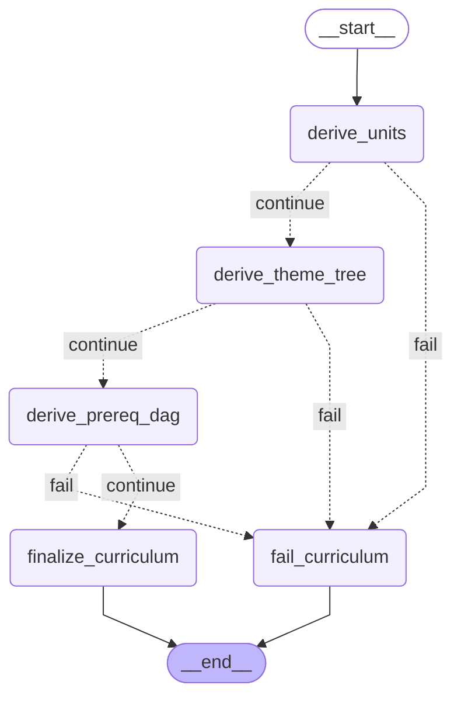

# Digest Curriculum Workflow

Curriculum derivation workflow built from digest graph impact.

```mermaid
---
config:
  flowchart:
    curve: linear
---
graph TD;
	__start__([<p>__start__</p>]):::first
	derive_units(derive_units)
	derive_theme_tree(derive_theme_tree)
	derive_prereq_dag(derive_prereq_dag)
	finalize_curriculum(finalize_curriculum)
	fail_curriculum(fail_curriculum)
	__end__([<p>__end__</p>]):::last
	__start__ --> derive_units;
	derive_prereq_dag -. &nbsp;fail&nbsp; .-> fail_curriculum;
	derive_prereq_dag -. &nbsp;continue&nbsp; .-> finalize_curriculum;
	derive_theme_tree -. &nbsp;continue&nbsp; .-> derive_prereq_dag;
	derive_theme_tree -. &nbsp;fail&nbsp; .-> fail_curriculum;
	derive_units -. &nbsp;continue&nbsp; .-> derive_theme_tree;
	derive_units -. &nbsp;fail&nbsp; .-> fail_curriculum;
	fail_curriculum --> __end__;
	finalize_curriculum --> __end__;
	classDef default fill:#f2f0ff,line-height:1.2
	classDef first fill-opacity:0
	classDef last fill:#bfb6fc
```
