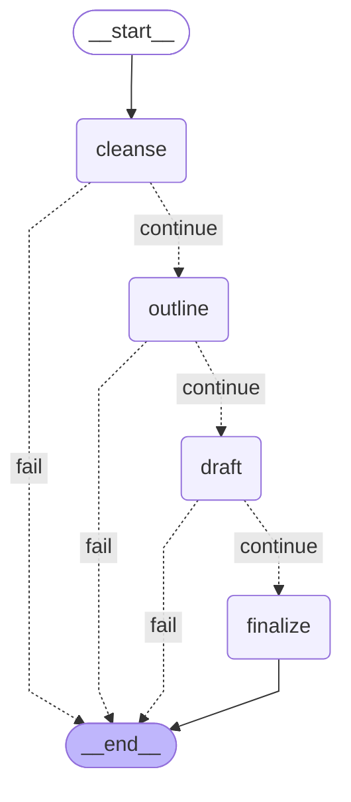

# Digest DocGen Workflow

Knowledge document generation workflow: cleanse → outline → draft → finalize.

```mermaid
---
config:
  flowchart:
    curve: linear
---
graph TD;
	__start__([<p>__start__</p>]):::first
	cleanse(cleanse)
	outline(outline)
	draft(draft)
	finalize(finalize)
	__end__([<p>__end__</p>]):::last
	__start__ --> cleanse;
	cleanse -. &nbsp;fail&nbsp; .-> __end__;
	cleanse -. &nbsp;continue&nbsp; .-> outline;
	draft -. &nbsp;fail&nbsp; .-> __end__;
	draft -. &nbsp;continue&nbsp; .-> finalize;
	outline -. &nbsp;fail&nbsp; .-> __end__;
	outline -. &nbsp;continue&nbsp; .-> draft;
	finalize --> __end__;
	classDef default fill:#f2f0ff,line-height:1.2
	classDef first fill-opacity:0
	classDef last fill:#bfb6fc
```
