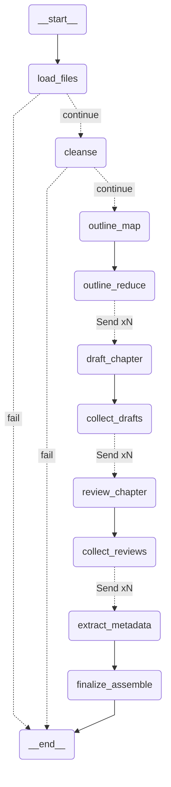

# Digest DocGen Workflow

Knowledge document generation workflow with fan-out parallelism.

```mermaid
---
config:
  flowchart:
    curve: linear
---
graph TD;
	__start__(<p>__start__</p>)
	load_files(load_files)
	cleanse(cleanse)
	outline_map(outline_map)
	outline_reduce(outline_reduce)
	draft_chapter(draft_chapter)
	collect_drafts(collect_drafts)
	review_chapter(review_chapter)
	collect_reviews(collect_reviews)
	extract_metadata(extract_metadata)
	finalize_assemble(finalize_assemble)
	__end__(<p>__end__</p>)
	__start__ --> load_files;
	cleanse -. &nbsp;fail&nbsp; .-> __end__;
	cleanse -. &nbsp;continue&nbsp; .-> outline_map;
	load_files -. &nbsp;fail&nbsp; .-> __end__;
	load_files -. &nbsp;continue&nbsp; .-> cleanse;
	outline_map --> outline_reduce;
	outline_reduce -. Send xN .-> draft_chapter;
	draft_chapter --> collect_drafts;
	collect_drafts -. Send xN .-> review_chapter;
	review_chapter --> collect_reviews;
	collect_reviews -. Send xN .-> extract_metadata;
	extract_metadata --> finalize_assemble;
	finalize_assemble --> __end__;
	classDef default fill:#f2f0ff,line-height:1.2
	classDef first fill-opacity:0
	classDef last fill:#bfb6fc
```
