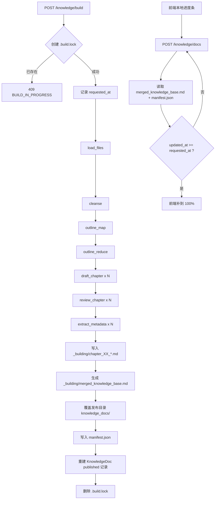

# Digest DocGen Workflow

当前知识文档工作流已经去 `job_id` 化。

外部接口只有：

- `POST /api/v1/subjects/{subject}/knowledge/build`
- `POST /api/v1/subjects/{subject}/knowledge/docs`

内部用 subject 级锁、staging 目录和 manifest 管理构建与发布。

