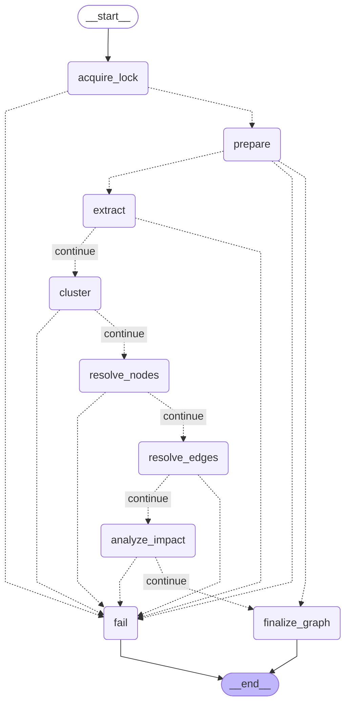

# Digest Graph Workflow

Incremental knowledge-graph build workflow.

```mermaid
---
config:
  flowchart:
    curve: linear
---
graph TD;
	__start__([<p>__start__</p>]):::first
	acquire_lock(acquire_lock)
	prepare(prepare)
	extract(extract)
	cluster(cluster)
	resolve_nodes(resolve_nodes)
	resolve_edges(resolve_edges)
	analyze_impact(analyze_impact)
	finalize_graph(finalize_graph)
	fail(fail)
	__end__([<p>__end__</p>]):::last
	__start__ --> acquire_lock;
	acquire_lock -.-> fail;
	acquire_lock -.-> prepare;
	analyze_impact -.-> fail;
	analyze_impact -. &nbsp;continue&nbsp; .-> finalize_graph;
	cluster -.-> fail;
	cluster -. &nbsp;continue&nbsp; .-> resolve_nodes;
	extract -. &nbsp;continue&nbsp; .-> cluster;
	extract -.-> fail;
	prepare -.-> extract;
	prepare -.-> fail;
	prepare -.-> finalize_graph;
	resolve_edges -. &nbsp;continue&nbsp; .-> analyze_impact;
	resolve_edges -.-> fail;
	resolve_nodes -.-> fail;
	resolve_nodes -. &nbsp;continue&nbsp; .-> resolve_edges;
	fail --> __end__;
	finalize_graph --> __end__;
	classDef default fill:#f2f0ff,line-height:1.2
	classDef first fill-opacity:0
	classDef last fill:#bfb6fc
```
