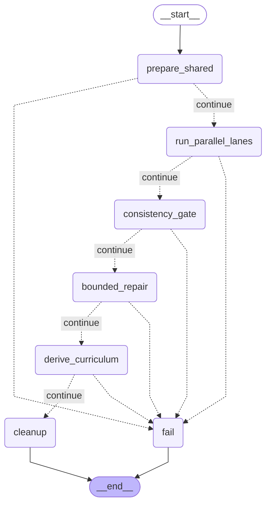

# Digest Unified Workflow

Shared prepare, docs lane, graph lane, consistency, repair, and curriculum.

```mermaid
---
config:
  flowchart:
    curve: linear
---
graph TD;
	__start__([<p>__start__</p>]):::first
	prepare_shared(prepare_shared)
	run_parallel_lanes(run_parallel_lanes)
	consistency_gate(consistency_gate)
	bounded_repair(bounded_repair)
	derive_curriculum(derive_curriculum)
	cleanup(cleanup)
	fail(fail)
	__end__([<p>__end__</p>]):::last
	__start__ --> prepare_shared;
	bounded_repair -. &nbsp;continue&nbsp; .-> derive_curriculum;
	bounded_repair -.-> fail;
	consistency_gate -. &nbsp;continue&nbsp; .-> bounded_repair;
	consistency_gate -.-> fail;
	derive_curriculum -. &nbsp;continue&nbsp; .-> cleanup;
	derive_curriculum -.-> fail;
	prepare_shared -.-> fail;
	prepare_shared -. &nbsp;continue&nbsp; .-> run_parallel_lanes;
	run_parallel_lanes -. &nbsp;continue&nbsp; .-> consistency_gate;
	run_parallel_lanes -.-> fail;
	cleanup --> __end__;
	fail --> __end__;
	classDef default fill:#f2f0ff,line-height:1.2
	classDef first fill-opacity:0
	classDef last fill:#bfb6fc
```
