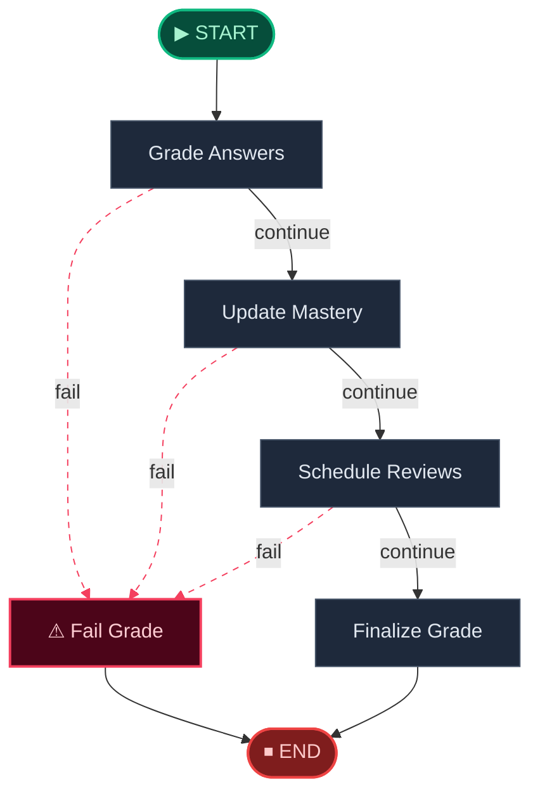
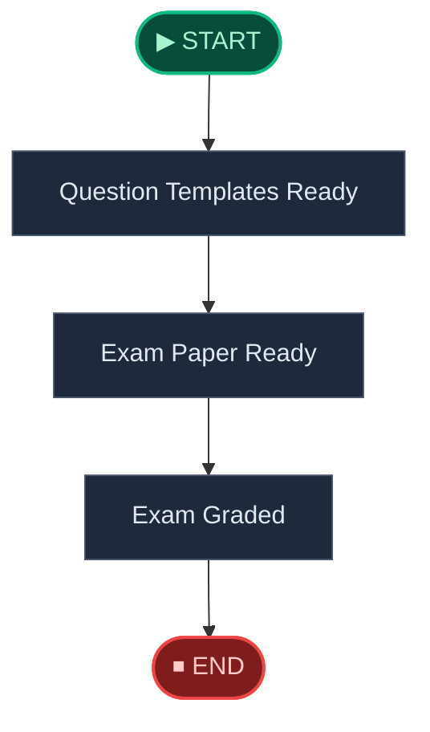
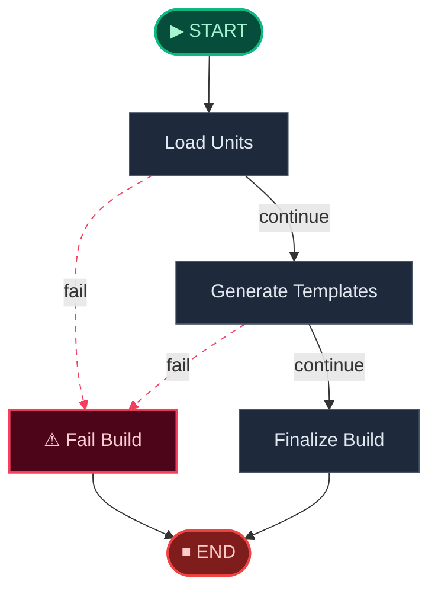

# 📝 Examine Engine · 诊断引擎

> 智能出卷 → AI 判卷 → 错因归类 → 掌握度更新 → 复习调度，形成完整的考试闭环。

**本模块包含以下子工作流：**

1. [Examine Exam Grade Workflow](#examine-exam-grade)
2. [Examine Workflow](#examine-flow)
3. [Examine Question Build Workflow](#examine-question-build)

---

## Examine Exam Grade Workflow

> Exam grading workflow including grading, mastery update, and review scheduling.



## Examine Workflow

> High-level examine workflow from question-template build to grading and review scheduling.



## Examine Question Build Workflow

> Question template build workflow driven by teaching-unit validation and template generation.



---

## 🧬 核心 Prompt 指纹

> 以下为本引擎在推理时注入大模型的核心提示词模板。点击展开查看完整内容。

<details>
<summary><b>Exam Generate</b> (<code>exam_generate</code>)</summary>

```
You are building a structured exam blueprint for the subject: {{ subject }}.
Return JSON only.

Requirements:
- Generate {{ num_questions }} questions.
- Allowed question types: {{ question_types }}.
- Allowed difficulty values: {{ difficulties }}.
- The paper should align with the requested knowledge points, weak points, and recent mistakes.
- Every question must be answerable from the provided teaching context.
- Keep wording clear, exam-like, and specific.

Requested knowledge points:
{{ requested_knowledge_points }}

Available knowledge points:
{{ available_knowledge_points }}

Weak knowledge points:
{{ weak_knowledge_points }}

Recent mistakes:
{{ recent_mistake_stems }}
```

</details>

<details>
<summary><b>Exam Generate From Text</b> (<code>exam_generate_from_text</code>)</summary>

```
You are generating high-quality exam questions from curated teaching context.
Return JSON only in the shape {"questions": [...]}.

Requirements:
- Generate exactly {{ num_questions }} questions.
- Allowed question types: {{ question_types }}.
- Allowed difficulty values: {{ difficulties }}.
- Use only the provided knowledge packet.
- Questions must feel like a real teacher-made paper, not flash cards.
- Prefer clear stems, unambiguous answers, and concise explanations.
- If the style profile mentions a sample paper, follow that tone and section style when reasonable.
- Each question item must include:
  - question_type
  - difficulty
  - stem
  - options (only for single_choice)
  - answer
  - explanation
  - knowledge_node_id (pick the best matching node when possible)

Knowledge packet:
{{ knowledge_packet }}
```

</details>

<details>
<summary><b>Short Answer Grade</b> (<code>short_answer_grade</code>)</summary>

```
Judge whether the user answer should receive full credit.
Return only `1` or `0`.

Rules:
- `1` means the answer is substantially correct.
- `0` means the answer misses a key idea, contains a wrong claim, or is too incomplete.
- Be strict but fair.
- Use the knowledge context if it is helpful.

Question:
{{ stem }}

Reference answer:
{{ answer }}

User answer:
{{ user_answer }}

Knowledge context:
{{ knowledge_context }}
```

</details>

<details>
<summary><b>Error Cause Label</b> (<code>error_cause_label</code>)</summary>

```
Pick the single best error cause label for the wrong answer.
Return only one of these labels:
concept_confusion
calculation_error
prerequisite_gap
careless_mistake
incomplete_understanding
method_misapplication
unknown

Question:
{{ stem }}

Reference answer:
{{ answer }}

User answer:
{{ user_answer }}

Knowledge context:
{{ knowledge_context }}
```

</details>

<details>
<summary><b>Mistake Analysis</b> (<code>mistake_analysis</code>)</summary>

```
Write a concise mistake analysis in under 120 Chinese characters.
Focus on why the answer is wrong and what to review next.

Question:
{{ stem }}

Reference answer:
{{ answer }}

User answer:
{{ user_answer }}

Knowledge point:
{{ knowledge_point }}
```

</details>
