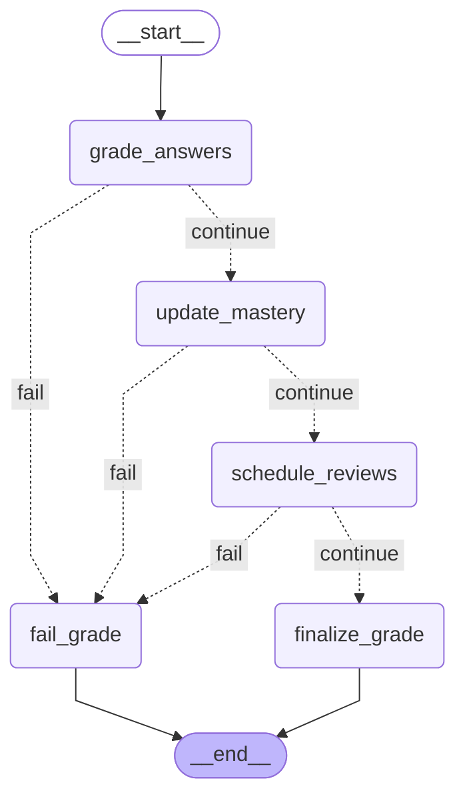

# Examine Exam Grade Workflow

Exam grading workflow including grading, mastery update, and review scheduling.

```mermaid
---
config:
  flowchart:
    curve: linear
---
graph TD;
	__start__([<p>__start__</p>]):::first
	grade_answers(grade_answers)
	update_mastery(update_mastery)
	schedule_reviews(schedule_reviews)
	finalize_grade(finalize_grade)
	fail_grade(fail_grade)
	__end__([<p>__end__</p>]):::last
	__start__ --> grade_answers;
	grade_answers -. &nbsp;fail&nbsp; .-> fail_grade;
	grade_answers -. &nbsp;continue&nbsp; .-> update_mastery;
	schedule_reviews -. &nbsp;fail&nbsp; .-> fail_grade;
	schedule_reviews -. &nbsp;continue&nbsp; .-> finalize_grade;
	update_mastery -. &nbsp;fail&nbsp; .-> fail_grade;
	update_mastery -. &nbsp;continue&nbsp; .-> schedule_reviews;
	fail_grade --> __end__;
	finalize_grade --> __end__;
	classDef default fill:#f2f0ff,line-height:1.2
	classDef first fill-opacity:0
	classDef last fill:#bfb6fc
```
