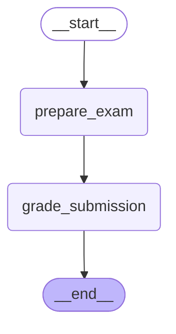

# Examine Workflow

Minimal exam generation and grading workflow.

```mermaid
---
config:
  flowchart:
    curve: linear
---
graph TD;
	__start__([<p>__start__</p>]):::first
	prepare_exam(prepare_exam)
	grade_submission(grade_submission)
	__end__([<p>__end__</p>]):::last
	__start__ --> prepare_exam;
	prepare_exam --> grade_submission;
	grade_submission --> __end__;
	classDef default fill:#f2f0ff,line-height:1.2
	classDef first fill-opacity:0
	classDef last fill:#bfb6fc
```
