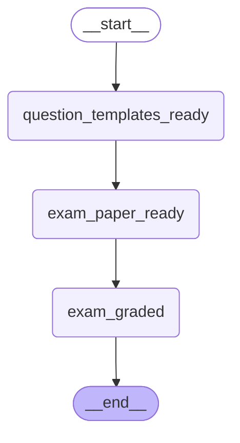

# Examine Workflow

High-level examine workflow from question-template build to grading and review scheduling.

```mermaid
---
config:
  flowchart:
    curve: linear
---
graph TD;
	__start__([<p>__start__</p>]):::first
	question_templates_ready(question_templates_ready)
	exam_paper_ready(exam_paper_ready)
	exam_graded(exam_graded)
	__end__([<p>__end__</p>]):::last
	__start__ --> question_templates_ready;
	exam_paper_ready --> exam_graded;
	question_templates_ready --> exam_paper_ready;
	exam_graded --> __end__;
	classDef default fill:#f2f0ff,line-height:1.2
	classDef first fill-opacity:0
	classDef last fill:#bfb6fc
```
