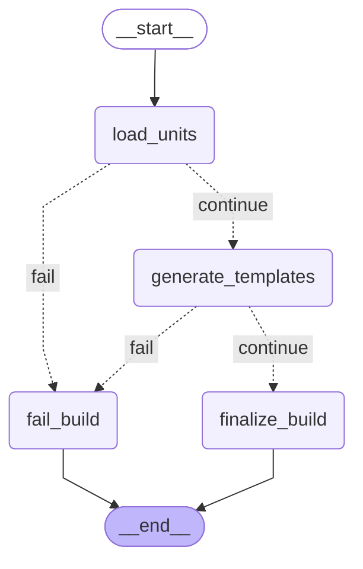

# Examine Question Build Workflow

Question template build workflow driven by teaching-unit validation and template generation.

```mermaid
---
config:
  flowchart:
    curve: linear
---
graph TD;
	__start__([<p>__start__</p>]):::first
	load_units(load_units)
	generate_templates(generate_templates)
	finalize_build(finalize_build)
	fail_build(fail_build)
	__end__([<p>__end__</p>]):::last
	__start__ --> load_units;
	generate_templates -. &nbsp;fail&nbsp; .-> fail_build;
	generate_templates -. &nbsp;continue&nbsp; .-> finalize_build;
	load_units -. &nbsp;fail&nbsp; .-> fail_build;
	load_units -. &nbsp;continue&nbsp; .-> generate_templates;
	fail_build --> __end__;
	finalize_build --> __end__;
	classDef default fill:#f2f0ff,line-height:1.2
	classDef first fill-opacity:0
	classDef last fill:#bfb6fc
```
