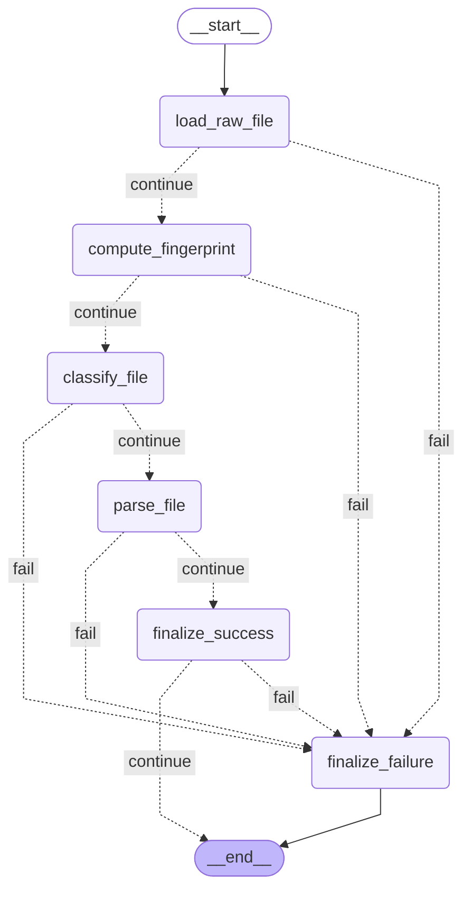

# Ingest File Parse Workflow

Single-file ingest parsing workflow.

```mermaid
---
config:
  flowchart:
    curve: linear
---
graph TD;
	__start__([<p>__start__</p>]):::first
	load_raw_file(load_raw_file)
	compute_fingerprint(compute_fingerprint)
	classify_file(classify_file)
	parse_file(parse_file)
	finalize_success(finalize_success)
	finalize_failure(finalize_failure)
	__end__([<p>__end__</p>]):::last
	__start__ --> load_raw_file;
	classify_file -. &nbsp;fail&nbsp; .-> finalize_failure;
	classify_file -. &nbsp;continue&nbsp; .-> parse_file;
	compute_fingerprint -. &nbsp;continue&nbsp; .-> classify_file;
	compute_fingerprint -. &nbsp;fail&nbsp; .-> finalize_failure;
	finalize_success -. &nbsp;continue&nbsp; .-> __end__;
	finalize_success -. &nbsp;fail&nbsp; .-> finalize_failure;
	load_raw_file -. &nbsp;continue&nbsp; .-> compute_fingerprint;
	load_raw_file -. &nbsp;fail&nbsp; .-> finalize_failure;
	parse_file -. &nbsp;fail&nbsp; .-> finalize_failure;
	parse_file -. &nbsp;continue&nbsp; .-> finalize_success;
	finalize_failure --> __end__;
	classDef default fill:#f2f0ff,line-height:1.2
	classDef first fill-opacity:0
	classDef last fill:#bfb6fc
```
