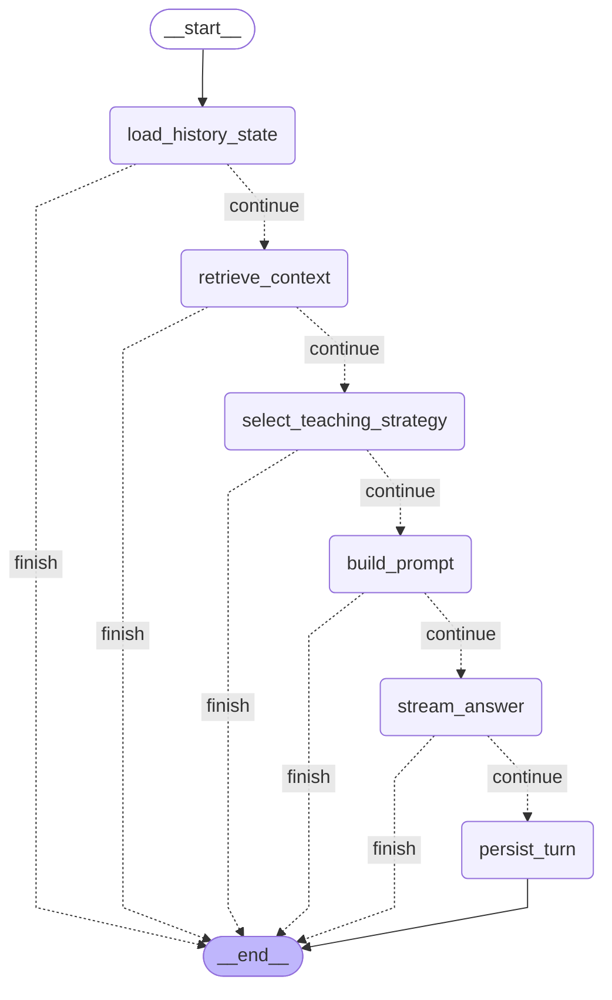

# Interact Workflow

Teaching chat workflow with history loading, retrieval, strategy selection, prompt assembly, streaming, and persistence.

```mermaid
---
config:
  flowchart:
    curve: linear
---
graph TD;
	__start__([<p>__start__</p>]):::first
	load_history_state(load_history_state)
	retrieve_context(retrieve_context)
	select_teaching_strategy(select_teaching_strategy)
	build_prompt(build_prompt)
	stream_answer(stream_answer)
	persist_turn(persist_turn)
	__end__([<p>__end__</p>]):::last
	__start__ --> load_history_state;
	build_prompt -. &nbsp;finish&nbsp; .-> __end__;
	build_prompt -. &nbsp;continue&nbsp; .-> stream_answer;
	load_history_state -. &nbsp;finish&nbsp; .-> __end__;
	load_history_state -. &nbsp;continue&nbsp; .-> retrieve_context;
	retrieve_context -. &nbsp;finish&nbsp; .-> __end__;
	retrieve_context -. &nbsp;continue&nbsp; .-> select_teaching_strategy;
	select_teaching_strategy -. &nbsp;finish&nbsp; .-> __end__;
	select_teaching_strategy -. &nbsp;continue&nbsp; .-> build_prompt;
	stream_answer -. &nbsp;finish&nbsp; .-> __end__;
	stream_answer -. &nbsp;continue&nbsp; .-> persist_turn;
	persist_turn --> __end__;
	classDef default fill:#f2f0ff,line-height:1.2
	classDef first fill-opacity:0
	classDef last fill:#bfb6fc
```
