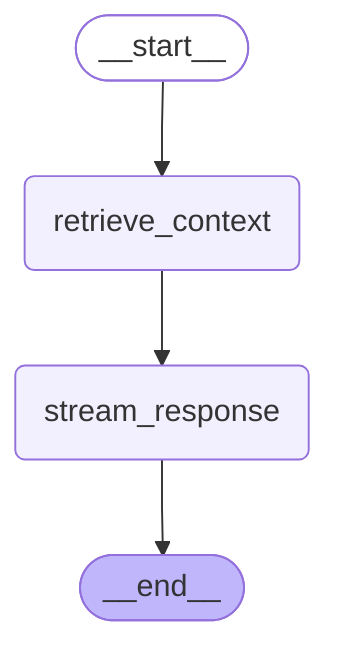

# Interact Workflow

Minimal retrieval and response workflow.

```mermaid
---
config:
  flowchart:
    curve: linear
---
graph TD;
	__start__([<p>__start__</p>]):::first
	retrieve_context(retrieve_context)
	stream_response(stream_response)
	__end__([<p>__end__</p>]):::last
	__start__ --> retrieve_context;
	retrieve_context --> stream_response;
	stream_response --> __end__;
	classDef default fill:#f2f0ff,line-height:1.2
	classDef first fill-opacity:0
	classDef last fill:#bfb6fc
```
