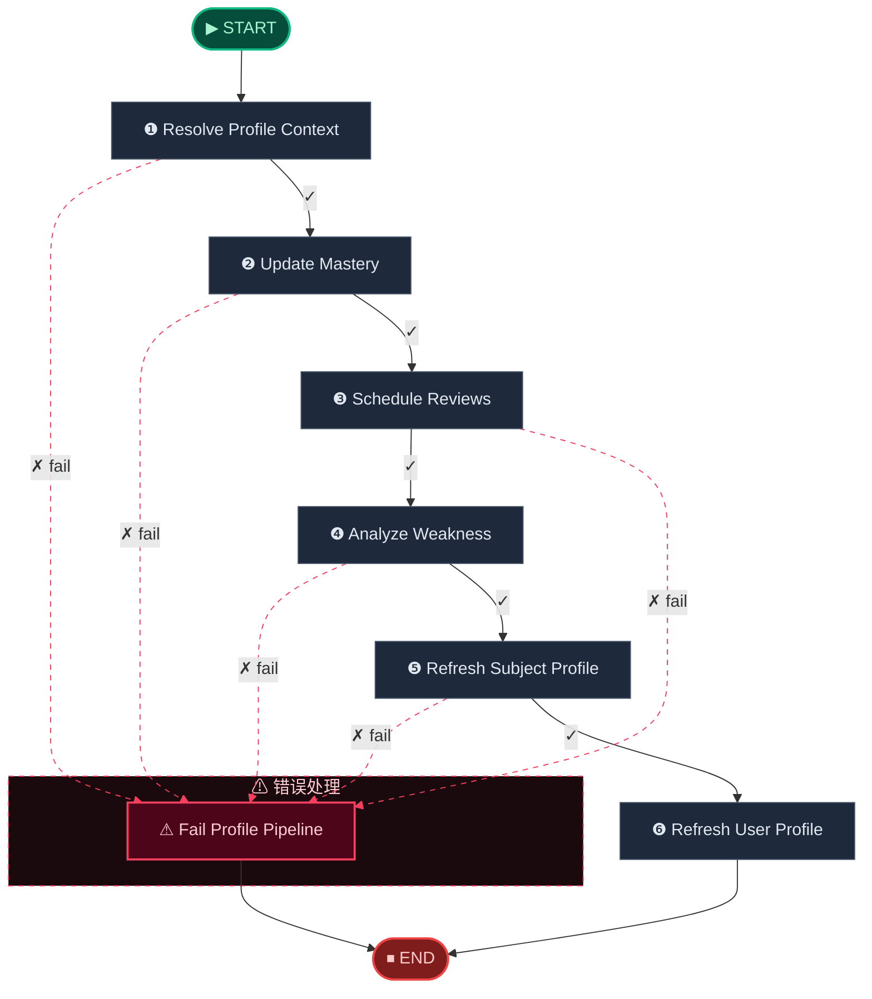
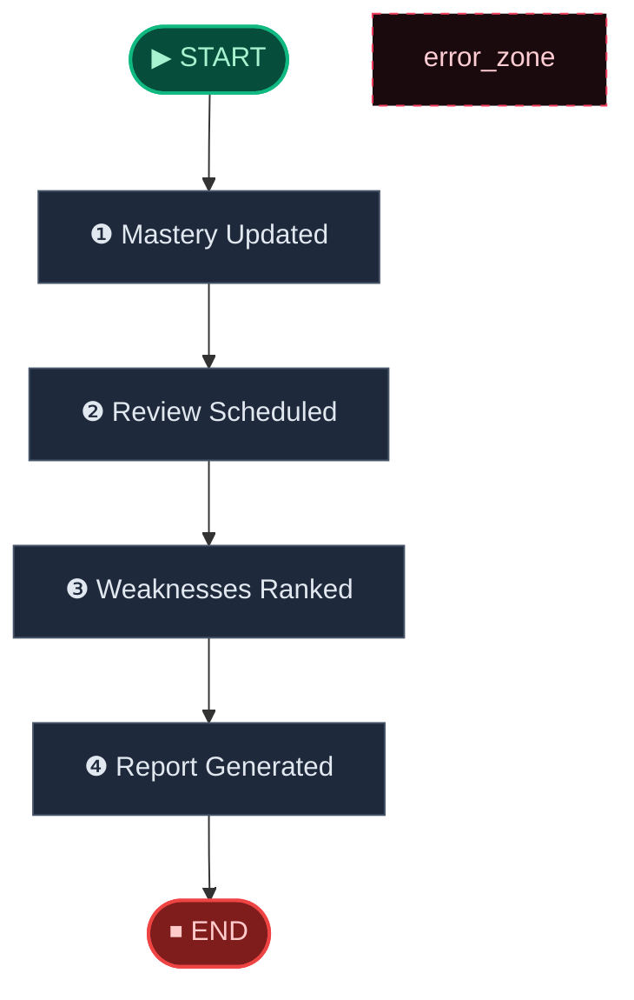

# 📊 Profile Engine · 显影引擎

> 掌握度计算 → 遗忘曲线复习排期 → 弱势排行 → 学习报告生成，驱动用户能力雷达图。

**本模块包含以下子工作流：**

1. [Profile Pipeline Workflow](#profile-pipeline)
2. [Profile Workflow](#profile-flow)

---

## Profile Pipeline Workflow

> Executable profile pipeline from mastery updates to review scheduling, weakness analysis, and profile refresh.

📊 **7** 个处理节点 · **13** 条边



**节点参考：**

| 节点 | 角色 | 路由 |
|------|------|------|
| Resolve Profile Context | 🔀 条件路由 | `fail` -> Fail Profile Pipeline / `continue` -> Update Mastery |
| Update Mastery | 🔀 条件路由 | `fail` -> Fail Profile Pipeline / `continue` -> Schedule Reviews |
| Schedule Reviews | 🔀 条件路由 | `continue` -> Analyze Weakness / `fail` -> Fail Profile Pipeline |
| Analyze Weakness | 🔀 条件路由 | `fail` -> Fail Profile Pipeline / `continue` -> Refresh Subject Profile |
| Refresh Subject Profile | 🔀 条件路由 | `fail` -> Fail Profile Pipeline / `continue` -> Refresh User Profile |
| Refresh User Profile | ⚙ 处理节点 | → END |
| Fail Profile Pipeline | ❌ 错误处理 | → END |

## Profile Workflow

> High-level profile workflow from mastery updates to review scheduling, weakness ranking, and report suggestions.

📊 **4** 个处理节点 · **5** 条边



**节点参考：**

| 节点 | 角色 | 路由 |
|------|------|------|
| Mastery Updated | ⚙ 处理节点 | → Review Scheduled |
| Review Scheduled | ⚙ 处理节点 | → Weaknesses Ranked |
| Weaknesses Ranked | ⚙ 处理节点 | → Report Generated |
| Report Generated | ⚙ 处理节点 | → END |

---

## 🧬 核心 Prompt 指纹

> 本引擎共使用 **1** 个核心提示词模板。点击展开查看完整内容。

<details>
<summary><b>Report Suggestions</b> (<code>report_suggestions</code>)</summary>

```
请根据下面的学习情况，给出 3 到 5 条简洁、可执行的复习建议。
要求：
1. 每条建议一行
2. 不要编号
3. 不要空话，要能直接执行

学科：
{{ subject }}

整体掌握度：
{{ overall_mastery }}

薄弱知识点：
{{ weak_points }}
```

</details>
