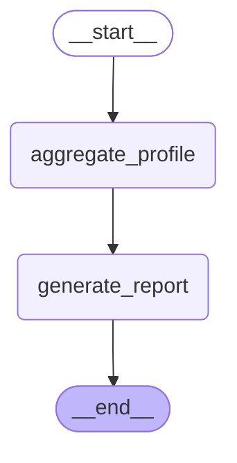

# Profile Workflow

Minimal profile aggregation and report workflow.

```mermaid
---
config:
  flowchart:
    curve: linear
---
graph TD;
	__start__([<p>__start__</p>]):::first
	aggregate_profile(aggregate_profile)
	generate_report(generate_report)
	__end__([<p>__end__</p>]):::last
	__start__ --> aggregate_profile;
	aggregate_profile --> generate_report;
	generate_report --> __end__;
	classDef default fill:#f2f0ff,line-height:1.2
	classDef first fill-opacity:0
	classDef last fill:#bfb6fc
```
