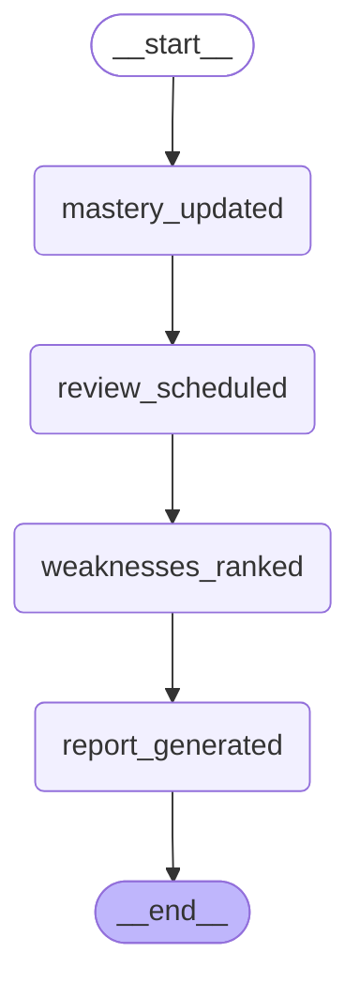

# Profile Workflow

High-level profile workflow from mastery updates to review scheduling, weakness ranking, and report suggestions.

```mermaid
---
config:
  flowchart:
    curve: linear
---
graph TD;
	__start__([<p>__start__</p>]):::first
	mastery_updated(mastery_updated)
	review_scheduled(review_scheduled)
	weaknesses_ranked(weaknesses_ranked)
	report_generated(report_generated)
	__end__([<p>__end__</p>]):::last
	__start__ --> mastery_updated;
	mastery_updated --> review_scheduled;
	review_scheduled --> weaknesses_ranked;
	weaknesses_ranked --> report_generated;
	report_generated --> __end__;
	classDef default fill:#f2f0ff,line-height:1.2
	classDef first fill-opacity:0
	classDef last fill:#bfb6fc
```
