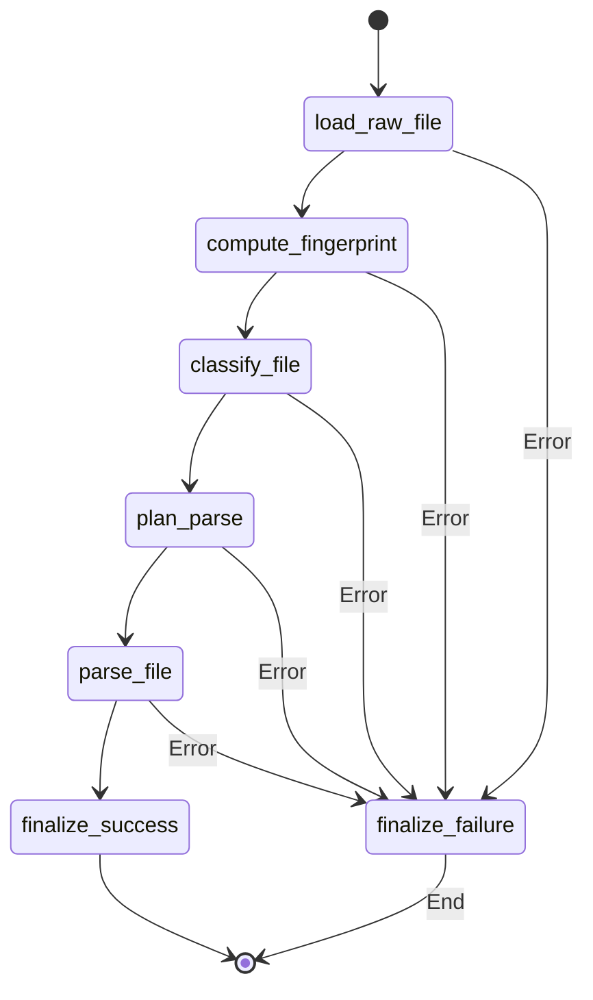
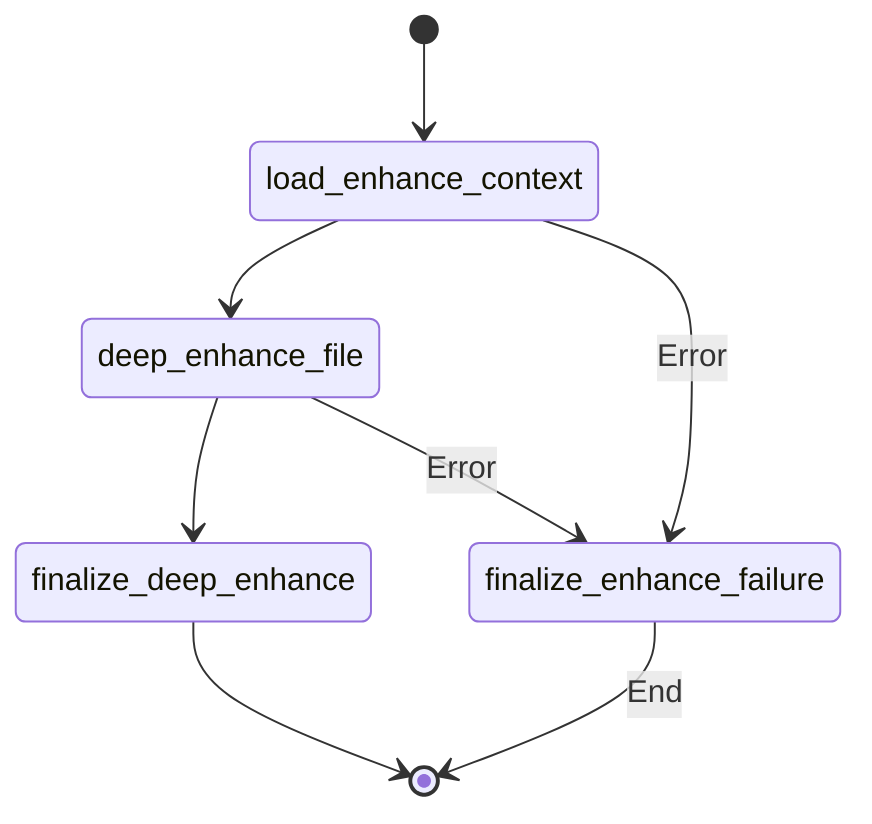

# 04. Ingest 引擎 (透视引擎)

## 1. 引擎定位

Ingest 引擎（透视引擎）负责把各种格式的原始资料（PDF, Word, PPT, 图片等）转换成系统可读取的稳定“材料层”（标准化 Markdown 和抽取出的资产文件）。

它是 AITeachMe 数据喂养的**第一关**，解决的痛点是文档格式杂乱、排版噪音大导致的后续处理瘫痪。

本引擎采用 **两阶段（Two-Phase）架构**，以平衡响应速度与解析质量：
- **Phase 1: Fast Parse (快速解析)** - 纯程序策略，不调用大语言模型（LLM），通过传统多模态解析器极速完成格式转换，目标是让用户前端能立刻“预览”。
- **Phase 2: Deep Enhance (深度增强)** - 运行于后台，调度视觉 LLM 获取高精度的数学公式或手写笔记等内容转换，覆写并补强 Phase 1 阶段的产出。

---

## 2. 状态机范式 (State Definition)

Ingest 引擎基于底层的两阶段拆分，定义了两个串行的 `TypedDict`，明确约束了流转于图节点间的数据：

### Phase 1 状态：`IngestParseState`
这是前端可感知的急速转换流程。

```python
class IngestParseState(TypedDict, total=False):
    subject: str                  # 学科或资源库归属
    file_id: int                  # 数据库中的 raw_file 的 ID
    filename: str                 # 原始文件名
    filetype: str                 # 文件类型拓展名，如 pdf / docx / pptx
    file_path: str                # 落盘在本地 / 云端存储的路径
    markdown_path: str            # Phase 1 产出的初步 Markdown 路径
    asset_dir: str                # 提取图片等子资产的目录
    asset_name_prefix: str        # 资产命名统一前缀
    content_hash: str | None      # 文件摘要 Hash
    file_size_bytes: int | None   # 文件大小
    classification: ClassificationResult | None  # 解析分类器结果（区分纯文本/图文/二进制）
    parse_plan: ParsePlan | None  # 匹配出的最佳解析管线计划
    parsed_markdown: str | None   # 挂载在内存的解析出 Markdown 文本
    parser_used: str | None       # 使用了哪个解析工具（如 pymupdf_native / pdfplumber 等）
    attempted_parsers: list[str]  # 记录尝试降级处理的解析器清单
    parser_elapsed_s: dict[str, float] # 解析器耗时跟踪
    error: str | None             # 错误抛出位
```

### Phase 2 状态：`IngestEnhanceState`
用于后台 OCR 补偿的调度状态。

```python
class IngestEnhanceState(TypedDict, total=False):
    subject: str
    file_id: int
    file_path: str
    filetype: str
    markdown_path: str
    asset_dir: str
    asset_name_prefix: str
    parse_plan: ParsePlan | None
    asset_ocr_images: int            # 提取到的待 OCR 图片数量
    asset_ocr_replacements: int      # 成功通过视觉模型替换进 MD 的段落数
    enhanced_markdown: str | None    # 强化后的完整被修正 Markdown 文本
    error: str | None
```

---

## 3. 管线架构图 (Pipeline Architecture)

以下为 LangGraph 的运行时子图。首先进入 Fast Parse，一旦成功则异步进入 Deep Enhance 背景流。

### Phase 1: Fast Parse 知识初步萃取流



### Phase 2: Deep Enhance 深度视觉补强流 (Background)



---

## 4. 核心处理节点解析

### 4.1 `Fast Parse` 核心节点说明

- **`compute_fingerprint`**：计算文件的 hash 值用来避免重复解析或者为以后的缓存设计留好扩展口。
- **`classify_file`**：将输入的文件类型与内部解析策略进行分类判定（例如判断是 Text-like, 还是需要复杂 OCR 兜底的 Image, 或者是 PDF）。
- **`plan_parse`**：排布解析器（Parser）链表。AITeachMe 在这里做了容错降级机制（Fallback Design）。如果 `pymupdf4llm` 失效或者内存不足，会自动顺延给 `pdfplumber` 获取保守解析。
- **`parse_file`**：真正开始抽取，会把抽取到的图片通过 base64 或原图直接存储到 `asset_dir`，同名引用落盘到 MD。
- **`finalize_success`**：完成文件系统持久化，将数据库中的 `digest_current_step` 标记为 `ingest.parse.queued` 供主节点分发，进而异步调度 Phase 2 增强。

### 4.2 `Deep Enhance` 核心节点说明

- **`deep_enhance_file`**：由于在 Phase 1 已经抽取出了一堆在文中以 `` 作为预留位的插图或长公式截图，此节点直接启动并行的 Vision LLM (视觉模型)，将其翻译为可编译的 Markdown 和 LaTeX 语法。
- **`finalize_deep_enhance`**：如果增强成功，用模型生成的文字覆盖原 MD，并将状态变为 `ready_for_digest` 让 `Digest` 引擎接管；如果抛出 `Error`，也不影响原始物料的可用性，它只是标为 `enhance_failed` 但仍提供降级态服务。

---

## 5. AI 提示词指纹 (Prompt Templates Showcase)

Phase 2 (Deep Enhance) 用来驱动视觉大模型进行 OCR 解析的基座提示词。该 Prompt 极度强调版式、LaTeX 公式的还原。

```text
你是专业的 OCR + 文档理解引擎，请将输入图片精确转换为高质量 Markdown。

核心要求：
1. **文本提取**：忠实提取所有可见文字，严格保持原文阅读顺序和排版结构
2. **结构保留**：完整还原标题层级、段落、列表、表格、引用、代码块等结构
3. **数学公式**：
   - 行内公式用 $...$ 包裹
   - 独立公式用 $$...$$ 包裹
   - 优先输出规范 LaTeX 语法（如 \frac、\sum、\int、\sqrt 等）
   - 保留所有数学符号、上下标、分式结构
4. **图表处理**：
   - 描述图表类型（柱状图、折线图、几何图形等）
   - 提取坐标轴标签、图例、关键数据点
   - 说明图表要表达的核心信息
5. **质量保证**：
   - 绝对禁止臆造或补充原图中不存在的内容
   - 对模糊不清或无法识别的内容，用 [unclear] 标注
   - 保持专业性，不添加任何主观评论或寒暄

输出格式：
- 直接输出 Markdown 内容
- 不要添加"以下是转换结果"等引导语
- 不要添加任何解释性文字
```

---

## 6. 事件与周边交互 (Events)

- **输入来源**：`app/services/file_service.py` 完成物理上传收拢后，通过事件调起 `build_fast_parse_graph` 的执行。
- **契约产物**：
  - Ingest 完成后，向系统中丢下一个持久化文件： `raw_markdowns/<file_id>.md`
  - 产出关联资源目录：`assets/<file_id>/`
  - 并且 `raw_file.ingest_status` 推进为 `fast_parsed` 或 `ready_for_digest`。
- 这是与下游 `Digest (织网引擎)` 进行对接的唯一核心标准接口。

---

## 7. 优化空间探讨 (Ideas for Optimization)

1. **更复杂的版面分析 (Layout Analysis)**：现有的文档提取，一旦遭遇双栏/三栏 PDF 文件，可能会出现段落和句子撕裂问题。也许能在 `classify_file` 时就尝试集成轻量级版面感知工具（如 DocStruct、Nougat 的预判）。
2. **多模态交错重组优化**：目前我们在 `parse_file` (Phase 1) 抽取了占位符供 Phase 2 填位。如果部分文档图片过于破碎（如全是单独一行字），会导致 Phase 2 发起大量并发的小图 OCR 请求，损耗严重。需要增加“小图片相邻合并为整张图 OCR” 的批处理节点策略。
3. **并发限流策略**：需要为 Phase 2 并行调视觉大模型赋予 Rate Limit 拦截节点，避免文档页数庞大时触发底层调用的 QPS 限制失败并连锁雪崩。
