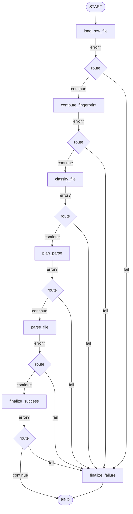
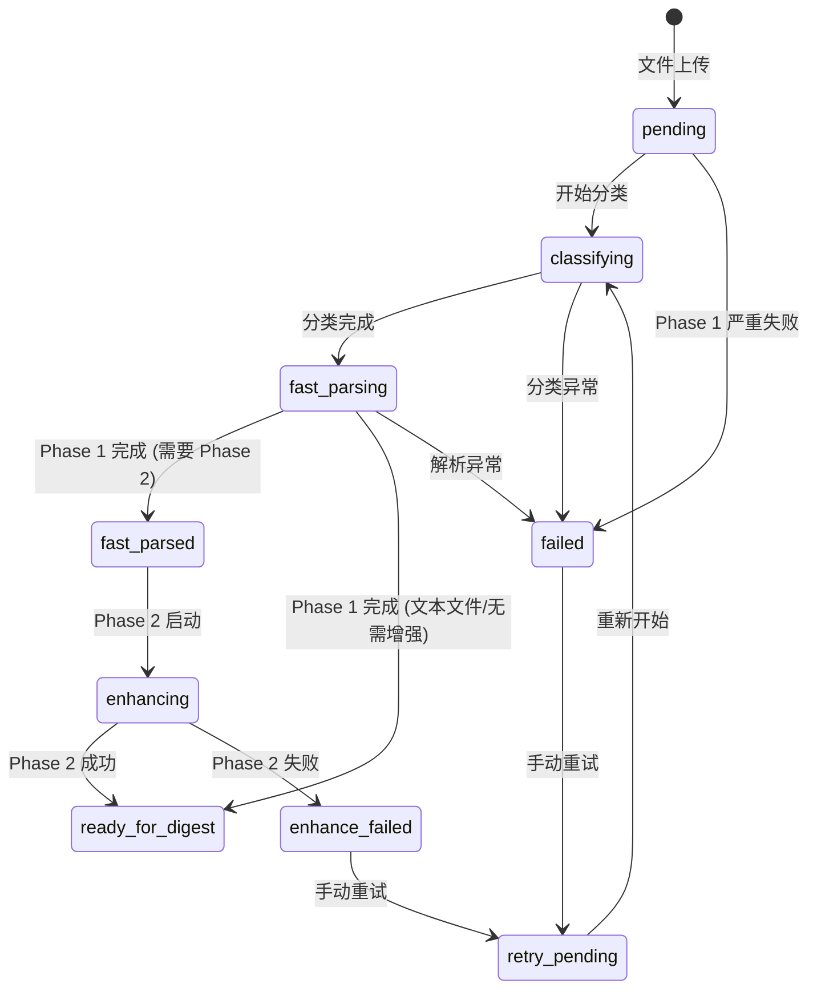

# 04. Ingest 引擎 — 透视引擎技术文档

> **最后更新**: 2026-04-16 · 基于 `backend/app/workflows/ingest/` 代码实现

---

## 1. 引擎定位与职责

Ingest（透视引擎）是 AITeachMe 数据流的**入口**，负责把用户上传的原始文件（PDF、DOCX、PPTX、图片、音频、文本等）转换成下游 Digest 引擎可以消费的**标准化 Markdown + 资产文件**。

**Ingest 只做三件事：**
1. 原始文件落盘、分类、制定解析策略
2. 用传统解析器快速产出可预览 Markdown（Phase 1）
3. 后台用 LLM Vision OCR 补强材料质量（Phase 2）

**Ingest 不做：**
- ❌ 不构建知识图谱
- ❌ 不生成课程结构
- ❌ 不调用 LLM 做文本理解（Phase 1 中完全不涉及 LLM）

---

## 2. 代码落点速查

| 层 | 模块路径 | 职责 |
|---|---|---|
| 前端页面 | `frontend/src/pages/FilesPage.tsx` | 文件上传、预览、状态展示 |
| API | `backend/app/api/files.py` | 上传接口、状态查询 |
| Support Files | `backend/app/workflows/support/files/uploads.py` / `catalog.py` / `parsing.py` / `deletion.py` | 上传编排、后台任务派发、列表与删除 |
| Workflow Graph | `backend/app/workflows/ingest/fast_parse/graph.py` | LangGraph dev/export 图定义 |
| Workflow Runtime | `backend/app/workflows/ingest/fast_parse/lib/runtime.py` / `fast_parse/lib/enhance.py` | 两阶段真实运行入口 |
| Workflow State | `backend/app/workflows/ingest/fast_parse/state.py` | Fast Parse 图状态类型 |
| Fast Parse 节点 | `backend/app/workflows/ingest/fast_parse/nodes/` | Phase 1 LangGraph 节点 |
| Fast Parse Helper | `backend/app/workflows/ingest/fast_parse/lib/` | Phase 1 节点内部实现 |
| 后台增强 | `backend/app/workflows/ingest/fast_parse/lib/enhance.py` | Phase 2 后台增强 worker |
| 解析分类器 | `backend/app/workflows/ingest/common/parsing/classifier.py` | 文件分类 |
| 解析策略 | `backend/app/workflows/ingest/common/parsing/strategy.py` | 解析计划生成 |
| 解析编排器 | `backend/app/workflows/ingest/common/parsing/orchestrator.py` | Phase 1 / Phase 2 路由 |
| 传统解析器 | `backend/app/workflows/ingest/common/parsing/pdf.py` 等 | 各格式解析实现 |
| Markdown 规范化 | `backend/app/workflows/ingest/common/parsing/canonicalizer.py` | 图片引用重写、嵌入图提取 |
| OCR 增强 | `backend/app/workflows/ingest/common/parsing/asset_ocr.py` | LLM Vision OCR |
| Prompt 模板 | `backend/app/workflows/ingest/common/parsing/prompts.py` | OCR prompt 中/英文版 |
| 主要业务表 | `raw_file` + `raw_file_asset` | 文件元数据与资产记录 |

---

## 3. 端到端主链路概览

用户上传一个文件后，完整的处理链路如下：

```
用户上传文件
    │
    ▼
┌─────────────────────────────────┐
│  Phase 0: 上传与排队             │  workflows/support/files
│  - 写原始文件到 ContentStore     │
│  - 创建 raw_file 记录           │
│  - 置 ingest_status = pending   │
│  - 触发后台解析任务              │
└────────────┬────────────────────┘
             │
             ▼
┌─────────────────────────────────┐
│  Phase 1: Fast Parse（同步）     │  runtime.py → orchestrator.py
│  - 文本快速通道 OR 常规通道       │
│  - 分类 → 策略 → 传统解析        │
│  - 产出可预览 Markdown           │
│  - 置 ingest_status = fast_parsed│
│  ← 前端立即可预览材料 ──────────│
└────────────┬────────────────────┘
             │ (如果 needs_enhance = true)
             ▼
┌─────────────────────────────────┐
│  Phase 2: 后台增强               │  enhance.py → orchestrator.py
│  - pymupdf4llm 质量重解析        │
│  - LLM Vision OCR 图片识别       │
│  - 覆盖同一份 Markdown           │
│  - 置 ingest_status =            │
│    ready_for_digest              │
└─────────────────────────────────┘
```

---

## 4. LangGraph 图定义

> 文件: `backend/app/workflows/ingest/fast_parse/graph.py`

Ingest 当前只保留**一张 LangGraph 图**，对应 Phase 1 Fast Parse。Phase 2 后台增强不是独立 workflow lane，而是 Fast Parse 完成后派发的后台补强任务。

### 4.1 Phase 1: Fast Parse Graph



**节点清单：**

| 节点 | 构建函数 | 源文件 |
|---|---|---|
| `load_raw_file` | `build_load_raw_file_node()` | `nodes/file.py` |
| `compute_fingerprint` | `build_compute_fingerprint_node()` | `nodes/file.py` |
| `classify_file` | `build_classify_file_node()` | `nodes/file.py` |
| `plan_parse` | `build_plan_parse_node()` | `nodes/file.py` |
| `parse_file` | `build_parse_file_node()` | `nodes/parse.py` |
| `finalize_success` | `build_finalize_success_node()` | `nodes/finalize.py` |
| `finalize_failure` | `build_finalize_failure_node()` | `nodes/finalize.py` |

**路由逻辑：** 每个节点执行后检查 `state["error"]`：
- `None` → `"continue"` 进入下一节点
- 非空 → `"fail"` 跳转到 `finalize_failure`

### 4.2 Phase 2: 后台增强说明

Phase 2 的真实入口是 `fast_parse/lib/enhance.py::_run_deep_enhance_background()`。它负责：

- 读取 Phase 1 Markdown 和 assets。
- 对 PDF 做 best-effort 质量重解析。
- 在配置 OCR 模型时做 Vision OCR 增强。
- 回写 Markdown、assets、`parse_metadata_json` 和 `ingest_status`。

它不再维护独立 LangGraph 图，避免和真实后台实现形成两套主线。

### 4.3 实际运行方式说明

> **重要**：当前实际运行入口 `fast_parse/lib/runtime.py` 中的 `run_parse_file_workflow()` 并没有通过 `graph.compile().ainvoke()` 来执行 Fast Parse 图，而是**直接在 runtime 函数中内联执行每一步**。`graph.py` 中的图定义主要用于：
> - 导出可视化流程图
> - 保持与 LangGraph 骨架约定的一致性
> - 为未来迁移到 LangGraph 运行时做准备

---

## 5. State 类型定义

> 文件: `backend/app/workflows/ingest/fast_parse/state.py`

### 5.1 `IngestParseState` — Phase 1 状态

| 字段 | 类型 | 说明 |
|---|---|---|
| `subject` | `str` | 学科 slug |
| `file_id` | `int` | raw_file 主键 |
| `filename` | `str` | 原始文件名 |
| `filetype` | `str` | 文件扩展名 |
| `file_path` | `str` | 原始文件物理路径 |
| `markdown_path` | `str` | 输出 Markdown 路径 |
| `asset_dir` | `str` | 资产目录路径 |
| `asset_name_prefix` | `str` | 资产文件名前缀 |
| `content_hash` | `str \| None` | 文件内容指纹 (SHA256) |
| `file_size_bytes` | `int \| None` | 文件大小 |
| `classification` | `ClassificationResult \| None` | 分类结果 |
| `classification_payload` | `str \| None` | 分类结果 JSON 序列化 |
| `estimated_pages` | `int \| None` | 估计页数 |
| `detected_language` | `str \| None` | 检测语言 (`zh`/`en`/`mixed`) |
| `parse_plan` | `ParsePlan \| None` | 解析计划 |
| `parse_plan_payload` | `str \| None` | 解析计划 JSON |
| `parse_metadata` | `str \| None` | 解析元数据 JSON |
| `parsed_markdown` | `str \| None` | 解析产出的 Markdown 正文 |
| `parser_used` | `str \| None` | 实际使用的解析器名称 |
| `attempted_parsers` | `list[str]` | 尝试过的解析器列表 |
| `parser_elapsed_s` | `dict[str, float]` | 各解析器耗时(秒) |
| `markdown_chars` | `int` | Markdown 字符数 |
| `image_count` | `int` | 提取的图片数量 |
| `rewritten_image_refs` | `int` | 重写的图片引用数 |
| `extracted_data_images` | `int` | 从 data URI 提取的图片数 |
| `appended_asset_images` | `int` | 追加到正文的资产图片数 |
| `error` | `str \| None` | 错误信息，非空则表示失败 |

### 5.2 Phase 2 状态

Phase 2 后台增强不维护独立 `State` 类型。它通过 DB 中的 `raw_file`、ContentStore 中的 Markdown/assets，以及 `parse_metadata_json` 恢复上下文并持久化结果。

---

## 6. 文件分类与解析策略

### 6.1 分类器 `classify_file()`

> 文件: `backend/app/workflows/ingest/common/parsing/classifier.py`

**输入：** `file_path: Path`, `filetype: str`
**输出：** `ClassificationResult`

分类器的目标是**零 LLM 调用、毫秒级**完成文件特征提取，为后续解析策略提供决策依据。

#### 分类路由矩阵

| 扩展名 | 分类方法 | 产出的 `file_category` |
|---|---|---|
| `.pdf` | 用 PyMuPDF 采样前 10 页分析文本密度、图像占比、公式密度 | `text_pdf` / `scanned_pdf` / `complex_pdf` / `formula_heavy_pdf` |
| `.pptx` / `.ppt` | 用 python-pptx 统计 slide 数和文本量 | `pptx` |
| `.docx` | 用 python-docx 统计段落/标题数，fallback 用 ZIP 解析 | `docx` |
| `.md` / `.txt` / `.py` 等 | 读取文本，统计行数/标题数/公式数 | `markdown` / `code` / `plain_text` / `structured_text` |
| `.jpg` / `.png` 等 | 直接标记 | `image` |
| `.xlsx` / `.csv` 等 | 直接标记 | `markitdown_generic` |
| 其它 | 尝试文本探测 | `unknown` |

#### `ClassificationResult` 完整字段

```python
class ClassificationResult(BaseModel):
    file_category: str         # 文件类别 (上表)
    text_density: float        # 平均每页字符数
    ocr_ratio: float           # 图像密集页占比
    image_page_ratio: float    # 图像密集页占比 (= ocr_ratio)
    heading_count: int         # 检测到的标题数
    estimated_pages: int       # 预估页数
    detected_language: str     # "zh" / "en" / "mixed" / "unknown"
    has_tables: bool           # 是否含表格
    has_formulas: bool         # 是否含数学公式
    recommended_parser: str    # 推荐解析器
    fallback_parsers: list[str]# 备选解析器链
```

#### PDF 分类决策树

```
采样前 10 页:
├── avg_density < 30 → scanned_pdf
│   推荐: pymupdf_native → markitdown → pymupdf4llm
├── formula_ratio > 0.5 且 avg_density < 300 → formula_heavy_pdf
│   推荐: pymupdf_native → pymupdf4llm → markitdown
├── image_ratio > 0.5 或 (drawing_ratio > 0.6 且 avg_density > 200) → complex_pdf
│   推荐: pymupdf4llm → pymupdf_native → markitdown
└── 其它 → text_pdf
    推荐: pymupdf4llm → markitdown → pymupdf_native
```

### 6.2 解析策略 `build_parse_plan()`

> 文件: `backend/app/workflows/ingest/common/parsing/strategy.py`

**输入：** `file_path`, `filetype`, `file_size_bytes`, `classification`
**输出：** `ParsePlan`

```python
class ParsePlan(BaseModel):
    mode: str                     # 解析模式 (下表)
    parser_chain: list[str]       # 有序解析器链
    decision_reason: str          # 策略选择原因 (人类可读)
    options: ParserRunOptions     # 运行时参数
```

#### 解析模式一览

| mode | 触发条件 | parser_chain | 特殊配置 |
|---|---|---|---|
| `native_text` / `native_markdown` / `native_structured_text` | 文本类文件 | `["text_native"]` | `asset_image_limit=0` |
| `vision_image` | 图片文件 ≤8MB | `["llm_vision"]` | 需 LLM API Key |
| `vision_large_image` | 图片文件 >8MB | `["llm_vision"]` | `timeout_s≥150` |
| `quality_pdf` | 普通文本 PDF | `["pymupdf_native", "pdfplumber", "pymupdf4llm", "markitdown"]` | `asset_vision_ocr_limit=8~16` |
| `balanced_medium_pdf` | 40~120 页 PDF | 同上 | `ocr_page_limit=10` |
| `fast_large_pdf` | >120 页或 >20MB | 同上 | `skip_image_supplement=True` |
| `fast_scanned_pdf` | 扫描件 PDF | 同上 | `enable_page_vision_ocr=True, ocr_page_limit=18` |
| `formula_heavy_pdf` | 数学试卷类 | 同上 | `asset_image_limit=32, asset_vision_ocr_limit=24` |
| `quality_complex_pdf` | 图文混排 PDF | 同上 | `asset_image_limit≥24, asset_vision_ocr_limit=16` |
| `balanced_docx` / `fast_docx` | DOCX 文件 | `["markitdown", "mammoth", "docx_native"]` | 大文件跳过二次图片扫描 |
| `balanced_pptx` / `fast_pptx` | PPTX 文件 | `["markitdown", "python_pptx_native"]` 或 `["python_pptx_native", "markitdown"]` | 大文件优先 native |
| `generic_markitdown` | xlsx/csv 等 | `["markitdown_generic"]` | — |

#### Phase 1 解析器优先顺序（关键设计决策）

对于 PDF，Phase 1 核心原则是**速度优先**：
```
Phase 1 链: pymupdf_native (最快, <1s) → pdfplumber (表格好) → pymupdf4llm → markitdown
Phase 2 补: pymupdf4llm 质量重解析 → LLM Vision OCR
```

解析器链按顺序尝试，第一个成功的解析器即为最终结果。如果当前解析器超时或报错，自动 fallback 到链中下一个。

---

## 7. 运行时执行详解（节点级）

> 文件: `backend/app/workflows/ingest/fast_parse/lib/runtime.py`

`run_parse_file_workflow()` 是 Ingest 的唯一入口。以下是**逐步骤**的详细执行流程：

### 7.1 文本快速通道 (Text Fast Path)

当文件扩展名匹配 `is_text_extension()` 时（`.md`, `.txt`, `.py`, `.json`, `.csv` 等），跳过分类/策略/解析的完整流程，直连快速通道：

```
输入: raw_file (扩展名属于文本类)
  │
  ├── 1. 读取原始文本 (UTF-8)
  ├── 2. 判断文本类别:
  │   ├── "markdown" → 原样保留
  │   ├── "structured_text" (代码/配置) → 包裹在 ```lang_hint\n...\n``` 代码块中
  │   └── 其它 → 原样保留
  ├── 3. 写入 ContentStore (raw_markdown_key)
  ├── 4. 更新 raw_file:
  │   ├── parsed_markdown = <content>
  │   ├── parser_used = "text_native"
  │   ├── status = COMPLETED
  │   ├── ingest_status = READY_FOR_DIGEST  ← 直接就绪，不进 Phase 2
  │   └── digest_current_step = "ingest.fast_path.completed"
  └── 5. 返回 ok_result
```

> **关键特征**：文本快速通道完全不会进入 Phase 2 Deep Enhance。

### 7.2 常规通道（PDF/DOCX/PPTX/Image）

当文件不属于文本类时，走完整的分类 → 策略 → 解析流程：

#### Step 1: 文件物化

```
输入: raw_file 记录
操作:
  1. 从 ContentStore 物化文件到本地临时目录 _temp_base
  2. 检查文件是否存在，不存在则标记 FAILED 并返回
  3. 清除可能残留的 parse_error_message
输出: file_path (本地临时路径)
```

#### Step 2: 分类 `classify_file()`

```
输入: file_path, file_ext
操作:
  1. 在线程池中运行 classify_file() (asyncio.to_thread)
  2. PDF: 用 PyMuPDF 打开，采样前 10 页:
     - 统计每页字符数 → text_density
     - 统计含大图但少字的页数 → image_page_ratio
     - 统计 drawing 聚类数 → drawing_ratio
     - 统计公式密集页 → formula_ratio
     - 检测语言 (中文字符 vs 英文字符比例)
     - 检测表格/公式特征
  3. DOCX: 用 python-docx 扫描段落/标题
  4. PPTX: 用 python-pptx 统计 slide 文本量
输出: ClassificationResult
写 DB:
  - raw_file.classification_json = 分类结果 JSON
  - raw_file.detected_language
  - raw_file.estimated_pages
  - raw_file.ingest_status = FAST_PARSING
  - raw_file.digest_current_step = "ingest.fast_parse.running"
```

#### Step 3: 构建解析计划 `build_parse_plan()`

```
输入: file_path, filetype, file_size_bytes, classification
操作:
  1. 确定可用解析器 (检查库是否安装)
  2. 按文件特征选择 parser_chain 顺序
  3. 决定解析模式 (mode) 和运行时参数:
     - timeout_s
     - asset_image_limit
     - enable_asset_vision_ocr
     - skip_image_supplement
     - parser_parallelism (基于文件大小和页数动态调整，范围 5~10)
     - ocr_language_mode (跟随 detected_language)
输出: ParsePlan { mode, parser_chain, decision_reason, options }
```

#### Step 4: Phase 1 执行 `fast_parse_file()`

```
输入: file_path, asset_dir, classification, parse_plan
操作:
  对 parser_chain 中的解析器逐一尝试:
    ┌─ 调用解析器 (有超时保护)
    │  例: pymupdf_native(pdf_path, asset_dir, options)
    │  → 产出 raw_markdown 字符串 + 提取的图片写入 asset_dir
    ├─ 成功则进入 canonicalize_markdown():
    │  1. 扫描 Markdown 中的图片引用
    │  2. 将绝对路径/data URI 重写为相对路径 (../assets/<file_id>/...)
    │  3. 提取 base64 data URI 嵌入图片为独立文件
    │  4. 统计 rewritten_image_refs / extracted_data_images
    │  5. 如果未设置 skip_image_supplement，追加 asset_dir 中未被引用的图片
    ├─ 超时/报错则 fallback 到链中下一个解析器
    └─ 全部失败则抛出异常

输出: FastParseResult {
  markdown,           # 规范化后的 Markdown
  parser_used,        # 最终使用的解析器名
  attempted_parsers,  # 所有尝试过的解析器
  parser_elapsed_s,   # 各解析器耗时
  needs_enhance,      # 是否需要 Phase 2
  rewritten_image_refs,
  extracted_data_images,
  appended_asset_images,
}
```

**`needs_enhance` 的判定逻辑**：
```python
needs_enhance = (
    plan.options.enable_asset_vision_ocr  # 策略层允许 OCR
    and not is_text_extension(extension)   # 不是文本文件
    and image_count > 0                    # 有提取出的图片
)
```

#### Step 5: Phase 1 结果持久化

```
操作:
  1. 将 Markdown 写入 ContentStore (raw_markdown_key)
  2. 将 asset_dir 整体上传到 ContentStore
  3. 构建 asset_rows (RawFileAsset 记录)
  4. 计算 quality_score (0.0~1.0，基于 markdown 长度、图片数、表格/公式特征)
  5. 更新 raw_file:
     ├── parsed_markdown = <markdown>
     ├── parser_used = <parser_name>
     ├── parse_metadata_json = <详细元数据 JSON>
     ├── quality_score = <score>
     ├── image_count = <count>
     ├── status = COMPLETED
     ├── ingest_status = FAST_PARSED (需要 Phase 2) 或 READY_FOR_DIGEST (不需要)
     └── digest_current_step = "ingest.fast_parse.completed" / "ingest.parse.completed"
  6. 替换 raw_file_asset 记录 (先删后插)
```

#### Step 6: 派发 Phase 2 后台任务

```
条件: needs_enhance == True
操作:
  1. 优先通过 `background_task_registry` 派发 `_run_deep_enhance_background(...)`
  2. 非 API 调用场景回退到 `_background_tasks` 集合 (防止 GC 回收)
  3. 立即返回 Phase 1 结果给调用方 (前端可预览)
```

### 7.3 Phase 2: Deep Enhance 后台执行

> 函数: `fast_parse/lib/enhance.py::_run_deep_enhance_background()`

Phase 2 在后台任务中执行，不阻塞 HTTP 响应。API 运行时通过 `background_task_registry` 追踪任务，脚本调用时回退到 `_background_tasks` 引用集合。

```
输入: subject, file_id
操作:

  Step 2.1: 加载上下文
    1. 从 DB 读取 raw_file
    2. 从 ContentStore 物化原始文件到临时目录
    3. 读取 Phase 1 的 Markdown
    4. 物化 Phase 1 已持久化资产到增强工作目录
    5. 从 raw_file.classification_json 恢复 ClassificationResult
    6. 重建 ParsePlan
    7. 置 ingest_status = ENHANCING

  Step 2.2: 质量重解析 (仅 PDF)
    条件: extension == ".pdf" && pymupdf4llm 可用
    操作:
      1. 用 pymupdf4llm 重新解析 PDF (表格/标题/公式渲染更好)
      2. canonicalize_markdown() 规范化
      3. 比较新旧 Markdown：新版长度 >= 旧版 50% 时才采用
      4. 覆盖本地 markdown_path
    容错: 失败时保留 Phase 1 产物继续

  Step 2.3: LLM Vision OCR (需要配置 OCR_MODEL)
    条件: settings.has_vision_ocr_model == True
    操作:
      1. enhance_markdown_with_asset_ocr():
         - 扫描 Markdown 中的图片引用
         - 对每张图片调用 LLM Vision API (并发, 由 llm_ocr_page_concurrency 控制)
         - 用 OCR 识别结果替换图片占位符
      2. (仅 PDF) enhance_pdf_markdown_with_page_fallback():
         - 检测低文本密度页
         - 将整页渲染为图片，送 LLM Vision OCR
         - 补充到 Markdown 中
    未配置时: 创建 dummy result，跳过 OCR

  Step 2.4: 结果持久化
    1. 覆盖 ContentStore 中的 Markdown
    2. 上传增强工作目录中的 assets，避免 Markdown 图片引用悬空
    3. 更新 raw_file:
       ├── parsed_markdown = <enhanced_markdown>
       ├── parse_metadata_json += ocr 统计
       ├── image_count = <enhanced asset count>
       ├── ingest_status = READY_FOR_DIGEST
       └── digest_current_step = "ingest.enhance.completed"
    4. 记录完成日志

  失败处理:
    1. 保留 Phase 1 产物 (不回滚 Markdown)
    2. 置 ingest_status = ENHANCE_FAILED
    3. 记录失败日志
```

---

## 8. Prompt 模板

> 文件: `backend/app/workflows/ingest/common/parsing/prompts.py`

Ingest 只在 Phase 2 LLM Vision OCR 中使用 Prompt。以下是完整的 Prompt 模板：

### 8.1 图片 OCR Prompt（中文版）

```
你是专业的 OCR + 文档理解引擎，请将输入图片精确转换为高质量 Markdown。

核心要求：
1. **文本提取**：忠实提取所有可见文字，严格保持原文阅读顺序和排版结构
2. **结构保留**：完整还原标题层级、段落、列表、表格、引用、代码块等结构
3. **数学公式**：
   - 行内公式用 $...$ 包裹
   - 独立公式用 $$...$$ 包裹
   - 优先输出规范 LaTeX 语法（如 \frac、\sum、\int、\sqrt 等）
   - 保留所有数学符号、上下标、分式结构
4. **图表处理**：
   - 描述图表类型（柱状图、折线图、几何图形等）
   - 提取坐标轴标签、图例、关键数据点
   - 说明图表要表达的核心信息
5. **质量保证**：
   - 绝对禁止臆造或补充原图中不存在的内容
   - 对模糊不清或无法识别的内容，用 [unclear] 标注
   - 保持专业性，不添加任何主观评论或寒暄

输出格式：
- 直接输出 Markdown 内容
- 不要添加"以下是转换结果"等引导语
- 不要添加任何解释性文字
```

### 8.2 图片 OCR Prompt（英文版）

```
You are a professional OCR + document understanding engine. Convert the input image
into high-quality Markdown with precision.

Core Requirements:
1. **Text Extraction**: Faithfully extract all visible text, strictly preserving
   original reading order and layout structure
2. **Structure Preservation**: Fully restore heading hierarchy, paragraphs, lists,
   tables, quotes, code blocks, etc.
3. **Mathematical Formulas**:
   - Use $...$ for inline formulas
   - Use $$...$$ for display formulas
   - Prioritize standard LaTeX syntax (\frac, \sum, \int, \sqrt, etc.)
   - Preserve all mathematical symbols, superscripts, subscripts, and fraction structures
4. **Charts & Diagrams**:
   - Describe chart type (bar chart, line chart, geometric figure, etc.)
   - Extract axis labels, legends, key data points
   - Explain the core message conveyed by the chart
5. **Quality Assurance**:
   - Absolutely forbidden to hallucinate or add content not present in the original image
   - Mark unclear or unrecognizable content with [unclear]
   - Maintain professionalism, no subjective comments or greetings

Output Format:
- Output Markdown content directly
- Do not add introductory phrases like "Here is the conversion result"
- Do not add any explanatory text
```

**Prompt 选择逻辑**：根据 `parse_plan.options.ocr_language_mode` 选择：
- `"en"` → 英文版
- 其它（默认 `"zh"`）→ 中文版

---

## 9. 事件系统

Ingest 当前不保留单独事件层。原因是当前没有明确订阅方，运行时观测主要依赖：

- `raw_file.ingest_status`
- `raw_file.digest_current_step`
- `parse_metadata_json`
- `structlog` 日志

后续如果出现真实订阅方，再按具体 lane 增加事件类型，不提前保留空事件层。

---

## 10. 状态机与错误恢复

### 10.1 `IngestStatus` 状态机



### 10.2 降级策略

| 场景 | 处理方式 |
|---|---|
| Phase 1 某个解析器超时 | 自动 fallback 到 `parser_chain` 下一个解析器 |
| Phase 1 所有解析器失败 | 标记 `ingest_status = FAILED`，前端展示错误 |
| Phase 2 质量重解析失败 | 保留 Phase 1 Markdown，继续执行 OCR 步骤 |
| Phase 2 LLM Vision OCR 失败 | 保留 Phase 1 Markdown，标记 `enhance_failed` |
| Phase 2 未配置 OCR_MODEL | 跳过 OCR，仅做质量重解析，最终仍为 `ready_for_digest` |
| ContentStore 文件物化失败 | 标记 `FAILED`，记录错误信息 |
| 后台 Task 被 GC 回收 | API 运行时由 `background_task_registry` 追踪；脚本调用由 `_background_tasks` 集合兜底 |

### 10.3 Digest 可消费态

Digest 准入条件（降级可构建策略）：以下任一 `ingest_status` 均可被 Digest 消费：

- ✅ `fast_parsed` — Phase 1 产物可用
- ✅ `enhancing` — Phase 2 进行中，Phase 1 产物可用
- ✅ `ready_for_digest` — 完整产物就绪
- ✅ `enhance_failed` — Phase 2 失败，Phase 1 产物可用

---

## 11. 产物与存储路径

### 11.1 ContentStore 存储键

| 产物 | 存储键模板 | 说明 |
|---|---|---|
| 原始文件 | `raw_files/<subject>/<file_id>.<ext>` | file_service 上传时写入 |
| Markdown | `cs.raw_markdown_key(subject, file_id)` | Phase 1 写入，Phase 2 覆盖 |
| 资产目录 | `cs.asset_prefix(subject, file_id)` | 提取的图片等资产 |

### 11.2 数据库 `raw_file` 关键字段

| 字段 | Phase 1 写入值 | Phase 2 覆盖值 |
|---|---|---|
| `parsed_markdown` | Phase 1 Markdown | Phase 2 增强 Markdown |
| `parser_used` | 实际解析器名 | 不变 |
| `classification_json` | 分类结果 JSON | 不变 |
| `parse_metadata_json` | 详细元数据 | 追加 OCR 统计 |
| `quality_score` | 0.55~1.0 | 不重算 |
| `ingest_status` | `fast_parsed` / `ready_for_digest` | `ready_for_digest` / `enhance_failed` |
| `status` | `completed` | 不变 |

### 11.3 `parse_metadata_json` 结构

```json
{
  "provider_used": "pymupdf_native",
  "provider_status": "fast_parsed",         // Phase 2 后变为 "enhanced"
  "parser_used": "pymupdf_native",
  "parse_mode": "quality_pdf",
  "decision_reason": "Text-heavy PDF keeps quality-first parser ordering.",
  "parser_chain": ["pymupdf_native", "pdfplumber", "pymupdf4llm", "markitdown"],
  "attempted_parsers": ["pymupdf_native"],
  "parser_elapsed_s": {"pymupdf_native": 0.34},
  "requested_features": [],
  "applied_features": [],
  "skipped_features": [],
  "failed_feature": null,
  "provider_failure_reason": null,
  "rewritten_image_refs": 5,
  "extracted_data_images": 0,
  "appended_asset_images": 3,
  "asset_ocr_images": 8,                   // Phase 2 写入
  "asset_ocr_replacements": 6,             // Phase 2 写入
  "needs_enhance": true,
  "raw_markdown_storage_key": "raw_markdowns/<subject>/<file_id>.md",
  "asset_storage_dir": "assets/<subject>/<file_id>"
}
```

---

## 12. 与其他引擎的接口关系

### 12.1 Ingest → Digest 桥接

Digest 消费的是材料层产物而不是 RawFile 本身：

```
raw_file → raw_markdowns (ContentStore) → retrieval_chunk
         → assets (ContentStore)
```

**核心契约**：
1. `raw_file.ingest_status` 必须在 Digest 可消费态
2. ContentStore 中对应的 Markdown key 必须存在且非空
3. 资产目录必须稳定

### 12.2 Ingest 不对外暴露

- Ingest 不直接产出知识图谱、教学单元、课程结构
- Ingest 不感知 Digest、Examine、Profile 的存在
- Ingest 当前不通过事件层通知下游；下游通过状态字段和 ContentStore 产物读取结果

---

## 13. 已知边界与演进方向

### 当前边界

1. `graph.py` 中定义的 LangGraph 图当前不通过 `app.ainvoke()` 执行，runtime 是内联实现
2. Phase 2 后台任务使用进程内任务注册表而非持久化作业队列，重启会丢失正在执行的增强任务上下文
3. `quality_score` 是基于简单规则的启发式计算，不涉及 LLM
4. 音频转写需要 `pydub + ffmpeg`，环境缺失时压缩音频格式会直接报错

### 演进方向

1. 将 Phase 2 后台任务迁移到持久化作业队列，支持重启恢复
2. 考虑统一通过 `graph.compile().ainvoke()` 执行，减少 runtime.py 的内联代码量
3. 增加增量解析能力（文件内容未变化时跳过重解析）
4. 为解析质量增加基于 LLM 的自动评估
