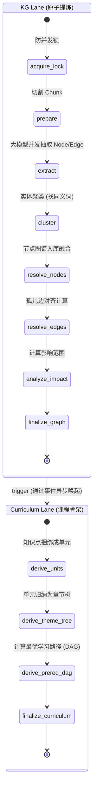
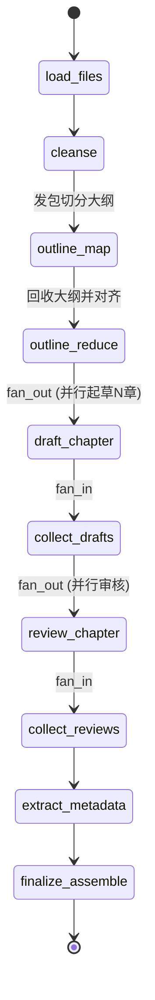

# 05. Digest 引擎 (织网引擎)

## 1. 引擎定位

Digest 引擎（织网引擎）是 AITeachMe 最核心的“大脑构建”工厂。它的职责是消费 Ingest 处理好的标准化资产（Markdown），通读几十万字，把原本扁平的文本段落，编织成一张具有时序、逻辑、依赖关系的“知识图谱”，并据此生长出结构化的“课程大纲（Curriculum）”。

为了解决超大规模文本处理中的并发与组合爆炸问题，Digest 引擎被拆分为三条并行的 LangGraph 异步流水线（Lanes）：
1. **KG Lane (知识抽取流)**：负责碎片化的原子知识抽取（实体识别、关系断言）。
2. **Curriculum Lane (课程派生流)**：负责把零散的图谱实体聚合成符合人类认知顺序的树状结构（Unit/主题树）。
3. **Docs Lane (文档生成流)**：根据结构和知识点，反向输出系统化教案（DocGen）。

---

## 2. 状态机范式 (State Definition)

三个子流分别维护自己的 `TypedDict`，彼此通过 `services` 落地数据库完成握手。

### 2.1 KG Lane State (`KGDigestState`)
图谱构建是 Map-Reduce 的经典场景，在并发抽出候选节点后，需要聚类和冲突消解。
```python
class KGDigestState(TypedDict, total=False):
    subject: str                  # 学科 / 知识库命名空间
    file_ids: list[int]           # 触发本次 Digest 的物料 IDs
    job_id: int                   # 本次构建任务跟踪 ID
    chunk_ids: list[int]                    # 切分后的所有文本块 IDs
    candidates: list[dict]                  # 抽取的未处理候选 entity (Concept/Topic等)
    all_candidate_edges: list[dict]         # 抽取的候选边 relations
    cluster_id_to_resolved_node_id: dict    # Entity 同义词合并后的图谱对齐字典
    new_node_ids: list[int]                 # 真正落库图谱的新节点
    updated_node_ids: list[int]             # 发生了更新的旧节点
    impact_set: ImpactSet | None            # 知识变更辐射范围（用于智能复习和增量更新）
```

### 2.2 Curriculum Lane State (`CurriculumDeriveState`)
```python
class CurriculumDeriveState(TypedDict, total=False):
    subject: str
    curriculum_job_id: int
    impact_set: ImpactSet | None            # KG Lane 跑完后传过来的变更圈
    derived_unit_ids: list[int]             # 聚类出的教学单元 (Units)
    theme_tree_version_id: int | None       # 生成的树状结构层级版本 (Module -> Chapter)
    prereq_dag_version_id: int | None       # 同层级节点的前置依赖图 (A是B的前提)
```

---

## 3. 管线架构图 (Pipeline Architecture)

### 3.1 核心主链路：KG Lane -> Curriculum Lane



### 3.2 辅助链路：Docs Lane (教案化)

此链路通过 `Map-Reduce`（Fan-out/Fan-in） 架构，并行写书。



---

## 4. 核心处理节点解析

### 4.1 KG Lane 数据流细节
- **`extract`**: 这是一个极具杀伤力的节点。会对全文拆分成的数百个 `Chunk` 并发调用大模型，运用提示词强迫大模型只能输出符合五大范式（Topic, Concept, Definition, Method, Example）的 JSON。
- **`cluster & resolve_nodes`**: 一定会出现不同 Chunk 抽取出相同概念的情形。此段使用图谱对齐提示词，让系统回答两者是否属于 Exact, Alias 或 No Match，做同义词合流。
- **`analyze_impact`**: AITeachMe 的特色功能。如果我们修改/废弃了一个 Concept，下游所有以来这个 Concept 生成的题目、文章都会被标记在 `ImpactSet` 中以备重新派生。

### 4.2 Curriculum Lane 数据流细节
它是从"散乱的网"变成"有序的树"的关键。
- **`derive_units`**: 将一堆高聚合的 `Concept/Definition/Example` 捆绑成一个 `Unit（教学单元）`，即用户每一次学习打卡的最小原子颗粒。
- **`derive_theme_tree`**: 让大模型看着一堆 `Unit`，生成 `Module（模块） -> Chapter（章节）` 的人类课本结构。
- **`derive_prereq_dag`**: 基于拓扑排序，如果 `Concept B` 依赖 `Concept A`，那么包含 A 的 Unit 就会被强制排在包含 B 的 Unit 之前。

---

## 5. AI 提示词指纹 (Prompt Templates Showcase)

### 5.1 图谱知识抽取提示词 (KG Extract Prompt)

> 位于 `workflows/digest/prompts/kg_prompts.py`
 
此 Prompt 制定了严格的 5节点/5边 枚举体系，这是 AITeachMe "不会把知识点越拆越乱" 的根基。

```text
你是一名知识图谱构建助手。请从给定的学习资料文本片段中抽取知识节点和知识边。

## 节点类型（仅限以下 5 种）
- Topic：主题或大类（如"微积分"、"系统架构"）
- Concept：核心概念（如"导数"、"核心痛点"）
- Definition：概念的正式定义或核心释义
- Method：方法、算法、解题技巧或业务策略
- Example：具体用例、场景、例题或习题（注意：一道完整的题目应作为一个 Example 节点）

## 边类型（仅限以下 5 种）
- belongs_to_topic，prerequisite_of，defined_by，illustrated_by，part_of

## 题目/习题识别规则（优先级最高）
1. 每道题独立抽取为一个 Example 节点。严禁合并多道题。
2. 试卷结构描述不抽取。
3. 题目中引用的学科概念，可以抽取为 Concept 节点，并用 illustrated_by 边连接到该 Example。
4. 题目中自创的临时定义属于题目设问的一部分，不得抽取为独立的 Definition 或 Concept。

## 通用抽取规则
- name 字段中的数学符号必须用 LaTeX（禁止使用 Unicode 上下标，必须写成 $\cos^2 x$）。
- Definition 和 Example 必须提供 parent_entity_name。
```

### 5.2 教学单元目录生成 (Theme Tree Prompt)

```text
你是一名课程结构设计助手。根据给定的教学单元(Unit)列表，设计一个层级化的主题树结构。

## 输出要求
1. 生成 module（模块）和 chapter（章节）两级结构
2. 每个 module 包含 1-5 个 chapter
3. 每个 chapter 应该能容纳 1-5 个教学单元
4. 结构应反映知识的逻辑组织关系
5. 标题简洁、准确，适合作为课程目录
```

---

## 6. 事件与周边交互 (Events)

- **入口触发**：Ingest 完成或者批量文件注入后，通过事件推入 `queue` ，由后台的 Task 调度 `build_kg_digest_graph`。
- **出口产物**：
  1. 向 `neo4j` 图数据库写入海量节点边。
  2. 生成新的结构树，引发前端 `Tree/Curriculum` 的视图刷新。
  3. 最终唤醒 `Profile Engine (显影引擎)` 重算用户的知识图谱雷达。

---

## 7. 优化空间探讨 (Ideas for Optimization)

1. **图谱噪音控制**：在目前的 `extract` 提词下，大模型容易对文档中的闲聊或纯例子话语强行提炼为一个 `Concept`。我们可以在聚类后引入一个专门拦截闲杂节点的轻量判别 Router。
2. **文档生成的容错**：`Docs Lane` 的 `Map-Reduce` 一旦触发，如果其中一个子章节的 `draft_chapter` 请求大模型超时失败返回了错误结果，它会导致整个书籍合成中断。我们需要在图的 `draft_chapter` 上加上强健的 `@retry` 或图内的 `Fallback Edge`。
