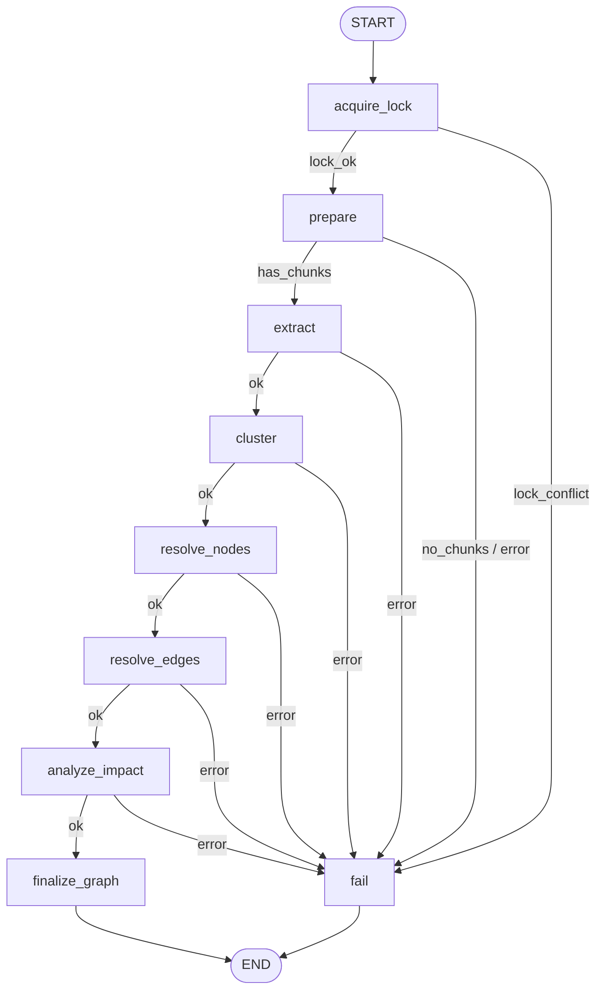
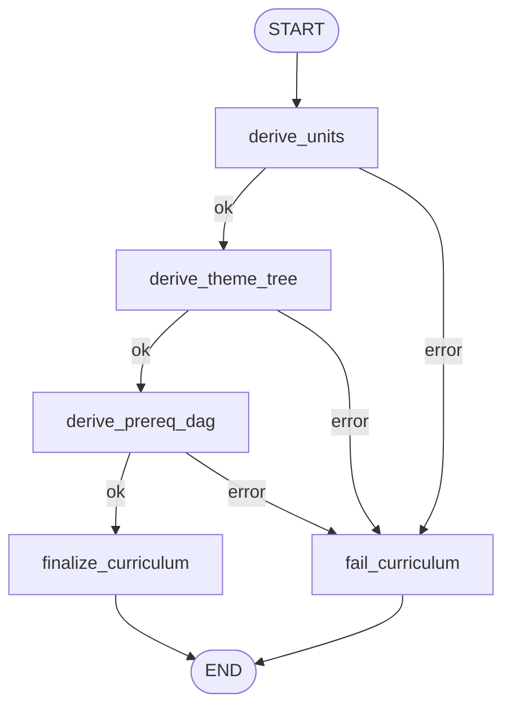
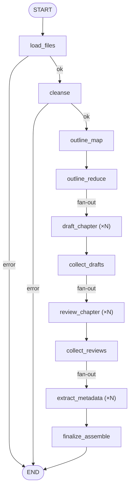

# 05. Digest 引擎 — 织网引擎技术文档

> **最后更新**: 2026-04-16 · 基于 `backend/app/workflows/digest/` 代码实现
> **合并说明**: 本文档合并了原 `05a_digest_knowledge_document.md` 和 `05b_digest_knowledge_graph.md` 的内容。

---

## 1. 引擎定位与职责

Digest（织网引擎）是 AITeachMe 的**知识加工中枢**，负责把 Ingest 产出的标准化 Markdown 材料加工为结构化的知识资产。

**Digest 当前核心链路：**

| Lane | 流程名 | 产物 | 触发方式 |
|---|---|---|---|
| **Planner Lane** | `digest.planner` | confirmed plan 草案 | 用户确认构建方案前触发 |
| **DocGen Lane** | `digest.docgen` | 知识文档（多章节 Markdown） | docs 构建 |
| **Knowledge Graph Lane** | `digest.knowledge_graph` | 知识节点 + 知识边 + 证据链 | graph 构建 |

**Digest 不做：**
- ❌ 不处理原始文件（那是 Ingest 的事）
- ❌ 不与用户交互（那是 Interact 的事）
- ❌ 不出题/判卷（那是 Examine 的事）

---

## 2. 代码落点速查

| 层 | 模块路径 | 职责 |
|---|---|---|
| DocGen Build | `backend/app/workflows/digest/docgen/builds.py` | Digest 构建入口、后台任务调度 |
| 模块入口 | `backend/app/workflows/digest/__init__.py` | 稳定导入面，指向真实链路 |
| Planner | `backend/app/workflows/digest/planner/` | confirmed plan 生成链路 |
| DocGen | `backend/app/workflows/digest/docgen/` | 文档生成链路 |
| Knowledge Graph | `backend/app/workflows/digest/knowledge_graph/` | 知识图谱链路 |
| Shared | `backend/app/workflows/digest/common/` | contracts / models / prepare / material_profile / metrics |
| DocGen Prompt | `backend/app/workflows/digest/docgen/prompts/` | 研究、标题、写作、资产 prompt |
| KG Prompt | `backend/app/workflows/digest/knowledge_graph/prompts/` | 抽取/对齐/命名/主题树 prompt |
| Reporting | 各链路 `lib/reporting.py` | 构建摘要与 token/timing 诊断 |

---

## 3. Lane 总体协作关系

```
Ingest 产物 (raw_markdowns) 就绪
    │
    ├── docs 构建  -> DocGen Lane -> KnowledgeDoc
    │
    └── graph 构建 -> KG Lane     -> KnowledgeGraph -> Curriculum
```

DocGen 与 Knowledge Graph 是两条独立构建链路，不再通过统一构建层编排。二者可以复用
`digest/common` 中的 shared input、chunk 物化、材料画像等基础能力，但不互相等待、不互相发布中间产物。

---

## 4. KG Lane — 知识图谱构建

### 4.1 LangGraph 流程图



### 4.2 节点详解

#### Node 1: `acquire_lock`

```
输入: subject, job_id
操作:
  1. 调用 kg_repo.acquire_subject_build_lock(session, subject, job_id)
     → 确保同一 subject 同时只有一个 KG 构建任务
  2. 成功: 更新 job progress=5, step="acquire_lock"
  3. 失败: 设置 error="lock_conflict"
输出: lock_acquired=True/False
写 DB: digest_job.status="processing"
路由: acquired → prepare, conflict → fail
```

#### Node 2: `prepare`

```
输入: subject, file_ids, build_session_id
操作:
  1. KG 独立调用 prepare_shared_inputs(...) 与 materialize_shared_inputs(...):
     - chunk_ids: 本次构建涉及的全部 retrieval_chunk 主键列表
     - chunk_uid_to_chunk_id: UID→ID 映射
     - chunk_id_to_chunk_uid: ID→UID 映射
     - shared_inputs: 本次图谱构建自己的材料分析结果
  2. 校验: chunk_ids 非空，否则 error="no_ready_digest_inputs"
输出: chunk_ids, shared_inputs, 双向映射
写 DB: job progress=10, step="prepare"
```

#### Node 3: `extract`（核心 LLM 节点）

```
输入: chunk_ids, shared_inputs
操作:
  1. 确定并发度:
     - chunk_count ≤ 20 → parallelism = min(chunk_count, 10)
     - chunk_count ≤ 100 → min(chunk_count, 20)
     - chunk_count > 100 → min(chunk_count, 30)
     - 受限于 `settings.knowledge_graph.extract_max_parallelism` 和 `settings.runtime.llm_concurrency_limit`
  2. 从 shared_inputs 的 subject_profile / fast_hints 生成 taxonomy_hint 和 sibling_topics
  3. 对每个 chunk 并行调用 extract_candidates():
     ┌─ 快速通道判断: 试卷类材料 + question_block_count ≥ 3 + 无概念性内容 → 跳过 LLM
     ├─ LLM 通道: 组装 prompt (见第 6 节) → 调用 LLM → 解析 JSON → CandidateNode + CandidateEdge
     └─ 后处理: 应用 taxonomy_hints 修正
  4. 汇总统计: success_chunk_count, failed_chunk_count, total_nodes, total_edges
  5. 校验: 全部失败 → error; 零节点 → error
输出: candidates (ChunkExtractionResult[]), all_candidate_edges
写 DB: job progress 15→40
LLM 调用: ✅ kg_extract (每 chunk 一次)
```

#### Node 4: `cluster`

```
输入: candidates, chunk_ids
操作:
  1. 展平所有 candidate 为 (CandidateNode, chunk_id) 对
  2. 调用 cluster_candidates():
     - 按 node_type + normalized_name 聚合
     - 产出 ClusteredCandidate: { representative, members, merged_summary, source_chunk_ids }
     - 产出 lookup_to_cluster_id: candidate_lookup_key → cluster_index
  3. 构建 early_topic_snapshot 写入 KG state，供图谱诊断与最终发布使用
输出: clustered_candidates, candidate_lookup_to_cluster_id
写 DB: job progress=50
LLM 调用: ❌ (纯规则)
```

#### Node 5: `resolve_nodes`（核心持久化节点）

```
输入: clustered_candidates, subject
操作:
  1. 构建 ResolutionIndex:
     - 加载 subject 下所有 active/pending 节点
     - 加载嵌入向量 (带缓存: embedding_cache.json)
     - 构建 normalized_map, alias_map, records_by_type, children_by_parent
  2. 计算候选嵌入: aembed_texts(所有候选的 "name\nsummary")
  3. 遍历每个 cluster:
     ┌─ Primary (Topic/Concept/Method):
     │  1. 精确匹配: normalized_name 完全一致 → "exact"
     │  2. 别名匹配: aliases_json 中存在 → "alias"
     │  3. 语义匹配: cosine_similarity ≥ 0.80 → "exact"
     │  4. 无匹配 → "no_match" → 创建新节点
     ├─ Secondary (Definition/Example):
     │  1. 先解析 parent_node_id (parent_entity_name → 已解析节点)
     │  2. 在 parent 的同类 children 中语义匹配 ≥ 0.85
     │  3. 无匹配 → 创建新节点
     ├─ 匹配成功:
     │  - 写 node_evidence (chunk→node 证据链)
     │  - 如有别名: 写 alias
     │  - 如有内容更新: 写 updated_revision
     └─ 新节点:
        - create_new_node() → KnowledgeNode + NodeRevision
        - 写 node_evidence
  4. 批量 commit (每 20 个 cluster 一次)
输出: new_node_ids, updated_node_ids, merged_node_ids,
      candidate_lookup_to_resolved_node_id, cluster_id_to_resolved_node_id
写 DB: knowledge_node, node_revision, node_evidence, node_alias
       job progress 50→65
LLM 调用: ❌ (embedding 不算 LLM chat)
```

#### Node 6: `resolve_edges`

```
输入: all_candidate_edges, candidate_lookup → resolved_node_id
操作:
  对每条候选边:
  1. 通过 candidate_lookup 解析 source_name → source_node_id
  2. 通过 candidate_lookup 解析 target_name → target_node_id
  3. 端点未解析 → 跳过 (unresolved_endpoint_count++)
  4. 查找已有边: (source_node_id, target_node_id, edge_type, subject)
     ├─ 新边: 创建 KnowledgeEdge + EdgeRevision + edge_evidence
     └─ 已有边: 追加 edge_evidence, 更新 confidence (基于证据数)
  5. 批量 commit (每 25 条一次)
输出: new_edge_ids, updated_edge_ids
写 DB: knowledge_edge, edge_revision, edge_evidence
       job progress=75
LLM 调用: ❌
```

#### Node 7: `analyze_impact`

```
输入: new_node_ids, updated_node_ids, merged_node_ids
操作:
  调用 analyze_impact():
  1. 合并全部变更节点 ID 列表
  2. 查找受影响的 teaching_unit (通过 unit_membership 关联)
  3. 构建 ImpactSet:
     - changed_node_ids: 本次变更的节点
     - affected_unit_ids: 需要重新推导的教学单元
输出: impact_set: ImpactSet
写 DB: job progress=85
LLM 调用: ❌
```

#### Node 8: `finalize_graph`

```
输入: clustered_candidates, impact_set
操作:
  1. 构建最终 topic_anchor_snapshot 写入 KG state
  2. 校验: topic_anchors 非空 且 resolved_node_count > 0
     失败 → error="finalize_failed: graph_not_usable"
  3. 激活全部 pending 实体:
     activate_graph_entities_by_job(job_id, subject)
     → 所有 status="pending" 的节点/边/证据 → "active"
  4. 释放构建锁: kg_repo.release_subject_build_lock()
  5. 更新 digest_job: status="completed"
  6. asyncio.create_task() 触发 Curriculum Lane
输出: graph_ready=True, active_node_count, active_edge_count
写 DB: 批量状态更新, job status, 锁释放
LLM 调用: ❌
```

#### `fail` node

```
操作:
  1. cleanup_pending_by_job(): 删除本 job 创建的所有 pending 实体
  2. 释放构建锁 (如已获取)
  3. 更新 digest_job: status="failed", error_message
```

---

## 5. Curriculum Lane — 课程结构推导

### 5.1 LangGraph 流程图



### 5.2 节点详解

#### Node 1: `derive_units`

```
输入: subject, impact_set
操作:
  调用 derive_teaching_units():
  1. 加载 subject 的完整知识子图 (active 节点 + 边)
  2. 基于图拓扑构建 unit 候选:
     - 每个 Concept/Method 节点 + 其 Definition/Example 子节点 → 一个单元候选
     - 受 impact_set 影响的 unit 需要重新推导
  3. 单元命名 (三级策略):
     ├─ 规则命名: 单节点 unit 直接用节点名
     ├─ LLM 命名: 多节点 unit 调用 LLM (SYSTEM_PROMPT_KG_UNIT_NAMING)
     │  → 产出 name, summary, learning_objectives
     └─ 回退命名: LLM 失败时用首节点名
  4. 持久化: TeachingUnit + UnitMembership 记录
输出: derived_unit_ids
写 DB: teaching_unit, unit_membership
       job progress=10→40
LLM 调用: ✅ kg_unit_naming (每个多节点 unit 一次)
```

#### Node 2: `derive_theme_tree`

```
输入: subject, impact_set, derived_unit_ids
操作:
  调用 derive_theme_tree():
  1. 加载所有 active teaching_unit
  2. 调用 LLM (SYSTEM_PROMPT_KG_THEME_TREE + USER_PROMPT_KG_THEME_TREE):
     → 输入: subject + unit 名称/摘要列表
     → 输出: module/chapter 两级结构 JSON
  3. 持久化:
     - CurriculumSnapshot (版本快照)
     - ThemeTreeNode (module + chapter)
     - TaxonomyAnchor (unit → chapter 映射)
输出: theme_tree_version_id
写 DB: curriculum_snapshot, theme_tree_node, taxonomy_anchor
       job progress=50→70
LLM 调用: ✅ kg_theme_tree (全 subject 一次)
```

#### Node 3: `derive_prereq_dag`

```
输入: subject, impact_set, derived_unit_ids
操作:
  调用 derive_prereq_dag():
  1. 基于知识图谱中的 prerequisite_of 边 → 推导 unit 间前置依赖
  2. 拓扑排序验证 (检测循环依赖)
  3. 持久化: UnitDependency 记录
输出: prereq_dag_version_id
写 DB: unit_dependency, job progress=75→85
LLM 调用: ❌ (纯图算法)
```

#### Node 4: `finalize_curriculum`

```
操作:
  1. activate_curriculum_entities_by_job(): pending → active
  2. publish_curriculum_snapshot(): 标记新版本为 current
  3. stamp_graph_revision_by_subject(): 关联图版本号
  4. archive_old_versions(): 旧版本 → archived
  5. 废弃受影响但未重建的旧 unit: status → "deprecated"
输出: snapshot_id, curriculum_version_no
写 DB: 批量状态更新, job progress=100
```

---

## 6. Docs Lane — 知识文档生成

> 当前代码中的 DocGen 真实链路已收口到 `backend/app/workflows/digest/docgen/`，节点为 `load_context / research_chapters / write_chapters / finalize_titles / merge_drafts / enrich_assets / append_practice / publish_document` 等。`docgen/lib/` 是真实 helper 落点，旧 `docgen/internal/` 已删除。下面保留的 cleanse/outline/draft/review 描述是历史 Docs Lane 设计背景，不再作为当前代码结构的权威说明；当前实现以 `backend/app/workflows/digest/docgen/README.md` 与 `docs/designs/refactor/*` 为准。

### 6.1 LangGraph 流程图



**特点**: Docs Lane 使用 LangGraph 的 `Send()` 原语实现 **fan-out/fan-in** 模式，对多个章节并行执行 draft → review → metadata。

### 6.2 节点详解

#### Node 1: `load_files`

```
输入: subject, file_ids
操作:
  1. 从 raw_file 加载指定文件的 parsed_markdown
  2. 过滤空内容和未就绪文件
  3. 构建 DocGen 本轮 shared_inputs
输出: file_contents, shared_inputs
```

#### Node 2: `cleanse` (LLM)

```
输入: raw markdown 内容
操作:
  对每个文件内容调用 LLM (CLEANSE_PROMPT):
  → 修复 OCR 错字、乱码和 PDF 提取噪声
  → 不重写结构，不补充内容，不删减信息
输出: cleansed text
LLM 调用: ✅ cleanse (每文件一次)
```

#### Node 3: `outline_map` (LLM)

```
输入: cleansed text
操作:
  对每个文本块调用 LLM (LOCAL_OUTLINE_PROMPT):
  → 提取 3~5 个子标题
  → 返回 JSON 数组
输出: local_outlines (per chunk)
LLM 调用: ✅ local_outline (每 chunk 一次)
```

#### Node 4: `outline_reduce` (LLM)

```
输入: local_outlines, subject_context, user_prompt
操作:
  调用 LLM (GLOBAL_OUTLINE_PROMPT):
  → 将零散标题整理为 章→节 两级结构
  → 每节标明对应的原始文本块索引
  → JSON: { chapters: [{ chapter_index, title, sections: [{title, source_chunk_indices}] }] }
输出: outline_tree, chapter_assignments
LLM 调用: ✅ global_outline (全 subject 一次)
```

#### Node 5: `draft_chapter` (fan-out, LLM)

```
输入: chapter assignment (title, source_contents, chapter_index, total_chapters)
      outline_tree, prev_summary, next_preview, user_prompt, shared_inputs
操作:
  用 Send() 并行生成每章草稿:
  1. 选择 Writer Prompt:
     ├─ 有 archetype → get_writer_prompt(archetype) (4种原型之一)
     └─ 无 archetype → WRITER_PROMPT (通用)
  2. 注入上下文: subject_context, chapter_title, section_titles,
     source_content, formula_refs, prev_summary, next_preview
  3. 调用 LLM 生成完整 Markdown 章节
输出: chapter_drafts[] (通过 Annotated[list, operator.add] 收集)
LLM 调用: ✅ writer (每章一次)
```

#### Node 6: `collect_drafts` → Node 7: `review_chapter` (fan-out, LLM)

```
操作:
  用 Send() 并行审校每章:
  1. 调用 LLM (REVIEWER_PROMPT 或 PEDAGOGICAL_AUDIT_PROMPT):
     → 检查一级标题、概要段、结构、公式、标签
     → 返回 JSON: { passed, issues, suggestions } 或扩展版
输出: chapter_reviews[]
LLM 调用: ✅ reviewer (每章一次)
```

#### Node 8: `collect_reviews` → Node 9: `extract_metadata` (fan-out, LLM)

```
操作:
  用 Send() 并行提取元数据:
  调用 LLM (METADATA_PROMPT):
  → 生成 50 字导读摘要 + 3~5 个标签
  → JSON: { summary, tags }
输出: chapter_metadatas[]
LLM 调用: ✅ metadata (每章一次)
```

#### Node 10: `finalize_assemble`

```
操作:
  1. 按 chapter_index 排序所有审校通过的章节
  2. 合并为完整 Markdown (merged_markdown)
  3. 持久化:
     - 创建 knowledge_document 记录
     - 关联 source_file_ids
     - 存储完整 Markdown 到 ContentStore
输出: doc_ids, merged_markdown
写 DB: knowledge_document
```

---

## 7. Prompt 模板全文

### 7.1 KG Lane Prompts

#### 知识抽取 — System Prompt

```
你是一名知识图谱构建助手。请从给定的学习资料文本片段中抽取知识节点和知识边。

## 节点类型（仅限以下 5 种）
- **Topic**：主题或大类（如"微积分"、"线性代数"）
- **Concept**：核心概念（如"导数"、"极限"）
- **Definition**：概念的正式定义或核心释义
- **Method**：方法、算法、解题技巧或业务策略
- **Example**：具体用例、场景、例题或习题

## 边类型（仅限以下 5 种）
- **belongs_to_topic**：节点属于某个 Topic
- **prerequisite_of**：source 是学习 target 的前置知识
- **defined_by**：Concept 由 Definition 定义
- **illustrated_by**：Concept/Method 由 Example 说明
- **part_of**：source 是 target 的组成部分

## 题目/习题识别规则（优先级最高）
1. 每道题独立抽取为一个 Example 节点
2. 严禁合并多道题
3. 试卷结构描述不抽取
4. 题目中引用的学科概念可以抽取为 Concept，用 illustrated_by 连接
5. 题目中自创的临时定义不得抽取为独立节点

## 多层级主题结构规则（非常重要）
1. 必须构建层级化的 Topic 结构
2. 从题目中提取知识点
3. parent_entity_name 必须精确
4. taxonomy_hint 应指向最近的上层 Topic

## 通用抽取规则
1. 每个节点必须有明确的 name 和 node_type
2. name 字段中的数学符号必须用 LaTeX
3. Definition 和 Example 必须提供 parent_entity_name
4. 每个节点应提供 taxonomy_hint
5. local_summary 应概括该知识点在本段文本中的核心内容
6. 边的 source_name 和 target_name 必须与节点 name 完全一致
7. 不要杜撰原文中没有的知识点或关系
8. 数学公式格式使用 LaTeX 语法
```

#### 知识抽取 — User Prompt

```
## 文本片段信息
- 标题：{{ chunk_title }}
- 文档结构路径：{{ header_path }}
- 文档类型：{{ doc_source_type }}
- 学科背景：{{ subject_context }}
- 同级主题参考：{{ sibling_topics }}
- 构建模式：速成课
- 构建模式：系统课

## 文本内容
{{ chunk_content }}
```

#### 实体对齐 — System Prompt

```
你是一名知识图谱实体对齐助手。请判断以下两个知识节点是否指代同一个知识点。

判定选项: EXACT / ALIAS / NO_MATCH
判定规则:
1. 含义完全一致 → EXACT
2. 别名/缩写/翻译/同义表述 → ALIAS
3. 相关但指代不同 → NO_MATCH
```

#### 单元命名 — System Prompt

```
你是一名教学设计助手。以下是一组紧密相关的知识节点，它们构成一个教学单元。
请为这个教学单元生成名称、摘要和学习目标。

输出要求:
1. 单元名称：简洁、准确、适合作为课程目录标题
2. 单元摘要：一段话描述本单元的核心内容
3. 学习目标：2-4 条，以"学完本单元后，学生能够..."开头
```

#### 主题树生成 — System Prompt

```
你是一名课程结构设计助手。根据给定的教学单元列表，设计一个层级化的主题树结构。

输出要求:
1. 生成 module（模块）和 chapter（章节）两级结构
2. 每个 module 包含 1-5 个 chapter
3. 每个 chapter 应该能容纳 1-5 个教学单元
4. 标题简洁、准确，适合作为课程目录
```

### 7.2 Docs Lane Prompts

#### 文本清洗 `CLEANSE_PROMPT`

```
你是一个文本修复助手。你的任务只有一个：修复下面文本里明显的 OCR 错字、乱码和 PDF 提取噪声。
要求：只修复明显错误，不重写结构，不补充内容。
```

#### 局部大纲 `LOCAL_OUTLINE_PROMPT`

```
你是一个教学大纲整理助手。请根据下面文本，提取 3-5 个能概括主要知识点的子标题。
要求：每个标题不超过 20 字。按内容出现顺序排列。只返回 JSON 数组。
```

#### 全局大纲 `GLOBAL_OUTLINE_PROMPT`

```
你是一位经验丰富的教研老师。请把下面零散的知识点整理成适合学习和复习的多章节结构。
输出两级结构：章 -> 节。每一节标明对应的原始文本块索引。
```

#### 写作 `WRITER_PROMPT` (通用版)

```
你是 AITeachMe 的金牌私教。请基于分配给你的原始素材，写出一章真正适合学习和复习的中文讲义。
写作要求:
1. 只输出这一章
2. 以 # {chapter_title} 作为唯一一级标题
3. 开头必须有 > 📌 本章概要：...
4. 正文写成自然的讲义
5. 公式保留 LaTeX 写法
6. 不要照搬原文，要用教学化语言重写
7. 文末附一行：📊 本章标签：#标签1 #标签2 ...
```

#### 四种原型 Writer Prompt

| 原型 | 适用场景 | 特有结构 |
|---|---|---|
| `concept_build` | 新概念建立 | 动机→通俗定义→严格定义→入门例子→相关概念区别→练习 |
| `method_solve` | 解题方法掌握 | 方法前提→标准步骤→判断点→典型例题→变式拓展→练习 |
| `problem_type` | 题型突破 | 题型识别→解题框架→简单/中等/进阶例题→高频错误→练习 |
| `review_sprint` | 综合复习 | 知识主线→公式速查表→记忆抓手→高危易错点→自测清单 |

所有原型共享通用头部（学科信息、学习目标、前置依赖）和通用尾部（通用写作要求、证据包注入）。

#### 审校 + 元数据

```
审校: 检查结构/标题/概要/公式/标签完整性 → JSON { passed, issues, suggestions }
元数据: 提取 50 字摘要 + 3~5 标签 → JSON { summary, tags }
```

### 7.3 Interact 引用 Prompt (预览)

> Interact 引擎的 Prompt 详见 [06_interact_engine.md](./06_interact_engine.md)

---

## 8. State 类型定义

### 8.1 `KGDigestState` 主要字段

| 字段 | 类型 | 说明 |
|---|---|---|
| `subject` | `str` | 学科 slug |
| `file_ids` | `list[int]` | 本次构建的源文件 |
| `job_id` | `int` | digest_job 主键 |
| `build_session_id` | `str` | 跨 Lane 会话标识 |
| `shared_inputs` | `SharedBuildInputs \| None` | 统一材料分析 |
| `chunk_ids` | `list[int]` | retrieval_chunk ID 列表 |
| `candidates` | `list[ChunkExtractionResult]` | 每 chunk 的抽取结果 |
| `all_candidate_edges` | `list[tuple]` | 候选边 + chunk_id |
| `clustered_candidates` | `list[ClusteredCandidate]` | 聚类后的候选 |
| `candidate_lookup_to_cluster_id` | `dict[str, int]` | lookup_key → cluster 索引 |
| `candidate_lookup_to_resolved_node_id` | `dict[str, int]` | lookup_key → 最终 node_id |
| `cluster_id_to_resolved_node_id` | `dict[int, int]` | cluster 索引 → node_id |
| `new_node_ids` | `list[int]` | 新建的知识节点 |
| `updated_node_ids` | `list[int]` | 更新的知识节点 |
| `impact_set` | `ImpactSet \| None` | 影响分析结果 |
| `lock_acquired` | `bool` | 是否获取构建锁 |
| `error` | `str \| None` | 错误信息 |

### 8.2 `CurriculumDeriveState` 主要字段

| 字段 | 类型 | 说明 |
|---|---|---|
| `subject` | `str` | 学科 slug |
| `graph_job_id` | `int` | KG Lane job_id |
| `curriculum_job_id` | `int` | Curriculum 自身 job_id |
| `impact_set` | `ImpactSet \| None` | KG Lane 传入的影响集 |
| `derived_unit_ids` | `list[int]` | 推导出的教学单元 |
| `theme_tree_version_id` | `int \| None` | 主题树版本 |
| `prereq_dag_version_id` | `int \| None` | 前置 DAG 版本 |
| `snapshot_id` | `int \| None` | 课程快照 ID |
| `curriculum_version_no` | `int \| None` | 课程版本号 |
| `error` | `str \| None` | 错误信息 |

### 8.3 `DocGenState` 主要字段

| 字段 | 类型 | 说明 |
|---|---|---|
| `subject` | `str` | 学科 slug |
| `file_ids` | `list[int]` | 源文件 ID |
| `user_prompt` | `str \| None` | 用户附加要求 |
| `requested_at` | `datetime` | 请求时间 |
| `chapter_assignments` | `list[dict]` | 大纲分配 |
| `chapter_drafts` | `list[dict]` | 草稿列表 (fan-out 收集) |
| `chapter_reviews` | `list[dict]` | 审校结果 |
| `chapter_metadatas` | `list[dict]` | 元数据列表 |
| `merged_markdown` | `str` | 合并后的完整文档 |
| `doc_ids` | `list[int]` | 生成的文档 ID |
| `error` | `str \| None` | 错误信息 |

---

## 9. 事件系统

| Lane | 事件类 | 触发时机 |
|---|---|---|
| KG | `DigestBuildRequestedEvent` | KG Lane 启动 |
| KG | `DigestGraphCompletedEvent` | KG Lane 成功完成 |
| KG | `DigestGraphFailedEvent` | KG Lane 失败 |
| Curriculum | `CurriculumDeriveCompletedEvent` | Curriculum 成功完成 |
| Curriculum | `CurriculumDeriveFailedEvent` | Curriculum 失败 |
| Docs | `DocGenRequestedEvent` | Docs Lane 启动 |
| Docs | `DocGenCompletedEvent` | Docs Lane 成功完成 |
| Docs | `DocGenFailedEvent` | Docs Lane 失败 |

---

## 10. 可观测性

Digest 的观测现在拆成两层：

- LangSmith trace
- 前端 progress

当前统一接法：

- `run_state_graph(...)`：workflow root
- `workflow_tracer(...).node(handler, ...)`：workflow node
- 官方 `@traceable`：稳定 prompt / helper
- `emit_progress(...)`：前端阶段事件

运行时兼容统计不再依赖通用 step 框架，而是：

- planner 只保留顶层 node 摘要
- `build_token_summary(build_session_id, lane)` 聚合 token 统计
- `add_slow_item()` 记录最慢 chunk / chapter / unit

LangSmith metadata 只保留少量关键字段和计数摘要，不再默认 dump 整份 state。

---

## 11. 错误恢复与降级策略

| 场景 | 处理方式 |
|---|---|
| KG 锁冲突 | error="lock_conflict", 不执行任何写入 |
| 部分 chunk 抽取失败 | 跳过失败 chunk，剩余成功即继续 |
| 全部 chunk 抽取失败 | error, fail 节点清理 pending 实体 |
| 节点解析失败 | fail 节点: 删除 pending 节点/边/证据，释放锁 |
| Curriculum 无 impact_set | error, 不产出教学单元 |
| 主题树 LLM 失败 | error, fail 节点清理 pending curriculum 实体 |
| Docs cleanse/outline 失败 | 直接跳到 END，不产出文档 |
| fan-out 中单章 draft 失败 | 该章跳过，其余章继续 |

---

## 12. 与其他引擎的接口关系

### Ingest → Digest

- Digest 消费 `raw_markdowns (ContentStore)` + `retrieval_chunk` (DB)
- 准入条件: `raw_file.ingest_status` ∈ {`fast_parsed`, `enhancing`, `ready_for_digest`, `enhance_failed`}

### Digest → Examine

- Examine 消费 `teaching_unit` + `knowledge_node` (DB)
- 通过 `unit_membership` 关联知识节点

### Digest → Interact

- Interact 通过 `retrieval_chunk` 做 RAG 检索
- 通过 `knowledge_document` 提供知识文档上下文

### Digest → Profile

- Profile 通过 `user_knowledge_state` 关联 `knowledge_node`
- 掌握度更新引用 `knowledge_node.id`

---

## 13. 已知边界与演进方向

1. KG Lane 当前通过 LangGraph `ainvoke()` 执行，Docs Lane 也通过 LangGraph 执行
2. Curriculum Lane 由 KG finalize 的 `asyncio.create_task()` 自动触发
3. Docs Lane 的 fan-out 使用 `langgraph.types.Send()` 原语，编集自带并发
4. 语义匹配阈值 (Primary=0.80, Secondary=0.85) 是硬编码常量，未来可配置化
5. 文档审校通过率偏高时 (passed=True)，缺少自动 rewrite 循环
