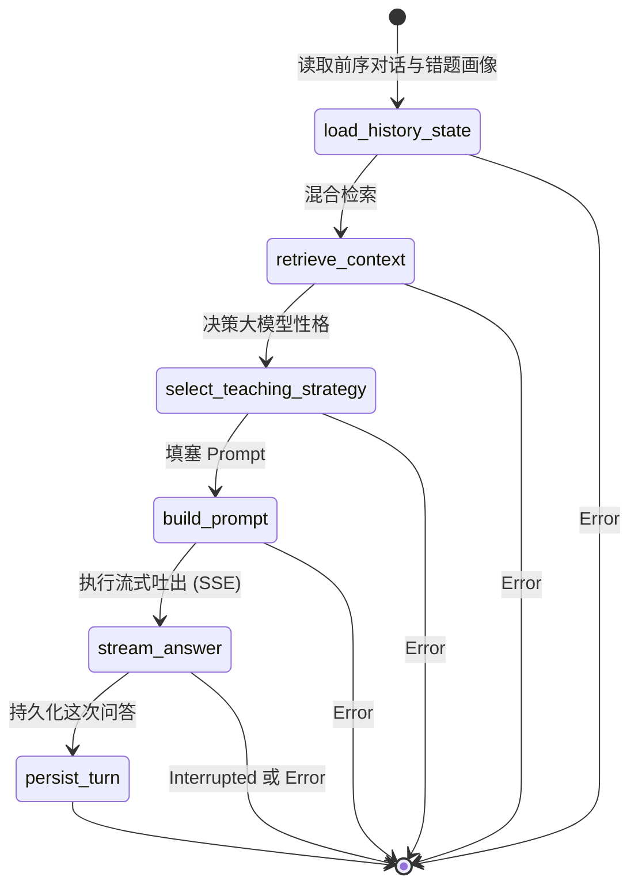

# 06. Interact 引擎 (伴读引擎)

## 1. 引擎定位

Interact 引擎（伴读引擎）是 AITeachMe 呈现 "24小时专属赛博私教" 这一核心标语的载体。
区别于普通带着检索库的 RAG 对话，该引擎在每次回答前，都会隐式拉取用户的 **知识薄弱点、近期错题错因** 以及**当前的教学策略**，使得回答变成“因人而异、因材施教”的启发式对话，而不是粗暴地抛给学生标准答案。

它的核心挑战是解决流式输出（Streaming）与复杂图状态的结合，确保低延迟回复的同时不丢失私教逻辑。

---

## 2. 状态机范式 (State Definition)

在整个单次对话轮回（Turn）中，伴读引擎的 LangGraph 状态数据如下：

```python
class InteractWorkflowState(TypedDict, total=False):
    subject: str                    # 学科上下文
    user_id: str
    session_id: str | None          # 当前对话 Session ID
    question: str                   # 用户抛出的问题
    selected_context: str | None    # 前端高亮划选发送的文本片段
    source_chunk_id: int | None
    
    recent_messages: list[RecentMessage]          # 历史对话记录
    weak_points: list[WeakPointSummary]           # Profile 显影引擎算出的用户薄弱点
    recent_mistakes: list[MistakeSummary]         # 最近的错题集
    retrieval_results: list[RetrievedContext]     # 向量+图谱混合检索来的知识材料
    contexts: list[ChatContextItem] | None        # 将被返回前端作为引用的溯源列表
    
    strategy_mode: StrategyMode     # 教学策略 (直接解答 / 苏格拉底启发 / 追问测验)
    messages: list[ChatMessage]     # 送给大模型的最终拼装消息序列
    assistant_response: str         # 流式吐完后存下来的大模型完整回复
    turn_id: str                    # 这一轮对话的落库 ID
    stream_interrupted: bool        # 检测客户端中断断开的 Flag
    error: str | None
```

---

## 3. 管线架构图 (Pipeline Architecture)

Interact 是一个纯典型的序列流（Sequential workflow），它的复杂度在于前置节点的重数据拉取。



---

## 4. 核心处理节点解析

- **`load_history_state`**：不仅加载近几轮的聊天，最关键的是会跨模块调用 `Profile` 和 `Examine` 的视图，提取出该用户近 7 天做错的关联题目及它的能力雷达短板。
- **`retrieve_context`**：如果用户的问题涉及特定知识，在此去向量库里找出关联片段。如果是用户划选了一段文字（`selected_context`），则提高那段文字的权重。
- **`select_teaching_strategy`**：一个轻量控制节点，根据用户状态（是否连续做错、是否考前复习）切换教学性格（例如"启发模式"或"保姆模式"）。
- **`stream_answer`**：在图内抛出 SSE event 向前端逐字渲染。
- **`persist_turn`**：不管流式是否被异常掐断，都会在这一步把这整个回合打包入库 `chat_messages`。

---

## 5. AI 提示词指纹 (Prompt Templates Showcase)

> 系统核心助教 Prompt 位于 `workflows/interact/prompts/prompts.py`

此 Prompt 中的注入点正是其能够"千人千面"的秘密。

```text
你是 AITeachMe 的 AI 学习助教，负责围绕 {{ subject }} 做教学型对话。

当前教学策略：
{{ teaching_strategy }}

回答要求：
1. 优先基于当前学科资料回答，不要脱离资料随意发挥。
2. 如果资料不够支撑结论，要明确说明“不确定”或“资料不足”。
3. 表达要耐心、具体、结构化，优先帮助用户真正理解，而不是只给结论。
4. 如果问题适合引导式教学，可以先拆步骤、先提示，再逐步推进。
5. 所有数学公式都使用 LaTeX：行内公式用 $...$，独立公式用 $$...$$。

学生薄弱项：
{{ weak_points_context }}

近期错题：
{{ mistakes_context }}

用户选段上下文：
{{ selected_context }}
```

---

## 6. 事件与周边交互 (Events & Lifecycle)

- **入口触发**：FastAPI 的 `@router.post("/streams/chat")` 端点直接挂载此工作流启动。依靠 SSE (Server-Sent Events) 打包流出。
- **旁路挂载特性**：它不在内部做持久化触发，但在结束后可以发送 `InteractTurnCompleted` 领域事件，**留给未来做学情追踪。**（比如：用户问了“洛必达法则”，那他的能力雷达表中洛必达的熟练度可以少量上涨）。

---

## 7. 优化空间探讨 (Ideas for Optimization)

1. **图谱联动 (Graph RAG)**：目前的 `retrieve_context` 节点更多偏向向量检索。但 Digest 已经给我们织出了漂亮的知识图谱。如果用户说“梳理一下这一章逻辑”，Interact 引擎应该能去捞取子图表结构，转交给大模型。这是下版本极具潜力的增强点。
2. **多模态问题对话**：用户如果上传了一张拍下的题目截图提问，目前的 `InteractWorkflowState` 没有 `image_payload` 的入参口。建议为 `Interact` state 扩充多模态能力入口。
