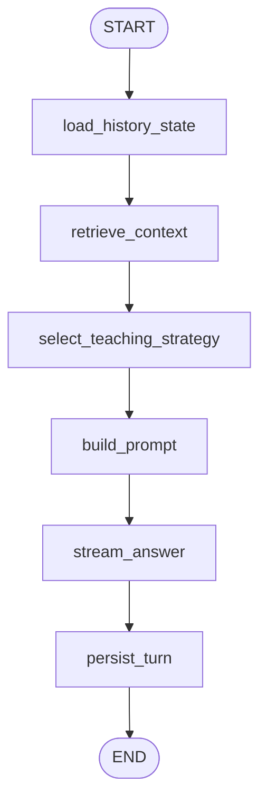

# 06. Interact 引擎 — 伴读引擎技术文档

> **最后更新**: 2026-04-16 · 基于 `backend/app/workflows/interact/` 代码实现

---

## 1. 引擎定位与职责

Interact（伴读引擎）是 AITeachMe 的**实时教学交互核心**，负责为用户提供基于知识库的 AI 辅导对话。

**Interact 做一件事：**
- ✅ 接收用户问题 → 检索相关知识 → 选择教学策略 → 用 LLM 生成启发式教学回复 → SSE 流式推送

**Interact 不做：**
- ❌ 不出题、不判卷（Examine 的事）
- ❌ 不构建知识图谱（Digest 的事）
- ❌ 不更新掌握度/画像（Profile 的事）

---

## 2. 代码落点速查

| 层 | 模块路径 | 职责 |
|---|---|---|
| API | `backend/app/api/chats.py` | 对话 SSE 与会话端点 |
| API-facing Use Cases | `backend/app/workflows/interact/chat/use_cases.py` | 会话管理、调度与 SSE 外壳 |
| Workflow Graph | `backend/app/workflows/interact/chat/graph.py` | LangGraph 图定义 |
| Workflow Runtime | `backend/app/workflows/interact/chat/graph.py` | 单次运行入口与 SSE streaming 底座 |
| Workflow State | `backend/app/workflows/interact/chat/state.py` | 状态类型 |
| Nodes | `backend/app/workflows/interact/chat/nodes/` | history/retrieval/strategy/prompt/stream/persist |
| Prompt 模板 | `backend/app/workflows/interact/chat/prompts/prompts.py` | System prompt |
| Helpers | `backend/app/workflows/interact/chat/lib/` | streaming / retrieval / execution / strategy |

---

## 3. LangGraph 流程图



**关键特征**: 六节点串行链路，无条件分支（每一步都不可跳过）。

---

## 4. State 类型定义

> 文件: `backend/app/workflows/interact/chat/state.py`

### `InteractWorkflowState` 主要字段

| 字段 | 类型 | 说明 |
|---|---|---|
| `subject` | `str` | 学科 slug |
| `user_id` | `int` | 用户 ID |
| `session_id` | `int` | 会话 ID |
| `question` | `str` | 用户本轮提问 |
| `chat_history` | `list[dict]` | 历史对话记录 |
| `weak_points` | `list[str]` | 用户薄弱知识点列表 |
| `recent_mistakes` | `list[str]` | 用户近期错误列表 |
| `retrieved_chunks` | `list[str]` | RAG 检索到的知识片段 |
| `search_notice` | `str \| None` | 检索降级提示 |
| `strategy` | `str` | 教学策略 |
| `strategy_mode` | `str` | 策略模式标识 |
| `prompt_messages` | `list[dict]` | 组装好的 LLM 消息列表 |
| `answer` | `str` | LLM 生成的完整回答 |
| `sse_queue` | `object` | SSE 推送队列引用 |
| `error` | `str \| None` | 错误信息 |

---

## 5. 节点详解

### Node 1: `load_history_state`

> 文件: `backend/app/workflows/interact/chat/nodes/history.py`

```
输入: subject, user_id, session_id
操作:
  1. 从 chat_message 表加载最近 N 轮对话历史
     → 转换为 [{"role": "user", "content": "..."}, {"role": "assistant", "content": "..."}]
  2. 从 user_knowledge_state 表加载用户薄弱知识点
     → 按 mastery_score ASC 排序，取 TOP K
     → 转换为 [node_name, ...] 字符串列表
  3. 从 exam_question_result 表加载用户近期错误
     → 最近 M 次考试中答错的题目
     → 转换为 ["错题简述1", ...]
输出:
  chat_history: list[dict]
  weak_points: list[str]
  recent_mistakes: list[str]
读 DB: chat_message, user_knowledge_state, exam_question_result
```

### Node 2: `retrieve_context`

> 文件: `backend/app/workflows/interact/chat/nodes/retrieval.py`

```
输入: subject, question, search_notice (可选)
操作:
  1. 判断检索降级:
     ├─ search_notice 非空 → 跳过检索，使用 notice 作为上下文提示
     └─ search_notice 空 → 执行 RAG 检索
  2. RAG 检索流程:
     a. 通过 `chat/lib/retrieval.py` 调用 LlamaIndex adapter
     b. 底层桥接到同一套 sqlite-vec / pgvector 存储
     c. 按相似度阈值过滤后返回 prompt-ready `RetrievedContext`
  3. 检索结果为空时: 设 search_notice = "未找到相关知识库内容"
输出:
  retrieved_chunks: list[str]  (或空列表)
  search_notice: str | None
读 DB: retrieval_chunk (向量检索)
```

### Node 3: `select_teaching_strategy`

> 文件: `backend/app/workflows/interact/chat/nodes/strategy.py`

```
输入: question, retrieved_chunks, weak_points
操作:
  基于问题类型和上下文选择教学策略:
  ├─ 问题明确指向某知识点 + 有检索结果 → "guided_explanation" (引导式讲解)
  ├─ 问题是开放性/探索性的 → "socratic" (苏格拉底式提问)
  ├─ 问题涉及用户薄弱知识点 → "remedial" (补救教学)
  ├─ 没有检索到上下文 → "general" (通用回答)
  └─ 其它 → "adaptive" (自适应)
输出:
  strategy: str
  strategy_mode: str
```

### Node 4: `build_prompt`

> 文件: `backend/app/workflows/interact/chat/nodes/prompt.py`

```
输入: subject, question, chat_history, retrieved_chunks, weak_points,
      recent_mistakes, strategy, search_notice
操作:
  1. 构建 system message:
     使用 TUTOR_SYSTEM_PROMPT 模板 (见第 6 节)
     注入: subject, strategy, weak_points, recent_mistakes
  2. 构建 context message (如有检索结果):
     "以下是与问题相关的知识库内容:\n{retrieved_chunks}"
  3. 组装最终 messages 列表:
     [system, ...chat_history, context (可选), user_question]
输出:
  prompt_messages: list[dict]  → 直接传给 LLM
```

### Node 5: `stream_answer`

> 文件: `backend/app/workflows/interact/chat/nodes/stream.py`

```
输入: prompt_messages, sse_queue
操作:
  1. 调用 LLM (streaming=True):
     → 使用 prompt_messages 作为完整消息列表
     → 逐 token 生成
  2. 每收到一个 token chunk:
     a. 累积到 answer 缓冲区
     b. 推送到 sse_queue → 经由 SSE 端点实时推给前端
  3. 流结束:
     a. 推送 [DONE] 信号
     b. 记录 total_tokens, elapsed_time
  4. 异常处理:
     ├─ LLM 调用失败 → answer = "[错误] 生成回复时出现问题"
     └─ 客户端断连 → 提前终止流，保存已有 answer
输出:
  answer: str  (完整回复文本)
LLM 调用: ✅ chat streaming
```

### Node 6: `persist_turn`

> 文件: `backend/app/workflows/interact/chat/nodes/persist.py`

```
输入: subject, user_id, session_id, question, answer
操作:
  1. 创建 user message 记录:
     chat_message(role="user", content=question, session_id, ...)
  2. 创建 assistant message 记录:
     chat_message(role="assistant", content=answer, session_id, ...)
  3. 更新 session 最后活跃时间:
     chat_session.last_active_at = now()
写 DB: chat_message (×2), chat_session
```

---

## 6. Prompt 模板全文

> 文件: `backend/app/workflows/interact/chat/prompts/prompts.py`

### `TUTOR_SYSTEM_PROMPT`

```
你是 AITeachMe 的学科私教，目前负责辅导的学科是：{subject}。

## 你的身份
- 你是一位耐心、专业、善于启发思考的 AI 教师
- 你的目标是帮助学生真正理解知识，而不仅仅是给出答案
- 你应该激发学生的好奇心和批判性思维

## 教学策略
当前教学策略: {strategy}

## 学生画像
{weak_points_section}
{recent_mistakes_section}

## 教学原则
1. **启发式教学**：不直接给答案，用问题引导学生思考
2. **层层递进**：从学生已有知识出发，逐步引导到新知识
3. **具体举例**：用生活化、直觉化的例子解释抽象概念
4. **及时纠正**：发现学生理解偏差时，温和地纠正并解释
5. **鼓励为主**：肯定学生的思考过程，即使答案不完全正确

## 格式要求
- 回复使用 Markdown 格式
- 数学公式使用 LaTeX：行内 $...$，独立公式 $$...$$
- 适当使用列表、标题等结构化元素提高可读性
- 回复长度适中，不要过长或过短
```

**变量注入说明**：
- `{subject}`: 当前学科名
- `{strategy}`: Node 3 选择的教学策略
- `{weak_points_section}`: 如果有薄弱点则生成 "学生的薄弱知识点：..." 段落
- `{recent_mistakes_section}`: 如果有近期错误则生成 "学生最近的错题：..." 段落

---

## 7. 数据流总览

```
用户发送消息 (POST /api/interact/chat)
    │
    ▼
┌─────────────────────────────────────────────────────────────────────┐
│ Node 1: load_history_state                                          │
│ 读: chat_message → chat_history                                     │
│ 读: user_knowledge_state → weak_points                              │
│ 读: exam_question_result → recent_mistakes                          │
├─────────────────────────────────────────────────────────────────────┤
│ Node 2: retrieve_context                                            │
│ 读: retrieval_chunk (向量检索) → retrieved_chunks                     │
├─────────────────────────────────────────────────────────────────────┤
│ Node 3: select_teaching_strategy                                    │
│ 纯逻辑: question + context + weak_points → strategy                 │
├─────────────────────────────────────────────────────────────────────┤
│ Node 4: build_prompt                                                │
│ 组装: system + history + context + question → prompt_messages        │
├─────────────────────────────────────────────────────────────────────┤
│ Node 5: stream_answer                                               │
│ LLM: prompt_messages → answer (streaming via SSE)                   │
├─────────────────────────────────────────────────────────────────────┤
│ Node 6: persist_turn                                                │
│ 写: chat_message ×2 (user + assistant)                              │
│ 写: chat_session.last_active_at                                     │
└─────────────────────────────────────────────────────────────────────┘
    │
    ▼
前端收到完整回复
```

---

## 8. SSE 流式输出机制

```
前端                          后端 (FastAPI)
  │                             │
  ├── POST /chat ──────────────→│ 创建 asyncio.Queue
  │                             │ asyncio.create_task(run_interact_workflow)
  │                             │
  │←── SSE: data: {"token":"你"}│ ← stream_answer 每 token 推送
  │←── SSE: data: {"token":"好"}│
  │←── SSE: data: {"token":"..."}│
  │←── SSE: data: [DONE]       │ ← 流结束信号
  │                             │
  └── 连接关闭 ────────────────→│ persist_turn 已在后台完成
```

**技术要点**:
- SSE 端点使用 `StreamingResponse(media_type="text/event-stream")`
- Queue 由 runtime 创建，传入 state，stream_answer 节点生产，API 端点消费
- 客户端断连时 stream_answer 检测到 `sse_queue` 不可写，提前终止

---

## 9. 与其他引擎的接口关系

### Digest → Interact
- `retrieval_chunk` 提供 RAG 知识库（Node 2 消费）
- `knowledge_document` 作为知识文档上下文

### Profile → Interact
- `user_knowledge_state` 提供薄弱知识点（Node 1 消费）
- `exam_question_result` 提供近期错题（Node 1 消费）

### Interact → Profile
- 当前 Interact **不直接更新** Profile 或掌握度
- 未来考虑在 persist_turn 后触发轻量级画像更新

---

## 10. 已知边界与演进方向

### 当前边界
1. 策略选择 (Node 3) 是基于规则的简单路由，不涉及 LLM
2. 检索管道使用单一向量相似度，不支持混合检索 (hybrid search)
3. 聊天历史窗口是固定滑动窗口，不做 summarization
4. 不支持多模态（图片/语音）输入

### 演进方向
1. 集成统一 `app.shared.infra.context` provider（上下文提供者迁移中）
2. 增加 Profile-aware 教学：根据用户画像动态调整教学深度和节奏
3. 支持会话级记忆摘要（长对话场景）
4. 混合检索：向量 + 关键词 + 知识图谱路径
