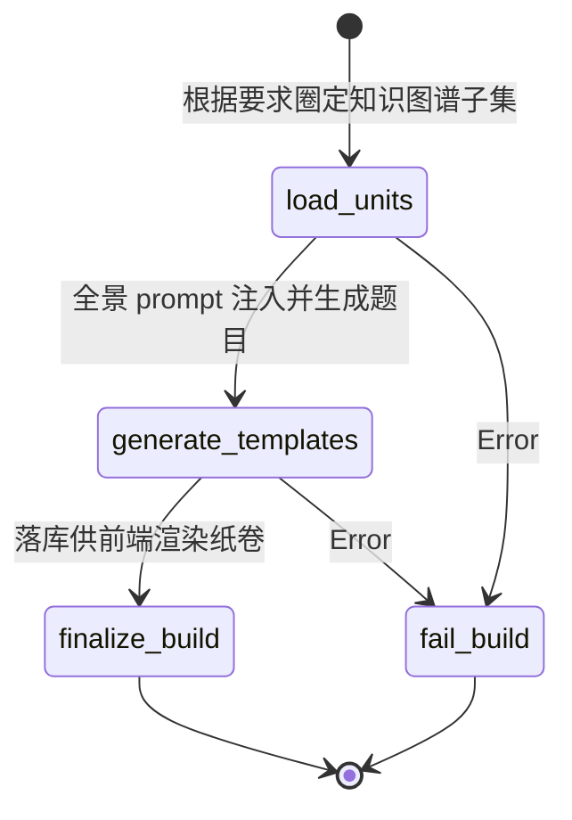
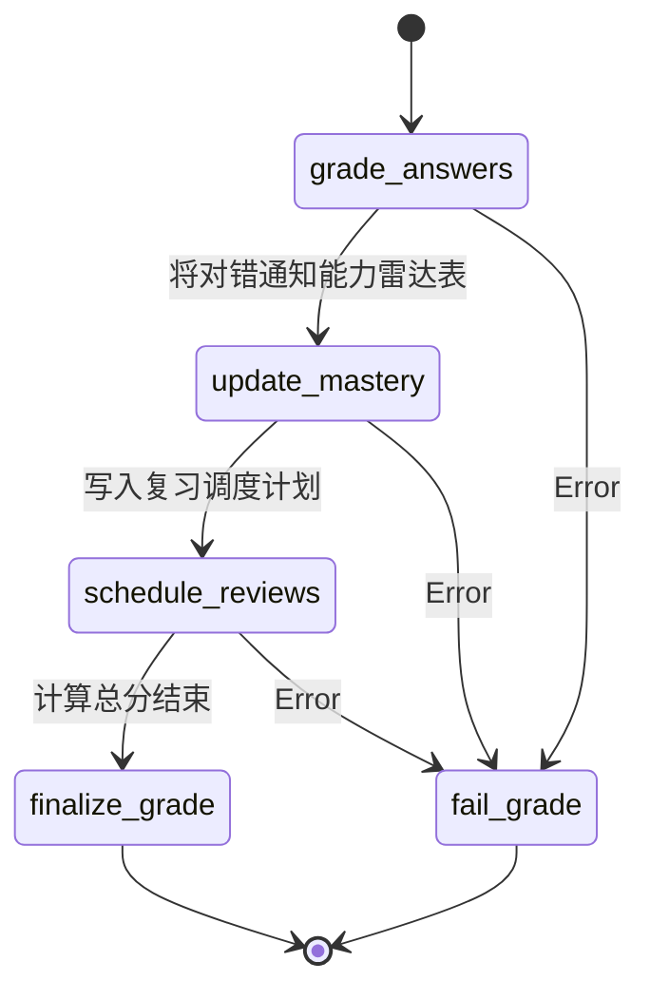

# 07. Examine 引擎 (诊断引擎)

## 1. 引擎定位

Examine 引擎（诊断引擎）负责构建 AITeachMe 的“千人千面考卷与智能批改流水线”。它不再是传统的题库随机抽题（那只会在会的题上浪费时间），而是能结合用户的掌握度数据、错题记录，当场**“无中生有”**地结构化生成针对性的考卷。

考试结束后，不仅能够判定对错，它还会基于大模型总结出**错误归因标签（Error Cause Label）**与**详细解析**，并直接触发后续的 Profile Engine 驱动掌握度更新与遗忘曲线复习调度。

---

## 2. 状态机范式 (State Definition)

引擎内部拆分为组卷管线和批改管线，各自持有独立状态。

### 2.1 组卷状态 `QuestionBuildState`
用于承接生成题目的前置语境组装。

```python
class QuestionBuildState(TypedDict, total=False):
    subject: str
    user_id: str
    unit_ids: list[int]               # 被锁定的测试大纲范围
    questions_per_unit: int           # 每个单元的题目数量
    exam_mode: str
    preferred_question_types: list[str]
    user_prompt: str | None           # 用户附加诉求（如：多来点计算题）
    focus_prompt: str | None          # 提词注入
    context_locked: bool
    scope_locked: bool
    focus_teaching_unit_ids: list[int]
    focus_node_ids: list[int]
    templates_created: int            # 产出的试题模板数
    created_template_ids: list[int]   # 持久化落库后的试题 ID
    warnings: list[str]
    error: str | None
```

### 2.2 判卷状态 `ExamGradeState`
负责整个判卷生命周期的流转与下游 Profile 更新。

```python
class ExamGradeState(TypedDict, total=False):
    exam_paper_id: int                # 交卷后的物理卷宗 ID
    job_id: int
    grade_result: GradeResult | None           # 各个短题对错判定得分汇总
    mastery_result: MasteryUpdateResult | None # 提交给 Profile 的掌握度加宽统计
    review_tasks: list[int]                    # 生成的未来复习任务清单(艾宾浩斯)
    error: str | None
```

---

## 3. 管线架构图 (Pipeline Architecture)

### 3.1 组卷链路 (`QuestionBuildWorkflow`)


### 3.2 判卷链路 (`ExamGradeWorkflow`)
它是对知识漏斗的再确认阶段。



---

## 4. 核心处理节点解析

- **`generate_templates`**: 这是通过大规模 Prompt 控制 LLM 吐出 JSON 的节点。它会拉入 `unit_ids` 涵盖的全部真实文本资料，要求大模型输出包含：题干、选项（如有）、官方解答、解答解析、以及这道题主要考查哪个具体的 `Knowledge_Node_ID`。
- **`grade_answers`**: 遍历用户填写的文本。对于客观题（单选）使用精确比对；如果试题含有文本填空简答题，会再切一条路去调用大模型（传入参考答案与用户的开放答案），判定得分 `[0, 1]`。
- **`schedule_reviews`**: 基于对错结合记忆曲线（底层将委派给 Profile），生成类似于 `tomorrow, next_week, next_month` 的重现复习考点。

---

## 5. AI 提示词指纹 (Prompt Templates Showcase)

> 提示词位于 `app/workflows/examine/prompts/prompts.py`

### 5.1 考卷生成 Prompt (局部展示)
该 Prompt 强行灌入了用户的薄弱点和最新错题，迫使生成的试卷带有报复性针对考察属性。

```text
You are generating high-quality exam questions from curated teaching context.
Return JSON only in the shape {"questions": [...]}.

Requirements:
- Generate exactly {{ num_questions }} questions.
- Allowed question types: {{ question_types }}.
- Allowed difficulty values: {{ difficulties }}.
- Use only the provided knowledge packet.
- Questions must feel like a real teacher-made paper, not flash cards.
- Each question item must include:
  - question_type, difficulty, stem, options, answer, explanation, knowledge_node_id

Weak knowledge points:
{{ weak_knowledge_points }}

Recent mistakes:
{{ recent_mistake_stems }}

Knowledge packet:
{{ knowledge_packet }}
```

### 5.2 错误归因 Prompt
不仅要判对错，还要给患者开出具体的病原单：

```text
Pick the single best error cause label for the wrong answer.
Return only one of these labels:
concept_confusion (概念混淆)
calculation_error (计算错误)
prerequisite_gap (前置知识缺漏)
careless_mistake (粗心大意)
incomplete_understanding (理解不全面)
method_misapplication (方法误用)
unknown

Question:
{{ stem }}

Reference answer:
{{ answer }}

User answer:
{{ user_answer }}

Knowledge context:
{{ knowledge_context }}
```

### 5.3 文字简答题自动评分 Prompt (Short Answer Grade)

```text
Judge whether the user answer should receive full credit.
Return only `1` or `0`.
- `1` means the answer is substantially correct.
- `0` means the answer misses a key idea, contains a wrong claim, or is too incomplete.
```

---

## 6. 事件与周边交互 (Events & Lifecycle)

该引擎深度粘合了 `Profile Engine`：
1. **生成时借调 Profile**：组卷前，会读取 Profile 中的雷达图薄弱点数据与近期 Mistake。
2. **结算时触发 Profile**：判卷完成后，必须通知 `mastery_updater` 增加或降低某个图谱实体的熟悉度系数。

---

## 7. 优化空间探讨 (Ideas for Optimization)

1. **题目生成的自博弈测试 (Adversarial Testing)**：大模型生成的题目标准答案有时有漏洞或存在另一个合理答案。我们可以在 `generate_templates` 出来后，隐式创建一个**验证节点**，再调用另外一个便宜的批判模型作为学生去解题，如果发现解不出来或者产生歧义，则拒绝录入该题目并要求主模型重新生成。
2. **简答题的柔性给分 (Partial Credit)**：目前的 `SHORT_ANSWER_GRADE` 是强硬的整型 `1` 或 `0` 扣除满分制，这让用户的主观题容错率极低，后续可以将 Prompt 设计为输出 `0.0~1.0` 浮点数以支持柔性按步骤给分。
