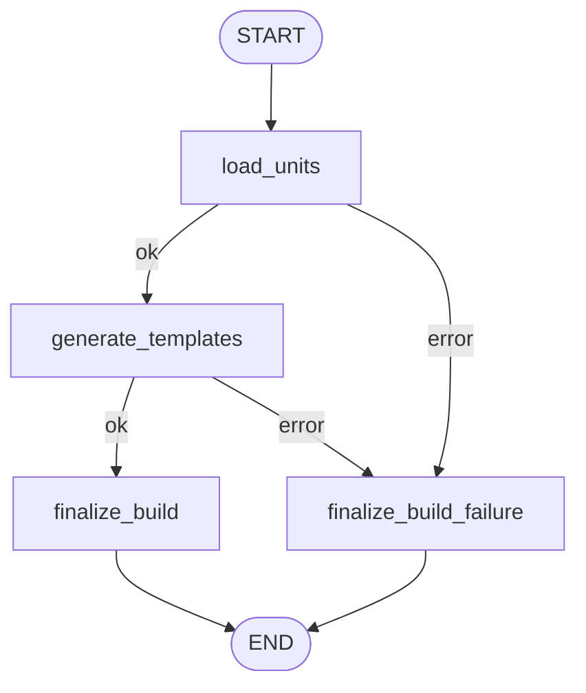
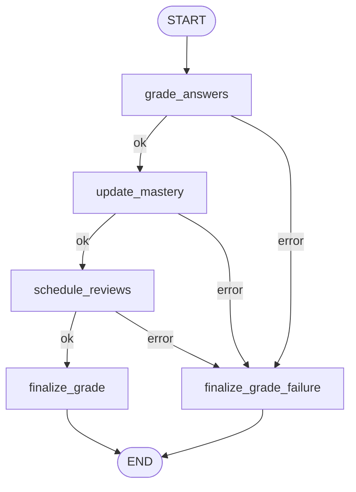

# 07. Examine 引擎 — 诊断引擎技术文档

> **最后更新**: 2026-04-16 · 基于 `backend/app/workflows/examine/` 代码实现

> 当前数据库以 `knowledge_unit / knowledge_edge` 为准；本文中出现的 `curriculum / teaching_unit / knowledge_node` 属于目标态或历史术语，课程结构表尚未落地。

---

## 1. 引擎定位与职责

Examine（诊断引擎）是 AITeachMe 的**评测与诊断闭环核心**，负责把 Digest 产出的知识结构转化为出题→考试→判卷→掌握度更新→复习调度的完整闭环。

> 当前公开 `api/exams.py` 仍处于 offline 占位状态，返回 `EXAMS_OFFLINE`。本文件描述的是 `backend/app/workflows/examine/` 内部能力和目标态契约，API 重新开放前需要以 `workflows/examine/application/` 为入口补齐联调。

**Examine 做四件事：**
1. 为每个教学单元生成题目模板（question_template）
2. 根据用户画像和考试模式自动组卷（exam_paper）
3. LLM 判卷 + 错因归因
4. 触发 Profile 更新掌握度和复习调度

---

## 2. 代码落点速查

| 层 | 模块路径 | 职责 |
|---|---|---|
| API | `backend/app/api/exams.py` | 出卷/提交/查分端点 |
| Application | `backend/app/workflows/examine/application/` | 考试用例编排、会话管理、组卷与判卷入口 |
| Workflow Graph | `backend/app/workflows/examine/graph.py` | LangGraph 图定义 |
| Workflow Runtime | `backend/app/workflows/examine/runtime.py` | 运行入口 |
| Workflow State | `backend/app/workflows/examine/state.py` | 状态类型 |
| 题目构建流程 | `backend/app/workflows/examine/question_build_workflow.py` | 构题 LangGraph 子图 |
| 题目生成器 | `backend/app/workflows/examine/question_builder.py` | LLM 出题核心 |
| 判卷流程 | `backend/app/workflows/examine/exam_grade_workflow.py` | 判卷 LangGraph 子图 |
| 判卷器 | `backend/app/workflows/examine/answer_grader.py` | LLM 判题核心 |
| 组卷器 | `backend/app/workflows/examine/paper_assembler.py` | 智能组卷策略 |
| 上下文构建 | `backend/app/workflows/examine/context.py` | 风格画像/单元上下文 |
| 试卷导出 | `backend/app/workflows/examine/paper_exporter.py` | 试卷 Markdown/JSON 导出 |
| 出题 Prompt | `backend/app/workflows/examine/question_build/prompts/generate.py` | 出题 prompt |
| 判卷 Prompt | `backend/app/workflows/examine/exam_grade/prompts/grade.py` | 判题/错因/分析 prompt |

---

## 3. 总体流程概览

Examine 包含两个独立的 LangGraph 子图和一个组卷服务：

```
┌──────────────────────────────────────────────────────────────────────────────┐
│                         Examine 三段式流程                                    │
│                                                                              │
│  Stage 1: 构题 (一次性)                                                       │
│  ┌──────────────────────────────────────────┐                                │
│  │ question_build_workflow                   │                                │
│  │ load_units → generate_templates → finalize│                                │
│  └──────────────────────────────────────────┘                                │
│       ↓ 产出: question_template (DB)                                          │
│                                                                              │
│  Stage 2: 组卷 (每次考试)                                                     │
│  ┌──────────────────────────────────────────┐                                │
│  │ paper_assembler.assemble_paper()          │                                │
│  │ → 从模板池选题 → 打乱选项 → 创建试卷         │                                │
│  └──────────────────────────────────────────┘                                │
│       ↓ 产出: exam_paper + exam_paper_item (DB)                               │
│                                                                              │
│  Stage 3: 判卷 (提交答案后)                                                    │
│  ┌──────────────────────────────────────────────────────┐                    │
│  │ exam_grade_workflow                                   │                    │
│  │ grade_answers → update_mastery → schedule_reviews →   │                    │
│  │ finalize_grade                                        │                    │
│  └──────────────────────────────────────────────────────┘                    │
│       ↓ 产出: exam_question_result, user_knowledge_state, review_task (DB)    │
└──────────────────────────────────────────────────────────────────────────────┘
```

---

## 4. LangGraph 图定义

### 4.1 题目构建子图



### 4.2 判卷子图



---

## 5. State 类型定义

### 5.1 `QuestionBuildState`

| 字段 | 类型 | 说明 |
|---|---|---|
| `subject` | `str` | 学科 slug |
| `user_id` | `str` | 用户 ID |
| `unit_ids` | `list[int]` | 目标教学单元 |
| `questions_per_unit` | `int` | 每单元生成题数 |
| `job_id` | `int` | 构建任务 ID |
| `exam_mode` | `str` | 考试模式 |
| `preferred_question_types` | `list[str]` | 偏好题型 |
| `user_prompt` | `str \| None` | 用户附加要求 |
| `focus_prompt` | `str \| None` | 聚焦提示 |
| `style_profile` | `ExamStyleProfile` | 风格画像 |
| `curriculum_version_id` | `int \| None` | 课程版本 |
| `template_context_signature` | `str \| None` | 上下文签名 (SHA256) |
| `context_locked` | `bool` | 是否锁定上下文 |
| `scope_locked` | `bool` | 是否锁定范围 |
| `focus_teaching_unit_ids` | `list[int]` | 聚焦单元 |
| `focus_node_ids` | `list[int]` | 聚焦节点 |
| `templates_created` | `int` | 已创建模板数 |
| `created_template_ids` | `list[int]` | 已创建模板 ID |
| `warnings` | `list[str]` | 构建警告 |
| `error` | `str \| None` | 错误信息 |

### 5.2 `ExamGradeState`

| 字段 | 类型 | 说明 |
|---|---|---|
| `exam_paper_id` | `int` | 试卷 ID |
| `job_id` | `int` | 判卷任务 ID |
| `grade_result` | `GradeResult \| None` | 判卷结果 |
| `mastery_result` | `MasteryUpdateResult \| None` | 掌握度更新结果 |
| `review_tasks` | `list[int]` | 生成的复习任务 |
| `error` | `str \| None` | 错误信息 |

---

## 6. 节点详解

### Stage 1: 题目构建流程

#### Node 1: `load_units`

```
输入: subject, unit_ids, user_id, exam_mode
操作:
  1. 构建 ExamStyleProfile:
     a. 加载样卷文件 (sample_file_uids) → 解析 Markdown
     b. 检测题型偏好 (单选/填空/简答的正则匹配)
     c. 检测试卷风格 (标题、分段标题、推荐题数)
     d. 加载 SubjectProfileSummary 和 UserProfileSummary
     e. 合并题型偏好和难度焦点
  2. 对每个 unit_id 构建 UnitExamContext:
     a. 从 teaching_unit 获取: name, summary, body, learning_objectives
     b. 通过 unit_membership 获取关联知识节点
     c. 对每个节点构建 NodeExamContext:
        - 从 knowledge_node + node_revision → name, summary, body
        - 从 user_knowledge_state → mastery_score, is_weak
     d. 从 knowledge_document 提取相关文档摘录 (doc_excerpt)
     e. 从 exam_question_result 加载近期错题
     f. 从 user_knowledge_state 识别薄弱节点
输出:
  unit_exam_contexts: list[UnitExamContext]
  style_profile: ExamStyleProfile
读 DB: teaching_unit, unit_membership, knowledge_node, node_revision,
       user_knowledge_state, exam_question_result, raw_file
```

#### Node 2: `generate_templates`（核心 LLM 节点）

```
输入: unit_exam_contexts, questions_per_unit, style_profile
操作:
  对每个 unit 并行调用 LLM 生成题目:
  1. 组装 prompt:
     system = EXAM_GENERATION_PROMPT (见第 7 节)
     user = UnitExamContext.prompt_block() (包含单元信息、知识锚点、薄弱点、风格画像)
  2. 调用 LLM → 解析 JSON 数组:
     每道题: { question_type, stem, options, answer, explanation, difficulty,
               knowledge_node_refs, tags }
  3. 校验: 题型是否在允许列表、选项是否完整
  4. 持久化: 创建 question_template 记录
     每条模板附带 selection_hints_json (记录生成上下文，用于组卷匹配)
输出: templates_created, created_template_ids
写 DB: question_template
LLM 调用: ✅ exam_generation (每 unit 一次)
```

#### Node 3: `finalize_build` / `finalize_build_failure`

```
成功: 更新 job 状态
失败:
  1. 删除本次 job 创建的所有 pending 模板 (回滚)
  2. 更新 job 状态 = "failed"
```

### Stage 2: 组卷

#### `assemble_paper()` 完整逻辑

> 文件: `backend/app/workflows/examine/paper_assembler.py`

```
输入: subject, user_id, exam_mode, num_questions, style_profile, ...
操作:

1. 确定课程版本:
   → curriculum_version_id 或从 DB 获取最新 published 版本

2. 加载兼容模板池:
   → 过滤: subject, curriculum_version, context_signature (如 locked)
   → 排除近 3 次考试用过的模板 (recent_template_exclusion)

3. 按考试模式执行不同的选题策略:

   ┌─ web_practice (在线练习):
   │  优先级: scope_units → review_due → weakpoint_boost → prereq_patch → default
   │  - 指定范围 → round_robin 从指定 unit 选题
   │  - 到期复习 → 从 due_knowledge_states 的 unit 选题
   │  - 薄弱强化 → 从 weak_states (mastery < 0.8) 的 unit 选题 (75%)
   │  - 前置补充 → 从薄弱 unit 的前置 unit 选题 (25%)
   │  - 兜底补充 → 从全量模板池 round_robin
   │
   └─ paper_exam (模拟试卷):
      - 根据课程主题树结构分配题量 (unit_weight ∝ 在主题树中的权重)
      - round_robin 按 unit 配额选题
      - 按题型分段排列 (单选→填空→简答)

4. Round-Robin 选题核心:
   - 按 unit 轮转，每 unit 每轮取一题
   - 跳过已选和 placeholder 模板
   - 选择理由 (reason) 记录到 selection_context_json

5. 单选题选项打乱:
   - 调用 shuffle_single_choice_options()
   - 保持 answer 与新顺序对应

6. 创建 exam_paper + exam_paper_item (批量写入)
   - section_plan: 试卷分段计划 (仅 paper_exam)
   - selection_context_json: 完整组卷上下文 (便于分析和回溯)

输出: ExamPaper (status="ready")
写 DB: exam_paper, exam_paper_item
```

### Stage 3: 判卷流程

#### Node 1: `grade_answers`（LLM 节点）

```
输入: exam_paper_id
操作:
  1. 从 DB 加载 exam_paper + exam_paper_item
  2. 对每个 item:
     ├─ 单选/填空: 精确匹配 (不调用 LLM)
     │  user_answer == answer_snapshot → correct
     └─ 简答题: 调用 LLM (GRADING_PROMPT)
        → 输入: stem, reference_answer, user_answer
        → 输出: { score (0~1), feedback, is_correct }
  3. 错因归因: 对每道错题调用 LLM (ERROR_CLASSIFICATION_PROMPT)
     → 输出: error_type (concept_error / calculation_error / careless / ...)
  4. 更新 exam_paper_item: user_answer, is_correct, score, feedback
输出: GradeResult { total_score, pass_rate, error_summary }
写 DB: exam_paper_item, exam_question_result
LLM 调用: ✅ grading (每道简答题) + error_classification (每道错题)
```

#### Node 2: `update_mastery`

```
输入: grade_result, exam_paper_id
操作:
  调用 Profile 引擎的 mastery_updater:
  1. 遍历本次考试涉及的知识节点
  2. 更新 user_knowledge_state.mastery_score:
     - 答对: mastery ↑ (最大 1.0)
     - 答错: mastery ↓ (最小 0.0)
     - 具体公式见 Profile 引擎文档
  3. 聚合 unit 级掌握度
输出: MasteryUpdateResult
写 DB: user_knowledge_state
```

#### Node 3: `schedule_reviews`

```
输入: mastery_result
操作:
  调用 Profile 引擎的 review_scheduler:
  1. 对 mastery < 阈值 的节点/单元安排复习
  2. 使用遗忘曲线计算 next_review_at
  3. 创建 review_task 记录
输出: review_tasks (任务 ID 列表)
写 DB: review_task, user_knowledge_state.next_review_at
```

#### Node 4: `finalize_grade` / `finalize_grade_failure`

```
成功: 更新 exam_paper.status = "graded"
失败: 标记 error，不回滚判分 (已持久化的部分判分保留)
```

---

## 7. Prompt 模板全文

> 文件: `backend/app/workflows/examine/question_build/prompts/generate.py` 与 `backend/app/workflows/examine/exam_grade/prompts/grade.py`

### 7.1 出题 Prompt `EXAM_GENERATION_PROMPT`

```
你是一位专业的命题老师，负责根据教学单元的知识内容生成高质量测试题目。

## 基本规则
1. 题目必须紧扣给定的知识点和学习目标
2. 题干表述清晰、准确、无歧义
3. 每道题必须有标准答案和详细解析
4. 数学公式使用 LaTeX 格式：行内 $...$，独立 $$...$$
5. 不得出超纲题（超出给定知识范围的题目）

## 题型要求
- **single_choice**（单选题）：4 个选项，答案为选项文本
- **fill_blank**（填空题）：答案简洁明确
- **short_answer**（简答题）：答案包含关键步骤和结论

## 难度分布
- easy: 基础概念直接考查
- medium: 需要一定思考和推理
- hard: 综合运用、多步推理

## 输出格式
JSON 数组，每个元素:
{
  "question_type": "single_choice" | "fill_blank" | "short_answer",
  "stem": "题目正文 (支持 LaTeX)",
  "options": ["A选项", "B选项", "C选项", "D选项"],  // 仅单选题
  "answer": "标准答案",
  "explanation": "详细解题思路",
  "difficulty": "easy" | "medium" | "hard",
  "knowledge_node_refs": ["关联知识点名称"],
  "tags": ["标签1", "标签2"]
}
```

### 7.2 判题 Prompt `GRADING_PROMPT`

```
你是一位严谨的阅卷老师。请根据标准答案判断学生的答案是否正确，并给出评分和反馈。

## 输入信息
- 题目: {stem}
- 标准答案: {reference_answer}
- 学生答案: {user_answer}

## 评分规则
1. score: 0.0 ~ 1.0 浮点数
2. 核心概念正确但表述不完整 → 0.5~0.8
3. 思路正确但计算错误 → 0.3~0.6
4. 完全错误或未作答 → 0.0

## 输出格式 (JSON)
{ "score": 0.8, "is_correct": true, "feedback": "..." }
```

### 7.3 错因归因 Prompt `ERROR_CLASSIFICATION_PROMPT`

```
请分析学生答题错误的原因类别。

错误类型:
- concept_error: 概念理解错误
- calculation_error: 计算/推导过程出错
- careless: 粗心大意（如抄错数字）
- incomplete: 答案不完整
- misunderstanding: 题意理解偏差
- other: 其它

输出: { "error_type": "...", "explanation": "..." }
```

### 7.4 错误分析 Prompt `ERROR_ANALYSIS_PROMPT`

```
请对学生的一批答题结果做综合分析，找出知识薄弱点和学习建议。

输出: { "weak_topics": [...], "suggestions": [...], "overall_assessment": "..." }
```

---

## 8. 风格画像 `ExamStyleProfile`

> 文件: `backend/app/workflows/examine/context.py`

`ExamStyleProfile` 是 Examine 的核心上下文对象，融合了样卷分析、用户画像和学科画像：

```python
@dataclass(frozen=True)
class ExamStyleProfile:
    source_file_uids: list[str]        # 参考样卷文件 UID
    title_hint: str                     # 猜测的试卷标题风格
    format_hint: str                    # "standard" | "paper_exam"
    section_titles: list[str]           # 检测到的分段标题 (如"一、单项选择题")
    preferred_question_types: list[str] # 偏好题型 (合并样卷+学科+用户画像)
    question_type_bias: dict[str, float]# 题型偏向权重
    recommended_question_count: int | None  # 推荐总题数
    difficulty_focus: str | None        # 难度焦点 ("easy"/"medium"/"hard"/"mixed")
    focus_teaching_unit_ids: list[int]  # 聚焦教学单元 (来自学科画像)
    focus_node_ids: list[int]           # 聚焦知识节点 (来自学科画像)
    style_prompt: str | None            # 风格提示 (用户自定义或默认)
    focus_prompt: str | None            # 聚焦提示
    user_prompt: str | None             # 用户通用要求
    notes: list[str]                    # 构建过程备注
```

**构建逻辑** (`build_exam_style_profile()`):
1. 从样卷 Markdown 中检测: 标题、题型比例、分段结构、推荐题数
2. 从 SubjectProfileSummary 获取: 推荐考试模式、聚焦单元/节点、难度、推荐题数
3. 从 UserProfileSummary 获取: 偏好解释风格、偏好节奏
4. 合并 preferred_question_types: 样卷 + 学科 + 用户
5. 如果是 paper_exam 模式且无样卷，注入默认风格 prompt

---

## 9. 与其他引擎的接口关系

### Digest → Examine
- `teaching_unit` + `unit_membership` → 出题的知识范围
- `knowledge_node` + `node_revision` → 出题内容和知识锚点
- `knowledge_document` → 文档摘录供 prompt 使用
- `curriculum_snapshot` → 组卷时确定课程版本和主题树

### Examine → Profile
- `grade_result` → 触发 `mastery_updater`
- `mastery_result` → 触发 `review_scheduler`
- `exam_question_result` → 错题记录供未来出题/伴读使用

### Profile → Examine
- `user_knowledge_state` → 掌握度 + 薄弱点用于组卷策略
- `review_task` → 到期复习项用于练习出卷
- `SubjectProfileSummary` + `UserProfileSummary` → 构建风格画像

---

## 10. 已知边界与演进方向

1. 简答题判分依赖 LLM，质量受模型能力限制
2. 单选/填空使用精确匹配，不支持近似答案
3. 组卷的 round-robin 策略可能导致某些 unit 题目被重复使用
4. `template_context_signature` (SHA256) 用于题目复用策略，同签名的模板可直接复用
5. 错因归因只产出单一 error_type，不支持多因素归因
6. 未来考虑增加自适应出题 (根据实时作答情况动态调整后续题目难度)
