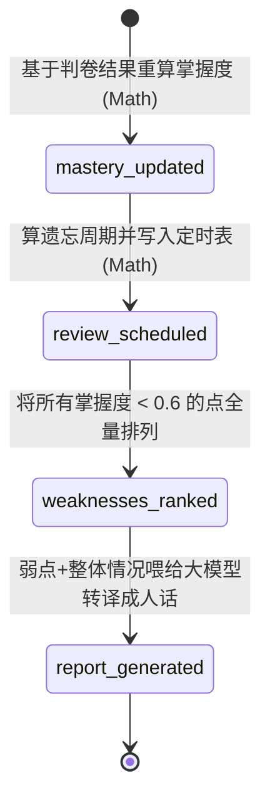

# 08. Profile 引擎 (显影引擎)

## 1. 引擎定位

Profile 引擎（显影引擎）是系统内的隐形推手，它通常不主动向用户发起页面交互，而是默默监听所有行为，作为**“学习资产记账中心”**。

在用户刷完一道题、读完一章讲义时，该引擎基于统计学公式（如 Ebbinghaus 遗忘曲线或简单的指数衰减）与 BKT (贝叶斯知识追踪) 逻辑，为你在系统中具象出那张 **代表你的能力的六边形雷达图**。

它的职责是把冰冷的判卷分数转译成动态的、细化到原子的 Mastery (掌握程度 $M \in [0, 1]$)，并由此生成结构化学习建议。

---

## 2. 状态机范式 (State Definition)

Profile Engine 在底层的图状态较轻，因为它的核心工作落在数学运算而非大模型的多轮次推理上：

```python
class ProfileWorkflowState(TypedDict, total=False):
    mastery_updated: bool       # 状态表 user_knowledge_state 是否已全量计算
    review_scheduled: bool      # 艾宾浩斯复习闹钟是否已写入 review_task 表
    weaknesses_ranked: bool     # 弱势排行 TopK 雷达角是否被算出
    report_generated: bool      # 阶段学习周报/报告文字是否已被大模型撰写
```

> **注意：** 该图在部分链路中（例如 ExamGrade 结束后）是采取函数调用同步触发的方式执行的，这是因为掌握度计算需要提供强一致性数据支持，防止脏读。

---

## 3. 管线架构图 (Pipeline Architecture)

这也是一条纯 Sequential 流式的状态图。



---

## 4. 核心处理逻辑与模块解析

虽然图节点简单，但背后的物理文件封装极其厚重（主要看 `mastery_updater.py`, `review_scheduler.py`）：

### 4.1 **`mastery_updated` (掌握度更新算子)**

这个节点不调用 LLM，纯数学计算。
它的输入来源是 Examine 提供的一组答卷记录，核心逻辑：
1. 取出针对该实体（比如“洛必达法则”）你过去 7 天的正确率。
2. $M_{new} = M_{old} + \alpha * (Score - Expected)$ 的变形计算（类似于 Elo 分数变动机制）。
3. 递归更新关联实体（如果大章节考了 10 分，它的子章节也要承受不同程度的扣分株连机制）。

### 4.2 **`review_scheduled` (复习防遗忘闹钟)**

基于 SM-2 / 艾宾浩斯算法的思想，如果一道题你第 1 次答对，闹钟定在次日；如果连续 3 次答对，闹钟定在 7 天后。
写入底层表 `review_task` 中的 `forgetting_due_at` 字段，等待前端在当天去唤醒 Interact 引擎。

### 4.3 **`weaknesses_ranked`**

这直接为后续的 Interact“伴读引擎”提供靶区。伴读引擎注入语境的那个 `weak_points` 下的所有标签都是从这算的，通常优先推给它最近出错频率最高且属于必修基干知识（Topic/Concept 层）的节点。

---

## 5. AI 提示词指纹 (Prompt Templates Showcase)

> 位于 `workflows/profile/prompts/prompts.py`

此引擎几乎是全自动化代码，唯一一次调用 LLM 是为了把统计出来的数据转化成能让用户感动的**行动倡议（Call to Action）报告**。

```text
请根据下面的学习情况，给出 3 到 5 条简洁、可执行的复习建议。
要求：
1. 每条建议一行
2. 不要编号
3. 不要空话，要能直接执行

学科：
{{ subject }}

整体掌握度：
{{ overall_mastery }}

薄弱知识点：
{{ weak_points }}
```

---

## 6. 事件与周边交互 (Events)

- **入口触发**：
  1. `ExamineEngine.ExamGrade` 结尾处强同步拉起，以防止考完试切出来发现雷达图没动。
  2. `InteractEngine` 结束后异步发出事件拉起，以完成对话中的隐式学习记录。
- **出口产物**：
  - 更新核心用户状态表：`user_knowledge_state`（修改 mastery/level 指标）。
  - 创建未来任务：`review_task` 等待定时处理。

---

## 7. 优化空间探讨 (Ideas for Optimization)

1. **更强大的贝叶斯知识追踪 (BKT 演进)**：从简单的加减罚分逐步进入到真正的“预判你是否会做”。BKT 具备基于大类推断小类的能力，目前这块还比较粗糙，可以结合大模型的置信度（Logprobs）进行复合算分。
2. **长尾记忆衰退扫描**：目前是在考试后顺发计算复习时间戳。但用户可能一个月没上线，这部分冷数据的衰退是“未被触发写入系统”的。需要引入定期的 CronJob 来扫盘整体掌握度折旧，使其真实反应人类认知衰减。
