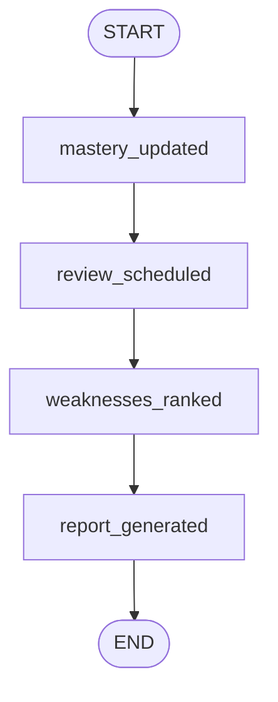

# 08. Profile 引擎 — 画像引擎技术文档

> **最后更新**: 2026-04-16 · 基于 `backend/app/workflows/profile/` 代码实现

---

## 1. 引擎定位与职责

Profile（画像引擎）是 AITeachMe 的**学习状态中枢**，负责把考试结果转化为可量化的掌握度分数，并驱动个性化的复习调度和薄弱点诊断。

**Profile 做四件事：**
1. **掌握度更新** — 把判卷结果转化为节点/单元级 mastery_score
2. **复习调度** — 基于 SM-2 算法和遗忘曲线安排复习时间
3. **薄弱点分析** — 多因子加权排序，识别用户最薄弱的教学单元
4. **画像聚合** — 构建学科画像 (SubjectProfileSummary) 和用户画像 (UserProfileSummary)

**Profile 不做：**
- ❌ 不出题、不组卷（Examine 的事）
- ❌ 不与用户对话（Interact 的事）
- ❌ 不构建知识图谱（Digest 的事）

---

## 2. 代码落点速查

| 层 | 模块路径 | 职责 |
|---|---|---|
| Workflow Graph | `backend/app/workflows/profile/pipeline/graph.py` | LangGraph 概览图定义与运行入口 |
| Workflow State | `backend/app/workflows/profile/pipeline/state.py` | 状态类型 |
| Pipeline Lib | `backend/app/workflows/profile/pipeline/lib/` | 掌握度更新、复习调度、薄弱点分析、画像聚合、报告建议 |
| Prompt 模板 | `backend/app/workflows/profile/pipeline/prompts/` | 分析类 prompt |

---

## 3. LangGraph 流程图



**架构特点**: Profile 的 LangGraph 定义是一个**概览级编排图**，四个节点串行。实际的核心计算逻辑封装在各自的独立模块中（mastery_updater、review_scheduler、weakness_analyzer），由 Examine 的判卷流程直接调用，而非通过 Graph 运行时触发。

---

## 4. State 类型定义

### `ProfileWorkflowState`

| 字段 | 类型 | 说明 |
|---|---|---|
| `mastery_updated` | `bool` | 掌握度是否已更新 |
| `review_scheduled` | `bool` | 复习是否已安排 |
| `weaknesses_ranked` | `bool` | 薄弱点是否已排序 |
| `report_generated` | `bool` | 报告是否已生成 |

### `UserKnowledgeState` 核心字段（DB 模型）

> Profile 的所有计算结果最终持久化到 `user_knowledge_state` 表。

| 字段 | 类型 | 说明 |
|---|---|---|
| `user_id` | `str` | 用户 ID |
| `subject` | `str` | 学科 slug |
| `teaching_unit_id` | `int \| None` | 教学单元 ID (unit 级状态) |
| `knowledge_node_id` | `int \| None` | 知识节点 ID (node 级状态) |
| `mastery_score` | `float` | 掌握度分数 [0.0, 1.0] |
| `confidence_score` | `float` | 置信度 = min(1.0, total_attempts / 10) |
| `stability_score` | `float` | 稳定度 = min(1.0, consecutive_correct / 5) |
| `total_attempts` | `int` | 累计答题次数 |
| `correct_attempts` | `int` | 累计正确次数 |
| `last_attempt_at` | `datetime` | 最后答题时间 |
| `forgetting_due_at` | `datetime \| None` | 预测遗忘时间点 |
| `review_priority` | `float` | 复习优先级 = 1.0 - mastery_score |
| `review_status` | `str` | "idle" / "pending" / "expired" |
| `scheduled_review_at` | `datetime \| None` | 下次复习时间 |
| `review_interval_days` | `int` | SM-2 当前间隔天数 |
| `review_ease_factor` | `float` | SM-2 难度系数 [1.3, 2.5] |
| `review_repetition_count` | `int` | SM-2 复习轮次 |
| `review_reason` | `str \| None` | 复习原因标签 |
| `source_exam_paper_id` | `int \| None` | 来源试卷 |
| `state_version` | `int` | 状态版本号 (乐观锁) |
| `stats_json` | `str` | 扩展统计 JSON |

**关键约束**: `teaching_unit_id` 和 `knowledge_node_id` 互斥——每条 state 记录要么追踪一个 unit，要么追踪一个 node。

---

## 5. 核心模块详解

### 5.1 掌握度更新器 `mastery_updater.py`

#### 入口函数: `update_mastery_from_exam(session, exam_paper_id)`

```
输入: exam_paper_id
操作:

1. 加载 exam_paper + exam_paper_item (已判分的)
2. 拆分答题记录为两个维度:

   ┌─ unit 维度: 每个 item 直接归属 teaching_unit_id
   │  → unit_attempts[unit_id].append(WeightedAttempt)
   │
   └─ node 维度: 解析 item.node_refs_json
      → 每个 {knowledge_node_id, coverage_weight} 对
      → coverage_weight 归一化 (各 node 权重之和 = 1.0)
      → node_attempts[node_id].append(WeightedAttempt)

3. 对每组 attempts 调用 _upsert_state_from_attempts():
   a. 加载已有 UserKnowledgeState (如有)
   b. 计算本次考试加权掌握度 (current_exam_score)
   c. 与历史掌握度合并 (merged mastery)
   d. 更新辅助指标 (confidence, stability, stats)
   e. upsert 到 DB

输出: MasteryUpdateResult { exam_paper_id, states_updated, updated_state_ids }
```

#### 掌握度计算公式

**Step 1: 加权正确率 (current_exam_score)**

```python
weighted_mastery = Σ(weight_i × is_correct_i) / Σ(weight_i)

其中每个 attempt 的权重 weight_i = difficulty_weight × time_decay_weight × coverage_weight

difficulty_weight:
  easy   → 0.8
  medium → 1.0
  hard   → 1.2

time_decay_weight:
  exp(-age_days / half_life_days)  # half_life_days = 30
  → 越久远的答题记录权重越低
```

**Step 2: 历史合并 (merged mastery)**

```python
alpha = fresh_weight / (history_weight + fresh_weight)
alpha = clamp(alpha, 0.25, 0.85)

merged = existing_mastery × (1 - alpha) + current_exam_score × alpha

其中:
  history_weight = max(1, existing.total_attempts)
  fresh_weight   = max(1.0, current_exam_weight × 1.5)
```

> **设计意图**: alpha 在 [0.25, 0.85] 范围内自适应——历史数据少时新数据占主导 (alpha→0.85)，历史数据多时更稳定 (alpha→0.25)。

**Step 3: 辅助指标**

```
confidence_score = min(1.0, total_attempts / 10)
  → 答题次数越多，对掌握度的置信越高

stability_score = min(1.0, consecutive_correct / 5)
  → 连续答对越多，掌握越稳定

review_priority = 1.0 - mastery_score
  → 掌握度越低，复习优先级越高
```

#### 扩展统计 `stats_json`

每次更新时追加到 `stats_json` 的统计字段:

| 统计项 | 说明 |
|---|---|
| `question_type_counts` | {单选: N, 填空: M, ...} |
| `difficulty_counts` | {easy: N, medium: M, hard: K} |
| `error_cause_counts` | {concept_error: N, calculation_error: M, ...} |
| `hint_used_count` | 使用提示的次数 |
| `timed_attempt_count` | 有计时的答题次数 |
| `total_time_spent_seconds` | 总用时 |
| `avg_time_spent_seconds` | 平均用时 |
| `confidence_self_report_count` | 自我评估次数 |
| `avg_confidence_self_report` | 平均自我评估分 |
| `last_question_type` | 最后一次的题型 |
| `last_difficulty` | 最后一次的难度 |
| `last_error_cause_label` | 最后一次的错误原因 |

---

### 5.2 复习调度器 `review_scheduler.py`

#### 入口函数: `schedule_reviews(session, user_id, subject, updated_state_ids)`

```
输入: user_id, subject, updated_state_ids (来自 mastery_updater)
操作:

1. 过期清理:
   遍历该用户的所有 pending review
   → scheduled_review_at + 7天 < now → status = "expired"

2. 对每个 updated state:
   a. 计算遗忘预测:
      forgetting_due_days = 1 + mastery × 11 + stability × 18
      forgetting_due_at = now + forgetting_due_days (上限 30 天)

   b. 判断是否需要复习:
      ├─ mastery ≥ 0.8 → review_status = "idle" (不需要复习)
      └─ mastery < 0.8 → 安排复习

   c. 如需复习 → SM-2 算法计算下次间隔:
      if accuracy > 0.8:  ease_factor += 0.15
      if accuracy < 0.6:  ease_factor -= 0.20
      ease_factor = clamp(ease_factor, 1.3, 2.5)

      if repetition = 0: interval = 1 天
      if repetition = 1: interval = 6 天
      if repetition ≥ 2: interval = round(current_interval × ease_factor)

   d. 如果已经过了遗忘时间 → scheduled_review_at = now (立即复习)

   e. 计算复习优先级:
      priority = (1-mastery)×0.5 + (1-stability)×0.25 + incorrect_rate×0.25 + due_bonus×0.3

   f. 推断复习原因:
      ├─ forgetting_due_at ≤ now → "forgetting_due"
      ├─ total_attempts ≤ 2 → "newly_learned"
      └─ else → "repeated_wrong"

输出: list[UserKnowledgeState] (已更新的状态)
```

#### SM-2 间隔示例

| 轮次 | 间隔 | 说明 |
|---|---|---|
| 0 | 1 天 | 首次复习 |
| 1 | 6 天 | 第二次复习 |
| 2 | 6 × EF = 15 天 | EF=2.5 时 |
| 3 | 15 × EF = 38 天 | 逐渐拉长 |

---

### 5.3 薄弱点分析器 `weakness_analyzer.py`

#### 入口函数: `analyze_weakness(session, user_id, subject, top_n=20)`

```
输入: user_id, subject
操作:

1. 加载所有 unit 级 UserKnowledgeState
2. 加载近 30 天错题统计 (per unit)
3. 加载课程主题树中各 unit 的考试权重
4. 检测前置依赖缺口 (prerequisite gap)

5. 对每个 unit 计算加权优先级:

   priority = mastery_component     (45%)
            + wrong_component       (20%)
            + prereq_component      (20%)
            + forgetting_component  (10%)
            + exam_weight_component (5%)

   其中:
   mastery_component     = (1.0 - mastery_score) × 0.45
   wrong_component       = recent_wrong_rate × 0.20
   prereq_component      = 0.20 if unit 有未掌握的前置依赖 else 0.0
   forgetting_component  = forgetting_risk × 0.10
   exam_weight_component = exam_weight × 0.05

6. 按 priority DESC 排序，取 top_n

输出: list[WeaknessItem]
```

#### 薄弱原因分类 `WeaknessReason`

| 原因 | 说明 | 触发条件 |
|---|---|---|
| `prereq_gap` | 前置依赖缺口 | 前置 unit mastery < 0.6 |
| `forgetting_due` | 遗忘到期 | forgetting_due_at ≤ now |
| `repeated_wrong` | 反复犯错 | 近期错误率 ≥ 50% 且答题 ≥ 2 次 |
| `newly_learned` | 新学知识 | 总答题 ≤ 2 次 |

#### 遗忘风险计算

```python
if forgetting_due_at ≤ now:
    forgetting_risk = 1.0  # 已过期
else:
    days_left = (due_at - now).days
    forgetting_risk = max(0, 1.0 - days_left / 30.0)  # 线性衰减
```

---

### 5.4 学科画像 `subject_profile.py`

#### `SubjectProfileSummary` 产出字段

| 字段 | 类型 | 计算方式 |
|---|---|---|
| `avg_unit_mastery` | `float \| None` | 所有 unit state 的 mastery_score 均值 |
| `avg_node_mastery` | `float \| None` | 所有 node state 的 mastery_score 均值 |
| `weak_unit_count` | `int` | mastery < 0.8 的 unit 数 |
| `weak_node_count` | `int` | mastery < 0.8 的 node 数 |
| `pending_review_count` | `int` | review_status = "pending" 的数量 |
| `due_review_count` | `int` | 已到期待复习的数量 |
| `preferred_question_types` | `list[str]` | 按答题频率 TOP 3 |
| `recommended_question_types` | `list[str]` | 按正确率 ASC 排序 TOP 2（薄弱优先） |
| `recommended_exam_mode` | `str` | 规则推断 (见下) |
| `recommended_question_count` | `int` | 推荐出题数 |
| `difficulty_focus` | `str` | "easy" / "medium" / "hard" / "mixed" |
| `focus_teaching_unit_ids` | `list[int]` | mastery ASC 排序 TOP 6 unit |
| `focus_node_ids` | `list[int]` | mastery ASC 排序 TOP 8 node |
| `question_type_accuracy` | `dict` | 各题型正确率 |
| `difficulty_accuracy` | `dict` | 各难度正确率 |

#### 考试模式推荐规则

```
if due_review_count ≥ 2         → web_practice  (有到期复习，赶紧练)
if avg_mastery < 0.35           → web_practice  (基础太差，不适合考试)
if weak_units ≥ 3 or weak_nodes ≥ 6 → web_practice  (薄弱点太多)
if avg_mastery ≥ 0.72 and weak_units ≤ 1 and weak_nodes ≤ 2
                                → paper_exam    (可以挑战模拟考)
else                            → web_practice
```

#### 推荐题数规则

```
paper_exam 模式         → 24 题
due_review ≥ 2          → max(8, min(14, due_count × 2))
else                    → max(10, min(16, weak_units × 2 or 10))
```

#### 难度焦点规则

```
avg_mastery < 0.35          → "easy"
hard 正确率 < 0.5           → "medium"
avg_mastery ≥ 0.75          → "mixed"
else                        → "medium"
```

---

### 5.5 用户画像 `user_profile.py`

#### `UserProfileSummary` 产出字段

| 字段 | 类型 | 计算方式 |
|---|---|---|
| `active_subject_count` | `int` | 活跃学科数 |
| `active_subject_ids` | `list[str]` | 活跃学科 slug 列表 |
| `recent_subject_ids` | `list[str]` | 近期考试涉及学科 TOP 5 |
| `preferred_question_types` | `list[str]` | 跨学科合并答题频率 TOP 3 |
| `preferred_exam_modes` | `list[str]` | 偏好考试模式 |
| `dominant_exam_mode` | `str` | 最常用的考试模式 |
| `explanation_style` | `str` | 解释风格偏好 (见下) |
| `pace_preference` | `str` | 学习节奏偏好 (见下) |
| `consistency_level` | `str` | 学习一致性 (见下) |
| `pending_review_count` | `int` | 跨学科待复习数 |
| `due_review_count` | `int` | 跨学科到期数 |

#### 解释风格推断

```
short_answer_total > max(choice_total, blank_total) → "guided"    (喜欢详细解析)
choice + blank ≥ max(2, short_answer × 2)           → "concise"   (喜欢简洁)
else                                                → "balanced"
```

#### 学习节奏推断

```
近 14 天考试 ≥ 6 次     → "quick_cycle"  (快速循环)
平均用时 ≥ 40 分钟      → "deep_dive"    (深入钻研)
else                    → "steady"       (稳步推进)
```

#### 学习一致性推断

```
近 30 天活跃天数 ≥ 10   → "high"      (高频学习)
近 30 天活跃天数 ≥ 4    → "steady"    (稳定学习)
else                    → "building"  (正在养成习惯)
```

---

## 6. 数据流总览

```
                     Examine 判卷完成
                           │
                           ▼
    ┌──────────────────────────────────────────────────────────────┐
    │ mastery_updater.update_mastery_from_exam()                    │
    │                                                              │
    │  exam_paper_item                                             │
    │   ├─ per unit_id → weighted_attempts → unit mastery          │
    │   └─ per node_id → weighted_attempts → node mastery          │
    │                                                              │
    │  → upsert user_knowledge_state (unit 级 + node 级)           │
    ├──────────────────────────────────────────────────────────────┤
    │ review_scheduler.schedule_reviews()                           │
    │                                                              │
    │  对每个 updated state:                                       │
    │   ├─ mastery ≥ 0.8 → idle (不安排复习)                       │
    │   └─ mastery < 0.8 → SM-2 → scheduled_review_at             │
    │                                                              │
    │  → update user_knowledge_state (review 字段)                 │
    ├──────────────────────────────────────────────────────────────┤
    │ weakness_analyzer.analyze_weakness() [按需调用]                │
    │                                                              │
    │  → 多因子排序 → top_n WeaknessItem                           │
    ├──────────────────────────────────────────────────────────────┤
    │ subject_profile.build_subject_profile_summary() [按需调用]     │
    │                                                              │
    │  → 聚合 unit/node states + exam items → SubjectProfileSummary│
    │  → 持久化到 subject.profile_json                              │
    ├──────────────────────────────────────────────────────────────┤
    │ user_profile.build_user_profile_summary() [按需调用]           │
    │                                                              │
    │  → 聚合跨学科 profiles + exam papers → UserProfileSummary    │
    │  → 持久化到 user.profile_json                                 │
    └──────────────────────────────────────────────────────────────┘
                           │
                           ▼
                Examine (组卷时消费画像)
                Interact (伴读时消费薄弱点)
```

---

## 7. 与其他引擎的接口关系

### Examine → Profile (触发方)

| 触发点 | 调用 | 产出 |
|---|---|---|
| 判卷完成 | `update_mastery_from_exam()` | `MasteryUpdateResult` |
| 判卷完成 | `schedule_reviews()` | 更新 review 字段 |

### Profile → Examine (消费方)

| 数据 | 消费场景 |
|---|---|
| `user_knowledge_state` | 组卷策略: 薄弱 unit 优先选题 |
| `SubjectProfileSummary` | 构建 ExamStyleProfile: 推荐模式/难度/题数 |
| `UserProfileSummary` | 构建 ExamStyleProfile: 解释风格/题型偏好 |
| `review_task (due)` | web_practice 模式: 到期复习 unit 优先 |

### Profile → Interact (消费方)

| 数据 | 消费场景 |
|---|---|
| `user_knowledge_state.mastery_score` | 加载薄弱知识点列表 |
| `exam_question_result` | 加载近期错题列表 |

### Digest → Profile (间接)

- Profile 通过 `knowledge_node_id` 关联 Digest 产出的知识图谱节点
- Profile 通过 `teaching_unit_id` 关联 Digest 产出的教学单元

---

## 8. 已知边界与演进方向

### 当前边界

1. SM-2 参数 (half_life_days=30, ease_factor 范围 1.3~2.5) 均为硬编码常量
2. 薄弱点分析的权重分配 (mastery 45% + wrong 20% + prereq 20% + forgetting 10% + exam 5%) 是固定值
3. SubjectProfileSummary 和 UserProfileSummary 以 JSON 形式存储在 subject/user 表中，写入时机为按需触发
4. 掌握度的 `alpha` 自适应范围 [0.25, 0.85] 覆盖了从冷启动到成熟状态的过渡
5. Profile 的 LangGraph 图是概览级定义，实际计算逻辑通过函数调用而非 Graph Runtime 执行

### 演进方向

1. SM-2 参数个性化: 根据用户学习风格和学科特点动态调整 ease_factor 范围
2. 遗忘曲线优化: 从固定线性模型升级为基于实际复习数据的拟合模型
3. 跨学科知识迁移: 识别不同学科间的共通概念，关联掌握度
4. 实时画像更新: 每次 Interact 会话后也触发轻量级画像更新（当前仅 Examine 触发）
5. 学习效率分析: 基于 `avg_time_spent_seconds` 和准确率结合评估学习效率
