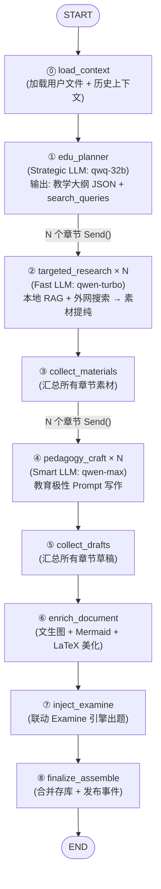

## 四、Digest DocGen 流程全链路重建

### 4.1 旧流程问题诊断

当前 `docgen/graph.py` 的拓扑：

```
load_files → cleanse → outline_map → outline_reduce → draft_chapter(fan-out)
  → collect_drafts → review_chapter(fan-out) → collect_reviews
  → extract_metadata → finalize_assemble → END
```

**问题清单**：

| # | 问题 | 根因 | 影响 |
|:---|:---|:---|:---|
| 1 | **LLM 注意力被噪声淹没** | `cleanse` 处理全量原文，`draft_chapter` 拿到的 `source_contents` 仍然是大段低质原文 | 生成质量差，token 浪费 |
| 2 | **大纲质量依赖原文结构** | `outline_map` 从原文提取 headers，`outline_reduce` 合并。如果原文结构差（如 PPT 碎片），大纲也差 | 章节划分不合理 |
| 3 | **无外部知识补充** | 整个流程只看用户上传的文件，不搜索外部资源 | 内容深度不足，不如蜂考速成课 |
| 4 | **无富媒体增强** | 纯文本 Markdown，无图片、无思维导图、无交互 | 视觉效果不如 PPT |
| 5 | **review 步骤效果有限** | `review_chapter` 只做结构检查和语义审阅，无法补充缺失内容 | 审阅变成"挑毛病"而非"补短板" |
| 6 | **串行瓶颈** | `outline_map → outline_reduce` 是串行的，且 `outline_map` 对每个 chunk 都调 LLM | 大文件时延迟高 |

### 4.2 新流程设计 — Plan-Execute-Write-Enrich

借鉴 gpt-researcher 的 Plan-Execute 范式，但完全重新设计为教育场景：

```
【新流程 — 4 阶段，Plan-Execute-Write-Enrich】

Phase 1: PLAN (edu_planner)
  → Strategic LLM 纯粹根据学科+模式生成"教学法骨架"
  → 不看任何原始文档！避免被低质原文污染

Phase 2: EXECUTE (targeted_research × N 并发)
  → 每个章节独立：本地RAG + 外网搜索 → 抓取 → 压缩
  → 只保留与该章节 required_elements 相关的高纯度干货

Phase 3: WRITE (pedagogy_craft × N 并发)
  → Smart LLM 只看高纯度素材，用教育极性 Prompt 写作
  → 输出带占位符的 Markdown（[IMAGE:...] [MERMAID:...] [INTERACTIVE:...]）

Phase 4: ENRICH (enrich_document + inject_examine + finalize)
  → 扫描占位符，调用各 Skill 生成富媒体
  → 联动 Examine 引擎出题
  → 组装入库
```

### 4.3 新版 LangGraph 拓扑



### 4.4 新版 State 定义

```python
# workflows/digest/docgen/state.py 重写

class DocGenState(TypedDict, total=False):
    """新版 DocGen 状态。"""

    # ── 输入 ──
    subject: str
    file_ids: list[int]
    user_prompt: str | None
    digest_mode: str                          # "sprint" | "systematic"
    tone: str                                 # "casual" | "professional" | "encouraging" | "concise"
    requested_at: datetime
    build_session_id: str
    shared_inputs: Any

    # ── Phase 0: load_context 输出 ──
    raw_chunks: list[dict[str, Any]]          # 用户上传文件的原始 chunks
    subject_profile: dict[str, Any] | None    # 学科画像（如果有）

    # ── Phase 1: edu_planner 输出 ──
    pedagogical_outline: list[dict[str, Any]] # ChapterPlan 列表
    planner_ms: int

    # ── Phase 2: targeted_research 输出（fan-out 汇聚） ──
    chapter_materials: Annotated[list[dict[str, Any]], operator.add]  # ChapterMaterial 列表
    research_ms: Annotated[int, operator.add]
    research_sources: Annotated[list[str], operator.add]  # 所有引用来源

    # ── Phase 3: pedagogy_craft 输出（fan-out 汇聚） ──
    chapter_drafts: Annotated[list[dict[str, Any]], operator.add]     # ChapterDraft 列表
    draft_ms: Annotated[int, operator.add]

    # ── Phase 4: enrich + examine + finalize 输出 ──
    enriched_markdown: str                    # 富媒体增强后的完整文档
    enrich_ms: int
    exam_questions: list[dict[str, Any]]      # 趁热打铁考题
    examine_ms: int
    doc_ids: list[int]
    merged_markdown: str
    merged_path: str
    finalize_ms: int

    # ── 可观测性 ──
    llm_calls_total: Annotated[int, operator.add]
    llm_calls_skipped: Annotated[int, operator.add]
    timing_summary: dict[str, Any]
    token_summary: dict[str, Any]
    error: str | None
```

### 4.5 各节点详细规范

#### ⓪ `load_context` — 加载上下文

| 维度 | 说明 |
|:---|:---|
| **模型** | 无 LLM 调用（纯 I/O） |
| **输入** | `subject`, `file_ids`, `build_session_id` |
| **输出** | `raw_chunks`, `subject_profile`, `shared_inputs` |
| **核心逻辑** | 复用现有 `load_files_node` 的逻辑，加载用户上传文件的 chunks。如果有 UnifiedBuildSession 则从中获取 shared_inputs。 |
| **LangSmith** | `wrap_digest_node(lane="docs", node_name="load_context")` |

**与旧流程的关系**：等价于旧 `load_files` 节点，但去掉了 `cleanse` 步骤（清洗由 `targeted_research` 中的 ContextCompressor 替代）。

#### ① `edu_planner` — 教研大纲规划（核心创新）

| 维度 | 说明 |
|:---|:---|
| **模型** | `acompletion_with_fallback(task_type=TaskType.REASONING)` → `qwq-32b` / `qwen-max` |
| **教育学公式** | Bloom 认知目标分类 + 教学法匹配 |
| **输入** | `subject` + `chunks`（文件内容） + `user_prompt` + `digest_mode` + `tone` |
| **输出** | `chapter_plans: list[ChapterPlan]` + `teaching_strategy: str` |
| **LangSmith** | `wrap_digest_node(lane="docs", node_name="edu_planner")` + metadata 含 `task_type=reasoning` |

**Prompt 设计原则**（移植 gpt-researcher 的 `plan_research_outline` 理念，但完全教育化）：

- Sprint 模式锁死 4 节：概念破冰 → 公式武器库 → 真题实战 → 防坑指南
- Systematic 模式锁死 6-8 节：动机 → 定义 → 定理 → 证明 → 应用 → 拓展 → 总结
- 每个章节必须包含 `search_queries`（2-3 个精准搜索词）和 `required_elements`（该章节必须包含的内容类型）

**输出 JSON Schema**：

```json
{
  "chapters": [
    {
      "chapter_index": 1,
      "title": "一句人话说清偏导数",
      "required_elements": ["通俗比喻", "几何截面图概念", "与全导数的区别"],
      "search_queries": ["偏导数 通俗理解 知乎", "偏导数 几何意义 图解"],
      "writing_instructions": "必须用生活实例开头，禁止直接写数学定义。需要一个 [MERMAID] 思维导图展示偏导数与相关概念的关系。",
      "media_hints": {
        "images": ["偏导数几何意义的三维截面图"],
        "mermaid": ["偏导数 vs 全导数 vs 方向导数 关系图"],
        "interactive": []
      }
    }
  ]
}
```

**与旧流程的关系**：替代旧 `outline_map` + `outline_reduce` 两个节点。旧流程从原文提取 headers 再合并，新流程由 Strategic LLM 直接规划教学骨架，质量天壤之别。

#### ② `targeted_research` — 靶向素材搜刮（Fan-Out）

| 维度 | 说明 |
|:---|:---|
| **模型** | `acompletion_with_fallback(task_type=TaskType.DOCGEN_LIGHT)` → `qwen-turbo` |
| **并发** | 每个章节一个 `Send()`, N 章并行，受 `strategy.chapter_semaphore` 控制 |
| **输入** | `ChapterPlan` (含 search_queries + required_elements) |
| **输出** | `ChapterMaterial { chapter_index, dense_context, sources }` |
| **核心逻辑** | 调用 `ResearchConductor` Skill 执行搜索 + 抓取 + 压缩 |
| **LangSmith** | `wrap_digest_node(lane="docs", node_name="targeted_research")` + 内部 Skill 自带追踪 |

**执行步骤**（移植自 `ResearchConductor`，教育域改造）：

```python
async def targeted_research_node(state: dict) -> dict:
    chapter = state["chapter_plan"]
    skill_ctx = SkillContext(
        subject=state["subject"],
        build_session_id=state["build_session_id"],
    )
    researcher = ResearchConductor(skill_ctx)

    # Step 1: 用 ResearchConductor 执行搜索 + 抓取 + 压缩
    result = await researcher.run(
        queries=chapter["search_queries"],
        local_rag_subject=state["subject"],
        max_results_per_query=5,
    )

    # Step 2: 用 Fast LLM 做素材提纯（只保留与 required_elements 相关的干货）
    compressed = await compress_context(
        raw_content=raw_content,
        query=chapter_plan["title"],
        task_type=TaskType.DOCGEN_LIGHT,
        threshold=COMPRESSION_THRESHOLD,
    )
    return {
        **chapter_plan,
        "dense_context": compressed,
        "sources": urls,
    }],
    "research_ms": ...,
    "research_sources": result.sources,
    "llm_calls_total": 2,  # search + purify
}
```

**与旧流程的关系**：这是全新节点，旧流程没有对应物。旧流程的 `draft_chapter` 直接拿原文写，新流程先搜索再提纯，确保 Smart LLM 只看高浓度干货。

#### ③ `collect_materials` — 汇总素材

纯汇聚节点，无 LLM 调用。等待所有 `targeted_research` fan-out 完成后，将 `chapter_materials` 按 `chapter_index` 排序。

#### ④ `pedagogy_craft` — 教学化写作（Fan-Out，核心）

| 维度 | 说明 |
|:---|:---|
| **模型** | `acompletion_with_fallback(task_type=TaskType.DOCGEN)` → `qwen-max` / `qwen-plus` |
| **教育学公式** | 知识点拆解 → 类比 → 例题 → 练习 → 小结 |
| **输入** | 单个 `ChapterPlan` + `dense_context` + `tone` |
| **输出** | `chapter_markdown: str`（含占位符） |
| **占位符** | `[IMAGE:偏导数的几何意义]`、`[MERMAID:梯度下降流程图]` — 留给 `enrich` 阶段解析 |
| **LangSmith** | `wrap_digest_node(lane="docs", node_name="pedagogy_craft")` + metadata 含 `task_type=docgen` |

**双模式 Prompt 策略**：

**Sprint 速成模式 System Prompt**：
```
你是蜂考级别的期末速成教父。你的受众是基础极差、时间极紧的大学生。

硬性排版要求:
1. 概念解释必须用 > [!TIP] 标出秒杀口诀
2. 每个核心公式后必须紧跟一句"大白话翻译"
3. 例题推导必须用 **STEP 1** / **STEP 2** / **STEP 3** 编号
4. 易错点必须用 > [!WARNING] 标出
5. 需要可视化的地方请用 <!-- [IMAGE: 描述] --> 占位符标记
6. 适合思维导图的地方请用 <!-- [MERMAID: 描述] --> 占位符标记
7. 公式必须用 $...$ (行内) 或 $$...$$ (独立行) 格式
8. 每节末尾必须有"本节速记卡"（3 句话总结）
```

**Systematic 系统课模式 System Prompt**：
```
你是数学/物理/工程学科的首席教授。你在为考研学子撰写可反复精读的系统课讲义。

硬性排版要求:
1. 定理必须用 > [!IMPORTANT] 标出，含完整条件和结论
2. 证明过程必须完整，步骤间用"∵ ... ∴ ..."连接
3. 表格对比必须用标准 Markdown 表格
4. 前置依赖必须在章首 > 📌 前置知识：... 中列出
5. 需要可视化的地方请用 <!-- [IMAGE: 描述] --> 占位符标记
6. 适合结构图的地方请用 <!-- [MERMAID: 描述] --> 占位符标记
7. 公式必须用 $...$ (行内) 或 $$...$$ (独立行) 格式
8. 每节末尾必须有"本节要点"（定理编号 + 一句话总结）
```

**与旧流程的关系**：替代旧 `draft_chapter` + `review_chapter` 两个节点。旧流程先写后审，新流程通过前置的 `edu_planner` + `targeted_research` 保障输入质量，写作一步到位，省去独立 review 步骤。

#### ⑤ `collect_drafts` — 汇总草稿

纯汇聚节点。按 `chapter_index` 排序，合并为完整 Markdown 文档。

#### ⑥ `enrich_document` — 富媒体增强（核心创新）

这是让文档**碾压 PPT** 的关键节点。

| 维度 | 说明 |
|:---|:---|
| **模型** | Fast LLM (规划) + 各种工具 API (执行) |
| **输入** | 合并后的完整 Markdown（含占位符） |
| **输出** | 富媒体增强后的 Markdown |
| **LangSmith** | `wrap_digest_node(lane="docs", node_name="enrich_document")` + 内部每个 Skill 自带追踪 |

**处理流程**：

```python
async def enrich_document_node(state: dict) -> dict:
    markdown = state["merged_markdown"]

    # 1. 扫描 <!-- [IMAGE: ...] --> 占位符 → 调用 ImageGenerator
    image_gen = ImageGenerator(skill_ctx)
    markdown = await image_gen.process_placeholders(markdown)

    # 2. 扫描 <!-- [MERMAID: ...] --> 占位符 → 调用 MermaidGenerator
    mermaid_gen = MermaidGenerator(skill_ctx)
    markdown = await mermaid_gen.process_placeholders(markdown)

    # 3. LaTeX 公式美化
    markdown = await normalize_math_delimiters(markdown)
    markdown = await validate_latex(markdown)

    # 4. 添加目录（如果章节 >= 4）
    if count_chapters(markdown) >= 4:
        toc = generate_toc(markdown)
        markdown = toc + "\n\n" + markdown

    return {"enriched_markdown": markdown, "enrich_ms": ...}
```

**占位符处理的并行优化**：

```python
# ImageGenerator.process_placeholders() 内部
async def process_placeholders(self, markdown: str) -> str:
    placeholders = re.findall(r'<!-- \[IMAGE: (.+?)\] -->', markdown)
    if not placeholders:
        return markdown

    # 并行生成所有图片
    tasks = [self._generate_one(desc) for desc in placeholders]
    results = await asyncio.gather(*tasks, return_exceptions=True)

    for desc, result in zip(placeholders, results):
        if isinstance(result, Exception):
            # 生成失败时保留占位符的文字描述
            markdown = markdown.replace(
                f'<!-- [IMAGE: {desc}] -->',
                f'> 📷 *{desc}*',
            )
        else:
            markdown = markdown.replace(
                f'<!-- [IMAGE: {desc}] -->',
                f'',
            )
    return markdown
```

**为什么这能碾压 PPT？**
- PPT 是静态的、线性的、设计工作量巨大
- 我们的文档是**响应式 Markdown**——内嵌 Mermaid 思维导图（前端渲染为 SVG）、LaTeX 公式（KaTeX 实时渲染）、AI 生成的解释性配图
- 前端渲染时可以加入暗色主题、代码高亮、公式交互（点击展开推导步骤）
- 未来 V2 可加入 `<!-- [INTERACTIVE: ...] -->` 支持嵌入式 HTML Demo

#### ⑦ `inject_examine` — 联动出题

| 维度 | 说明 |
|:---|:---|
| **模型** | Smart LLM |
| **输入** | 增强后的完整文档 |
| **输出** | 文档 + 尾部追加的 3 道考题 |
| **逻辑** | 将文档摘要发给 Smart LLM，生成 `## 📝 趁热打铁` 模块（1 道选择 + 1 道填空 + 1 道简答） |
| **LangSmith** | `wrap_digest_node(lane="docs", node_name="inject_examine")` |

#### ⑧ `finalize_assemble` — 组装入库

| 维度 | 说明 |
|:---|:---|
| **模型** | 无 LLM 调用 |
| **输入** | 完整增强文档 + 考题 |
| **输出** | `doc_ids`, `merged_markdown`, `merged_path` |
| **逻辑** | 复用现有 `finalize_node` 的存储逻辑：stage → publish → 写入 ContentStore |
| **LangSmith** | `wrap_digest_node(lane="docs", node_name="finalize_assemble")` |

### 4.6 新版 graph.py 骨架

```python
# workflows/digest/docgen/graph.py 重写

def build_docgen_graph(*, context: WorkflowContext) -> StateGraph:
    workflow = StateGraph(DocGenState)
    strategy = DocGenExecutionStrategy.from_settings()

    # 注册节点（每个都包裹 wrap_digest_node）
    for node_name, builder in [
        ("load_context", build_load_context_node),
        ("edu_planner", build_edu_planner_node),
        ("targeted_research", build_targeted_research_node),
        ("collect_materials", build_collect_materials_node),
        ("pedagogy_craft", build_pedagogy_craft_node),
        ("collect_drafts", build_collect_drafts_node),
        ("enrich_document", build_enrich_document_node),
        ("inject_examine", build_inject_examine_node),
        ("finalize_assemble", build_finalize_assemble_node),
    ]:
        workflow.add_node(
            node_name,
            wrap_digest_node(
                builder(context=context, strategy=strategy),
                workflow_name=context.workflow_name,
                lane="docs",
                node_name=node_name,
            ),
        )

    # 线性边
    workflow.set_entry_point("load_context")
    workflow.add_edge("load_context", "edu_planner")

    # edu_planner → targeted_research (fan-out)
    workflow.add_conditional_edges(
        "edu_planner",
        _build_research_sends,  # 返回 list[Send("targeted_research", {...})]
    )
    workflow.add_edge("targeted_research", "collect_materials")

    # collect_materials → pedagogy_craft (fan-out)
    workflow.add_conditional_edges(
        "collect_materials",
        _build_craft_sends,  # 返回 list[Send("pedagogy_craft", {...})]
    )
    workflow.add_edge("pedagogy_craft", "collect_drafts")

    # 线性收尾
    workflow.add_edge("collect_drafts", "enrich_document")
    workflow.add_edge("enrich_document", "inject_examine")
    workflow.add_edge("inject_examine", "finalize_assemble")
    workflow.add_edge("finalize_assemble", END)

    return workflow
```

### 4.7 与现有 Digest 三车道的关系

当前 Digest 引擎有三条并行车道：KG Lane / Docs Lane / Curriculum Lane。本次重构**只改 Docs Lane**，KG Lane 和 Curriculum Lane 完全不动。

```
Digest 统一入口 (runtime.py)
├── KG Lane (不变)
│   └── acquire_lock → prepare → extract → cluster → resolve → impact → finalize
├── Docs Lane (重构) ← 本文档范围
│   └── load_context → edu_planner → targeted_research → pedagogy_craft → enrich → examine → finalize
└── Curriculum Lane (不变)
    └── derive_units → theme_tree → prereq_dag → finalize
```

**兼容性保障**：
- `DocGenState` 的输出字段（`doc_ids`, `merged_markdown`, `merged_path`）保持不变
- `finalize_assemble` 节点的存储逻辑复用现有代码
- `build_session_id` 传递机制不变
- `wrap_digest_node()` 可观测性包装不变
- `DigestTimingReport` 的 docs lane summary 字段需要适配新节点名（具体映射见下表）

**`observability.py` → `build_docs_lane_summary()` 字段映射**：

| 旧字段名 | 新字段名 | 说明 |
|:---|:---|:---|
| `cleanse_ms` | *(删除)* | 清洗由 ContextCompressor 替代，无独立计时 |
| `outline_ms` | `planner_ms` | edu_planner 规划耗时 |
| `draft_ms` | `draft_ms` | pedagogy_craft 写作耗时（字段名不变） |
| `review_ms` | *(删除)* | 取消独立 review，由前置 Research 保障质量 |
| `metadata_ms` | *(删除)* | 合并进 finalize_assemble |
| *(新增)* | `research_ms` | targeted_research 搜索+压缩耗时 |
| *(新增)* | `enrich_ms` | 富媒体增强耗时 |
| *(新增)* | `examine_ms` | 联动出题耗时 |

### 4.8 错误处理策略

| 节点 | 失败行为 | 降级策略 |
|:---|:---|:---|
| `edu_planner` | JSON 解析失败 | 重试 1 次，仍失败则用 fallback 模板（速成课固定 4 章 / 系统课固定 6 章） |
| `targeted_research` | 某章搜索无结果 | 该章 `dense_context` 设为空，`pedagogy_craft` 纯靠 LLM 知识生成 |
| `pedagogy_craft` | 超 token limit | 截断 `dense_context` 到 4000 字后重试 |
| `enrich_document` | 图片生成失败 | 占位符降级为文字描述 `> 📷 *描述*` |
| `enrich_document` | Mermaid 生成失败 | 占位符降级为无序列表 |
| `inject_examine` | 出题失败 | 跳过，文档不含趁热打铁模块 |
| `finalize_assemble` | 存储失败 | 抛异常，不影响 KG/Curriculum Lane（各 Lane 独立） |

### 4.9 流式输出（前端实时进度）

通过 WebSocket 推送 DocGen 进度（移植 gpt-researcher 的 `stream_output()` 模式）：

```python
# 进度事件类型定义
ProgressEvent = Literal[
    "plan",       # edu_planner 完成
    "research",   # targeted_research 每章完成
    "draft",      # pedagogy_craft 每章完成
    "media",      # enrich_document 每个媒体完成
    "examine",    # inject_examine 完成
    "done",       # finalize 完成
]

# 推送示例
edu_planner 完成  → {"type": "plan", "chapters": [...], "mode": "sprint"}
targeted_research 每章完成 → {"type": "research", "chapter": 1, "sources": 5, "total": 4}
pedagogy_craft 每章完成    → {"type": "draft", "chapter": 1, "words": 2500, "total": 4}
enrich_document 每个媒体完成 → {"type": "media", "kind": "mermaid", "chapter": 2}
inject_examine 完成        → {"type": "examine", "question_count": 3}
finalize 完成             → {"type": "done", "doc_id": 123, "word_count": 12000}
```

**实现方式**：在 `wrap_digest_node()` 中注入 WebSocket 回调，每个节点完成时自动推送。回调通过 `WorkflowContext` 传入，不修改 `wrap_digest_node()` 本身的签名。

### 4.10 新版 `create_docgen_initial_state()` 签名

```python
def create_docgen_initial_state(
    *,
    subject: str,
    file_ids: list[int],
    user_prompt: str | None,
    digest_mode: str = "sprint",        # 新增
    tone: str = "casual",               # 新增
    requested_at: datetime,
    build_session_id: str | None,
) -> DocGenState:
    return {
        "subject": subject,
        "file_ids": file_ids,
        "user_prompt": user_prompt,
        "digest_mode": digest_mode,
        "tone": tone,
        "requested_at": requested_at,
        "build_session_id": build_session_id or "",
        "error": None,
    }
```

---
