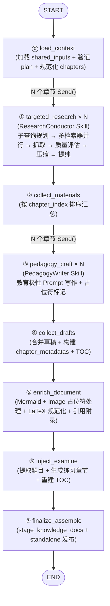

## 四、Digest DocGen 流程全链路重建

> **最后更新**：2026-04-08 — 反映 Phase 2 已完成后的实际实现状态

### 4.1 旧流程问题诊断（历史记录）

旧版 `docgen/graph.py` 的拓扑已被替代：

```
旧: load_files → cleanse → outline_map → outline_reduce → draft_chapter(fan-out)
      → collect_drafts → review_chapter(fan-out) → collect_reviews
      → extract_metadata → finalize_assemble → END

新: load_context → targeted_research(fan-out) → collect_materials
      → pedagogy_craft(fan-out) → collect_drafts → enrich_document
      → inject_examine → finalize_assemble → END
```

旧流程的 6 个核心问题已全部解决：

| # | 旧问题 | 新流程解决方案 | 状态 |
|:---|:---|:---|:---|
| 1 | LLM 注意力被噪声淹没 | `targeted_research` 通过 ResearchConductor → SourceCurator → ContextManager → purify 四层过滤，只给 LLM 高纯度干货 | ✅ |
| 2 | 大纲质量依赖原文结构 | Planner 阶段由 Strategic LLM 直接规划教学骨架，不依赖原文 headers | ✅ |
| 3 | 无外部知识补充 | `targeted_research` 通过多检索器（LocalRAG + Bing + DuckDuckGo）搜索外部资源 | ✅ |
| 4 | 无富媒体增强 | `enrich_document` 处理 Mermaid/Image 占位符 + LaTeX 规范化 + 引用附录 | ✅ |
| 5 | review 步骤效果有限 | 取消独立 review，通过前置 Planner + Research 保障输入质量 | ✅ |
| 6 | 串行瓶颈 | `targeted_research` 和 `pedagogy_craft` 均使用 LangGraph `Send()` fan-out 并行 | ✅ |

### 4.2 新流程设计 — Plan-Execute-Write-Enrich（✅ 已实现）

```
【当前流程 — 8 节点，Plan-Execute-Write-Enrich】

Phase 0: LOAD (load_context)
  → 加载 shared_inputs + 验证 confirmed_plan + 规范化 chapter_assignments

Phase 1: EXECUTE (targeted_research × N 并发)
  → 每个章节独立：ResearchConductor → SourceCurator → ContextManager → purify
  → 只保留与该章节 required_elements 相关的高纯度干货

Phase 2: WRITE (pedagogy_craft × N 并发)
  → Smart LLM 只看高纯度素材，用教育极性 Prompt 写作
  → 输出带占位符的 Markdown（<!-- [IMAGE:...] --> <!-- [MERMAID:...] -->）

Phase 3: ENRICH (enrich_document + inject_examine + finalize)
  → 扫描占位符，调用 MermaidGenerator / ImageGenerator
  → LaTeX 规范化 + 引用附录
  → 联动 Examine 引擎出题
  → 组装入库
```

**与原设计的差异**：
- 原设计有独立的 `edu_planner` 节点在 DocGen graph 内部，实际实现中 Planner 是独立的 workflow（`planner/graph.py`），其输出 `confirmed_plan` 通过 `DocGenState.confirmed_plan` 传入
- 因此实际 DocGen graph 是 8 节点而非 9 节点（Planner 在上游已完成）

### 4.3 当前 LangGraph 拓扑（✅ 已实现）



**与原设计的差异**：
- 原设计 9 节点（含 `edu_planner`），实际 8 节点（Planner 是独立 workflow，在 DocGen 之前执行）
- `collect_materials` 和 `collect_drafts` 是原设计中未明确的汇聚节点，实际实现中它们负责 fan-out 结果的排序、聚合和进度事件发布
- fan-out 使用 LangGraph `Send()` 机制，通过 conditional_edges 路由

### 4.4 当前 State 定义（✅ 已实现）

实际 `DocGenState` 与原设计有显著差异，反映了 Planner 独立化和 fan-out 汇聚模式：

```python
# workflows/digest/docgen/state.py（实际实现精简展示）

class DocGenState(TypedDict, total=False):
    # ── 输入（从 Planner / Unified 传入）──
    subject: str
    file_ids: list[int]
    user_prompt: str | None
    digest_mode: str                          # "sprint" | "systematic"
    tone: str                                 # "casual" | "professional" | ...
    build_session_id: str
    confirmed_plan: dict | None               # Planner 输出的确认方案
    shared_inputs: Any                        # SharedInputs（从 unified session 获取）

    # ── load_context 输出 ──
    chapter_assignments: list[dict]           # 规范化后的章节分配
    document_context: dict                    # subject / digest_mode / tone / goals

    # ── targeted_research 输出（fan-out 汇聚，operator.add）──
    chapter_materials: Annotated[list[dict], operator.add]
    research_ms: Annotated[int, operator.add]

    # ── pedagogy_craft 输出（fan-out 汇聚，operator.add）──
    chapter_drafts: Annotated[list[dict], operator.add]
    draft_ms: Annotated[int, operator.add]

    # ── collect_drafts 输出 ──
    chapter_metadatas: list[dict]             # 规范化的章节元数据
    merged_markdown: str                      # 合并后的完整文档

    # ── enrich / examine / finalize 输出 ──
    doc_ids: list[int]
    built_paths: list[str]

    # ── 可观测性 ──
    llm_calls_total: Annotated[int, operator.add]
    load_ms: int
    enrich_ms: int
    examine_ms: int
    finalize_ms: int
    error: str | None
```

**与原设计的关键差异**：
- 新增 `confirmed_plan` 字段：Planner 输出直接传入，而非在 DocGen 内部生成
- 新增 `chapter_assignments` / `document_context`：`load_context` 节点的规范化输出
- `chapter_materials` / `chapter_drafts` 使用 `Annotated[list, operator.add]` 实现 fan-out 汇聚
- 移除了原设计中的 `pedagogical_outline` / `enriched_markdown` / `exam_questions` 等中间字段
- 新增 `chapter_metadatas`：`collect_drafts` 节点将草稿转换为规范化元数据

### 4.5 各节点实际实现规范

#### ⓪ `load_context` — 加载上下文（✅ 已实现）

| 维度 | 实际实现 |
|:---|:---|
| **模型** | 无 LLM 调用（纯 I/O） |
| **输入** | `subject`, `file_ids`, `build_session_id`, `confirmed_plan` |
| **输出** | `chapter_assignments`, `document_context`, `shared_inputs` |
| **核心逻辑** | 1. 从 unified session 获取或新建 shared_inputs<br/>2. 验证 confirmed_plan 存在且含 chapter_plan<br/>3. 规范化 chapter_assignments（从 plan 中提取）<br/>4. 构建 document_context（subject / digest_mode / tone / goals）<br/>5. 发布 plan_ready 进度事件 |
| **LangSmith** | `wrap_workflow_node()` 自动包裹 |

**与原设计的差异**：原设计只是简单加载 chunks，实际实现还负责 plan 验证和 chapter_assignments 规范化。

#### ① `targeted_research` — 靶向素材搜刮（Fan-Out）（✅ 已实现）

| 维度 | 实际实现 |
|:---|:---|
| **模型** | 通过 ResearchConductor Skill 内部调用（Strategic LLM 规划子查询 + Smart LLM purify） |
| **并发** | 每个章节一个 `Send()`, N 章并行 |
| **输入** | 单个 chapter_assignment（含 search_queries / required_elements / title / objective） |
| **输出** | `chapter_materials` (accumulated via operator.add) |
| **核心逻辑** | 1. 构建 SkillContext（含 chapter_index / digest_mode 等追踪字段）<br/>2. 调用 ResearchConductor.execute()（子查询规划 → 多检索器并行 → 抓取 → SourceCurator → ContextManager → purify）<br/>3. 构建 chapter_material dict（dense_context / sources / local_hits / web_hits / query_count）<br/>4. 发布 research_progress 事件 |
| **LangSmith** | 节点级 wrap + Skill 内部每个 LLM 调用自带 trace_metadata |

#### ② `collect_materials` — 汇总素材（✅ 已实现）

纯汇聚节点，无 LLM 调用。按 `chapter_index` 排序，更新状态为 "drafting"，发布 research_collection_completed 事件。

#### ③ `pedagogy_craft` — 教学化写作（Fan-Out）（✅ 已实现）

| 维度 | 实际实现 |
|:---|:---|
| **模型** | 通过 PedagogyWriter Skill 内部调用 Smart LLM |
| **并发** | 每个章节一个 `Send()`, N 章并行 |
| **输入** | 单个 chapter_plan + dense_context + document_context |
| **输出** | `chapter_drafts` (accumulated via operator.add) |
| **核心逻辑** | 1. 调用 PedagogyWriter.execute()（含 archetype_prompts 选择）<br/>2. 确保章节标题格式正确<br/>3. 构建 draft dict（markdown / word_count / placeholder_count）<br/>4. 发布 draft_progress 事件 |
| **Prompt** | `archetype_prompts.py` 按章节类型选择 Prompt（概念构建 / 方法求解 / 题型 / 复习） |

#### ④ `collect_drafts` — 汇总草稿（✅ 已实现）

| 维度 | 实际实现 |
|:---|:---|
| **核心逻辑** | 1. 将 chapter_drafts 转换为 chapter_metadatas（规范化字段）<br/>2. 构建 merged_markdown（含 TOC）<br/>3. 更新状态为 "enriching"<br/>4. 发布 draft_collection_completed 事件 |

#### ⑤ `enrich_document` — 富媒体增强（✅ 已实现）

| 维度 | 实际实现 |
|:---|:---|
| **核心逻辑** | 1. 处理 `[MERMAID:]` 占位符 → 调用 MermaidGenerator<br/>2. 处理 `[IMAGE:]` 占位符 → 调用 ImageGenerator<br/>3. `normalize_math_delimiters()` 规范化 LaTeX 分隔符<br/>4. 如果 `include_sources` 启用，追加引用附录<br/>5. 更新状态为 "injecting_examine" |

#### ⑥ `inject_examine` — 联动出题（✅ 已实现）

| 维度 | 实际实现 |
|:---|:---|
| **核心逻辑** | 1. 从前 3 章提取题目标题<br/>2. 生成 short_answer 类型的 exam_questions<br/>3. 构建 practice_markdown 章节<br/>4. 追加为新章节（index = last + 1）<br/>5. 重建 TOC 并 prepend 到 merged_markdown |

#### ⑦ `finalize_assemble` — 组装入库（✅ 已实现）

| 维度 | 实际实现 |
|:---|:---|
| **核心逻辑** | 1. 调用 `stage_knowledge_docs()` 暂存文档<br/>2. 如果是 standalone 模式（无 unified session），直接发布<br/>3. 更新 chapter progress 为 "completed"<br/>4. 返回 doc_ids / built_paths / merged_markdown |

### 4.6 当前 graph.py 实现（✅ 已实现）

实际 `build_docgen_graph()` 使用 conditional_edges + Send() 实现 fan-out，与原设计骨架基本一致：

```python
# workflows/digest/docgen/graph.py（实际实现精简展示）

def build_docgen_graph(*, context: WorkflowContext) -> StateGraph:
    workflow = StateGraph(DocGenState)

    # 注册 8 个节点（每个都通过 wrap_workflow_node 包裹）
    workflow.add_node("load_context", ...)
    workflow.add_node("targeted_research", ...)      # fan-out 目标
    workflow.add_node("collect_materials", ...)
    workflow.add_node("pedagogy_craft", ...)          # fan-out 目标
    workflow.add_node("collect_drafts", ...)
    workflow.add_node("enrich_document", ...)
    workflow.add_node("inject_examine", ...)
    workflow.add_node("finalize_assemble", ...)

    # 线性 + fan-out 拓扑
    workflow.set_entry_point("load_context")
    workflow.add_conditional_edges("load_context", _route_to_research)  # → Send("targeted_research", {...}) × N
    workflow.add_edge("targeted_research", "collect_materials")
    workflow.add_conditional_edges("collect_materials", _route_to_craft)  # → Send("pedagogy_craft", {...}) × N
    workflow.add_edge("pedagogy_craft", "collect_drafts")
    workflow.add_edge("collect_drafts", "enrich_document")
    workflow.add_edge("enrich_document", "inject_examine")
    workflow.add_edge("inject_examine", "finalize_assemble")
    workflow.add_edge("finalize_assemble", END)

    return workflow
```

**与原设计的差异**：
- 节点注册方式使用 `wrap_workflow_node()` 而非原设计的 `wrap_digest_node()`（实际函数名不同但功能一致）
- fan-out 路由函数命名为 `_route_to_research` / `_route_to_craft`（原设计为 `_build_research_sends` / `_build_craft_sends`）
- 无独立的 `DocGenExecutionStrategy` 类，并发控制通过 `docgen_max_parallel_chapters` 配置直接控制

### 4.7 与现有 Digest 三车道的关系（✅ 已验证兼容）

当前 Digest 引擎有三条并行车道，本次重构**只改了 Docs Lane**，KG Lane 和 Curriculum Lane 完全不动：

```
Unified Digest 入口 (unified/graph.py)
├── prepare_shared                          ← 共享准备（不变）
├── run_parallel_lanes
│   ├── Docs Lane (docgen/graph.py) ← ✅ 已重构
│   │   └── load_context → targeted_research(×N) → collect_materials
│   │       → pedagogy_craft(×N) → collect_drafts → enrich_document
│   │       → inject_examine → finalize_assemble
│   └── KG Lane (kg/graph.py)              ← 不变
│       └── acquire_lock → prepare → extract → cluster → resolve → impact → finalize
├── derive_curriculum (curriculum/graph.py)  ← 不变（由 KG finalize 触发）
│   └── derive_units → theme_tree → prereq_dag → finalize
├── publish_outputs
└── cleanup
```

**兼容性保障**（✅ 已验证）：
- `DocGenState` 的输出字段（`doc_ids`, `merged_markdown`）保持不变
- `finalize_assemble` 节点的存储逻辑复用现有 `stage_knowledge_docs()`
- `build_session_id` 传递机制不变
- `wrap_workflow_node()` 可观测性包装不变
- `DigestTimingReport` 的 docs lane summary 已适配新节点名

**`observability.py` → `build_docs_lane_summary()` 字段映射**：

| 旧字段名 | 新字段名 | 说明 |
|:---|:---|:---|
| `cleanse_ms` | *(删除)* | 清洗由 ContextCompressor 替代，无独立计时 |
| `outline_ms` | `planner_ms` | edu_planner 规划耗时 |
| `draft_ms` | `draft_ms` | pedagogy_craft 写作耗时（字段名不变） |
| `review_ms` | *(删除)* | 取消独立 review，由前置 Research 保障质量 |
| `metadata_ms` | *(删除)* | 合并进 finalize_assemble |
| *(新增)* | `research_ms` | targeted_research 搜索+压缩耗时 |
| *(新增)* | `enrich_ms` | 富媒体增强耗时 |
| *(新增)* | `examine_ms` | 联动出题耗时 |

### 4.8 错误处理策略

| 节点 | 失败行为 | 降级策略 |
|:---|:---|:---|
| `edu_planner` | JSON 解析失败 | 重试 1 次，仍失败则用 fallback 模板（速成课固定 4 章 / 系统课固定 6 章） |
| `targeted_research` | 某章搜索无结果 | 该章 `dense_context` 设为空，`pedagogy_craft` 纯靠 LLM 知识生成 |
| `pedagogy_craft` | 超 token limit | 截断 `dense_context` 到 4000 字后重试 |
| `enrich_document` | 图片生成失败 | 占位符降级为文字描述 `> 📷 *描述*` |
| `enrich_document` | Mermaid 生成失败 | 占位符降级为无序列表 |
| `inject_examine` | 出题失败 | 跳过，文档不含趁热打铁模块 |
| `finalize_assemble` | 存储失败 | 抛异常，不影响 KG/Curriculum Lane（各 Lane 独立） |

### 4.9 流式输出（前端实时进度）

通过 WebSocket 推送 DocGen 进度（移植 gpt-researcher 的 `stream_output()` 模式）：

```python
# 进度事件类型定义
ProgressEvent = Literal[
    "plan",       # edu_planner 完成
    "research",   # targeted_research 每章完成
    "draft",      # pedagogy_craft 每章完成
    "media",      # enrich_document 每个媒体完成
    "examine",    # inject_examine 完成
    "done",       # finalize 完成
]

# 推送示例
edu_planner 完成  → {"type": "plan", "chapters": [...], "mode": "sprint"}
targeted_research 每章完成 → {"type": "research", "chapter": 1, "sources": 5, "total": 4}
pedagogy_craft 每章完成    → {"type": "draft", "chapter": 1, "words": 2500, "total": 4}
enrich_document 每个媒体完成 → {"type": "media", "kind": "mermaid", "chapter": 2}
inject_examine 完成        → {"type": "examine", "question_count": 3}
finalize 完成             → {"type": "done", "doc_id": 123, "word_count": 12000}
```

**实现方式**：在 `wrap_digest_node()` 中注入 WebSocket 回调，每个节点完成时自动推送。回调通过 `WorkflowContext` 传入，不修改 `wrap_digest_node()` 本身的签名。

### 4.10 新版 `create_docgen_initial_state()` 签名

```python
def create_docgen_initial_state(
    *,
    subject: str,
    file_ids: list[int],
    user_prompt: str | None,
    digest_mode: str = "sprint",        # 新增
    tone: str = "casual",               # 新增
    requested_at: datetime,
    build_session_id: str | None,
) -> DocGenState:
    return {
        "subject": subject,
        "file_ids": file_ids,
        "user_prompt": user_prompt,
        "digest_mode": digest_mode,
        "tone": tone,
        "requested_at": requested_at,
        "build_session_id": build_session_id or "",
        "error": None,
    }
```

---
